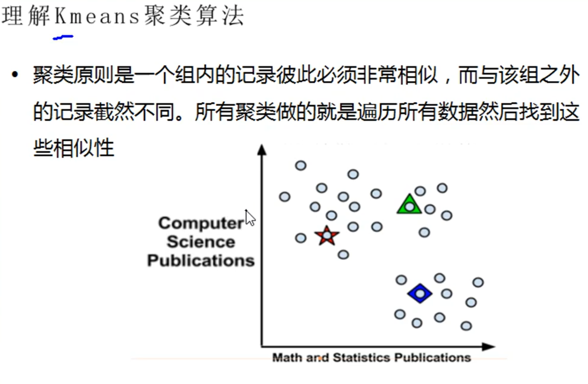

## 1, 线性回归算法

* 监督学习

Linear Regression


最小二乘法就是线性回归算法。

```java
LBFGS
```


## 2, 贝叶斯分类算法

* 监督学习

Beyes


## 3, 朴素贝叶斯

* 监督学习

Naive Beyes


```
tf(term frequency 词频)
```

```python

```


## 4, KNN算法

* 监督学习

邻近算法，或者说K最近邻(*kNN*，k-NearestNeighbor)分类算法

最近的点数一般不会超过20，也就是k最大选择不要超过20


> 该算法在分类时有个主要的不足是，当样本不平衡时，如一个类的样本容量很大，而其他类样本容量很小时，有可能导致当输入一个新样本时，该样本的K 个邻居中大容量类的样本占多数。解决：可以采用权值的方法，根据和该样本距离的远近，对近邻进行加权，距离越小的邻居权值大，权重一般为距离平方的倒数。 
>
> 其实就是给距离加权，这个权值是距离平方的倒数，然后把远一点的距离拉近一点，把近一点的距离推远一点。


Normalization

归一化：把特征值的范围缩小，使得各个特征值近似


KNN三要素：

### 01, K值的选择

* 最近的点数一般不会超过20，也就是k最大选择不要超过20

### 02, 距离的度量

### 03, 分类决策：少数服从多数


## 5, KMeans聚类算法

* 非监督学习

> 比如说要分成三类，那么随机初始化3个点，然后计算





**1.**    **距离度量**

**欧式距离**：也称欧几里得距离，在一个N维度的空间里，求两个点的距离，这个距离肯定是一个大于等于零的数字，那么这个距离需要用两个点在各自维度上的坐标相减，平方后加和再开方。

* 这个就是平方差距离


**平方欧式距离：**就是欧式距离的平方。


**曼哈顿距离**：相比欧式距离简单的多，曼哈顿距离只要把两个点坐标的x坐标相减取绝对值，y坐标相减取绝对值，再加和 。三维，四维以此类推。


**余弦距离**：也叫余弦相似度，是用向量空间中两个向量夹角的余弦值作为衡量两个个体间差异的大小的度量。如果两个向量的方向一致，即夹角接近零，那么这两个向量就越相近。要确定两个向量方向是否一致，要用到余弦定理计算向量的夹角。


**闵可夫斯基距离**：闵式距离不是一种距离，而是一组距离的定义，是对多个距离度量公式的概括性表述。定义：两个n维变量（可以理解为n维数组，就是有n个元素）a()与b()间的闵可夫斯基距离定义为：**** 其中p是一个变参数，当p=1时，就是曼哈顿距离，当p=2时，就是欧式距离，当p 就是切比雪夫距离。


**切比雪夫距离**：国际象棋中，国王可以直行、横行、斜行。国王走一步，可以移动到相邻的8个方格的任意一个。国王从格子 到格子最少需要多少步？这个距离就是切比雪夫距离。


切比雪夫距离公式简单理解为就是各坐标数值差的最大值，在2维空间中的计算公式为： 。


**谷本距离：**同时考虑余弦距离和欧式距离的测度。


**加权距离测度**：可以指定某一维度的权重比例，从而使某个权重的影响力更大。


## 6, KMeans++算法

