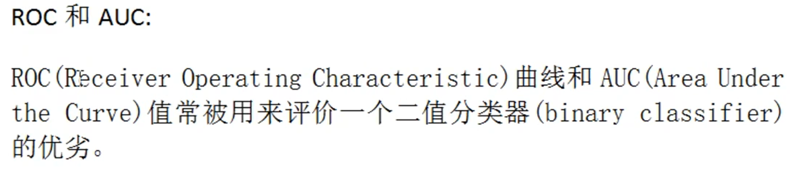
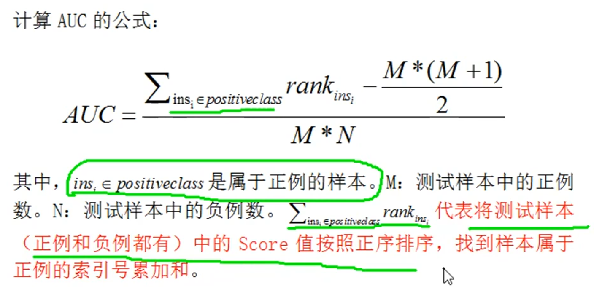

模型评估的ROC和AUC

混淆矩阵：

| 人数           |                 | 实际结果 | Positive                  | Negative                  |
| -------------- | --------------- | -------- | ------------------------- | ------------------------- |
|                | 诊断结果        |          |                           |                           |
| Y-诊断阳性人数 | Yes(诊断为阳性) |          | TP(True Positive)-真阳性  | FP(False Positive)-假阳性 |
| N-诊断阴性人数 | No(诊断为阴性)  |          | FN(False Negitive)-假阴性 | TN(True Negative)-真阴性  |
|                |                 |          | p-真实为阳性人数          | n-真实为阴性人数          |

`TPR`：True Positive Rate = TP/p， 也叫`灵敏度`或者`召回率`

`FPR`: False Positive Rate = FP/n, 也叫做`误诊率`， 本来阳性有病，结果诊断为阴性

精确率

precision = TP/Y， 也就是能正确的诊断出有病的概率

accuracy = (TP+TN)/(p+n), 精准率，也就是能正确诊断出有病，和正确诊断没病的精准度。

