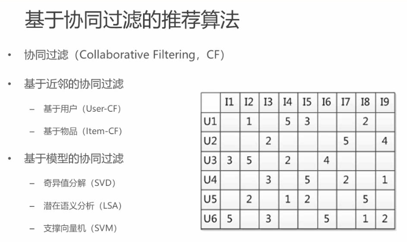
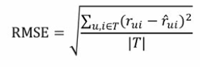
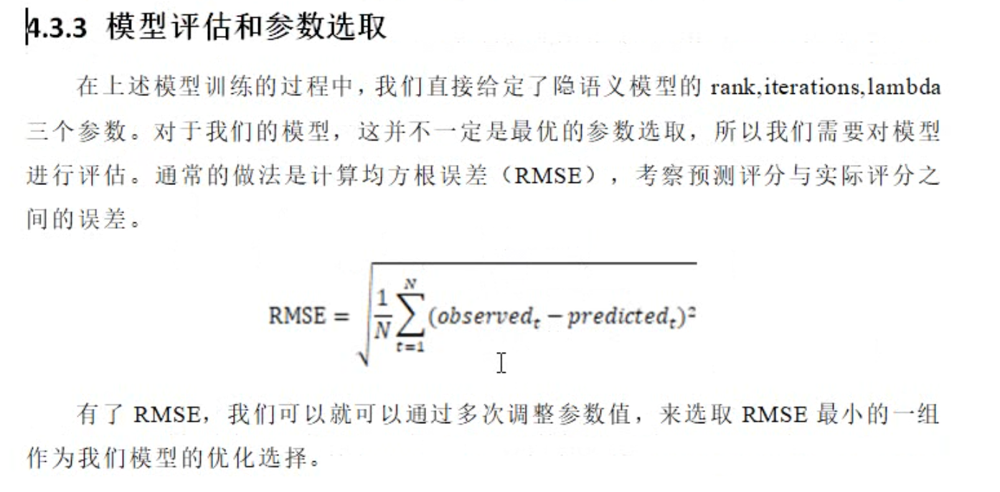
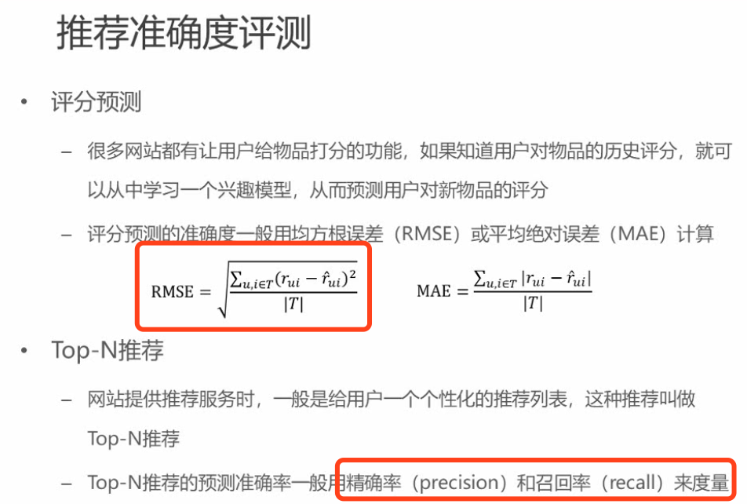

## 1, 推荐使用数据来源

### 1.1, 用户数据

* 包括用户的基本信息，如年龄，性别，身高等用户本身的信息

### 1.2, 商品数据

* 包括商品的价格，作用，分类等等商品的信息

### 1.3, 用户行为数据

* 包括用户的购买，浏览信息，评价，收藏等用户行为

用户行为数据分为两类：

一类是显式用户行为数据：

* 如直接跟商品喜好相关的数据，比如评分，评价等等

一类是隐式用户行为数据：

* 比如用户购买行为，搜藏行为，浏览行为等等

## 2, 推荐系统分类

> 下面的分类主要是基于数据来源进行的分类

### 2.1, 基于人口统计学的分类

* 主要是通过分析用户数据，然后分类
* 找出与A用户相似的用户B，把A购买的商品推荐给用户B
* 也就是`人以群分`

### 2.2, 基于内容的推荐

* 主要是通过分析商品数据，然后分类
* 找出A用户喜欢的商品a，然后找出与商品a类似的商品b，然后推荐给用户A
* 也就是`物以类聚`

### 2.3, 基于协同过滤的推荐

* 主要是通过分析用户的行为数据进行分类
* Collaborative Filtering, CF

### 2.4, 混合推荐

## 3, 推荐系统验证

### 3.1, RMSE

#### RMSE: 均方根误差：

rui：rate of user to item

T: 总的打分个数

### 3.2, 精确率和召回率

| 人数           |                 | 实际结果 | Positive                  | Negative                  |
| -------------- | --------------- | -------- | ------------------------- | ------------------------- |
|                | 诊断结果        |          |                           |                           |
| Y-诊断阳性人数 | Yes(诊断为阳性) |          | TP(True Positive)-真阳性  | FP(False Positive)-假阳性 |
| N-诊断阴性人数 | No(诊断为阴性)  |          | FN(False Negitive)-假阴性 | TN(True Negative)-真阴性  |
|                |                 |          | p-真实为阳性人数          | n-真实为阴性人数          |

#### 召回率recall

`TPR`：True Positive Rate = TP/p

#### 精确率precision

precision = TP/Y， 也就是能正确的诊断出有病的概率

#### 准确率accuracy

accuracy = (TP+TN)/(p+n), 精准率，也就是能正确诊断出有病，和正确诊断没病的精准度。

