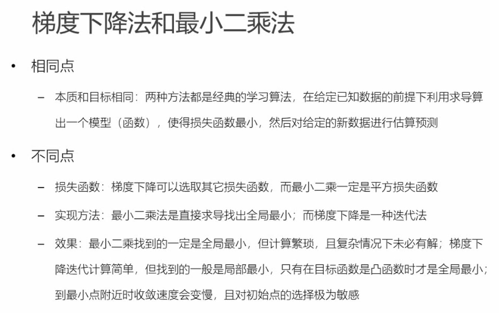
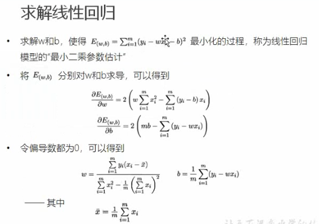
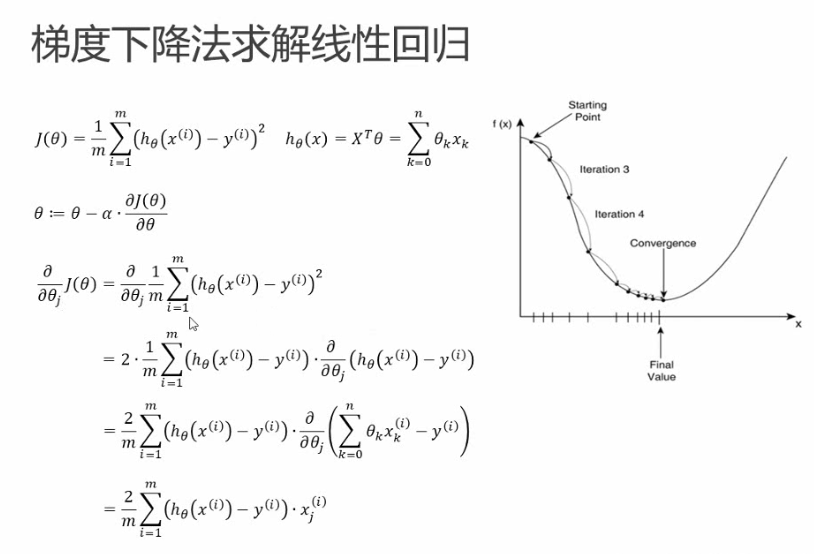
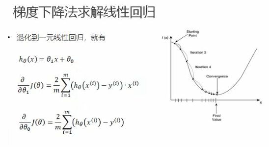

最小二乘法(least squares method):

基于均方误差最小化来进行模型求解的方法称为最小二乘法（least squares method）

1, 一元一次方程

* 一元一次方程可以通过求w，b的偏导，然后就可以求出其w和b的具体解乏。
* 但是如果是多元一次方程，求解偏导数的过程极其复杂，很难直接求出来
* 这个时候就可以用梯度下降算法

2, 梯度下降算法

* 但是如果是多元一次方程，求解偏导数的过程极其复杂，很难直接求出来
* 这个时候就可以用梯度下降算法
* 我们求出偏导数后， 根据偏导数，就可以确定方向导数，也就是梯度增加最快的方向，然后逆向也就是梯度下降最快的方向
* 然后根据下降最快的方向，进行值下降，直到：理想情况下达到最小值为止

