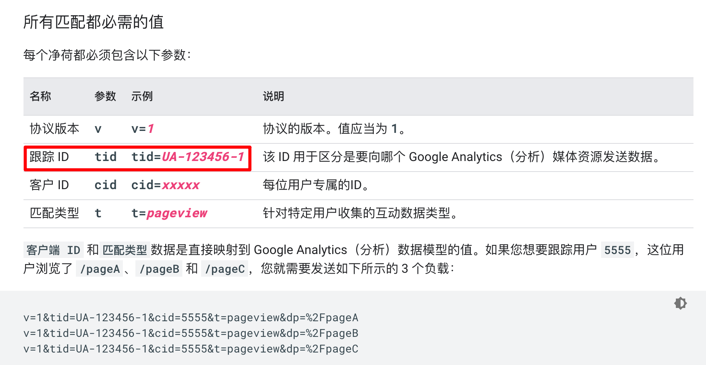
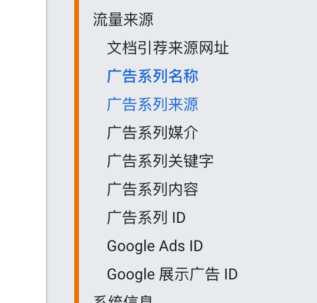
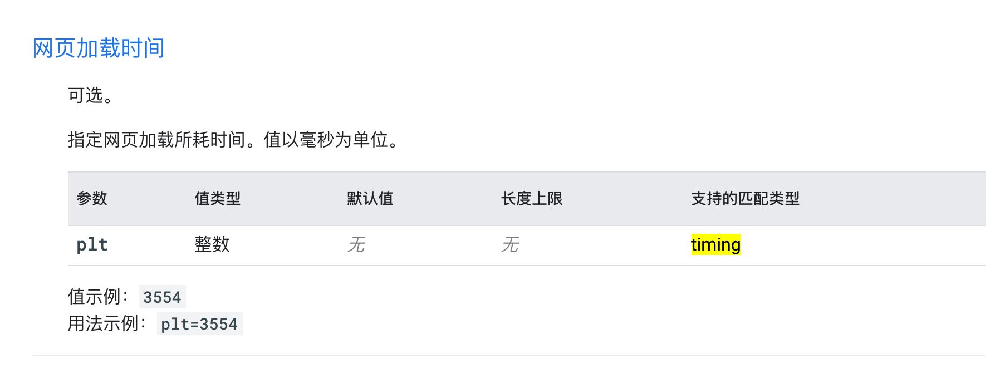

[toc]


## 0, 现有问题

```shell
0, app负责：海哥，网站负责：？， B站产品负责：施施，A站产品负责：？，ppmianliao产品负责：？是否还有其他人

1, ip能不能取
2, 国家能不能取(from_domain)
3, 确认下如下还有哪个字段有问题获取不能取
4，经纬度我们一概不获取权限，那么之后是否获取，如果不获取，我们字段直接删掉，请确认
5，分辨率，网络模式，手机模型等这些是否需要获取？
6，对于移动端而言，仿user_agent都有哪些因素
7，是否还有其他字段需要分析？
8，签名是否需要(咨询浩哥)
9, 国家，prov， city是取sting还是取id，如果取id，是否有对应的事实表关联
10, ga中的tid是做什么的， tracking_id
11, channel, source, medium请给出枚举值
12， 上周需要的那些枚举值需要给出
```


## 1, 通用字段解释

* 如下字段为通用字段， 任何埋点事件均需要传递如下字段

| 字段 | 类型   | 是否必填 | 参数含义                                  | 备注                                         | ga      |
| ---- | ------ | -------- | ----------------------------------------- | -------------------------------------------- | ------- |
| pl   | int    | true     | product_line,产品线                       | 1代表azazie，2代表blushmark，3代表ppmianliao | view_id |
| p    | int    | true     | platform,平台                             | 1代表pc, 2代表mweb, 3代表ios， 4代表android  | ds      |
|      |        |          |                                           |                                              |         |
| c    | int    | true     | 国家id                                    | 3859为us，3844为ca                           |         |
| prov | int    | false    | 州(id)                                    | 该数据从用户表中获取                         |         |
| city | int    | false    | 城市(id)                                  | 该数据从用户表中获取                         |         |
|      |        |          |                                           |                                              |         |
| cid  | string | true     | client_id,设备唯一标识                    | 每台设备必须唯一, app有的，网站需自行生成    | cid     |
| uid  | string | false    | user_id,用户id                            | 数据库中的用户id, 如果用户登陆则需要提交     | uid     |
| ip   | string | true     | ip,ip地址                                 | ip地址                                       | uip     |
|      |        |          |                                           |                                              |         |
| cv   | string | true     | client_version,客户端版本号，代码的版本号 | 由客户端定义，规则需要统一，不可随意更改     |         |
|      |        |          |                                           |                                              |         |
| nw   | string | true     | network,网络模式                          | 如WIFI                                       |         |
| sr   | string | false    | screen_size,屏幕分辨率                    | 800x600                                      |         |
| md   | string | false    | model                                     | model, 移动端填写手机模型iphone 6s           |         |
| ov   | string | false    | operating system, 系统版本                | 手机填写手机系统版本，网站填写浏览器版本     |         |
| ua   | string | true     | userAgent                                 | 移动端请模拟出对应信息(咨询海哥)             | ua      |
| am   | string | true     | app_market,下载的市场                     | 比如appStore                                 |         |
|      |        |          |                                           |                                              |         |
| ln   | double | false    | lng经度                                   |                                              |         |
| la   | double | false    | lat 纬度                                  |                                              |         |
|      |        |          |                                           |                                              |         |
| dwc  | string | false    | channel, 下载channel                      | 网站可不填,app必填                           |         |
| dws  | string | false    | source,下载source                         | 网站可不填,app必填                           |         |
| dwm  | string | false    | medium,下载medium                         | 网站可不填,app必填                           |         |
| owc  | string | true     | channel, 打开channel                      | 打开渠道，必填                               |         |
| ows  | string | true     | source,打开source                         | 打开source，必填                             |         |
| owm  | string | true     | medium,打开medium                         | 打开medium，必填                             |         |
|      |        |          |                                           |                                              |         |
| lgt  | long   | true     | time,客户端日志时间                       | 1506047606608，时间戳即可                    |         |
| st   | long   | false    | server_time, 这个由数据接受方添加         | 1506047606608                                |         |
|      |        |          |                                           |                                              |         |
| t    | string | true     | type,也就是打点的类型                     | 0=app_event, 1=page_event, 3=module_event    |         |
|      |        |          |                                           |                                              |         |
|      |        |          |                                           |                                              |         |
| sign | string | true     | 签名                                      | 具体参考签名规则                             |         |


## 2, 部分字段详细解释

```shell
国家都需要记录哪些？


```






