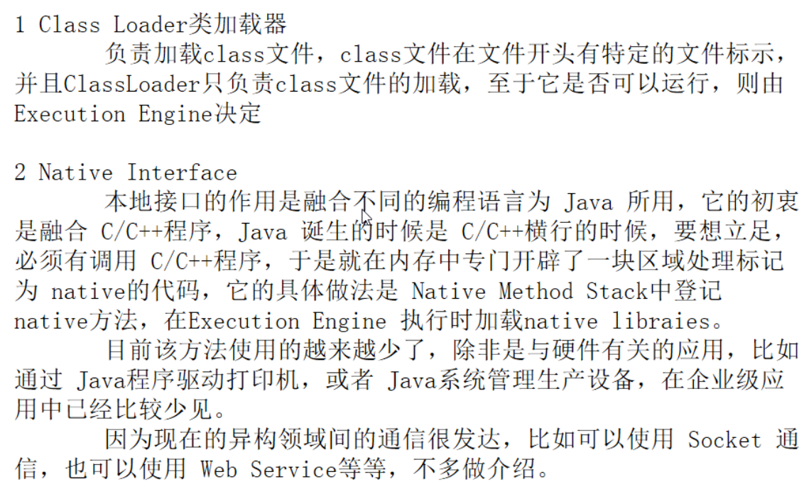

## 1, JVM简介


------

* jvm中线程私有的一律不需要优化

- jvm优化都是优化线程共享区：堆区和方法区,方法区又称离堆
- 所谓jvm优化：
- 99%是优化堆
- 1%是优化方法区

------

### jvm组成结构


### jvm架构图


### 1, class loader  2, native interface




### 3,method area  4, pc register  5, native method stack


## 2, 堆和栈


### 6, 栈是什么  6.1 栈中存储什么东西


### 6.2, 栈原理：FIFO


### 栈溢出错误


## 3, 三种jvm


## 4, 堆内存各区层级关系示意图

* new的对象是在新生区的伊甸区
* 伊甸区达到容量的70%的时候，需要垃圾回收
* 垃圾回收能杀死不需要的对象
* 剩余未被杀死的会被移到幸存0区
* 幸存0区若满了，也会进行垃圾回收，没有被垃圾回收的原先的幸存0区的会移到幸存1区
* 幸存1区也是如此
* 默认活过15次会进入养老区，养老区并不怎么进行垃圾回收
* 若是养老区也满了，那就会进行full gc
* 若full gc之后，还没有空间创建新的对象，那么就会OOM，内存溢出
* 永久区没有垃圾回收
* 具体看下面文字


> 
>
> ⚠️注意：看下面，字符串是在`字符串常量池`中的， 而`字符串常量池`在不同版本的jvm中存储的位置是不一样的
>
> 对于jvm6，`字符串常量池`在方法区,也就是永久代，对于jvm7，`字符串常量池`在堆内存中，而在jvm8中，是存在元空间中的。另外，在jvm1.8之后，已经没有永久代了，具体看上面几行红色字体。


## 5, jvm堆内存重点

* -Xms : -X是默认写法， m是MB，s是start，也就是开始内存

* -Xmx：-X是默认写法， m是MB，x是max，也就是最大内存

* jvm默认设置下：最大可使用内存也就是物理内存的1/4

* ```java
  System.out.println(Runtime.getRuntime().maxMemory());
  
  // 打印3817865216
  //3817865216/1024/1024 = 3641M, 也就是4G，我是16G内存，16/4=4G，所以默认使用内存是物理内存的1/4
  ```


```java
System.out.println(Runtime.getRuntime().maxMemory());

//这里创建一个大对象可以轻易内存溢出，因为超出最大的3641M了
byte[] byteArray = new byte[1024 * 1024 * 4000];

System.out.println("ivanl001 is the king of world!");
```


* 永久存储区就是方法区，也就是非堆


- 内存简单理解可以分为：堆内存，栈内存和方法区。
- 堆内存主要存对象，数组等，如果无限制的循环的往数组中添加对象，很快就会造成堆内存满
- 栈内存主要存储主函数和调用的方法？，比如说迭代循环调用很快就会造成栈内存压力过大，栈内存溢出
- 方法区主要存储静态变量和静态方法？？？
- 监控中的几个内存分区：
- --------------------heap--------------------
- 1，Eden区，伊甸区，当前运行的一些内存主要在这里
- 2, S0, 也就是幸存一区，Eden区的对象被gc，回收后会先进入到幸存一区
- 3, S1, 也即是幸存二区，幸存一区的对象会被回收到幸存二区
- 4，old,也就是年老区
- ------------1-3都是年轻代，4是年老代，这四个都是heap？，也就是堆内存------
- -------------------non-heap,非堆--------------------
- 5，metaspace, 也即是方法区，非堆，这里是JVM中heap以外的区域
- --------------------off-heap, 离堆------------------
- 6，off-heap, 这是离堆，其实已经是jvm外的内存

##  5,  徐培成教程：栈内存修改参数

```shell
# 修改栈内存，默认是1m，修改后可以增加栈内存
-Xss 1m
```


## 6,jvm7和jvm8


## 7, 堆内存调优的两个参数


```java
//1, 最大使用内存
System.out.println(Runtime.getRuntime().maxMemory()/1024/1024);

//2, 当前占用的总内存
System.out.println(Runtime.getRuntime().totalMemory()/1024/1024);
```


```java
//代码中设置jvm参数如下，可以打印出如下的信息：
-Xms1024m -Xmx1024m -XX:+PrintGCDetails

981
981
Heap
 PSYoungGen      total 305664K, used 20971K [0x00000007aab00000, 0x00000007c0000000, 0x00000007c0000000)
  eden space 262144K, 8% used [0x00000007aab00000,0x00000007abf7afb8,0x00000007bab00000)
  from space 43520K, 0% used [0x00000007bd580000,0x00000007bd580000,0x00000007c0000000)
  to   space 43520K, 0% used [0x00000007bab00000,0x00000007bab00000,0x00000007bd580000)
 ParOldGen       total 699392K, used 0K [0x0000000780000000, 0x00000007aab00000, 0x00000007aab00000)
  object space 699392K, 0% used [0x0000000780000000,0x0000000780000000,0x00000007aab00000)
 Metaspace       used 3301K, capacity 4496K, committed 4864K, reserved 1056768K
  class space    used 368K, capacity 388K, committed 512K, reserved 1048576K
```


## 8, 触发GC测试

```java
package com.atguigu;

import java.util.Random;

/**
 * #author      : ivanl001
 * #creator     : 2019-08-05 22:06
 * #description : 出发GC垃圾回收
 **/
public class a03_GC {
    public static void main(String[] args) {
        String str = "ivanl001 is the king of world!";
        while (true) {
            //不停的生成新的对象，内存就会满，就会进行垃圾回收
            str += str + new Random().nextInt(10000000) + new Random().nextInt(10000000);
        }
    }
}
```

* 打印结果如下：

```java
/Library/Java/JavaVirtualMachines/jdk1.8.0_131.jdk/Contents/Home/bin/java -Xms8m -Xmx8m -XX:+PrintGCDetails "-javaagent:/Applications/IntelliJ IDEA.app/Contents/lib/idea_rt.jar=61324:/Applications/IntelliJ IDEA.app/Contents/bin" -Dfile.encoding=UTF-8 -classpath ......

com.atguigu.a03_GC
objc[35207]: Class JavaLaunchHelper is implemented in both /Library/Java/JavaVirtualMachines/jdk1.8.0_131.jdk/Contents/Home/bin/java (0x10c23c4c0) and /Library/Java/JavaVirtualMachines/jdk1.8.0_131.jdk/Contents/Home/jre/lib/libinstrument.dylib (0x10c2c04e0). One of the two will be used. Which one is undefined.
[GC (Allocation Failure) [PSYoungGen: 1536K->496K(2048K)] 1536K->520K(7680K), 0.0018073 secs] [Times: user=0.00 sys=0.00, real=0.00 secs] 
[GC (Allocation Failure) [PSYoungGen: 1744K->511K(2048K)] 1768K->815K(7680K), 0.0107597 secs] [Times: user=0.00 sys=0.00, real=0.02 secs] 
[GC (Allocation Failure) [PSYoungGen: 1594K->511K(2048K)] 1898K->1462K(7680K), 0.0110821 secs] [Times: user=0.01 sys=0.00, real=0.01 secs] 
[GC (Allocation Failure) [PSYoungGen: 1945K->511K(2048K)] 2896K->1846K(7680K), 0.0037535 secs] [Times: user=0.00 sys=0.00, real=0.00 secs] 
[GC (Allocation Failure) [PSYoungGen: 1945K->192K(2048K)] 4686K->3636K(7680K), 0.0106244 secs] [Times: user=0.00 sys=0.00, real=0.01 secs] 
[Full GC (Ergonomics) [PSYoungGen: 923K->0K(2048K)] [ParOldGen: 4850K->2530K(5632K)] 5774K->2530K(7680K), [Metaspace: 3320K->3320K(1056768K)], 0.0175603 secs] [Times: user=0.01 sys=0.00, real=0.02 secs] 
[Full GC (Ergonomics) [PSYoungGen: 1465K->0K(2048K)] [ParOldGen: 5343K->1826K(5632K)] 6808K->1826K(7680K), [Metaspace: 3320K->3320K(1056768K)], 0.0089546 secs] [Times: user=0.01 sys=0.00, real=0.01 secs] 
[Full GC (Ergonomics) [PSYoungGen: 1435K->0K(2048K)] [ParOldGen: 4639K->4639K(5632K)] 6074K->4639K(7680K), [Metaspace: 3320K->3320K(1056768K)], 0.0050721 secs] [Times: user=0.00 sys=0.00, real=0.00 secs] 
[GC (Allocation Failure) [PSYoungGen: 0K->0K(2048K)] 4639K->4639K(7680K), 0.0006406 secs] [Times: user=0.00 sys=0.00, real=0.00 secs] 
[Full GC (Allocation Failure) Exception in thread "main" [PSYoungGen: 0K->0K(2048K)] [ParOldGen: 4639K->4619K(5632K)] 4639K->4619K(7680K), [Metaspace: 3320K->3320K(1056768K)], 0.0057337 secs] [Times: user=0.01 sys=0.00, real=0.01 secs] 
java.lang.OutOfMemoryError: Java heap space
	at java.util.Arrays.copyOf(Arrays.java:3332)
	at java.lang.AbstractStringBuilder.ensureCapacityInternal(AbstractStringBuilder.java:124)
	at java.lang.AbstractStringBuilder.append(AbstractStringBuilder.java:674)
	at java.lang.StringBuilder.append(StringBuilder.java:208)
	at com.atguigu.a03_GC.main(a03_GC.java:18)
Heap
 PSYoungGen      total 2048K, used 60K [0x00000007bfd80000, 0x00000007c0000000, 0x00000007c0000000)
  eden space 1536K, 3% used [0x00000007bfd80000,0x00000007bfd8f348,0x00000007bff00000)
  from space 512K, 0% used [0x00000007bff80000,0x00000007bff80000,0x00000007c0000000)
  to   space 512K, 0% used [0x00000007bff00000,0x00000007bff00000,0x00000007bff80000)
 ParOldGen       total 5632K, used 4619K [0x00000007bf800000, 0x00000007bfd80000, 0x00000007bfd80000)
  object space 5632K, 82% used [0x00000007bf800000,0x00000007bfc82c48,0x00000007bfd80000)
 Metaspace       used 3351K, capacity 4496K, committed 4864K, reserved 1056768K
  class space    used 373K, capacity 388K, committed 512K, reserved 1048576K

Process finished with exit code 1
```

## 9, 面试题


