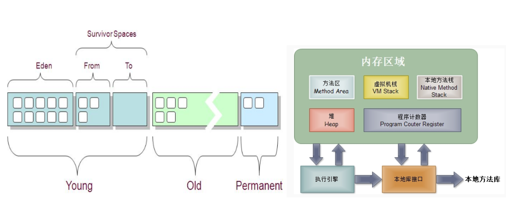
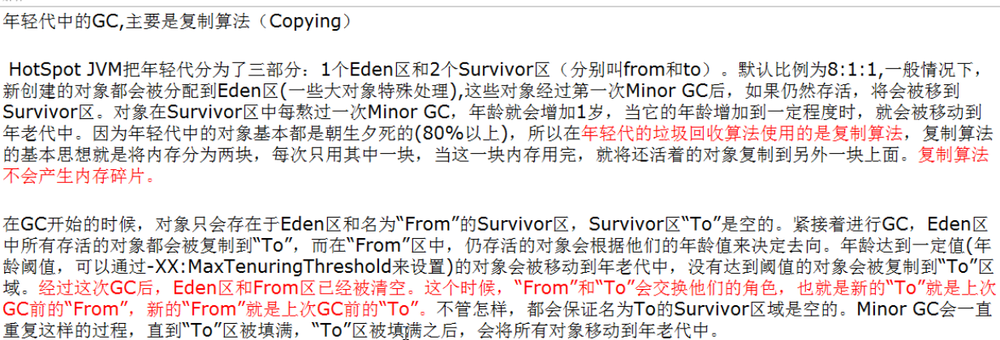
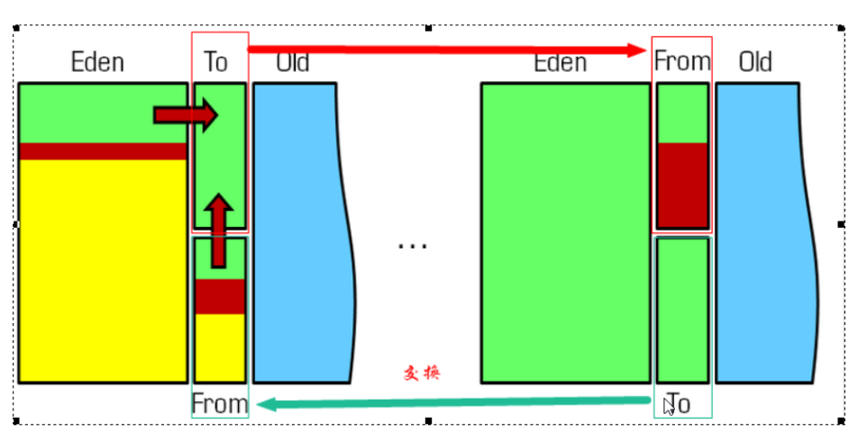
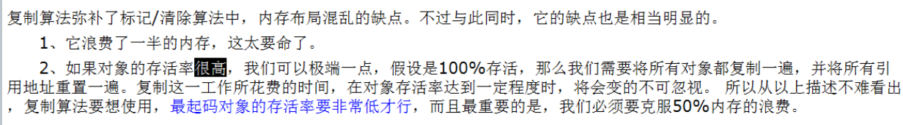
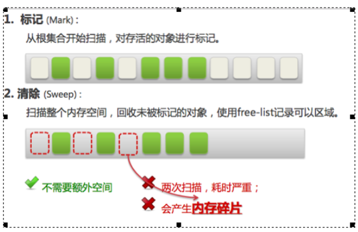
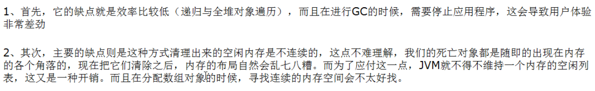
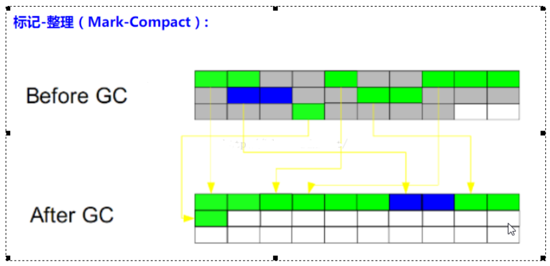
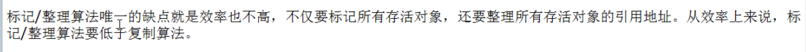
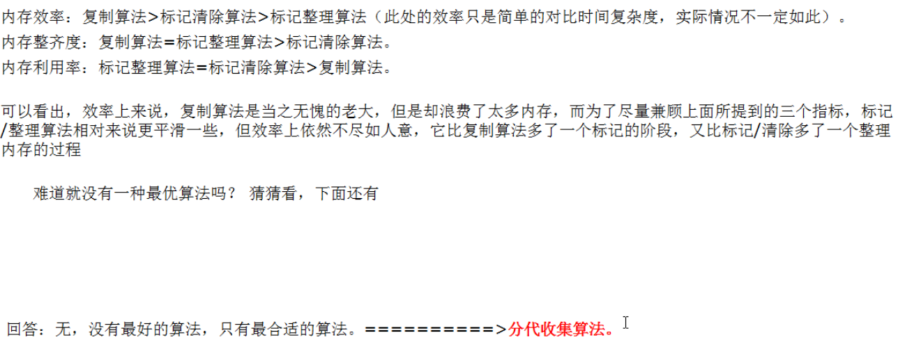

## 1, jvm复习

## 2, GC是什么

### 2.1, 频繁搜集Young区

* minor gc, copying

### 2.2, 较少搜集Old区

* full gc, mark-sweep标记清除  mark-compact标记整理

### 2.3, 基本不动Perm区

## 3, GC算法总体概述

JVM在进行GC时，并非每次都对三个内存区域一起回收(新生代，老年代，永久代)

因此GC按照回收的区域又分为两种：

* minor gc：只针对新生代的gc， 新生代使用的gc的算法是复制算法Copying

  * minor gc 会把伊甸区的所有的活的对象都移动到幸存区，如果幸存区的慢慢的满了之后，幸存区中的活的对象就会被移动到老年代。这就是minor gc，一旦minor gc后， 伊甸区就会空出来，好让后面的新的对象进入。
  * 
  * 
  * 

* major gc( Full gc): 针对年老代的gc，偶尔伴随新生代的gc和对永久代的gc  
  * full gc, 一般是有mark-sweep标记清除实现   或者标记清除和mark-compact标记整理混合实现

  * 
  * 
  * 

  * 

* 

