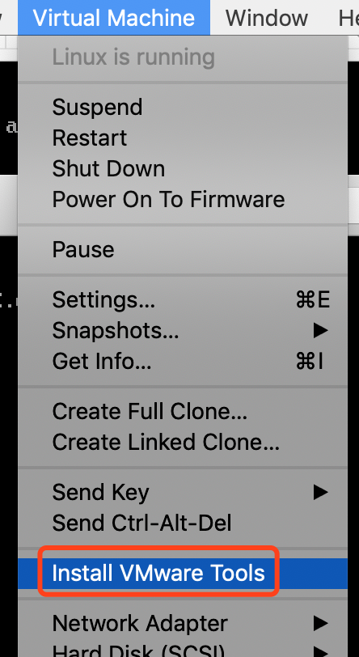
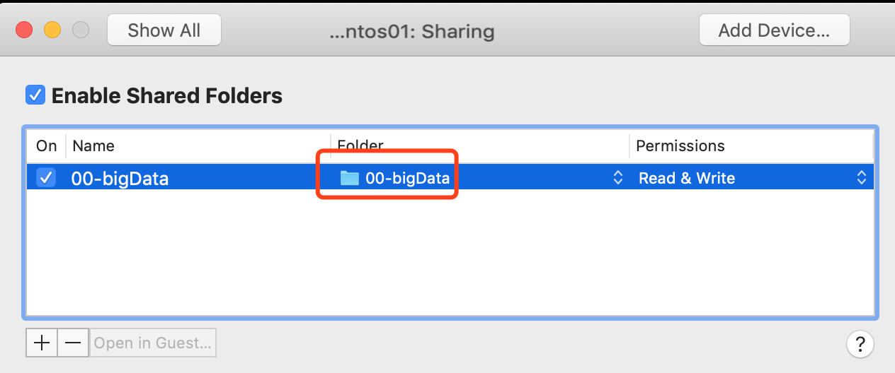
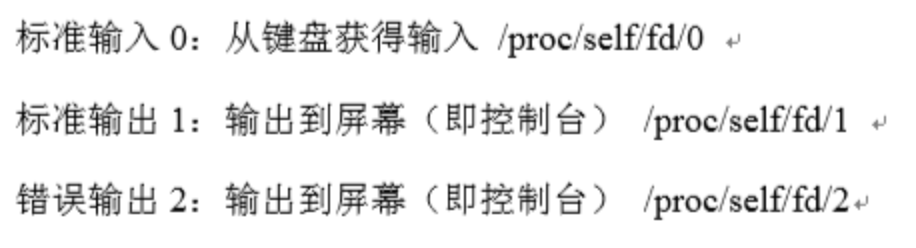

## 1，linux的一些基础命令：

* cd  : change directory
* cd -: 回到上一个目录
* pwd : print working directory
* ls  : list
* ll  : list all
* whoami: current username
* man : manual
* passwd: 修改密码
* su  : switch user
* sudo: super user do
* 	[nano文本编辑器,命令行模式]
	* $>nano a.txt										//打开nano编辑器，编辑a.txt文件
	* $>ctrl + o											//保存文件,提示后直接回车
	* $>ctrl + x											//退出文件
	* $>ctrl + k											//cut 文本
	* $>ctrl + u											//uncut 文本
	
* wc ivanl001.txt    //分别显示行数/单词数/字节数 
* wc -l ivanl001.txt //这个是只显示行数
* wc -w ivanl001.txt //只显示单词数
* wc -c ivanl001.txt //只显示字节数
* wc -m ivanl001.txt //这个是显示字符数· 

* centOS 切换命令行模式

  > Ctrl + alt + F1/F2/F3/F4/F5/F6
  > F1是可是桌面，F2-F6是命令行窗口

* centOS切换到窗口模式

  > Ctril + alt + F1

* 查看网络

  > ifconfig //这个和window上： ipconfig /alli


* />和>> 

  >/>代表写入，是覆盖模式， 比如 ifconfig > ifconfig.txt, 是指把ifconfig的内容覆盖写入到指定的txt中
  >
  >/>>代表写入，是追加模式，比如 ifconfig >> ifconfig.txt, 是指把ifconfig的内容追加写入到指定的txt中

* echo写入字符到文本中

  > 覆盖写入： echo ivanl001 > ivanl001.txt
  >
  > 追加写入： echo ivanl001 >> ivanl001.txt

* nano命令的一些操作：

  > Ctrl + o 写出，也就是保存
  >
  > Ctrl + x 退出

* 不同权限用户命令前的符号是不同的

  > root用户命令前提示符是一个#
  >
  > 普通用户命令前提示符是一个$

* more命令

  > 空格代表向下走一页
  >
  > -10 代表显示10行
  >
  > more -100 find.txt

* head命令

  > head -5 find.txt  //和more命令类似，默认是10行
  >
  > head -n 5 find.txt

* 管道|， 代表把前面的输出作为后面输入的内容

  > find . | more 这里的意思是find出来的内容太多，页面显示不全，所以用more来一页一页的查看

* 对于linux中的命令，如果后面的参数是一个字母，一般用"-", 如果是多个字母，一般用"--"

  > more --help

* wc命令 word count

  > wc -l ivanl001.txt 统计行数
  >
  > wc -c ivanl001.txt 统计字节
  >
  > wc -m ivanl001.txt 统计字符

* hostname 

  > hostname 查看主机名，localhost.localdomain
  >
  > uname 查看unix名字
  >
  > uname -r 查看unix系统内核
  >
  > uname -a 查看所有的unix信息

* file

  > file ivanl001.txt //查看文件类型

* gzip压缩命令，这个是压缩源文件

  > gzip find.txt //压缩文件
  >
  > gzip -d find.txt.gz //解压缩被gzip压缩过的文件
  >
  >  gunzip find.txt.gz //同上

* tar和gz

  > tar -zcvf find.txt.tar.gz find.txt find2.txt //归档加压缩,如果有多个文件，直接放在后面即可
  >
  > tar -zxvf find.txt.tar.gz //解档并解压缩

* xargs 

  > find . | xargs //把查询出来的内容的多行变成一行， 并用空格分割
  >
  > // 比如说要把搜索出来的东西进行复制或者执行其他命令，可以用如下：
  >
  
  > find . | grep .txt | cp \`xargs\` ./allText 
  
  > \#find 和ls是一样的，只不过find是换行的，可以用xargs处理一下
  
  > cp \`find . | xargs\` /home/ivanl001
  
  > cp \`ls\` /home/ivanl001/ 
  
  > \#这个是把ls出来的所有文件或者文件夹都拷贝到home/ivanl001目录下
  > find显示的是绝对路径，ls显示相对路径

* `` 命令嵌套

  > \`\`是相当于把一个命令的结果改变成字符串， 以让另外一个命令使用这个命令的结果
  >
  > echo \`pwd\` >> pwd.txt

* ln：创建链接

  > ln ivanl001.txt ivanl001.link //这个是硬链，可以理解为实时备份，链接和源文件大小一样，两个文件完全同步，只有删除的时候只删除直接被处理的那个文件，目录不能使用硬链
  >
  > //一般情况下用软链比较多，方式如下：
  >
  > ln -s ivanl001.txt ivanl001-softLink
  
  > ln -s /usr/bin bin
  > 如果是在上面的那个bin链接目录下，pwd打印的是是软链的地址，而不是/usr/bin的地址，如果想要打印后者， 可用-P , 物理地址
  > pwd -P
  > cd -P bin //直接通过软链进入物理那个文件夹，而不是软链文件夹内

* sudo权限配置

  > 如果想要使用sudo的话，centos里面是需要给指定用户进行配置的，比如说现在要想让master使用sudo进行某些操作，那么需要在/etc/sudoer文件中增加如下一行
  >
  > master  ALL=(ALL)  ALL  //注意：master需要改成你想要的用户名
  
* export导出环境变量，session中有效

## 2，linux权限问题

* which

  > which cd //查询某个命令所在的目录

### 2.1， 相关目录

```
/bin    系统相关的二进制可执行文件，比如说cat，more等
/sbin   系统相关的比较重要的二进制可执行文件，比如说创建用户等

*上面两个其实就是下面两个的链接，bin指向/usr/bin, sbin指向/usr/sbin*

/usr/bin
/usr/sbin   这两个是厂商相关的命令

/usr/local/bin
/usr/local/sbin   这两个是用户相关的命令
```

### 2.2，文件类型

```
- 文件类型
d 文件夹类型
l 链接类型
b 块文件，比如说U盘，光盘等
c 字符文件
```

### 2.3，linux的权限

```
u 当前用户，也就是文件的owner
g owner所在的组
o others，其他人
a all, 可以通过a来同时操作上面三个用户的权限
r 4 
w 2
e 1
```

### 2.4, 更改文件权限

> chmod u-w ifconfig.txt //取消拥有者的写入权限
>
> chmod 777 ifconfig.txt //给所有人赋予所有的操作权限
>
> chmod u+x test.sh      //赋给当前用户执行权利

> chmod a+x test.sh      //这个是指同时给all，也就是所有用户添加执行权限

* 对于root用户，就算对于文件夹没有任何权限，貌似也可以进行相关操作
* 对于除了root之外的其他用户而言：
* 读权限：
    * 文件：读取文件内容
    * 文件夹：ls出文件夹下有哪些文件，就算没有读权限，也可以cd进去，因为cd是执行权限，但是看不到里面的东西
* 执行权限：
    * 文件：就是执行咯
    * 文件夹：cd
* 写权限：
    * 文件：就是写入了
    * 文件夹：touch或者mkdir吧


### 2.5,  更改拥有者

> *更改拥有者应该只能在root用户下更改*
>
> su root //先切换到root用户下
>
> chown root:root ivanl001.txt
>
> //如果需要递归某个文件夹下的所有文件
>
> chown -R root:root /home/ivanl001/temp 

## 3, 网络连接相关

### 3.1, 虚拟机的三种网络连接方式

> NAT模式：network address transform, 这种方式是VM默认的网络连接方式，相当于vm建立一个虚拟网卡，然后通过虚拟网卡进行网络访问，这种模式的问题在于，由于是虚拟网卡，所以客户机可以访问主机和同网络内的其他机器，但是宿主机或者说任何的物理主机都不能访问到NAT下的该客户机
>
> 桥接模式：这个相当于是完全按照物理主机的方式进行访问，所以物理机可以访问客户机，客户机也能访问物理机，但是在mac下客户机貌似不能联网，其他的暂时还没什么问题
>
> only host模式：这种模式是NAT的安全模式，也就是说客户机只能访问本物理主机，而不能访问同网络下的其他物理主机，应该也不能联网，不关心这个，先不管

### 3.2，linux网络配置

> 配置静态ip：
>
> su root
>
>  cd /etc/sysconfig/network-scripts/
>
> vim ifcfg-ens33 //这里需要修改的是你的网卡的名称，不一定是叫做这个名字
>
> // 更改如下几个内容，没有的条目加上去, 网址，网管和子网掩码需要根据自己的具体网络设定
>
> BOOTPROTO="static"
>
> IPADDR="223.167.197.120"
> NETMASK="255.255.255.0"
> GATEWAY="223.168.197.255"
>
> //保存后重启网络
>
> service network restart

## 4，service服务相关

### 4.1，查看状态

> service serviceName status

### 4.2, 启动服务

> service serviceName start

### .3, 关闭服务

> service serviceName stop

### 4.4 , 重启服务

> service serviceName restart

## 5, mount 挂载相关

### `挂载设备`

> 首先插入光盘之后，在/dev/目录下有一个cdrom的链接文件指向src0，src0则是一个字节文件
>
> 这个cdrom或者说src0就是光盘文件，但是因为没有挂载所以是看不到文件的

#### 5.1, 创建文件夹

```shell
mkdir -p /mnt/cdrom
```

#### 5.2, 挂载命令

```shell
# 挂载前要先确认光盘是否已经连接哦，如果没有连接，挂载的时候会报错没有文件什么的错误
mount /dev/cdrom /mnt/cdrom
```

#### 5.3, 进入/mnt/cdrom查看挂载内容


### `卸载设备`

#### 5.4, cd到非/mnt/cdrom/目录

```shell
cd /
```

#### 5.5, 卸载设备即可

```shell
umount /mnt/cdrom/
```


### `虚拟机安装增强工具实现文件共享`

#### 1, 虚拟机页面选择"Install VMWare Tools"

> 会有提示：Mount the virtual CD drive in the guest, uncompress the installer, and then execute vmware-install.pl to install VMware Tools.

 


#### 2, 创建被加载的文件夹

```shell
mkdir -p /mnt/cdrom
```


#### 3, 加载

```shell
# 挂载前要先确认光盘是否已经连接哦，如果没有连接，挂载的时候会报错没有文件什么的错误
mount /dev/cdrom /mnt/cdrom
```


#### 4, 解压缩安装包

```shell
tar -zxvf /mnt/cdrom/VMwareTools-10.1.15-6627299.tar.gz -C /root/ivanl001/
```


#### 5, 进入解压缩文件夹下进行安装

```shell
/root/ivanl001/vmware-tools-distrib/vmware-install.pl
```


#### 6, 安装错误

##### 6.1, gc错误

> The path "" is not valid path to the gcc binary.
> Would you like to change it? 

```shell
yum install gcc -y
```

##### 6.2, kernel header

> Searching for a valid kernel header path...
> The path "" is not a valid path to the 3.10.0-957.27.2.el7.x86_64 kernel 
> headers.
> Would you like to change it? 

```shell
yum install "kernel-devel-uname-r == $(uname -r)" -y
```


##### 7, 其他问题一路回车即可

##### 8, ok! 安装完成

##### 9, 安装完成，页面添加共享文件夹后，在/mnt/hgfs下即可看到




## 6, 其他

### 6.1, 后台运行，进程等

#### nohup命令

```shell
#命令格式
nohup java -jar zhang.jar &
```

#### &命令

> 放在后台运行某个程序, 在命令后面加上符号&

`less ivanl001 &`

> 查看后台的程序

`jobs`

> 后台程序切回到前台, %后面跟的是这个后台程序的编号

`fg %1`

> 前台作业放到后台执行

`ctrl+z`

`bg %1`

> 杀死作业

`kill %1`

#### &命令输出到文件

> command >out.file 2>&1 &
>
> command >out.file是将command的输出重定向到out.file文件，即输出内容不打印到屏幕上，而是输出到out.file文件中。 2>&1 是将标准出错重定向到标准输出，这里的标准输出已经重定向到了out.file文件，即将标准出错也输出到out.file文件中。最后一个& ， 是让该命令在后台执行。
>
> 试想2>1代表什么，2与>结合代表错误重定向，而1则代表错误重定向到一个文件1，而不代表标准输出； 
>
> 换成2>&1，&与1结合就代表标准输出了，就变成错误重定向到标准输出.

输出到文件：

```shell
nohup java -jar zhang.jar  > /root/test.log 2>&1 & 
```

不输出到文件:

```shell
nohup java -jar zhang.jar  > /dev/null 2>&1 & 

# /dev/null是黑洞概念， 把日志丢进黑洞，就不打印
# 而0，1，2的概念如下图，1，2的信息也丢掉
```



### 6.2, 进程查看

`ps`:process show

> 查看所有进程

`ps -ef | grep gnom`

`top`: 这个是查看实时更新的进程信息

> cut命令可以剪切过长的行, 如下，只显示第一列到第50列，后面的直接被剪掉了 
`ps -ef | cut -c 1-50 | more `


### 6.3，磁盘使用情况，fdisk

`/dev/sda` : 这个是磁盘

`/dev/sda1,/dev/sda2,/dev/sda3 `: 这个是磁盘分区

`fdisk -l /dev/sda`: 查看磁盘分区情况

`df -ah`: df是disk free，加上-ah的话可以按照人性化的单位显示

`df -ah .`: 查看当前的分区的使用情况

`df -ah /home`: 查看home目录 的分区的使用情况


### 6.4， dirname和basename

`dirname /ivanl001/a/b/c`:是给定文件的上一级目录，如果输入是/ivanl001/a/b/c,输出是/ivanl001/a/b

`basename /ivanl001/a/b/c` ：当前目录如果输入是/ivanl001/a/b/c,输出是c


### 6.5， hostname相关

`sudo hostname ivanl001`: 临时性的更改主机名，退出后重新进入的时候生效，重启后失效

`更改文件/etc/hostname`:永久性的更改主机名


### 6.6，创建用户

`useradd guest`: 创建用户

`passwd guest`: 用户创建成功后修改这个用户的密码


### 6.7，配置文件即时生效

`source /etc/profile`:后面跟的路径是你需要重新生效的路径


### 6.8，卸载centos7自带的默认java版本

```shell
[root@master ~]# rpm -qa | grep java

[root@master ~]# rpm -e --nodeps java-1.8.0-openjdk-headless-1.8.0.101-3.b13.el7_2.x86_64
[root@master ~]# rpm -e --nodeps java-1.8.0-openjdk-1.8.0.101-3.b13.el7_2.x86_64
[root@master ~]# rpm -e --nodeps java-1.7.0-openjdk-headless-1.7.0.111-2.6.7.2.el7_2.x86_64
[root@master ~]# rpm -e --nodeps java-1.7.0-openjdk-1.7.0.111-2.6.7.2.el7_2.x86_64
```


###6.9, 更改系统语言，这个更改的是系统显示的语言

> vim /etc/locale.conf
>
> //把原先的LANG=en_US.UTF-8改为LANG=zh_CN.UTF-8 也就是改成中文显示语言


### 7.0，用客户端ssh centos7时候警告cannot change locale (UTF-8)：

*如果你用locale -a的时候会发现，其实编码前面都会加上类似en_US UTF-8或者zh_CN UTF-8的国家简称，是没有UTF-8的，所以只需要指定一下就可以了，如下：*

`消除这个警告只需要在/etc/locale.conf中新增加如下一行：LC_CTYPE="en_US.UTF-8"`

* 如果中文显示还是有问题，试一下下面安装：

  `yum install glibc-common`


### 7.1, ssh免密登陆

* 01, 生成rsa公钥和私钥，命令：ssh-keygen，默认生成目录是当前用户下的.ssh目录
* 02, A要无密登陆B服务器，则：
    * 在B的.ssh目录下新建一个authorized_keys文件
    * 将A的.ssh目录下的公钥文件内容追加到B的authorized_keys中即可
    * 这样就可以在A服务器上：ssh B了


### 7.2，软链接进入实际的物理地址：

> cd -P desktop/
>
> pwd -P 


### 7.3, 环境变量相关

> path=/home/master/Desktop
>
> * echo $path/test01.txt //有一部分特殊符号可以直接放在后面可以识别
> * echo ${thepath}/test01.txt //但是保险还是用{}把环境变量扩起来比较实在
> * echo "$thepath"/test01.txt //如果用双引号，需要把\$符号也阔进去
> * $zhangbuer$
> * export name=ivanl001 //导出环境变量，好像只在当前session中有效
> * export name=\${var01:-${var02}} //导出name为var01的值，如果var01没有值，则导出var02的值，三元运算符
> * echo \`pwd\` //执行后面的pwd命令，然后在把结果echo出来
> * if: 
>   * if COMMANDS; then COMMANDS; [ elif COMMANDS; then COMMANDS; ]... [ else COMMANDS; ] fi

### 7.4, 更换yum的仓库为阿里源

> 仓库的配置文件的位置：/etc/yum.repos.d/*.repo
>
> 切换到上述的/etc/yum.repos.d/目录下，执行下面的命令：

`curl -o /etc/yum.repos.d/aliyun.repo http://mirrors.aliyun.com/repo/Centos-7.repo`


### 7.5, 在linux的提示中，显示整个路径，而不只是上个路径：

* 在/etc/profile中增加如下一样代码
> export PS1='[\u@\h \`pwd`]\$' 
> 这个是意思是前面是用户名@主机名 后面直接显示路径，最后用个$结尾


