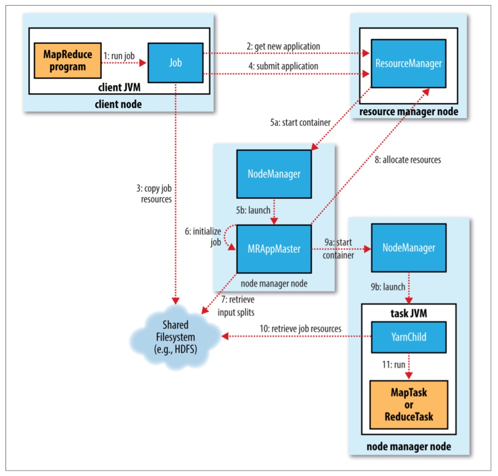
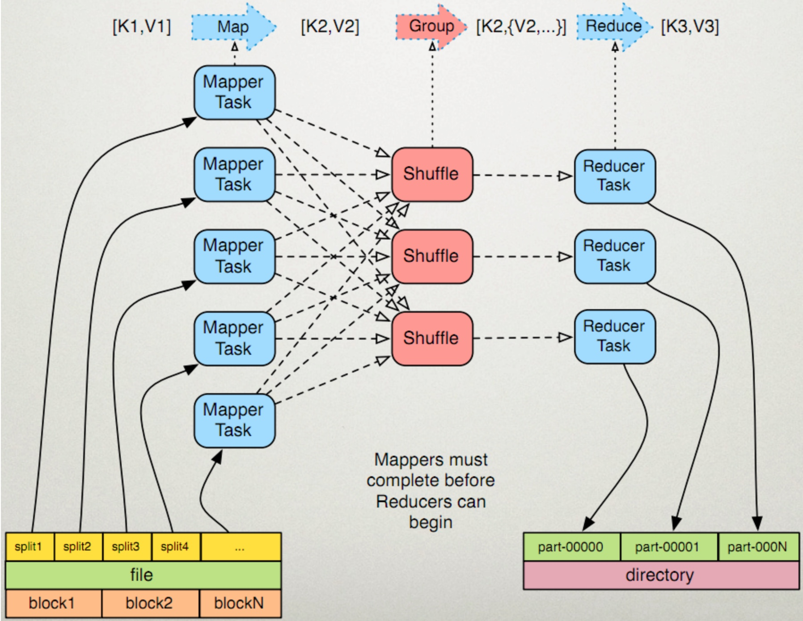

> 运行java   
> java -cp 00-JarTest-1.0-SNAPSHOT.jar Test
>
>   * cp的意思是classpath

> 运行hadoop的jar包
hadoop jar 03-Hadoop-1.0-SNAPSHOT.jar im.ivanl001.bigData.Hadoop.WordCount.IMWordCountApp /user/root/test/zhang.txt /user/root/test/out

* 作业提交过程流程图

  * 

切片是针对mapper而言的， 有多少切片，就会有多少个mapper
  * 

LR： -n line feed 换行符
CR： -r           回车符

行分隔符在windows 下是 \r\n，在Linux下面是 \n， 在Mac下是 \r
路径分隔符在windows下是 \ ，在LInux下是 /

两个系统的动态链接文件：
window:  dll : dynamic linked library
linux:   so  : shared object  

