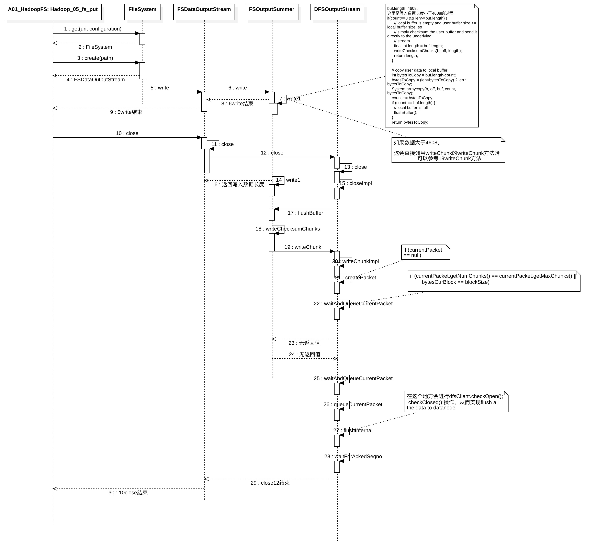
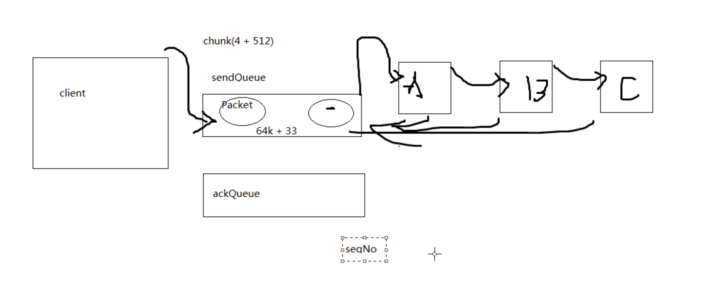
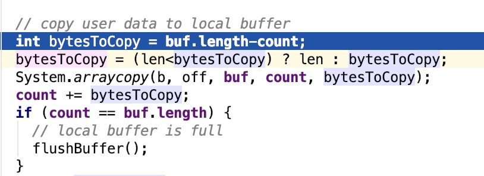
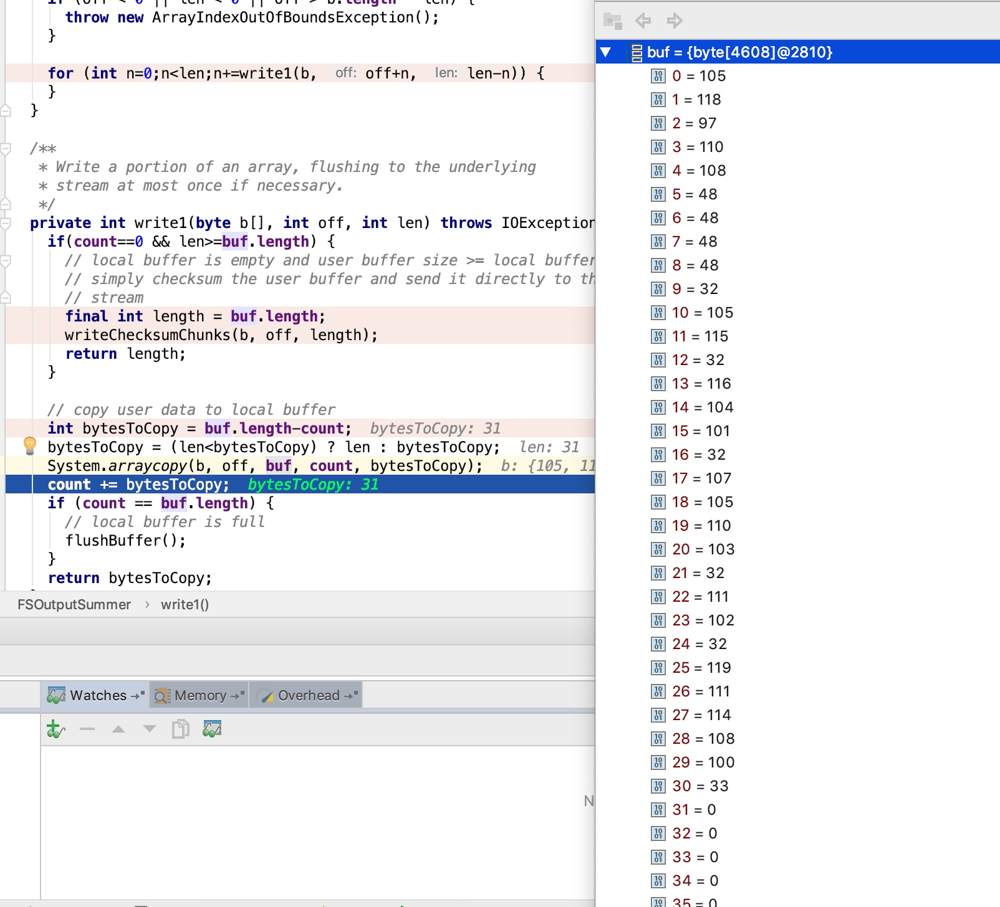
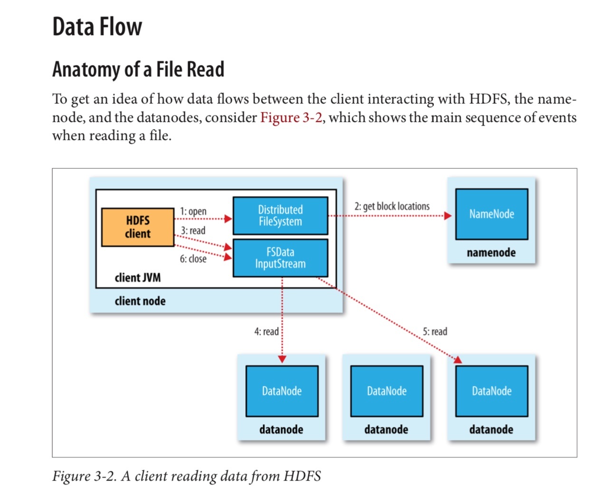
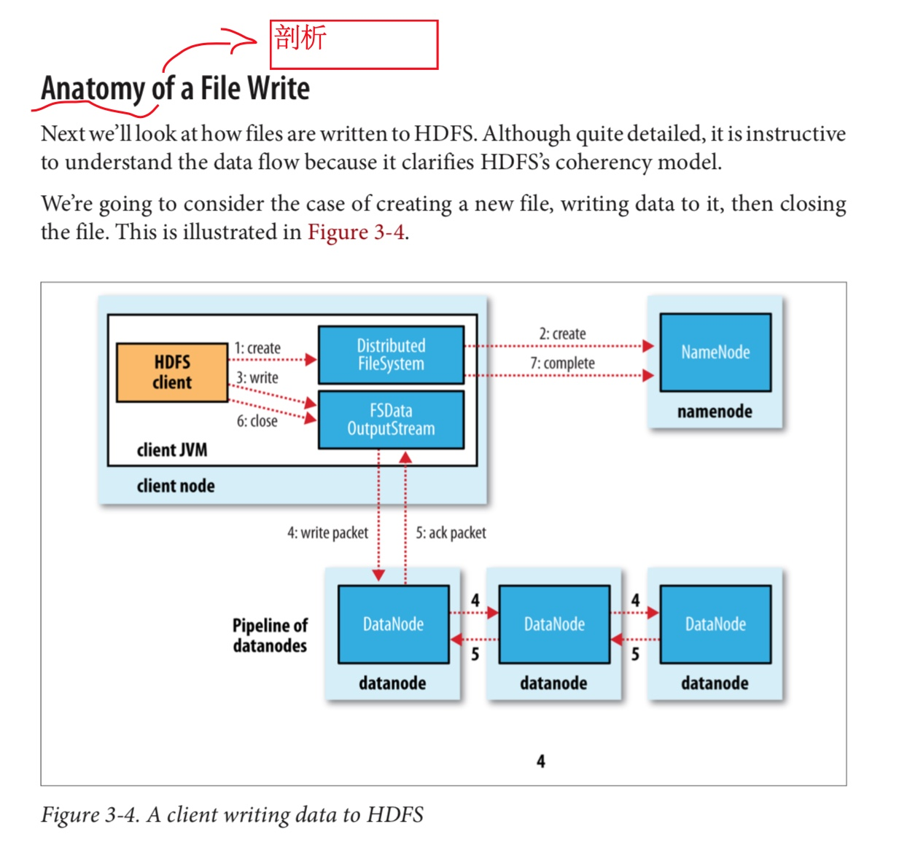
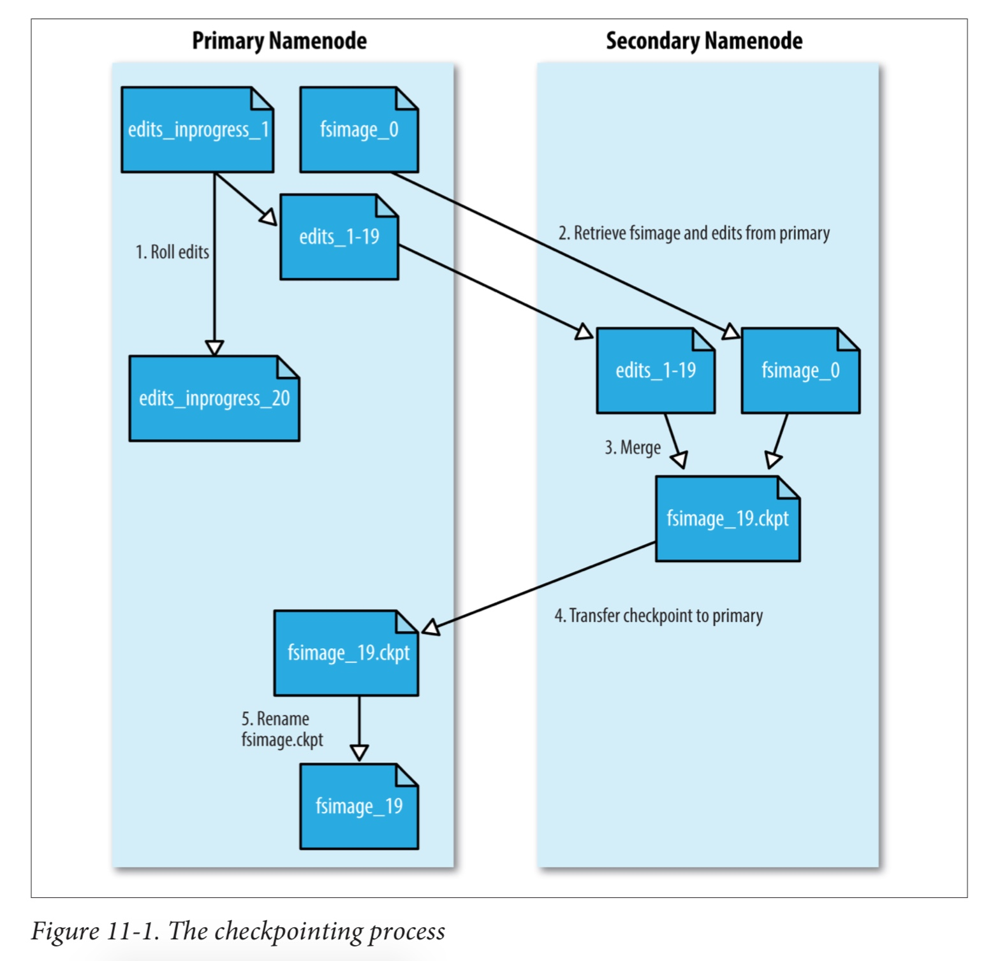

内容过于多，源码已经看过，但是不好总结，所以先挖个坑，有空再来看
Hadoop第05天-02-hdfs写入剖析
Hadoop第05天-02-hdfs写入剖析2

* 

* 


* 

## 1, hdfs写入过程分析

```java
//这个也就是写入
@Test
public void Hadoop_05_fs_put(){
    Configuration configuration = new Configuration();
  	//如果core-site.xml中已经配置了，这里就不需要重复配置
    URI uri = URI.create("hdfs://master:8020");

    Path path = new Path("/user/root/zhang/wahaha.txt");

    try {
        FileSystem fs = FileSystem.get(uri, configuration);

        //fs.copyFromLocalFile(new Path(""), path);
        FSDataOutputStream fsDataOutputStream = fs.create(path);
        fsDataOutputStream.write("ivanl0000 is the king of world!".getBytes());

        fsDataOutputStream.close();
    } catch (IOException e) {
        e.printStackTrace();
    }
}
```

* 01, FileSystem fs = FileSystem.get(uri, configuration);
  * 这里根据配置文件configuration来得到FileSystem对象
  * 确切的说是FileSystem的子类，
  * 我们一般用到的有DistributedFileSystem和LocalFileSystem

* 02, FSDataOutputStream fsDataOutputStream = fs.create(path);

* 03, fsDataOutputStream.write("ivanl0000 is the king of world!".getBytes());


* 03, 进入FSOutputSummer的write方法

* 04, FSOutputSummer的write里面进行校验
数据校验的方式:
> public static final int CHECKSUM_CRC32   = 1;

* 05, write里面调用本对象的write1, 里面buf是缓冲区4608，count=0.len是数据的长度,count是用来计算前面拷贝了多少数据，超过缓冲区就flush掉
* 
* 

## 以免忘记还是总结一下:
* 01, 首先创建FileSystem.get的时候会根据配置文件的不同创建不同的文件系统，有可能是本地文件系统或者分布式文件系统
* 02, 然后开始创建输出流对象。
* 03, 之后写入write操作，在写入的时候判断根据数据量，如果大于512字节，那么，进行校验，形成一个4个字节的数据，和512字节的数据一起组成一个chunk，然后用来把所有的chunk放在一起，组成一个packet包，一个包中一共64k数据，包括516*126=65016，也就是126个chunk，然后还有33个字节的包头数据，最后组成一个包
* 03步其实就是放进packet中，只是放进的方式是这样的：首先每6408字节计算一次校验核，然后计算完之后，这4608数据， 每512字节，然后连带4字节校验核写入到刚才创建的64k容量的packet中(packet放满，会给这个packet添加33字节的包头，然后放进队列中，并通知notifyAll，之后会重新创建一个新的)，一遍一遍执行这样的操作，如果写入packet的数据超过了4608，也就是9个512字节，会重新再计算接下来的4608自己的校验核，然后这4608数据，连带校验核，每512字节+4字节校验核接着再写入到packet中。直到packet放满，会给这个packet添加33字节的包头，然后放进队列中，并通知notifyAll，之后会重新创建一个新的
* 03 同时除了本身的消息队列以外，还会建立一个确认队列，除非收到所有datanode节点的确认回执，否则不会从确认队列中删除。发生错误的时候，也会把消息重新排在队列的前面进行容错重新处理
* 04, 如果不大于512字节，直接放在缓存中，然后把后续的写入一起累加起来，最后还是不大于512字节，就等着close的时候直接一并把那些不足的给搞到一个packet中写出。
* 05, 在关闭的时候才会把从主线程中把包给放到序列中flush出去。
* 06, 第一个数据节点写完之后，后续会把第一个节点的数据写入到第二个节点，第二个节点写入到第三个节点，以此类推，直到写完所有副本。写完之后会进行消息通知，从队列中删除。如果出错，那么会重新把这个包放在队列最前，重新开始。
* 大致过程如上，有写地方描述是不对的，大体上是对的，具体参考源码


* `参考  97/756  [O'REILLY]Hadoop.The.Definitive.Guide.4th.Edition.2015.3`
* 
  
* `参考  100/756  [O'REILLY]Hadoop.The.Definitive.Guide.4th.Edition.2015.3`
* 


## Secondary Namenode
*减少启动日志是指如果没有secondary namenode的话，namenode需要融合节点，镜像文件只有一个，可能超级大，会比较耗时。但是如果有了secondary namenode的话，会让namenode定时滚动，通过设定检查点来融合日志，下载namenode重新启动的时候不需要重头融合镜像文件和编辑日志，速度会快*

* SecondaryNamenode的作用：帮助namenode合并编辑日志，减少Namenode的启动时间 #TODO
  * 
  * 1. The secondary asks the primary to roll its in-progress edits file, so new edits go to a new file. The primary also updates the seen_txid file in all its storage directories.
  * 2. The secondary retrieves the latest fsimage and edits files from the primary (using HTTP GET).
  * 3. The secondary loads fsimage into memory, applies each transaction from edits, then creates a new merged fsimage file.
  * 4. The secondary sends the new fsimage back to the primary (using HTTP PUT), and the primary saves it as a temporary .ckpt file.
  * 5. The primary renames the temporary fsimage file to make it available.
  
  * 滚动时间是一个小时，在hdfs-default.xml中有如下配置信息
    ```
    <property>
      <name>dfs.namenode.checkpoint.period</name>
      <value>3600</value>
      <description>The number of seconds between two periodic checkpoints.
      </description>
    </property>
    ```