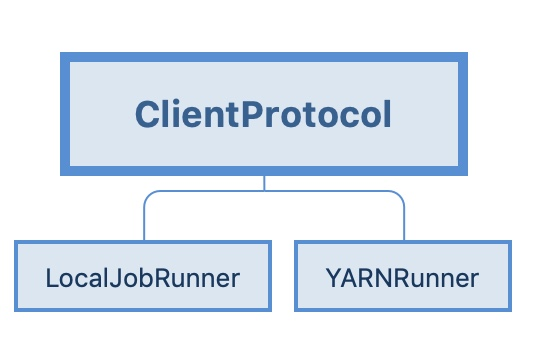
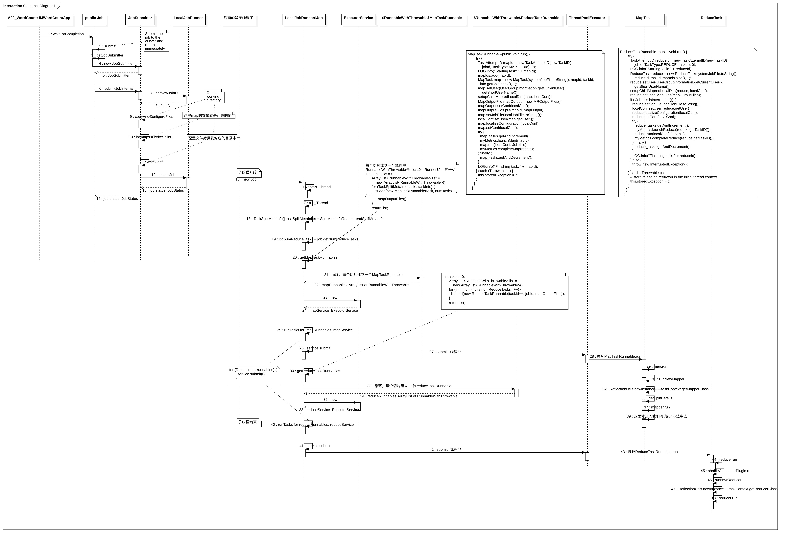
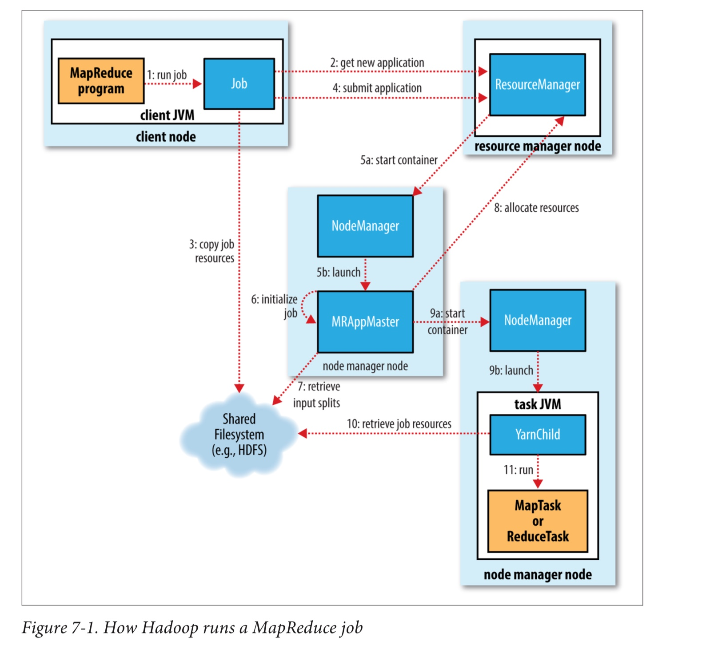

* 01， 创建外部Job(mapreduce.Job),设置配置信息

* 02，通过waitForCompletion开始提交

* 03，显示通过Jobsubmitter把需要的job的1, 分区信息，job内容，2, 配置文件，包括块信息，块元素等还有一些其他信息写入到临时目录

* 04，不同的文件系统创建不同的JobRunner
  * LocalJobRunner(下图是LocalJobRunner的代码流程)
  * YARNRunner（最下面那张图是yarn资源调度的流程图）

  * 

* 05，下面按照简单的LocalJobRunner说

* 06，LocalJobRunner将外部Job 转换成内部Job，这个是线程子类，也即是从这里开启子线程。

* 07，内部Job执行线程，分别计算Map和reduce任务信息，并通过线程池孵化新线程执行MR任务。

整个流程图如下，小图如果看不清楚，请下载源文件进行观看：

---
* `参考  214/756  [O'REILLY]Hadoop.The.Definitive.Guide.4th.Edition.2015.3`
* 01，客户端提交作业
* 02，到yarn节点，也就是ResourceManager上获取一个job应用，返回appId。
* 03， 先是计算分区，把分区信息写入到刚才创建的资源文件夹中
* 03，然后获取配置信息等，写入到资源文件夹中
* 04，最后把作业提交给资源管理器
* 05，06，资源管理器通过节点管理器启动一个MRAppMaster
* 07，MRAppMaster获取到配置文件和块信息等
* 08，通过拿到的信息让资源管理器分配资源
* 09，资源管理器分配好资源后，MRAppMaster到指定节点上启动任务虚拟机，在内部通过yarn的子进程读取配置文件等信息，开启map或者reduce任务 

  * 