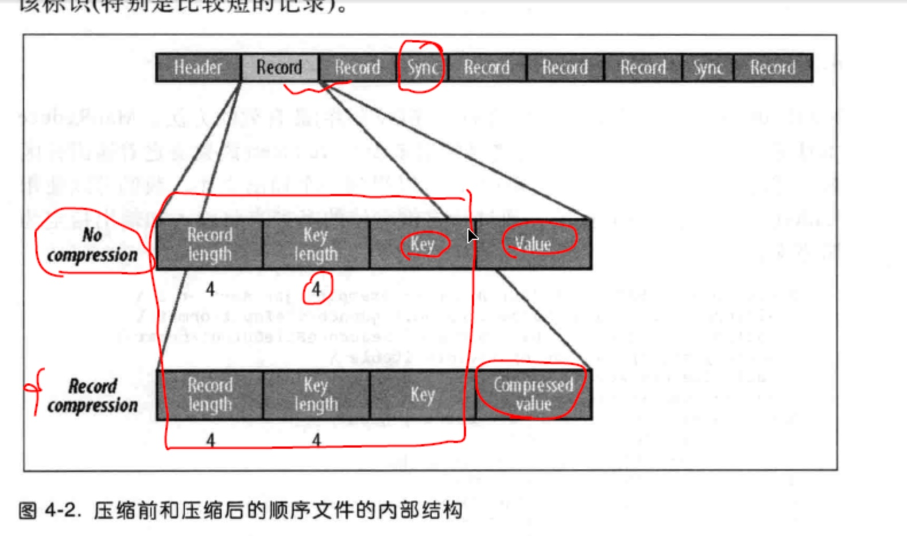
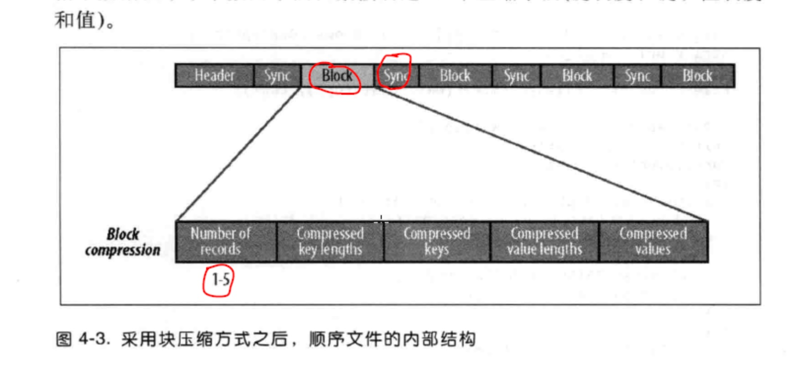

# SequenceFile

## 1, seq存储方式

* key-value方式存储


## 2, seq的查看

* seq文件是不能直接查看的，否则会有乱码，可以通过在hadoop shell中使用如下命令查看

```shell
hdfs dfs -text /user/ivanl001/seq/seq01.seq
```


## 3, seq的java API

* 如下代码位置：im.ivanl001.bigData.a01_hadoop_hdfs.A03_SequenceFile

### 3.1,  seq文件写入

```java
//序列文件的写入
//
@Test
public void sequenceFileSave() throws IOException {

  //hadoop SequenceFileWriteDemo numbers.seq

  String uri = "/user/ivanl001/seq/seq01.seq";
  Configuration conf = new Configuration();
  //设置本地系统
  //configuration.set("fs.defaultFS", "file:///");

  FileSystem fs = FileSystem.get(URI.create(uri), conf);
  Path path = new Path(uri);
  IntWritable key = new IntWritable();
  Text value = new Text();

  SequenceFile.Writer writer = null;
  try {
    //createWriter(FileSystem fs, Configuration conf, Path name, Class keyClass, Class valClass)
    //如果不指定压缩格式，会使用默认的压缩格式，org.apache.hadoop.io.compress.DefaultCodec;，
    // 默认是DeflateCodec压缩方式
    writer = SequenceFile.createWriter(fs, conf, path, key.getClass(), value.getClass());

    for (int i = 0; i < 30; i++) {
      writer.append(new IntWritable(i), new Text("ivanl00" + i));

      //默认会有默认的添加同步点的方式，不过如果想要特定的地方添加同步点，方便读取的时候进行读取，可以使用下面的方式添加同步点
      //同时添加同步点也会让文件变大
      if (i % 10 == 0) {
        writer.sync();//如果是10的倍数，那个添加一个同步点
      }
    }

    for (int i = 0; i < 10; i++) {
      if (i % 2 == 0 || i % 3 == 0) {
        writer.append(new IntWritable(i), new Text("ivanl00" + i));
      }
    }

  } catch (Exception e) {
    assert writer != null;
    writer.close();
  } finally {
    //IOUtils.closeStream(writer);
  }

  writer.close();
}
```


### 3.2, seq文件读取

```java
//序列文件的读取
@Test
public void sequenceFileRead() throws Exception{

  String pathStr = "/user/ivanl001/seq/seq03.seq";
  Configuration configuration = new Configuration();
  //设置本地系统
  //configuration.set("fs.defaultFS", "file:///");

  FileSystem fileSystem = FileSystem.get(configuration);

  Path path = new Path(pathStr);
  SequenceFile.Reader reader = null;

  reader = new SequenceFile.Reader(fileSystem, path, configuration);

  IntWritable key = new IntWritable();
  Text value = new Text();

  //第一种方式
  //如果第一种方式打开，也打开第二种方式，第二种方式是读不到数据的，因为句柄的偏移量已经到末尾了
  /*System.out.println("------------第一种方式-------------");
        while (reader.next(key, value)) {
            System.out.println(key.get() + ":" + value.toString());
            System.out.println("-------------");
        }*/


  //第二种方式
  System.out.println("------------第二种方式-------------");
  while (reader.next(key)) {
    //把对应的value写到value这个变量中
    reader.getCurrentValue(value);
    System.out.println("position: " + reader.getPosition() + ", " + key.get() + ":" + value.toString());
  }
}
```


### 3.3, seq文件同步点分析

```java
//同步点的分析
@Test
public void sequenceFileAnaylize() throws Exception{

  //读取文件路径
  String pathStr = "/user/ivanl001/seq/seq01.seq";
  Configuration configuration = new Configuration();
  //设置本地系统
  //configuration.set("fs.defaultFS", "file:///");
  FileSystem fileSystem = FileSystem.get(configuration);

  Path path = new Path(pathStr);
  SequenceFile.Reader reader = new SequenceFile.Reader(fileSystem, path, configuration);

  IntWritable key = new IntWritable();
  Text value = new Text();

  long position = reader.getPosition();
  System.out.println(position);

  //默认情况下seek只能恰好seek在同步点上才能正常的进行查找，否则会报错EOF，用sync可以
  //206是第二个key对应同步点的位置，如果直接seek到206，那么就不能打印出第一个key-value对了
  //reader.seek(206);//838是同步点，所以seek到838没问题，但是如果seek到837就会报错
  //可以使用sync，会自动找到下一个同步点,但是如果是小文件，很可能只有开头一个同步点，这样子的话可能就不会读出任何内容，但是也不会报错

  //位置和同步点不是一个概念哈，位置是偏移量，同步点是一个标记，第一个同步点和第二个同步点之前位置上进行sync，会直接从第二个同步点开始打印哦
  reader.sync(206);
  //reader.sync(837);//这里使用837也可以正常的找到837后面一个同步点

  long time01 = System.currentTimeMillis();

  //reader.sync(35773011);
  //也就是因为seq文件有同步点，所以它才是可分割的

  while (reader.next(key)) {
    reader.getCurrentValue(value);
    System.out.println("position:" + reader.getPosition() + ", key:" + key + ", value:" + value);
  }

  long time02 = System.currentTimeMillis();
  System.out.println("time:" + (time02 - time01));
}
```


### 3.4, seq文件压缩

#### 3.4.0, 基本和压缩分类

```java
/** Do not compress records. */
//NONE,
/** Compress values only, each separately. */
//RECORD,
/** Compress sequences of records together in blocks. */
//BLOCK
```


* seq文件压缩的两种方式：value压缩和块压缩
* 默认情况下seek只能恰好seek在同步点上才能正常的进行查找，否则会报错EOF，用sync可以
* 也就是因为seq文件有同步点，所以它才是可分割的

* value压缩
  
* 块压缩
  

#### 3.4.1, value压缩代码

```java
//seq文件压缩的两种方式：value压缩和块压缩
//先介绍一下value压缩
/** Do not compress records. */
//NONE,
/** Compress values only, each separately. */
//RECORD,
/** Compress sequences of records together in blocks. */
//BLOCK
@Test
public void sequenceFileCompressValue() throws Exception{

  String pathStr = "/user/ivanl001/seq/seq02.seq";
  Path path = new Path(pathStr);

  Configuration configuration = new Configuration();
  FileSystem fileSystem = FileSystem.get(configuration);


  IntWritable key = new IntWritable();
  Text value = new Text();
  SequenceFile.Writer writer = SequenceFile.createWriter(fileSystem, configuration, path, key.getClass(), value.getClass(), SequenceFile.CompressionType.RECORD, new DeflateCodec());


  for(int i=0;i<100;i++){
    writer.append(new IntWritable(i), new Text("ivanl00"+i));
    //默认会有默认的添加同步点的方式，不过如果想要特定的地方添加同步点，方便读取的时候进行读取，可以使用下面的方式添加同步点
    //同时添加同步点也会让文件变大
    if (i % 10 == 0) {
      writer.sync();//如果是10的个数，那个添加一个同步点
    }
  }

  for (int i = 0; i < 10; i++) {
    writer.append(new IntWritable(i), new Text("ivanl00"+i));
  }
  writer.close();
}
```


#### 3.4.2, 块压缩代码

```java
//BLOCK：Compress sequences of records together in blocks.
@Test
public void sequenceFileCompressBlock() throws Exception{

  String pathStr = "/user/ivanl001/seq/seq03.seq";
  Path path = new Path(pathStr);

  Configuration configuration = new Configuration();
  FileSystem fileSystem = FileSystem.get(configuration);

  IntWritable key = new IntWritable();
  Text value = new Text();
  SequenceFile.Writer writer = SequenceFile.createWriter(fileSystem, configuration, path, key.getClass(), value.getClass(), SequenceFile.CompressionType.BLOCK, new DeflateCodec());


  for(int i=0;i<100;i++){
    writer.append(new IntWritable(i), new Text("ivanl00"+i));
    //默认会有默认的添加同步点的方式，不过如果想要特定的地方添加同步点，方便读取的时候进行读取，可以使用下面的方式添加同步点
    //同时添加同步点也会让文件变大
    if (i % 10 == 0) {
      writer.sync();//如果是10的个数，那个添加一个同步点
    }
  }

  for (int i = 0; i < 10; i++) {
    writer.append(new IntWritable(i), new Text("ivanl00"+i));
  }

  writer.close();
}
```
