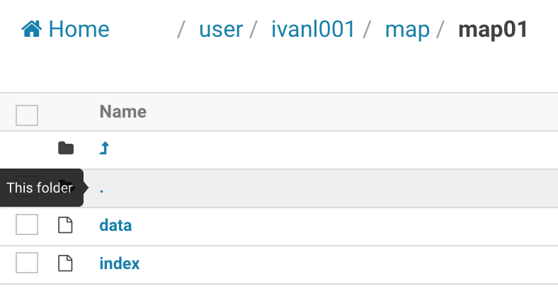

# MapFile

## 1, MapFile的存储方式

* key和value方式存储，但是存储到文件夹，而不是一个文件中
* 文件夹中有两个文件：index和data文件
* 但不同的是：key和value是分别放在两个不同的seqFile里面
* key放在index文件中，value放在data文件中



## 2, map的查看

- map文件是不能直接查看的，否则会有乱码，可以通过在hadoop shell中使用如下命令查看

```shell
# 暂时不知道
```


## 3, MapFile的java API

如下代码位置：im.ivanl001.bigData.a01_hadoop_hdfs.A04_MapFile

### 3.1, MapFile的写入

```java
@Test
public void mapFileWrite() throws Exception{

  //这里只需要给定一个文件夹即可，因为mapfile保存的时候并不是只保存一个文件，而是key和value分别保存在不同的文件里面的
  String uri = "/user/ivanl001/map/map01";
  Configuration conf = new Configuration();
  FileSystem fs = FileSystem.get(URI.create(uri), conf);
  Path path = new Path(uri);
  IntWritable key = new IntWritable();
  Text value = new Text();

  MapFile.Writer writer = new MapFile.Writer(conf, fs, uri, key.getClass(), value.getClass());

  for(int i=0;i<10000;i++){
    writer.append(new IntWritable(i), new Text("ivanl00"+i));
  }

  //如果有下面的几行的话，会报错：
  /*
         java.io.IOException: key out of order: 0 after 99
         意思就是：序号没有按照大小顺序排列
         */
  /*for (int i = 0; i < 10; i++) {
            writer.append(new IntWritable(i), new Text("ivanl00"+i));
        }*/

  writer.close();
}
```


### 3.2, MapFile的读取

```java
//----------------------------对比------------------------------
/*
     * 对比了一下seqfile和mapfile，发现对于查找相同的数据：
     * seqfile的seek是查找的同步点，那个点不好定位具体的某个key，
     * mapfile的seek可以直接seek到某个key
     * 但是对于找到最后的比如说1000条数据并打印出来的时间，两者并没有特别的差距，不知道是不是不能这样比较，毕竟seek的方式本身就不一样
     *
     */
@Test
public void mapFileRead() throws Exception{

  //这里只需要给定文件夹即可，在读取的时候reader会自动的定位到文件夹中的data文件的
  String pathStr = "/user/ivanl001/map/map01";
  Configuration configuration = new Configuration();
  FileSystem fileSystem = FileSystem.get(configuration);

  Path path = new Path(pathStr);
  MapFile.Reader reader = null;

  reader = new MapFile.Reader(fileSystem, pathStr, configuration);
  IntWritable key = new IntWritable();
  Text value = new Text();

  long time01 = System.currentTimeMillis();

  //这里可以快速的定位到想要的位置,seek的位置就是key，而不是和seqfile中的那样，seek出来的是一个对应的索引值
  reader.seek(new IntWritable(30));

  //第一种方式
  while (reader.next(key, value)) {
    System.out.println(key.get() + ":" + value.toString());
    System.out.println("-------------");
  }

  long time02 = System.currentTimeMillis();
  System.out.println("time:" + (time02 - time01));
  //第二种方式
  /*while (reader.next(key)) {
            reader.getCurrentValue(value);
            System.out.println("position: " + reader.getPosition() + ", " + key.get() + ":" + value.toString());
        }*/
}
```
