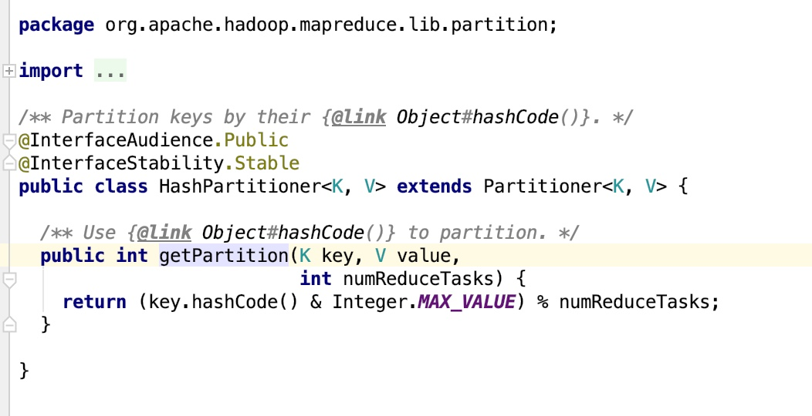

input ->  reader  ->  map  ->  partition -> combiner  -> reduce


## 1, 默认分区方法

> ```java
> return (key.hashCode() & Integer.MAX_VALUE) % numReduceTasks
> // 默认分区和最大值进行&运算，是因为hash值是int值，超过范围就有可能是负数
> ```



* 上面这个图是分区算法，基本可以理解为获取hash值，然后对reduce的个数进行取余，然后就知道哪些key进入哪些分区了。和整数的最大值做&运算是因为hash值有可能为负数

* 重写分区函数并设置给job之后就可以按照我们重写的分区进行分区

## 2, 自定义分区
### 2.1, 重写的分区类

```java
package im.ivanl001.bigData.Hadoop.A06_partion;

import org.apache.hadoop.io.IntWritable;
import org.apache.hadoop.io.Text;
import org.apache.hadoop.mapreduce.Partitioner;

/**
 * #author      : ivanl001
 * #creator     : 2018-10-24 15:09
 * #description : 自定义分区函数
 **/
public class IMPartitioner extends Partitioner<Text, IntWritable>{

    //这里的意义就是所有的都会分到0这个分区上，也即是说就算设置了三个reducer也是没用的，所有的都会到0上
    public int getPartition(Text text, IntWritable intWritable, int i) {
        return 0;
    }
}
```

### 2.2，设置给job

```java
package im.ivanl001.bigData.Hadoop.A06_partion;

import org.apache.hadoop.conf.Configuration;
import org.apache.hadoop.fs.FileSystem;
import org.apache.hadoop.fs.Path;
import org.apache.hadoop.io.IntWritable;
import org.apache.hadoop.io.Text;
import org.apache.hadoop.mapreduce.Job;
import org.apache.hadoop.mapreduce.lib.input.FileInputFormat;
import org.apache.hadoop.mapreduce.lib.input.TextInputFormat;
import org.apache.hadoop.mapreduce.lib.output.FileOutputFormat;

import java.io.IOException;

/**
 * #author      : ivanl001
 * #creator     : 2018-10-20 19:35
 * #description : wordcount
 **/
public class IMWordCountApp {

    /*
     * mapper过程之后产生的文件的命名中是***-m-00000*什么的，m代表是mapper，后面的数字代表是分区
     * reducer过程之后产生的文件的命名中是***-r-00000*什么的，r代表的是reducer，后面的数字代表的也是分区
     * 如果设置三个reducer，在没有重写分区函数的情况下，会有三个r，也就会有三个输出文件，因为一个reducer会有一个输出文件
     * 如果重写了分区函数，其实也会生成三个文件，但是只有算法中有指向的才会有内容，其他的就是空文件了
     * */
    public static void main(String[] args) {

        try {

            if (args.length != 2) {
                System.out.println("参数个数有误！");
                return;
            }

            //"/users/ivanl001/Desktop/bigData/input/zhang.txt"
            String inputFileStr = args[0];
            String outputFolderStr = args[1];

            //0，创建配置对象，以修正某些配置文件中的配置
            Configuration configuration = new Configuration();
            //这里一旦设置单机版就会出错，而且不能有core-default.xml文件，这个文件中一旦配置也会有问题，不知道为啥，先过
//            configuration.set("fs.defaultFS", "file:///");
            //configuration.set("fs.hdfs.impl", org.apache.hadoop.hdfs.DistributedFileSystem.class.getName());
            //configuration.set("fs.file.impl", org.apache.hadoop.fs.LocalFileSystem.class.getName());

            //这里因为文件存在，总是需要删除，麻烦，所以直接程序自动删除
            FileSystem.get(configuration).delete(new Path(outputFolderStr));

            //1，创建作业
            Job wordcountJob = Job.getInstance(configuration);
            wordcountJob.setJobName("wordcountApp");
            //之前这句没写，就会一直报错，什么mapper类找不到，这里需要注意一下
            wordcountJob.setJarByClass(IMWordCountApp.class);

            //--------------------------------这里设置输出格式类------------------------------------
            //这个是设置输出格式为------------序列文件输出格式-------------，我这里并不想保存序列文件，所以这里就不设置
            //wordcountJob.setOutputFormatClass(SequenceFileOutputFormat.class);


            //2,设置作业输入
            //这句话可以不加，因为默认就是文本输入格式
            wordcountJob.setInputFormatClass(TextInputFormat.class);
            FileInputFormat.addInputPath(wordcountJob, new Path(inputFileStr));

            //3，设置mapper
            wordcountJob.setMapperClass(IMWordCountMapper.class);
            wordcountJob.setMapOutputKeyClass(Text.class);
            wordcountJob.setMapOutputValueClass(IntWritable.class);

            //----中间设置一下分区函数
            wordcountJob.setPartitionerClass(IMPartitioner.class);


            //4, 设置reducer
            wordcountJob.setReducerClass(IMWordCountReducer.class);
            //每个reduce会产生一个输出结果或者输出文件，这里设置一个reduce
            wordcountJob.setNumReduceTasks(3);//设置reducer的个数，如果是0就是不需要r
            //设置输出的key和value的类型
            wordcountJob.setOutputKeyClass(Text.class);
            wordcountJob.setOutputValueClass(IntWritable.class);

            //5, 设置输出
            wordcountJob.setOutputValueClass(FileOutputFormat.class);
            FileOutputFormat.setOutputPath(wordcountJob, new Path(outputFolderStr));

            //6，提交，开始处理
            wordcountJob.waitForCompletion(false);

        } catch (IOException e) {
            e.printStackTrace();
        } catch (InterruptedException e) {
            e.printStackTrace();
        } catch (ClassNotFoundException e) {
            e.printStackTrace();
        }
    }
}
```

### 2.3, mapper类

```java
package im.ivanl001.bigData.a02_Hadoop_MR.A06_partion;

import org.apache.hadoop.io.IntWritable;
import org.apache.hadoop.io.LongWritable;
import org.apache.hadoop.io.Text;
import org.apache.hadoop.mapreduce.Mapper;

import java.io.IOException;

/**
 * #author      : ivanl001
 * #creator     : 2018-10-20 19:23
 * #description : mapper
 **/
public class IMWordCountMapper extends Mapper<LongWritable, Text, Text, IntWritable>{

    @Override
    protected void map(LongWritable key, Text value, Context context) throws IOException, InterruptedException {
        System.out.println("key:" + key + ",value:" + value);
        String[] splitStr = value.toString().split(" ");
        Text outText = new Text();
        IntWritable outInt = new IntWritable();
        for (String str : splitStr) {
            outText.set(str);
            outInt.set(1);
            //这里是意思就是把每个单词拼成(zhang,1), (li, 1), (dan, 1)类似的格式传给reduce
            context.write(outText, outInt);
        }
    }
}
```


### 2.4, reducer类

```java
package im.ivanl001.bigData.a02_Hadoop_MR.A06_partion;

import org.apache.hadoop.io.IntWritable;
import org.apache.hadoop.io.Text;
import org.apache.hadoop.mapreduce.Reducer;

import java.io.IOException;

/**
 * #author      : ivanl001
 * #creator     : 2018-10-20 19:30
 * #description : reducer
 **/
public class IMWordCountReducer extends Reducer<Text, IntWritable, Text, IntWritable> {


    @Override
    protected void reduce(Text key, Iterable<IntWritable> values, Context context) throws IOException, InterruptedException {
        int count = 0;
        for (IntWritable intWritable : values) {
            count = count + intWritable.get();
        }
        context.write(key, new IntWritable(count));
    }
}
```

