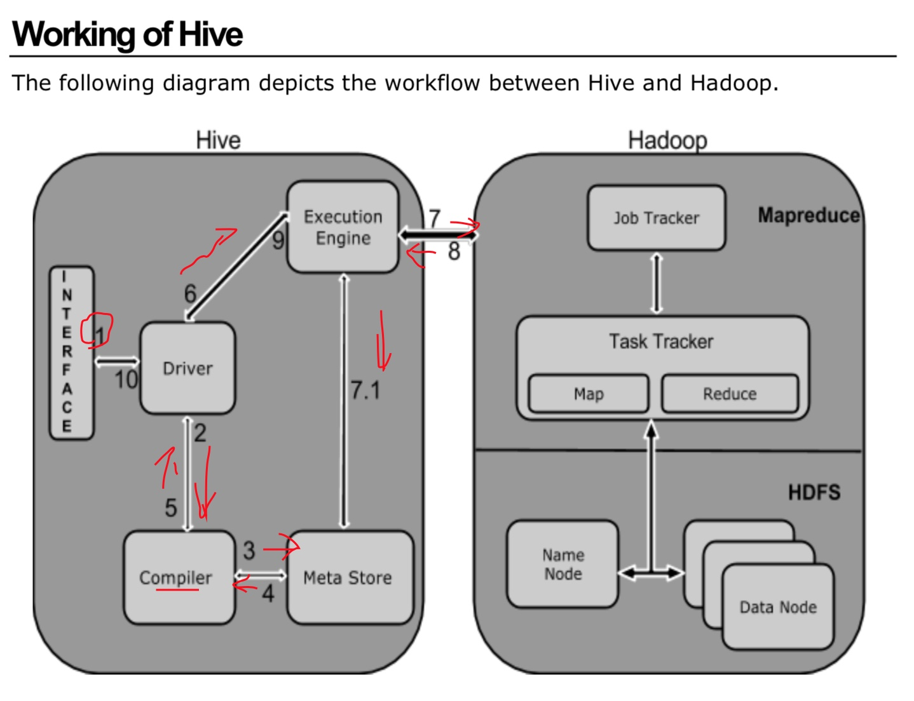

## 1，Hive介绍

* hive是数据仓库，OLAP， online analyze process, 在线分析处理，延迟性高
* 数据库， OLTP， online transaction process, 在线事务处理， 实时性比较好
* Hive的工作流程：
* 
* 

* hive
  * 数据仓库,在线分析处理。
  * HiveQL,类似sql语言
  * 表内容存在：metadata->rdbms
  * hive处理的数据存在：hdfs

## 2, Hive安装流程

### 2.1, 安装mysql

> Hive安装之前需要先安装mysql, 在centos7下安装mysql流程如下：

* 01， 使用yum直接安装MariaDB
  
```shell
yum -y install mariadb*
```


* 02, 开启服务，并设置开机启动
  
```shell
systemctl start mariadb.service
systemctl enable mariadb.service
```


* 03, 尝试登陆,刚开始是没有密码的，应该可以直接登陆成功
  
```shell
mysql
```


* 04，如果成功之后，退出，设置密码
  
```shell
exit;
mysql_secure_installation;
```


* 05，提示输入密码，如果是刚装的，密码是空，直接enter即可，然后输入用户和密码，按照提示操作即可

* 06, 都成功之后，可以按照正常流程进行登陆即可
  
```shell
mysql -u root -p *   //root是你设置的用户名
```


* 07， 默认情况下，外部是不能直接连接我们的数据库的，需要更改设置,并刷新权限
  * 这里是可以设置不同的用户名和不同的密码的哦，好强大的样子
  

```shell
GRANT ALL PRIVILEGES ON *.* TO 'root'@'%'IDENTIFIED BY ',.' WITH GRANT OPTION;
flush privileges;
```


* 08, 可以从用户表中查看root访问权限


```shell
select host, user from mysql.user;
```


### 2.2, Hive的安装配置


#### 01, 解压，配置环境变量


#### 02, 配置hive-site.xml

* 修改配置文件，重命名hive-default.xml.template为hive-site.xml，注意：这里一定要有hive-site.xml，仅仅有hive-default.xml是不行的！！！被坑过

* 修改配置信息，注意下面需要创建一个mysql数据库，配置在下面

```xml
<property>
  <name>javax.jdo.option.ConnectionDriverName</name>
  <value>com.mysql.jdbc.Driver</value>
  <description>Driver class name for a JDBC metastore</description>
</property>
<!-- 注意下面需要创建一个mysql数据库，配置在下面 -->
<property>
  <name>javax.jdo.option.ConnectionURL</name>
  <value>jdbc:mysql://master:3306/hive</value>
  <description>
    我们这里的数据都存储到master一台机器的数据库中去
    JDBC connect string for a JDBC metastore.
    To use SSL to encrypt/authenticate the connection, provide database-specific SSL flag in the connection URL.
    For example, jdbc:postgresql://myhost/db?ssl=true for postgres database.
  </description>
</property>

<property>
  <name>javax.jdo.option.ConnectionUserName</name>
  <value>root</value>
  <description>Username to use against metastore database</description>
</property>

<property>
  <name>javax.jdo.option.ConnectionPassword</name>
  <value>,.</value>
  <description>password to use against metastore database</description>
</property>


<!-- 建议把路径地址换到指定的地址 -->
<property>
  <name>hive.exec.local.scratchdir</name>
  <value>/data/hive</value>
  <description>Local scratch space for Hive jobs</description>
</property>

<property>
  <name>hive.querylog.location</name>
  <value>/data/hive</value>
  <description>Location of Hive run time structured log file</description>
</property>

<property>
  <name>hive.server2.logging.operation.log.location</name>
  <value>/data/hive/operation_logs</value>
  <description>Top level directory where operation logs are stored if logging functionality is enabled</description>
</property>

<!-- HiveServer2, 修改下面这个配置，好像是允许访问 -->
<property>
  <name>hive.server2.enable.doAs</name>
  <value>false</value>
  <description>
    Setting this property to true will have HiveServer2 execute
    Hive operations as the user making the calls to it.
  </description>
</property>
```


#### 03，初始化hive的数据库

```shell
schematool -dbType mysql -initSchema
```


#### 04, shell验证

```shell
hive
```


