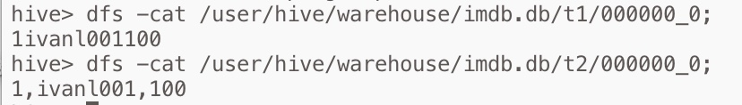
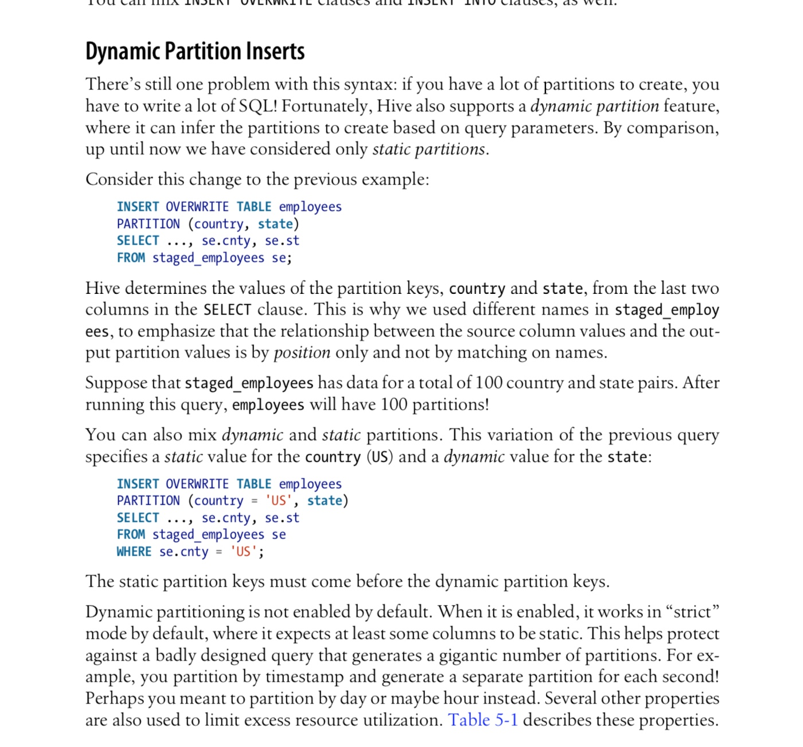
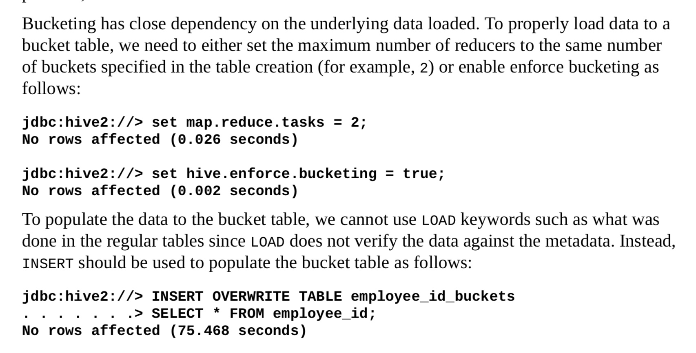
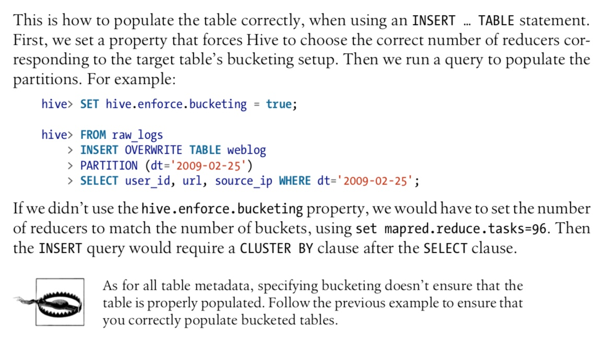
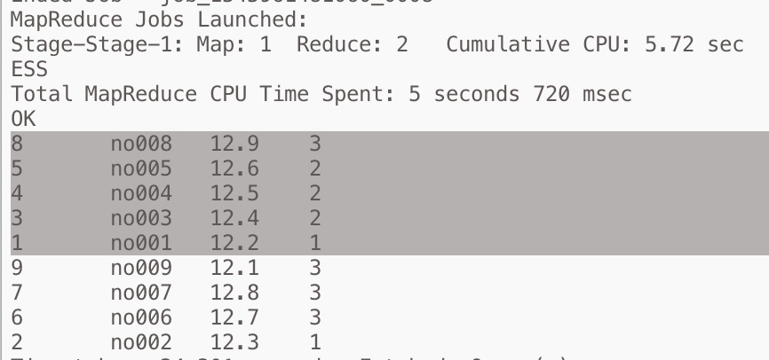
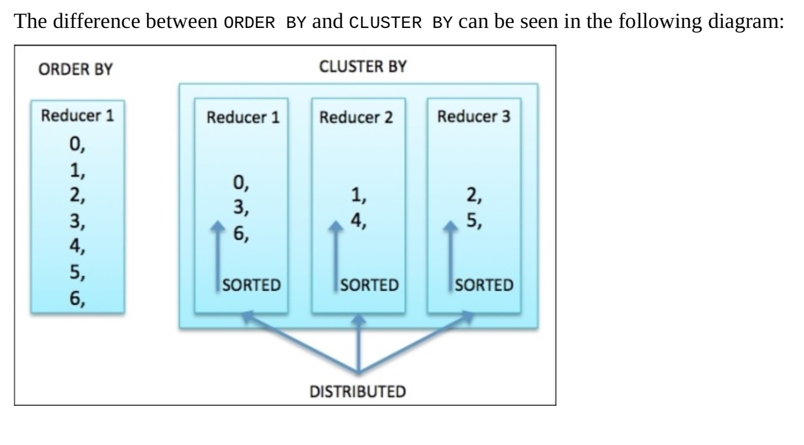

## Hive的使用01

*注意：hive默认是不支持行级操作的哈*

* 上面说的好像也不对，可以执行insert操作，会转化成mr
* 查过资料，确定hive默认支持insert，会转换成mr插入。但是不支持update和delete操作，但是可以通过更改配置文件增减update和delete的支持

```mysql
insert into stu(id,name,age) values (1, 'tom', 12);
```


* 07，复制表，这个和sql是一样的

```mysql
create table t4_copy as select * from t4;//结构和数据都复制
create table t4_struc_copy like t4;//只复制结构
```


## 1，创建表

*Hive中表有两种，一种是托管表，默认就是托管表，另外一种是外部表。*
* 01, 托管表在删除表的时候， 数据也会被删除
* 02, 外部表在删除表的时候， 数据不会被删除

## 2，Hive命令

*  01, 创建表，默认方式 :

```mysql
CREATE TABLE IF NOT EXISTS t1(id int,name string,age int) COMMENT '这是注释'; 
```


* 02, 创建表，默认方式加强版:  

```mysql
CREATE TABLE IF NOT EXISTS t2(id int,name string,age int) COMMENT '这是注释' ROW FORMAT DELIMITED FIELDS TERMINATED BY ',' STORED AS TEXTFILE;

CREATE external TABLE IF NOT EXISTS t2(id int,name string,age int) COMMENT '这是注释' ROW FORMAT DELIMITED FIELDS TERMINATED BY ',' STORED AS TEXTFILE;
```


* 指定分隔符和不指定分隔符：

    

* 03，查看表的具体信息
```mysql
desc t1;
desc formatted t1;
```


* 04, 加载本地文件到hive表，另外需要注意：如果覆盖，之前的数据会全部删除哦， 这个其实是上传本地文件到hive的表目录下
```mysql
# 注意：如果文件中有分隔符，创建表的时候也必须要添加分隔符限制
load data local inpath '/root/share/customers.txt' [overwrite] into table t2;
```


* 05, 加载hdfs上的文件到hive表， 这个其实是把hdfs原目录的文件移动到hive指定的表的目录下
```mysql
load data inpath '/user/root/customer.txt' into table t3;
```


* 06, 创建外部表,
```mysql
# 加载数据也是和托管表一样，也是上传或者移动数据，但是只是删除数据的时候，文件不会被删除
CREATE external TABLE IF NOT EXISTS t4(id int,name string,age int) COMMENT '这是注释' ROW FORMAT DELIMITED FIELDS TERMINATED BY ',' STORED AS TEXTFILE;
```


* 07，复制表，这个和sql是一样的
```mysql
# 结构和数据都复制
create table t4_copy as select * from t4;

# 只复制结构
create table t4_struc_copy like t4;
```


* 08，count()查询要转成mr
```mysql
select count(*) from t2 ;
```


* 09, 启用/禁用表，现在貌似不管用

```mysql
# 不允许删除
ALTER TABLE t2 ENABLE NO_DROP;

# 允许删除
ALTER TABLE t2 DISABLE NO_DROP;
```


* 10, 创建分区表.
  分区表,优化手段之一，从目录的层面控制搜索数据的范围。
  
  * 首先创建分区表
  
  ```mysql
  CREATE TABLE t5(id int,name string,age int) PARTITIONED BY (Year INT, Month INT) ROW FORMAT DELIMITED FIELDS TERMINATED BY ',' ;
  ```
  
  
  
  * 然后添加分区，其实就是创建目录
  
  ```mysql
  alter table t5 add partition (year=2017, month=12);
  alter table t5 add partition (year=2018, month=01) partition(year=2018, month=02);
  ```
  
  
  
  * 然后可以查看分区
  
  ```mysql
  show partitions t5;
  ```
  
  
  
  * 如果有添加错误的分区或者不需要的分区，可以删除
  
  ```mysql
  alter table t5 drop partition (year=2019, month=23);
  ```
  
  
  
  * 加载数据到分区，需要指定分区哦
  
  ```mysql
  # 注意：这里是有一个问题的，month=02，在创建文件夹的时候其实是名字为2的文件夹，0是不会添加在里面的
  load data local inpath '/root/share/customers.txt' into table t5 partition (year=2018, month=02);
  ```
  
  
  
  * 其实还有动态分区，参考 `94/350 [O'REILLY]Programming Hive`
    > 动态分区，后面填坑
    


* 11, 桶表
  *桶表其实就是按文件进行划分，比如说以id值做参考创建三个桶，那么会通过hash值均分到三个文件中*

  * 创建桶表t6

  ```mysql
  create table t6 (id int, name string, age int) clustered by (id) into 3 buckets row format delimited fields terminated by ',';
  ```

  

  * 插入数据, 这里需要注意一点：如果用load加载数据到桶表，是不能实现分桶操作的。可以通过先加载数据到其他表，再复制到桶表中是ok的，我们这里把分区表t5中的数据复制到t6中去, 如果成功后会在t6表中到文件夹中多三个文件，也就是三个桶

  ```mysql
  # 会转mr
  insert into t6 select id, name, age from t5;
  ```

  

  * 上面说的好像也不对，如下图，桶表应该也能加载数据，但是要设置属性，不过好像load方式也不推荐，我们这里就不尝试了
    * 
    * 

  //桶表的数量如何设置?
  //评估数据量，保证每个桶的数据量block的2倍大小。一般也就是256M


2G

8


* 12，连接查询

  * 首先创建表

  ```mysql
  CREATE TABLE customers(id int,name string,age int) ROW FORMAT DELIMITED FIELDS TERMINATED BY ',' ;
  CREATE TABLE orders(id int,orderno string,price float,cid int) ROW FORMAT DELIMITED FIELDS TERMINATED BY ',' ;
  ```

  

  * 然后加载数据到表

  ```mysql
  load data local inpath '/root/share/customers.txt' into table customers;
  load data local inpath '/root/share/orders.txt' into table orders;
  ```

  


  * 通过正常到sql连接语句即可
    * 内连接
    
    ```mysql
    select a.*, b.* from customers as a, orders as b where a.id = b.cid;
    ```
    
    
    
    * 左外连接,优先显示左边，右边没有匹配到也会显示左边的数据
    
    
    ```mysql
    select a.*, b.* from customers as a left outer join orders as b on a.id = b.cid;
    ```
    
    
    
    
    * 右外连接,优先显示右边，左边没有匹配到也会显示右边数据
    
    ```mysql
    select a.*, b.* from customers as a right outer join orders as b on a.id = b.cid;
    ```
    
    
    
    * 全外连接，注意这个mysql中是没有这个语法的哈，只是hive中有，可以同时查到没有订单的顾客和没有顾客的订单
    
    ```mysql
    select a.*, b.* from customers as a full outer join orders as b on a.id = b.cid;
    ```
    
    
    
* 13， 数据的导入导出

  * 导出表结构+数据。
  ```mysql
  EXPORT TABLE customers TO '/user/centos/data';	
  ```
  
  
  
  * 导出的数据是一个文件夹，该文件夹下有一个_metadata文件，是元数据，记录表的结构，字段，分隔符等相关信息。还有一个/data/目录，下面放的是数据文件，如果这张表你是加载是文件上去的，那么导出来的文件和上传的那个文件是一摸一样的哈


* 14, order:全排序， mr排序
  *书里说这个排序用的方法就是设置了一个reducer，这么夸张吗*
  
  ```mysql
  select * from orders order by id desc ;
  ```
  
  


* 15, sort:部分排序。
  *这个就是部分排序，如果设置了reducer个数是1，那么就等于order排序，也就是全排序了*

  ```mysql
  select * from orders sort by id desc ;
  ```
  
  
  
   * 可以设置reducer的个数
  ```mysql
  set mapred.reduce.tasks=2;   # 这个设置reduce的个数
  set hive.exec.reducers.max=0 # 这个可以限制
  set mapreduce.job.reduces=0  # 这个设置好像无效
  
  
  In order to change the average load for a reducer (in bytes):
    set hive.exec.reducers.bytes.per.reducer=<number>
  In order to limit the maximum number of reducers:
    set hive.exec.reducers.max=<number>
  In order to set a constant number of reducers:
    set mapreduce.job.reduces=<number>
  
  ```
  
  
  
    * 
    * 上图说明：两个reduce，8，5，4，3，1有序，是第一个，9，7，6，2有序是第二个


* 16，DISTRIBUTE BY，mapper端的分区操作,需要放在sort之前，因为排序之前需要确定哪些数据进入哪个reducer，要不然怎么排序.....这个作用不是特别懂， 说是类似于mysql的group by， 大概意思应该是group by的字段会进入到一个reduce，然后配合使用sort就可以实现分组后排序。比如下面，根据用户id分组后，根据订单id排序。

```mysql
select cid , orderno, oid from orders distribute by cid sort by oid ;
```


* 17， cluster by ===>  distribute by cid sort by cid
*意思是如果DISTRIBUTE BY和sort by需要操作同一个字段，可以直接用cluster by，这个就是简写。当然如果向上面那样cid分组，oid排序，是不能用这个哈*

```mysql
select cid , orderno, cid from orders cluster by cid ;
```




