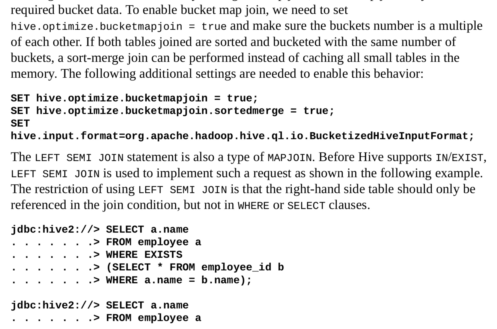
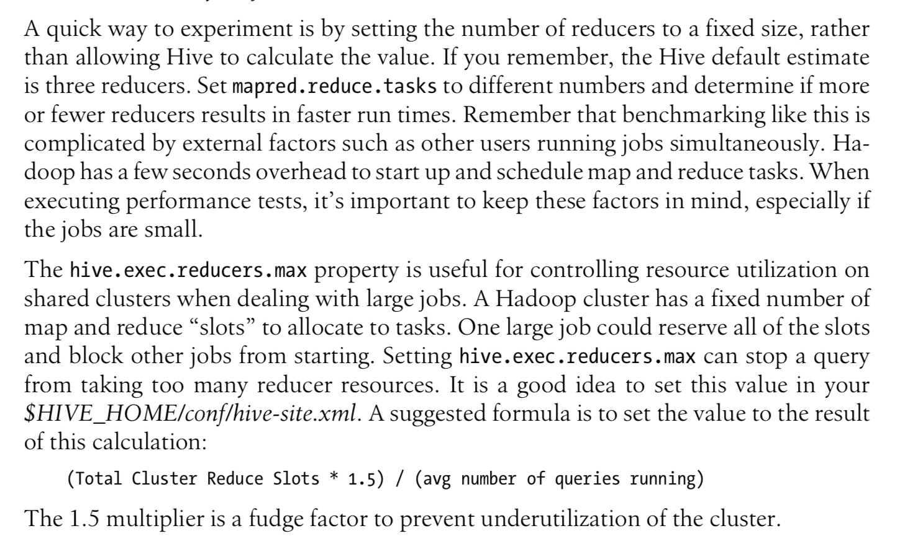
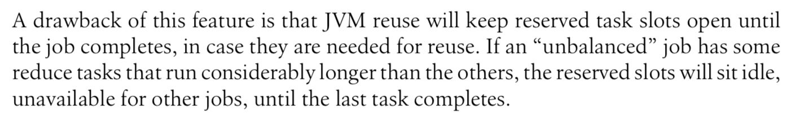
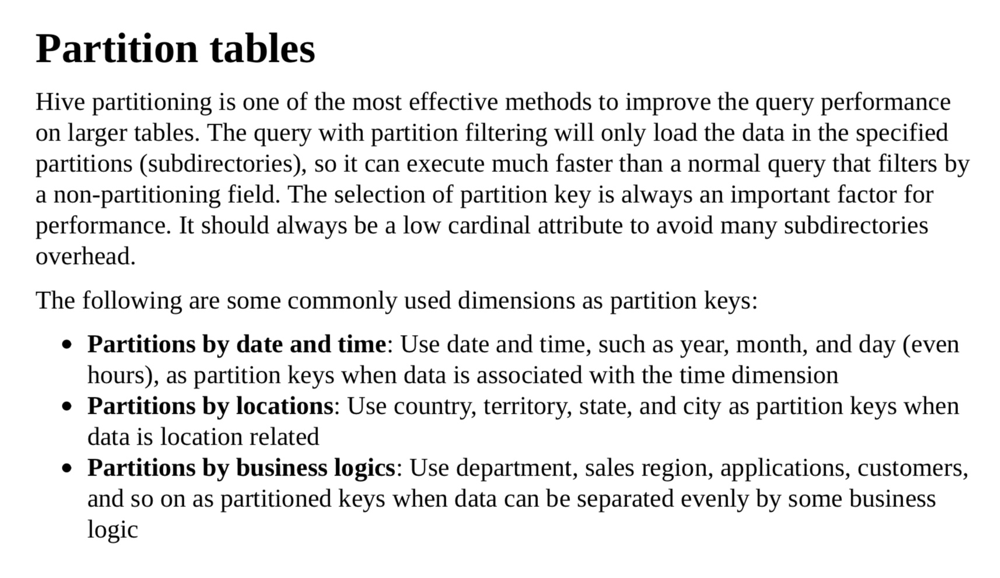
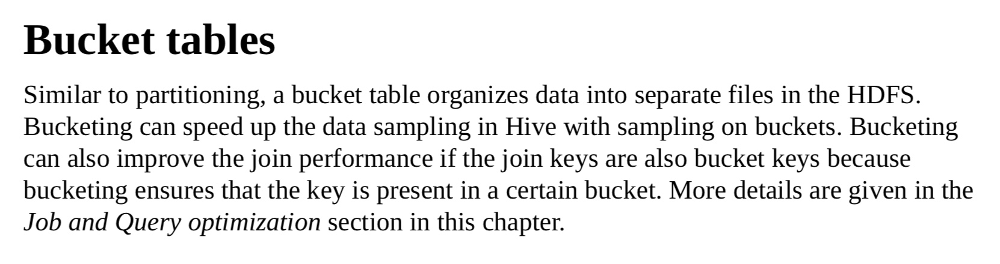
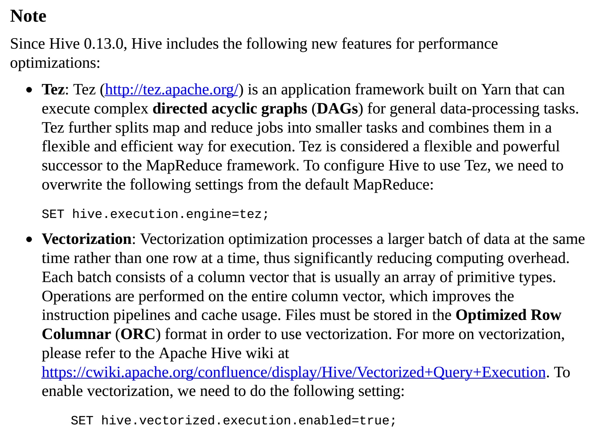

> The first step to learning how Hive works (after reading this book...) is to use the EXPLAIN feature to learn how Hive translates queries into MapReduce jobs.
第一步是学会用EXPLAIN命令了解hive如何把查询语言转化成MR作业

## 1, 优化工具explain

### 查看语句的执行流程和整体情况explain

* 01, 在需要查看的语句前添加explain关键字就可以
  

```mysql
explain select * from t8;
explain select a.*,b.* from customers a left outer join orders b on a.id = b.cid;
```


* 02, 查看更加详尽的步骤信息
  

```mysql
explain extended select * from t8;
explain extended select a.*,b.* from customers a left outer join orders b on a.id = b.cid;
```

#### 总结一下，有点用处但是感觉用处不大，不是很好分析啊，可能是分析的比较少


## 2，limit字段

* 01, 人们在查询的时候会使用limit字段，但是在某些查询的时候即便是使用了limit字段依然会执行整个查询，只是返回有用的信息(个人表示不太懂暂时)。这样很浪费。在hive中可以设置如下属性避免这种情况发生：

```xml
<property>
  <name>hive.limit.optimize.enable</name> 
  <value>true</value>
  <description>Whether to enable to optimization to try a smaller subset of data for simple LIMIT first.</description>
</property>
```
* 02, 然后需要设置一下最大最小限制量

```xml
<property>
  <name>hive.limit.row.max.size</name>
  <value>100000</value>
  <description>When trying a smaller subset of data for simple LIMIT, how much size we need to guarantee each row to have at least. </description>
</property>
<property>
  <name>hive.limit.optimize.limit.file</name>
  <value>10</value>
  <description>When trying a smaller subset of data for simple LIMIT, maximum number of files we can sample.</description> 
</property>
```

* 但是有一个问题需要注意：设置了如上属性之后有一些有用的数据有可能会被过滤掉。具体说法如下
* A drawback of this feature is the risk that useful input data will never get processed. For example, any query that requires a reduce step, such as most JOIN and GROUP BY operations, most calls to aggregate functions, etc., will have very different results. Per- haps this difference is okay in many cases, but it’s important to understand.


## 3，连接优化
### 3.1，大小表连接查询优化

* *如果有大表有小表需要连接查询，那么可以开启mapjoin提高性能，开启之后就算没有设置连接暗示也能判断大小表，然后大小表的时候可以进行map连接，从而避免reduce连接*


```mysql
set hive.auto.convert.join=true			//设置自动转换连接,默认开启了。
```


* 当然使用连接暗示也是可以的。如下，/*+ mapjoin(customers) */这个那是customer是小表哈


```mysql
select /*+ mapjoin(customers) / a., b.* from customers a left outer join orders b on a.id = b.cid ;
```


* 当然如果是桶表连接查询的话，是一种特殊的mapjoin连接查询。桶表的连接查询只会获取桶表中需要的那些字段，而不是加载所有字段数据。需要注意：这个只适用于桶表数量不相同的情况


```mysql
set hive.optimize.bucketmapjoin=true;
```


* 在桶数量相同或者其他情况，不想翻译了，所以直接截图过来了，如下图
* 

### 3.2，大表连接

* 大表放在join的后面

* it’s important to know which table is the largest and put it last in the JOIN clause, or use the /* streamtable(table_name) */ directive.
* 具体参考 `120/350   [O'REILLY]Programming Hive.pdf`


## 4, 本地模式

*有写时候输入数据量不是很大的时候，是可以开启本地模式执行任务的。因为每次开启任务需要消耗满多时间。那么对于这些小数据量的数据，可以设置自定检测，并临时开启本地模式*

hive-site.xml

```xml
<property> 
  <name>hive.exec.mode.local.auto</name> 
  <value>true</value>
  <description>Let hive determine whether to run in local mode automatically</description> 
</property>
```


## 5, 并发执行

* *hive会把查询分成很多阶段。不同阶段是一个一个执行的，开启并发执行可以提高作业的执行效率*
* Hive converts a query into one or more stages. Stages could be a MapReduce stage, a sampling stage, a merge stage, a limit stage, or other possible tasks Hive needs to do. By default, Hive executes these stages one at a time. However, a particular job may consist of some stages that are not dependent on each other and could be executed in parallel, possibly allowing the overall job to complete more quickly. However, if more stages are run simultaneously, the job may complete much faster.

```xml
<property>
  <name>hive.exec.parallel</name>
  <value>true</value>
  <description>Whether to execute jobs in parallel</description>
</property>
```


## 6, Strict Mode

* 开启严格模式限制三种查询

  * 1, 分区表在未指定分区情况下不能查询。必须要在where执行分区时候才能查询
  * 2，ORDER BY查询没有limit字段限制则不能查询
  * 3，笛卡尔积查询


## 7，最优化mapper和reducer个数

* *hive默认会根据输入文件的大小自动决定mr个数，一般情况下效果都非常好。*

* 如果想要自己控制mr个数，可以自己设置

* The default value of hive.exec.reducers.bytes.per.reducer is 1 GB. Changing this value to 750 MB causes Hive to estimate four reducers for this job:

  ```shell
  set hive.exec.reducers.bytes.per.reducer=750000000;
  ```
  
* 同时最好设置最大reducer个数

  * 

#### 总结：这个看的有点迷糊，大概意思懂了，具体可以参考如下

参考 `Tuning the Number of Mappers and Reducers  158/350  [O'REILLY]Programming Hive.pdf`


## 8, JVM重用

*设置jvm重用对于hive执行作业是很有效的,特别是执行的job有的tasks特别多的情况下。也即是小文件多的情况等*

mapred-site.xml

```xml
<property>
  <name>mapred.job.reuse.jvm.num.tasks</name>
  <value>10</value>
  <description>How many tasks to run per jvm. If set to -1, there is no limit.</description> 
</property>
```
  * 
* #### 开启的话可以很大程度提高效率，只是在reduce任务执行时间，这些slots就会闲置了


## 9，Indexes

*创建索引*


## 10，动态分区

  * 动态分区的作用不言而喻，在文件夹的层面上来进行分区，直接在量级上控制搜索的范围

  * *在加入的时候根据加入数据的字段自动分区，而不必把分区数据定死。如下，演示一下动态分区*

  * 首先创建一个有年份和月份的表，用作数据插入的元数据


```mysql
create table t7 (id int , name string , age int, year string, month string);
```


  * 然后插入两条不同年份或月份的数据吧
    

```mysql
insert into t7 (id, name, age, year, month) values (1, "ivanl0000", 10, 2015, 12);

insert into t7 (id, name, age, year, month) values (2, "ivanl111111", 15, 2016, 11);
```


  * 然后把上面表中的两条数据插入到我们之前建的分区表t5中去，因为并没有开启动态分区，会报错：


```mysql
insert into t5 partition (year, month) select id, name, age, year, month from t7;
```


  * 上面的插入会报错, 默认严格模式，严格模式在插入时候必须要指定一个静态分区，我们关闭这个严格模式即可：


```mysql
FAILED: SemanticException [Error 10096]: Dynamic partition strict mode requires at least one static partition column. To turn this off set hive.exec.dynamic.partition.mode=nonstrict
```


  * 根据提示可以知道需要设置分区模式为非严格模式


```mysql
set hive.exec.dynamic.partition.mode=nonstrict
```


  * 重新插入发现ok了


## 11，优化设计
### 01，分区
  * 
### 02，桶表
  * 


## 12, index
*这里是另外一本书，`参考 205/313 [PACKT]Apache Hive Essentials.pdf`*

* 01，创建索引(COMPACT和BITMAP是两种不同的索引方式，都是ok的哈)


```mysql
CREATE INDEX idx_id_employee_id ON TABLE employee_id (employee_id) AS 'COMPACT' WITH DEFERRED REBUILD;

CREATE INDEX idx_sex_employee_id ON TABLE employee_id (sex_age) AS 'BITMAP' WITH DEFERRED REBUILD;
```


* 02，刷新索引
*WITH DEFERRED REBUILD字段表明这个索引不是即使生效的，可以使用如下命令进行建立索引。当然如果数据有所变动，索引创建则是自动的哈。大概意思可以理解成第一次手动创建建立索引即可*


```mysql
ALTER INDEX idx_id_employee_id ON employee_id REBUILD;

ALTER INDEX idx_sex_employee_id ON employee_id REBUILD;
```


* 03, 查看索引表，参考原书吧

* 04，删除索引


```mysql
DROP INDEX idx_sex_employee_id ON employee_id;
```


 * 另外两种方式提高性能：
 * 

## 13, 解决数据倾斜配置

```mysql
SET hive.optimize.skewjoin=true; 
-- If there is data skew in join, set it to true. Default is false.

SET hive.skewjoin.key=100000;
-- This is the default value. If the number of key is bigger than this, the new keys will send to the other unused reducers.
```


* 下面是解决groupby的时候遇到的数据倾斜需要再增加的配置
```mysql
SET hive.groupby.skewindata=true;
```


