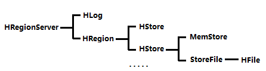

> https://www.cnblogs.com/swordfall/p/8737328.html#auto_id_0


# 1. HBase简介

## 1.1 什么是HBase

HBASE是一个高可靠性、高性能、面向列、可伸缩的分布式存储系统，利用HBASE技术可在廉价PC Server上搭建起大规模结构化存储集群。

HBASE的目标是存储并处理大型的数据，更具体来说是仅需使用普通的硬件配置，就能够处理由成千上万的行和列所组成的大型数据。

HBASE是Google Bigtable的开源实现，但是也有很多不同之处。比如：Google Bigtable使用GFS作为其文件存储系统，HBASE利用Hadoop HDFS作为其文件存储系统；Google运行MAPREDUCE来处理Bigtable中的海量数据，HBASE同样利用Hadoop MapReduce来处理HBASE中的海量数据；Google Bigtable利用Chubby作为协同服务，HBASE利用Zookeeper作为协同服务。

## 1.2 与传统数据库的对比

1、传统数据库遇到的问题：

  1）数据量很大的时候无法存储；
  2）没有很好的备份机制；
  3）数据达到一定数量开始缓慢，很大的话基本无法支撑；

2、HBASE优势：

  1）线性扩展，随着数据量增多可以通过节点扩展进行支撑；
  2）数据存储在hdfs上，备份机制健全；
  3）通过zookeeper协调查找数据，访问速度快。

## 1.3 HBase集群中的角色

1、一个或者多个主节点，Hmaster；

2、多个从节点，HregionServer；

3、HBase依赖项，zookeeper；

# 2. HBase数据模型

 

## 2.1 HBase的存储机制

HBase是一个面向列的数据库，在表中它由行排序。表模式定义只能列族，也就是键值对。一个表有多个列族以及**每一个列族可以有任意数量的列**。后续列的值连续存储在磁盘上。表中的每个单元格值都具有时间戳。总之，在一个HBase：

- 表是行的集合。
- 行是列族的集合。
- 列族是列的集合。
- 列是键值对的集合。

这里的列式存储或者说面向列，其实说的是列族存储，HBase是根据列族来存储数据的。列族下面可以有非常多的列，列族在创建表的时候就必须指定。

### HBase 和 RDBMS的比较


RDBMS的表：


HBase的表：


## 2.2 Row Key 行键

与nosql数据库一样，row key是用来表示唯一一行记录的**主键**，HBase的数据时按照RowKey的**字典顺序**进行全局排序的，所有的查询都只能依赖于这一个排序维度。访问HBASE table中的行，只有三种方式：

\1. 通过单个row key访问；

\2. 通过row key的range（正则）

\3. 全表扫描

Row  key 行键（Row key）可以是任意字符串(最大长度是64KB，实际应用中长度一般为10-1000bytes)，在HBASE内部，row  key保存为字节数组。存储时，数据按照Row  key的字典序(byte  order)排序存储。设计key时，要充分排序存储这个特性，将经常一起读取的行存储放到一起。(位置相关性)

## 2.3 Columns  Family 列族

列簇：HBASE表中的每个列，都归属于某个列族。列族是表的schema的一部分(而列不是)，必须在使用表之前定义。列名都以列族作为前缀。例如courses：history，courses：math 都属于courses这个列族。

## 2.4 Cell

由{row key，columnFamily，version} 唯一确定的单元。cell中的数据是没有类型的，全部是字节码形式存储。

关键字：无类型、字节码

## **2.5 Time Stamp 时间戳**

HBASE中通过rowkey和columns确定的为一个存储单元称为cell。每个cell都保存着同一份数据的多个版本。版本通过时间戳来索引。时间戳的类型是64位整型。时间戳可以由HBASE(在数据写入时自动)赋值，此时时间戳是精确到毫秒的当前系统时间。时间戳也可以由客户显示赋值。如果应用程序要避免数据版本冲突，就必须自己生成具有唯一性的时间戳。每个cell中，不同版本的数据按照时间倒序排序，即最新的数据排在最前面。

为了避免数据存在过多版本造成的管理(包括存储和索引)负担，HBASE提供了两种数据版本回收方式。一是保存数据的最后n个版本，而是保存最近一段时间内的版本(比如最近7天)。用户可以针对每个列族进行设置。

# 3. HBase原理

##  HBase系统架构体系图


组成部件说明：

**Client：**

使用HBase RPC机制与HMaster和HRegionServer进行通信
Client与HMaster进行管理类操作
Client与HRegionServer进行数据读写类操作

**Zookeeper：**

> 这里我纠正一下：`-ROOT-`表在hbase 0.96.0中已经被移除了，之前存在的时候，`-ROOT-`表的作用就是在zk中存储`.META`表的位置，可以通过联系zk找到`.META`表的位置，也就是现在的`hbase:meta`表. 
>
> 现在的版本中，`hbase:meta`表的位置已经直接存储在zk的节点“hbase:meta”中了，所以客户端会直接去zk中找到`hbase:meta`表的位置即可
>
> `hbase:meta`表中主要存储hbase的分区列表
>
> 
>
> 客户端会先去zk找到hbase:meta的服务器，然后去服务器上找到meta元数据表，这张表里存储了hbase的分区信息，包含每个分区的服务器地址。这些信息都会被客户端缓存下来，防止再次查找。
>
> 然后如果有读写请求，客户端会直接联系RegionServer而不需要联系master，就可以进行操作。
>
> 如果region被改写，客户端会重新查询新的分区信息。


Zookeeper Quorum存储-ROOT-表地址、HMaster地址
HRegionServer把自己以Ephedral方式注册到Zookeeper中，HMaster随时感知各个HRegionServer的健康状况
Zookeeper避免HMaster单点问题

Zookeeper的主要作用：客户端首先联系ZooKeeper子集群（quorum）（一个由ZooKeeper节点组成的单独集群）查找行健。上述过程是通过ZooKeeper获取含有-ROOT-的region服务器名（主机名）来完成的。通过含有-ROOT-的region服务器可以查询到含有.META.表中对应的region服务器名，其中包含请求的行健信息。这两处的主要内容都被缓存下来了，并且都只查询一次。最终，通过查询.META服务器来获取客户端查询的行健数据所在region的服务器名。一旦知道了数据的实际位置，即region的位置，HBase会缓存这次查询的信息，同时直接联系管理实际数据的HRegionServer。所以，之后客户端可以通过缓存信息很好地定位所需的数据位置，而不用再次查找.META.表。


**HMaster：**

HMaster没有单点问题，HBase可以启动多个HMaster，通过Zookeeper的Master Election机制保证总有一个Master在运行
主要负责Table和Region的管理工作：

1. 管理用户对表的增删改查操作
2. 管理HRegionServer的负载均衡，调整Region分布
3. Region Split后，负责新Region的分布
4. 在HRegionServer停机后，负责失效HRegionServer上Region迁移

**HRegionServer：**

> 下面这个是我添加的，官网上看的

```mysql
Table                    (HBase table)
    Region               (Regions for the table)
        Store            (Store per ColumnFamily for each Region for the table)
            MemStore     (MemStore for each Store for each Region for the table)
            StoreFile    (StoreFiles for each Store for each Region for the table)
                Block    (Blocks within a StoreFile within a Store for each Region for the table)
                
                
# HRegionServer存取一个子表时，会创建一个HRegion对象，
# 然后对表的每个列族创建一个Store实例，
# 每个Store都会有一个MemStore和0个或多个StoreFile与之对应，
# 每个StoreFile都会对应一个HFile，
# HFile就是实际的存储文件。
# 因此，一个HRegion（表）有多少个列族就有多少个Store。
# 一个HRegionServer会有多个HRegion和一个HLog。
```


HBase中最核心的模块，主要负责响应用户I/O请求，向HDFS文件系统中读写


​                                                

HRegionServer管理一系列HRegion对象；
每个HRegion对应Table中一个Region，HRegion由多个HStore组成；
每个HStore对应Table中一个Column Family的存储；
Column Family就是一个集中的存储单元，故将具有相同IO特性的Column放在一个Column Family会更高效。

可以看到，client访问hbase上的数据并不需要master参与（寻址访问zookeeper和region server，数据读写访问region server），master仅仅维护table和region的元数据信息（table的元数据信息保存在zookeeper上），负载很低。HRegionServer存取一个子表时，会创建一个HRegion对象，然后对表的每个列族创建一个Store实例，每个Store都会有一个MemStore和0个或多个StoreFile与之对应，每个StoreFile都会对应一个HFile，HFile就是实际的存储文件。因此，一个HRegion（表）有多少个列族就有多少个Store。一个HRegionServer会有多个HRegion和一个HLog。

**HRegion：**

table在行的方向上分隔为多个Region。Region是HBase中分布式存储和负载均衡的最小单元，即不同的region可以分别在不同的Region Server上，但同一个Region是不会拆分到多个server上。

Region按大小分隔，每个表一般是只有一个region。随着数据不断插入表，region不断增大，当region的某个列族达到一个阀值（默认256M）时就会分成两个新的region。

每个region由以下信息标识：

1. <表名，startRowKey，创建时间>
2. 由目录表(-ROOT-和.META.)记录该region的endRowKey

HRegion定位：Region被分配给哪个RegionServer是完全动态的，所以需要机制来定位Region具体在哪个region server。

HBase使用三层结构来定位region：

1. 通过zookeeper里的文件/hbase/rs得到-ROOT-表的位置。-ROOT-表只有一个region。
2. 通过-ROOT-表查找.META.表的第一个表中相应的region的位置。其实-ROOT-表是.META.表的第一个region；.META.表中的每一个region在-ROOT-表中都是一行记录。
3. 通过.META.表找到所要的用户表region的位置。用户表中的每个region在.META表中都是一行记录。

注意：

 -ROOT-表永远不会被分隔为多个region，保证了最多需要三次跳转，就能定位到任意的region。client会将查询的位置信息缓存起来，缓存不会主动失效，因此如果client上的缓存全部失效，则需要进行6次网络来回，才能定位到正确的region，其中三次用来发现缓存失效，另外三次用来获取位置信息。

table和region的关系

table默认最初只有一个region，随着记录数的不断增加而变大，起初的region会逐渐分裂成多个region，一个region有【startKey, endKey】表示，不同的region会被master分配给相应的regionserver管理。

region是hbase分布式存储和负载均衡的最小单元，不同的region分不到不同的regionServer。

注意：region虽然是分布式存储的最小单元，但并不是存储的最小单元。region是由一个或者多个store组成的，每个store就是一个column family。每个store又由memStore和1至多个store file 组成(memstore到一个阀值会刷新，写入到storefile，有hlog来保证数据的安全性，一个regionServer有且只有一个hlog)　　　　　　　　　　　　　　　　　　　　　　　　　　　　　　　　　　　　　

**HStore：**

HBase存储的核心。由MemStore和StoreFile组成。MemStore是Stored Memory Buffer。
**HLog：**

引入HLog原因：在分布式系统环境中，无法避免系统出错或者宕机，一旦HRegionServer意外退出，MemStore中的内存数据就会丢失，引入HLog就是防止这种情况。

工作机制：
每个HRegionServer中都会有一个HLog对象，HLog是一个实现Write Ahead Log的类，每次用户操作写入MemStore的同时，也会写一份数据到HLog文件，HLog文件定期会滚动出新，并删除旧的文件(已持久化到StoreFile中的数据)。当HRegionServer意外终止后，HMaster会通过Zookeeper感知，HMaster首先处理遗留的HLog文件，将不同region的log数据拆分，分别放到相应region目录下，然后再将失效的region重新分配，领取到这些region的HRegionServer在Load Region的过程中，会发现有历史HLog需要处理，因此会Replay HLog中的数据到MemStore中，然后flush到StoreFiles，完成数据恢复。

## 3.1 HBase的存储格式

HBase中的所有数据文件都存储在Hadoop HDFS文件系统上，格式主要有两种：

\1. HFile，HBase中Key-Value数据的存储格式，HFile是Hadoop的二进制格式文件，实际上StoreFile就是对HFile做了轻量级包装，即StoreFile底层就是HFile。

\2. HLog File，HBase中WAL(Write Ahead Log)的存储格式，物理上是Hadoop的Sequence File

### HFile


图片解释：

HFile文件不定长，长度固定的块只有两个：Trailer和FileInfo

Trailer中指针指向其他数据块的起始点

File Info中记录了文件的一些Meta信息，例如：AVG_KEY_LEN, AVG_VALUE_LEN, LAST_KEY, COMPARATOR, MAX_SEQ_ID_KEY等

Data Index和Meta Index块记录了每个Data块和Meta块的起始点

Data Block是HBase I/O的基本单元，为了提高效率，HRegionServer中有基于LRU的Block Cache机制

每个Data块的大小可以在创建一个Table的时候通过参数指定，大号的Block有利于顺序Scan，小号Block利于随机查询 

每个Data块除了开头的Magic以外就是一个个KeyValue对拼接而成, Magic内容就是一些随机数字，目的是防止数据损坏

HFile里面的每个KeyValue对就是一个简单的byte数组。这个byte数组里面包含了很多项，并且有固定的结构。


KeyLength和ValueLength：两个固定的长度，分别代表Key和Value的长度 

Key部分：Row Length是固定长度的数值，表示RowKey的长度，Row 就是RowKey 

Column Family Length是固定长度的数值，表示Family的长度 

接着就是Column Family，再接着是Qualifier，然后是两个固定长度的数值，表示Time Stamp和Key Type（Put/Delete） 

Value部分没有这么复杂的结构，就是纯粹的二进制数据

### HLog File


HLog文件就是一个普通的Hadoop Sequence File，Sequence File 的Key是HLogKey对象，HLogKey中记录了写入数据的归属信息，除了table和region名字外，同时还包括 sequence number和timestamp，timestamp是“写入时间”，sequence number的起始值为0，或者是最近一次存入文件系统中sequence number。 

HLog Sequece File的Value是HBase的KeyValue对象，即对应HFile中的KeyValue

## 3.2 写流程


1) Client通过Zookeeper的调度，向RegionServer发出写数据请求，在Region中写数据；

2) 数据被写入Region的MemStore，直到MemStore达到预设阀值(即MemStore满)；

3) MemStore中的数据被Flush成一个StoreFile；

4) 随着StoreFile文件的不断增多，当其数量增长到一定阀值后，触发Compact合并操作，将多个StoreFile合并成一个StoreFile，同时进行版本合并和数据删除；

5) StoreFiles通过不断的Compact合并操作，逐步形成越来越大的StoreFile；

6) 单个StoreFile大小超过一定阀值后，触发Split操作，把当前Region Split成2个新的Region。父Region会下线，新Split出的2个子Region会被HMaster分配到相应的RegionServer上，使得原先1个Region的压力得以分流到2个Region上。

可以看出HBase只有增添数据，所有的更新和删除操作都是在后续的Compact历程中举行的，使得用户的写操作只要进入内存就可以立刻返回，实现了HBase I/O的高性能。

## 3.3 读流程

1) Client访问Zookeeper，查找-ROOT-表，获取**.**META**.**表信息；

2) 从**.**META**.**表查找，获取存放目标数据的Region信息，从而找到对应的RegionServer；

3) 通过RegionServer获取需要查找的数据；

4) RegionServer的内存分为MemStore和BlockCache两部分，MemStore主要用于写数据，BlockCache主要用于读数据。读请求先到MemStore中查数据，查不到就到BlockCache中查，再查不到就会到StoreFile上读，并把读的结果放入BlockCache。

寻址过程：client—>Zookeeper—>ROOT表—>**.**META**.** 表—>RegionServer—>Region—>client

# 4. HBASE命令

## 4.1 命令的进退

1、hbase提供了一个shell的终端给用户交互

*hbase shell*

 

2、如果退出执行*quit*命令


## 4.2 命令

| 名称                       | 命令表达式                                                   |
| -------------------------- | ------------------------------------------------------------ |
| 查看hbase状态              | status                                                       |
| 创建表                     | create '表名','列族名1','列族名2','列族名N'                  |
| 查看所有表                 | list                                                         |
| 描述表                     | describe '表名'                                              |
| 判断表存在                 | exists '表名'                                                |
| 判断是否禁用启用表         | is_enabled '表名' is_disabled '表名'                         |
| 添加记录                   | put '表名','rowkey','列族：列'，'值'                         |
| 查看记录rowkey下的所有数据 | get '表名','rowkey'                                          |
| 查看所有记录               | scan '表名'                                                  |
| 查看表中的记录总数         | count '表名'                                                 |
| 获取某个列族               | get  '表名','rowkey','列族：列'                              |
| 获取某个列族的某个列       | get '表名','rowkey','列族：列'                               |
| 删除记录                   | delete '表名','行名','列族：列'                              |
| 删除整行                   | deleteall '表名','rowkey'                                    |
| 删除一张表                 | 先要屏蔽该表，才能对该表进行删除 第一步 disable '表名'，第二步 drop '表名' |
| 清空表                     | truncate '表名'                                              |
| 查看某个表某个列中所有数据 | scan '表名',{COLUMNS=>'列族名：列名'}                        |
| 更新记录                   | 就是重新一遍，进行覆盖，hbase没有修改，都是追加              |

具体实例：

1、查看HBase运行状态  status


2、创建表  create <table>,{NAME => <family>, VERSIONS => <VERSIONS>}

创建一个User表，并且有一个info列族

 

3、查看所有表  list

 

4、描述表详情  describe 'User'


5、判断表是否存在 exists  'User'


6、启用或禁用表 is_disabled  'User'   is_enabled  'User'


7、添加记录，即插入数据，语法：put <table>,<rowkey>,<family:column>,<value>


8、根据rowKey查询某个记录，语法：get <table>,<rowkey>,[<family:column>, ...]


9、查询所有记录，语法：scan <table>,{COLUMNS  =>  [family:column, ...], LIMIT => num}

扫描所有记录

 

扫描前2条


范围查询


另外，还可以添加TIMERANGE和FILTER等高级功能，STARTROW、ENDROW必须大写，否则报错，查询结果不包含等于ENDROW的结果集。

10、统计表记录数，语法：count <table>, {INTERVAL => intervalNum，CACHE => cacheNum}

 INTERVAL设置多少行显示一次及对应的rowkey，默认1000；CACHE每次去取的缓存区大小，默认是10，调整该参数可提高查询速度。


11、删除

删除列


删除整行


删除表中所有数据


12、禁用或启用表

禁用表


启用表


12、删除表

删除前，必须先disable

 


> 参考资料：
>
> https://www.cnblogs.com/cenyuhai/p/3708135.html
>
> https://blog.csdn.net/liutong123987/article/details/79377327

