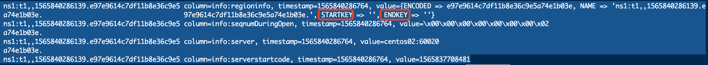
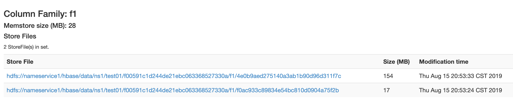

> 这里我纠正一下：`-ROOT-`表在hbase 0.96.0中已经被移除了，之前存在的时候，`-ROOT-`表的作用就是在zk中存储`.META`表的位置，可以通过联系zk找到`.META`表的位置，也就是现在的`hbase:meta`表. 
>
> 现在的版本中，`hbase:meta`表的位置已经直接存储在zk的节点“hbase:meta”中了，所以客户端会直接去zk中找到`hbase:meta`表的位置即可, 也就是下图中zk的/hbase/meta-region-server节点的信息
>
> `hbase:meta`表中主要存储hbase的分区列表
>
> 
>
> 客户端会先去zk找到hbase:meta的服务器，然后去服务器上找到meta元数据表，这张表里存储了hbase的分区信息，包含每个分区的服务器地址。这些信息都会被客户端缓存下来，防止再次查找。
>
> 然后如果有读写请求，客户端会直接联系RegionServer而不需要联系master，就可以进行操作。
>
> 操作过程也比较简单， 首先会根据rowkey和对应的region对比，就可以找到所在的region，因为meta中存储的信息包含这个region的rowkey的起始rowkey和结束rowkey。(我这里因为只有一个region，还没有切分，所以就是空的)
>
> 
>
> 如果region被改写，客户端会重新查询新的分区信息。
>
> 

首先

hbase中一张表的一个分区只有一个HRegion

慢慢增长，超过一定的大小会进行切分

切分是按照rowkey来切分

这也是为什么我们需要设计rowkey的时候不能设计成连续的，而是需要把分区号追加在最前面。

比如说：我们的rowkey的标准是00000这样

刚开始是一个region，然后表数据足够大之后，切分成两个，那么就会从50000左右切开。

那么50000一下的会进入到第一个region01，50000以上的会进入第二个region02

所以如果一个rowkey是10000的自然进入region01

然后10001也是一样，

60001就会进入region02

所以我们设计的时候，需要把rowkey给打散，这样才能避免热点问题

重新在总结一下写入流程：

首先联系zk确定meta表的服务器位置

根据meta表找到各个region的位置以及region所在服务器的位置，缓存到内存中去。

当需要写入的时候，

客户端直接联系HRegionServer，然后根据rowkey来确定是哪个region，然后根据内存中的region相关信息找到HRegionServer上面对应的HRegion(对应hbase的表)。HRegion包括若干HStore(对应列族)， HStore中包含一个MemStore和若干HStoreFile实例，前者是用来缓存，后者用来刷写到磁盘。

默认情况下

1, 写入的时候会先写入到写前日志，WAL中去，这个是HRegionServer负责。

2, 写入WAL完毕然后保存到HStore的MemStore，也就是内存中，默认5M，感觉好像是50M，因为测试当中如下图，每当50多M的时候就会写出去，当这些内存被写满的时候， 会开线程写出到HStoreFile里面。一个HStore，也就是一个列族在同一台服务器上可能有多个HStoreFile，也就是多个线程同时写入。

3, 每一个HStoreFile里面有一个HFile实例，这个HFile对应HDFS上的一个真实文件。HFile会记录最后写入磁盘的序号，下次就知道那些数据被持久化了。

4, 由于HStoreFile可以有多个，也就是开多个线程，跑多个HStoreFile，那么就会写出到多个小文件中。这些小文件会自动的合并成大文件(这里是指特定一台服务器上的小文件合并成一个大文件)。然后如果这些文件达到一定的标准，配置文件中是10G，（但是在实际测试中，超过256M左右有时候就会切分，有时候又不会），就会重新进行分裂，然后分裂后的文件分布到不同的服务器上去。

简单来讲：写入就是：先写入WAL写前日志中，然后写入到缓存，默认5M，然后满了之后flush到磁盘！磁盘上先进行合并小文件。小文件足够大，然后分裂文件，发到不同的服务器上，分布式存储。

