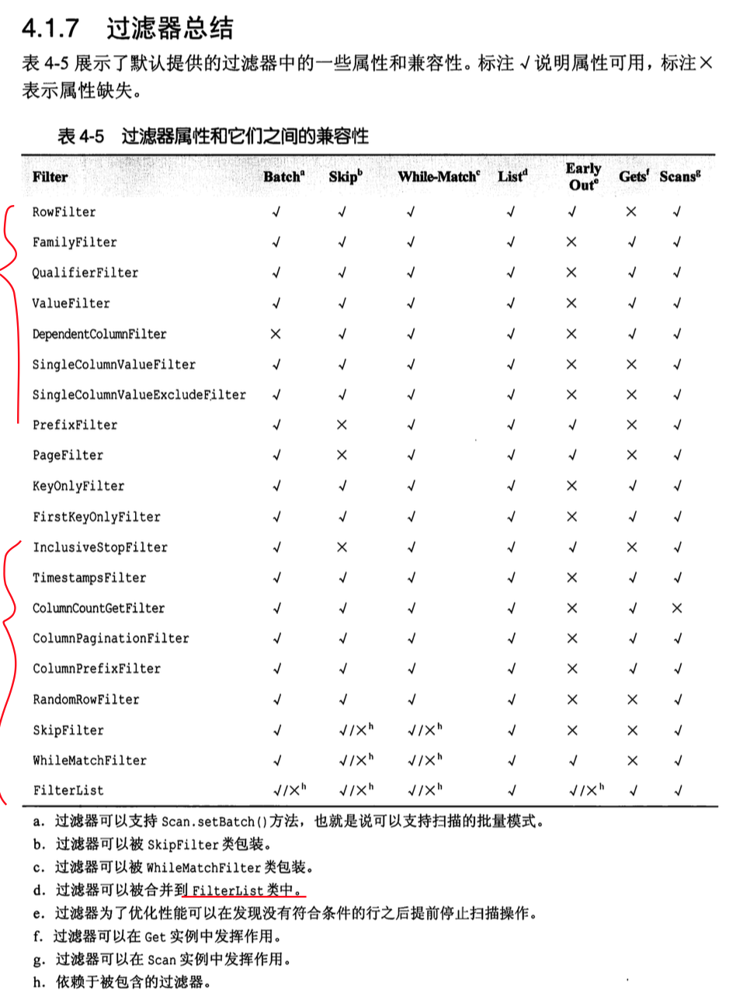

## 1, 操作符

### 1.1, LESS

### 1.2, LESS_OR_EQUAL

### 1.3, EQUAL

### 1.4, NOT_EQUAL

### 1.5, GREATER_OR_EQUAL

### 1.6, GREATER


### 1.7, NO_OP

> org.apache.hadoop.hbase.filter.CompareFilter

```java
public abstract class CompareFilter extends FilterBase {

  /** Comparison operators. */
  @InterfaceAudience.Public
  @InterfaceStability.Stable
  public enum CompareOp {
    /** less than */
    LESS,
    /** less than or equal to */
    LESS_OR_EQUAL,
    /** equals */
    EQUAL,
    /** not equal */
    NOT_EQUAL,
    /** greater than or equal to */
    GREATER_OR_EQUAL,
    /** greater than */
    GREATER,
    /** no operation */
    NO_OP,
  }
}

//LESS									小于
//LESS_OR_EQUAL					小于等于
//EQUAL									等于
//NOT_EQUAL							不等于
//GREATER_OR_EQUAL			大于等于
//GREATER								大于
//NO_OP									无任何操作
```


## 2, 对比器

### 2.1, BinaryComparator

### 2.2, RegexStringComparator

### 2.3, SubstringComparator

```java
//二进制对比器
BinaryComparator
//正则对比器
RegexStringComparator
//截串对比器
SubstringComparator
```


## 3, 过滤器

### 3.1, RowFilter

### 3.2, FamilyFilter

### 3.3,QualifierFilter

### 3.4, ValueFilter

### 3.5, SingleColumnValueFilter

### 3.6, SingleColumnValueExcludeFilter

### 3.7,PrefixFilter

### 3.8, PageFilter


## 4, 可以添加过滤器的对象

### 4.1, Scan

```java
Configuration configuration = HBaseConfiguration.create();
Connection connection = ConnectionFactory.createConnection(configuration);

TableName tableName = TableName.valueOf("ns1:t1");
Table table = connection.getTable(tableName);

//终于明白了这里设置一个scan的作用是什么了，可以设置过滤器呀
Scan scan = new Scan();
scan.addFamily("f1".getBytes());
//scan.addColumn("f1".getBytes(), "name".getBytes());

//截串对比器
Filter filter3 = new RowFilter(CompareFilter.CompareOp.EQUAL, new SubstringComparator("row34"));

//对Scan设置过滤器
scan.setFilter(filter3);

ResultScanner resultScanner = table.getScanner(scan);
Iterator<Result> results = resultScanner.iterator();
```


### 4.2, Get

```java
Configuration configuration = HBaseConfiguration.create();
Connection connection = ConnectionFactory.createConnection(configuration);

TableName tableName = TableName.valueOf("ns1:t2");
Table table = connection.getTable(tableName);

Filter filter = new QualifierFilter(CompareFilter.CompareOp.EQUAL, new BinaryComparator("age".getBytes()));

Get get = new Get("r0000001".getBytes());
//对Get设置过滤器
get.setFilter(filter);

Result result = table.get(get);
```


## 5, 使用范例

```java
Filter filter3 = new RowFilter(CompareFilter.CompareOp.EQUAL, new SubstringComparator("row34"));
scan.setFilter(filter3);
```


```java
//1, RowFilter
//对scan设置rowFilter过滤器
@Test
public void hbase_rowFilter_test() throws Exception {

  Configuration configuration = HBaseConfiguration.create();
  Connection connection = ConnectionFactory.createConnection(configuration);

  TableName tableName = TableName.valueOf("ns1:t1");
  Table table = connection.getTable(tableName);

  //终于明白了这里设置一个scan的作用是什么了，可以设置过滤器呀
  Scan scan = new Scan();
  scan.addFamily("f1".getBytes());
  //scan.addColumn("f1".getBytes(), "name".getBytes());

  //第一种，二进制对比器
  /*Filter filter = new RowFilter(CompareFilter.CompareOp.LESS_OR_EQUAL, new BinaryComparator("r0001000".getBytes()));
    scan.setFilter(filter);*/

  //第二种，正则对比器, 正则大多也不记得， 先放着吧
  /*Filter filter2 = new RowFilter(CompareFilter.CompareOp.EQUAL, new RegexStringComparator(""));
    scan.setFilter(filter2);*/

  //第三种，截串对比器
  Filter filter3 = new RowFilter(CompareFilter.CompareOp.EQUAL, new SubstringComparator("row34"));
  scan.setFilter(filter3);


  ResultScanner resultScanner = table.getScanner(scan);
  Iterator<Result> results = resultScanner.iterator();

  while (results.hasNext()) {
    // 在这里获取结果即可
  }
}
```


## 6, 深入了解全部代码

> ⚠️注意：更多内容参考：《[中文]HBase权威指南.pdf》这本书

### 6.0, 下面调用的一个通用方法

```java
//这个是个静态方法，懒得重复拷贝，所以直接抽取出来放在这里方便调用
public static void func(Filter filter) throws Exception {
  Configuration configuration = HBaseConfiguration.create();
  Connection connection = ConnectionFactory.createConnection(configuration);

  TableName tableName = TableName.valueOf("ns1:t1");
  Table table = connection.getTable(tableName);

  //终于明白了这里设置一个scan的作用是什么了，可以设置过滤器呀
  Scan scan = new Scan();
  scan.setFilter(filter);

  ResultScanner resultScanner = table.getScanner(scan);
  Iterator<Result> results = resultScanner.iterator();

  while (results.hasNext()) {

    Result result = results.next();
    //因为我们这里想要获取所有列族的数据，所以不能像上面那样指定具体的某一列族了
    NavigableMap<byte[], NavigableMap<byte[], NavigableMap<Long, byte[]>>> tMap = result.getMap();

    for (Map.Entry<byte[], NavigableMap<byte[], NavigableMap<Long, byte[]>>> entry : tMap.entrySet()) {

      byte[] familyKey = entry.getKey();
      NavigableMap<byte[], NavigableMap<Long, byte[]>> familyValue = entry.getValue();

      for (Map.Entry<byte[], NavigableMap<Long, byte[]>> entry1 : familyValue.entrySet()) {
        byte[] columnKey = entry1.getKey();
        NavigableMap<Long, byte[]> columnValue = entry1.getValue();
        //对于一个具体的列，可能还有不同的版本
        for (Map.Entry<Long, byte[]> entry2 : columnValue.entrySet()) {
          Long versionKey = entry2.getKey();
          byte[] versionValue = entry2.getValue();
          System.out.println("列族："+ new String(familyKey) + ", 列：" + new String(columnKey) + ",版本号：" + versionKey + ",值是：" + new String(versionValue));
        }
      }
    }
  }
  resultScanner.close();
}
```


### 6.1, scan_hbase_rowFilter_test

```java
//1, RowFilter
//对scan设置rowFilter过滤器
@Test
public void scan_hbase_rowFilter_test() throws Exception {

  Configuration configuration = HBaseConfiguration.create();
  Connection connection = ConnectionFactory.createConnection(configuration);

  TableName tableName = TableName.valueOf("ns1:t1");
  Table table = connection.getTable(tableName);

  //终于明白了这里设置一个scan的作用是什么了，可以设置过滤器呀
  Scan scan = new Scan();
  scan.addFamily("f1".getBytes());
  //scan.addColumn("f1".getBytes(), "name".getBytes());

  //第一种，二进制对比器
  Filter filter = new RowFilter(CompareFilter.CompareOp.LESS_OR_EQUAL, new BinaryComparator("row34".getBytes()));
  scan.setFilter(filter);

  //第二种，正则对比器, 正则大多也不记得， 先放着吧
  /*Filter filter2 = new RowFilter(CompareFilter.CompareOp.EQUAL, new RegexStringComparator(""));
        scan.setFilter(filter2);*/

  //第三种，截串对比器
  /*Filter filter3 = new RowFilter(CompareFilter.CompareOp.EQUAL, new SubstringComparator("row34"));
        scan.setFilter(filter3);*/


  ResultScanner resultScanner = table.getScanner(scan);
  Iterator<Result> results = resultScanner.iterator();

  while (results.hasNext()) {

    Result result = results.next();
    //因为我们这里想要获取所有列族的数据，所以不能像上面那样指定具体的某一列族了
    NavigableMap<byte[], NavigableMap<byte[], NavigableMap<Long, byte[]>>> tMap = result.getMap();

    for (Map.Entry<byte[], NavigableMap<byte[], NavigableMap<Long, byte[]>>> entry : tMap.entrySet()) {

      byte[] familyKey = entry.getKey();
      NavigableMap<byte[], NavigableMap<Long, byte[]>> familyValue = entry.getValue();

      for (Map.Entry<byte[], NavigableMap<Long, byte[]>> entry1 : familyValue.entrySet()) {
        byte[] columnKey = entry1.getKey();
        NavigableMap<Long, byte[]> columnValue = entry1.getValue();
        //对于一个具体的列，可能还有不同的版本
        for (Map.Entry<Long, byte[]> entry2 : columnValue.entrySet()) {
          Long versionKey = entry2.getKey();
          byte[] versionValue = entry2.getValue();
          System.out.println("列族："+ new String(familyKey) + ", 列：" + new String(columnKey) + ",版本号：" + versionKey + ",值是：" + new String(versionValue));
        }
      }
    }
  }
}
```


### 6.2,scan_hbase_familyFilter_test

```java
//2, FamilyFilter, 这里就是演示一下//如果连续添加过滤器，后者会覆盖前者！！！！！！！
//对scan设置familyFilter过滤器
@Test
public void scan_hbase_familyFilter_test() throws Exception {

  Configuration configuration = HBaseConfiguration.create();
  Connection connection = ConnectionFactory.createConnection(configuration);

  TableName tableName = TableName.valueOf("ns1:t2");
  Table table = connection.getTable(tableName);

  //终于明白了这里设置一个scan的作用是什么了，可以设置过滤器呀
  Scan scan = new Scan();
  //注意：如果添加列族，那么只会扫描指定列族的内容，如果没有添加，会扫描所有列族
  //scan.addColumn("f1".getBytes(), "name".getBytes());
  //scan.addColumn("f2".getBytes(), "age".getBytes());

  //这里限定要扫描的列族，等于f2
  Filter filter = new FamilyFilter(CompareFilter.CompareOp.EQUAL, new BinaryComparator("f2".getBytes()));
  Filter filter01 = new RowFilter(CompareFilter.CompareOp.LESS_OR_EQUAL, new BinaryComparator("r0001000".getBytes()));
  //如果连续添加过滤器，后者会覆盖前者！！！！！！！
  scan.setFilter(filter01);
  scan.setFilter(filter);


  ResultScanner resultScanner = table.getScanner(scan);
  Iterator<Result> results = resultScanner.iterator();

  while (results.hasNext()) {

    Result result = results.next();
    //因为我们这里想要获取所有列族的数据，所以不能像上面那样指定具体的某一列族了
    NavigableMap<byte[], NavigableMap<byte[], NavigableMap<Long, byte[]>>> tMap = result.getMap();

    for (Map.Entry<byte[], NavigableMap<byte[], NavigableMap<Long, byte[]>>> entry : tMap.entrySet()) {

      byte[] familyKey = entry.getKey();
      NavigableMap<byte[], NavigableMap<Long, byte[]>> familyValue = entry.getValue();

      for (Map.Entry<byte[], NavigableMap<Long, byte[]>> entry1 : familyValue.entrySet()) {
        byte[] columnKey = entry1.getKey();
        NavigableMap<Long, byte[]> columnValue = entry1.getValue();
        //对于一个具体的列，可能还有不同的版本
        for (Map.Entry<Long, byte[]> entry2 : columnValue.entrySet()) {
          Long versionKey = entry2.getKey();
          byte[] versionValue = entry2.getValue();
          System.out.println("列族："+ new String(familyKey) + ", 列：" + new String(columnKey) + ",版本号：" + versionKey + ",值是：" + new String(versionValue));
        }
      }
    }
  }

  resultScanner.close();
}
```


### 6.3,scan_hbase_familyFilter01_test

```java
//3, FamilyFilter
//对scan设置familyFilter过滤器
@Test
public void scan_hbase_familyFilter01_test() throws Exception {

  Configuration configuration = HBaseConfiguration.create();
  Connection connection = ConnectionFactory.createConnection(configuration);

  TableName tableName = TableName.valueOf("ns1:t2");
  Table table = connection.getTable(tableName);

  Get get = new Get("r0000001".getBytes());


  Filter filter = new FamilyFilter(CompareFilter.CompareOp.EQUAL, new BinaryComparator("f2".getBytes()));
  //Filter filter01 = new RowFilter(CompareFilter.CompareOp.LESS_OR_EQUAL, new BinaryComparator("r0001000".getBytes()));
  //这个就是在get上添加过滤器
  get.setFilter(filter);


  Result result = table.get(get);
  //因为我们这里想要获取所有列族的数据，所以不能像上面那样指定具体的某一列族了
  NavigableMap<byte[], NavigableMap<byte[], NavigableMap<Long, byte[]>>> tMap = result.getMap();

  for (Map.Entry<byte[], NavigableMap<byte[], NavigableMap<Long, byte[]>>> entry : tMap.entrySet()) {

    byte[] familyKey = entry.getKey();
    NavigableMap<byte[], NavigableMap<Long, byte[]>> familyValue = entry.getValue();

    for (Map.Entry<byte[], NavigableMap<Long, byte[]>> entry1 : familyValue.entrySet()) {
      byte[] columnKey = entry1.getKey();
      NavigableMap<Long, byte[]> columnValue = entry1.getValue();
      //对于一个具体的列，可能还有不同的版本
      for (Map.Entry<Long, byte[]> entry2 : columnValue.entrySet()) {
        Long versionKey = entry2.getKey();
        byte[] versionValue = entry2.getValue();
        System.out.println("列族："+ new String(familyKey) + ", 列：" + new String(columnKey) + ",版本号：" + versionKey + ",值是：" + new String(versionValue));
      }
    }
  }
}
```


### 6.4,scan_hbase_qualifierFilter_test

```java
//4, QualifierFilter
//对scan设置qualifierFilter过滤器
@Test
public void scan_hbase_qualifierFilter_test() throws Exception {

  Configuration configuration = HBaseConfiguration.create();
  Connection connection = ConnectionFactory.createConnection(configuration);

  TableName tableName = TableName.valueOf("ns1:t2");
  Table table = connection.getTable(tableName);

  //终于明白了这里设置一个scan的作用是什么了，可以设置过滤器呀
  Scan scan = new Scan();
  //注意：如果添加列族，那么只会扫描指定列族的内容，如果没有添加，会扫描所有列族
  //scan.addColumn("f1".getBytes(), "name".getBytes());
  //scan.addColumn("f2".getBytes(), "age".getBytes());

  //
  //Filter filter01 = new RowFilter(CompareFilter.CompareOp.LESS_OR_EQUAL, new BinaryComparator("r0001000".getBytes()));
  Filter filter = new QualifierFilter(CompareFilter.CompareOp.EQUAL, new BinaryComparator("age".getBytes()));

  //如果连续添加过滤器，后者会覆盖前者！！！！！！！
  //scan.setFilter(filter01);
  scan.setFilter(filter);


  ResultScanner resultScanner = table.getScanner(scan);
  Iterator<Result> results = resultScanner.iterator();

  while (results.hasNext()) {

    Result result = results.next();
    //因为我们这里想要获取所有列族的数据，所以不能像上面那样指定具体的某一列族了
    NavigableMap<byte[], NavigableMap<byte[], NavigableMap<Long, byte[]>>> tMap = result.getMap();

    for (Map.Entry<byte[], NavigableMap<byte[], NavigableMap<Long, byte[]>>> entry : tMap.entrySet()) {

      byte[] familyKey = entry.getKey();
      NavigableMap<byte[], NavigableMap<Long, byte[]>> familyValue = entry.getValue();

      for (Map.Entry<byte[], NavigableMap<Long, byte[]>> entry1 : familyValue.entrySet()) {
        byte[] columnKey = entry1.getKey();
        NavigableMap<Long, byte[]> columnValue = entry1.getValue();
        //对于一个具体的列，可能还有不同的版本
        for (Map.Entry<Long, byte[]> entry2 : columnValue.entrySet()) {
          Long versionKey = entry2.getKey();
          byte[] versionValue = entry2.getValue();
          System.out.println("列族："+ new String(familyKey) + ", 列：" + new String(columnKey) + ",版本号：" + versionKey + ",值是：" + new String(versionValue));
        }
      }
    }
  }

  resultScanner.close();
}
```


### 6.5,get_hbase_qualifierFilter01_test

```java
//5, get设置qualifierFilter过滤器
//对get设置qualifierFilter过滤器
@Test
public void get_hbase_qualifierFilter01_test() throws Exception {

  Configuration configuration = HBaseConfiguration.create();
  Connection connection = ConnectionFactory.createConnection(configuration);

  TableName tableName = TableName.valueOf("ns1:t2");
  Table table = connection.getTable(tableName);

  //
  //Filter filter01 = new RowFilter(CompareFilter.CompareOp.LESS_OR_EQUAL, new BinaryComparator("r0001000".getBytes()));
  Filter filter = new QualifierFilter(CompareFilter.CompareOp.EQUAL, new BinaryComparator("age".getBytes()));


  Get get = new Get("r0000001".getBytes());
  get.setFilter(filter);


  Result result = table.get(get);

  //因为我们这里想要获取所有列族的数据，所以不能像上面那样指定具体的某一列族了
  NavigableMap<byte[], NavigableMap<byte[], NavigableMap<Long, byte[]>>> tMap = result.getMap();

  for (Map.Entry<byte[], NavigableMap<byte[], NavigableMap<Long, byte[]>>> entry : tMap.entrySet()) {

    byte[] familyKey = entry.getKey();
    NavigableMap<byte[], NavigableMap<Long, byte[]>> familyValue = entry.getValue();

    for (Map.Entry<byte[], NavigableMap<Long, byte[]>> entry1 : familyValue.entrySet()) {
      byte[] columnKey = entry1.getKey();
      NavigableMap<Long, byte[]> columnValue = entry1.getValue();
      //对于一个具体的列，可能还有不同的版本
      for (Map.Entry<Long, byte[]> entry2 : columnValue.entrySet()) {
        Long versionKey = entry2.getKey();
        byte[] versionValue = entry2.getValue();
        System.out.println("列族："+ new String(familyKey) + ", 列：" + new String(columnKey) + ",版本号：" + versionKey + ",值是：" + new String(versionValue));
      }
    }
  }
}
```


### 6.6,scan_hbase_valueFileter_test

```java
//6, ValueFilter
//对scan设置valueFileter过滤器
@Test
public void scan_hbase_valueFileter_test() throws Exception {

  Configuration configuration = HBaseConfiguration.create();
  Connection connection = ConnectionFactory.createConnection(configuration);

  TableName tableName = TableName.valueOf("ns1:t1");
  Table table = connection.getTable(tableName);

  //终于明白了这里设置一个scan的作用是什么了，可以设置过滤器呀
  Scan scan = new Scan();

  //
  Filter filter = new ValueFilter(CompareFilter.CompareOp.LESS_OR_EQUAL, new BinaryComparator("ivanl00329".getBytes()));
  scan.setFilter(filter);


  ResultScanner resultScanner = table.getScanner(scan);
  Iterator<Result> results = resultScanner.iterator();

  while (results.hasNext()) {

    Result result = results.next();
    //因为我们这里想要获取所有列族的数据，所以不能像上面那样指定具体的某一列族了
    NavigableMap<byte[], NavigableMap<byte[], NavigableMap<Long, byte[]>>> tMap = result.getMap();

    for (Map.Entry<byte[], NavigableMap<byte[], NavigableMap<Long, byte[]>>> entry : tMap.entrySet()) {

      byte[] familyKey = entry.getKey();
      NavigableMap<byte[], NavigableMap<Long, byte[]>> familyValue = entry.getValue();

      for (Map.Entry<byte[], NavigableMap<Long, byte[]>> entry1 : familyValue.entrySet()) {
        byte[] columnKey = entry1.getKey();
        NavigableMap<Long, byte[]> columnValue = entry1.getValue();
        //对于一个具体的列，可能还有不同的版本
        for (Map.Entry<Long, byte[]> entry2 : columnValue.entrySet()) {
          Long versionKey = entry2.getKey();
          byte[] versionValue = entry2.getValue();
          System.out.println("列族："+ new String(familyKey) + ", 列：" + new String(columnKey) + ",版本号：" + versionKey + ",值是：" + new String(versionValue));
        }
      }
    }
  }
  resultScanner.close();
}
```


### 6.7,get_hbase_valueFileter01_test

```java
//对get设置qualifierFilter过滤器
@Test
public void get_hbase_valueFileter01_test() throws Exception {

  //
  //Filter filter01 = new RowFilter(CompareFilter.CompareOp.LESS_OR_EQUAL, new BinaryComparator("r0001000".getBytes()));
  Filter filter = new ValueFilter(CompareFilter.CompareOp.LESS_OR_EQUAL, new BinaryComparator("ivanl0000100".getBytes()));


  Configuration configuration = HBaseConfiguration.create();
  Connection connection = ConnectionFactory.createConnection(configuration);

  TableName tableName = TableName.valueOf("ns1:t2");
  Table table = connection.getTable(tableName);


  Get get = new Get("r0000001".getBytes());
  get.setFilter(filter);


  Result result = table.get(get);

  //因为我们这里想要获取所有列族的数据，所以不能像上面那样指定具体的某一列族了
  NavigableMap<byte[], NavigableMap<byte[], NavigableMap<Long, byte[]>>> tMap = result.getMap();

  for (Map.Entry<byte[], NavigableMap<byte[], NavigableMap<Long, byte[]>>> entry : tMap.entrySet()) {

    byte[] familyKey = entry.getKey();
    NavigableMap<byte[], NavigableMap<Long, byte[]>> familyValue = entry.getValue();

    for (Map.Entry<byte[], NavigableMap<Long, byte[]>> entry1 : familyValue.entrySet()) {
      byte[] columnKey = entry1.getKey();
      NavigableMap<Long, byte[]> columnValue = entry1.getValue();
      //对于一个具体的列，可能还有不同的版本
      for (Map.Entry<Long, byte[]> entry2 : columnValue.entrySet()) {
        Long versionKey = entry2.getKey();
        byte[] versionValue = entry2.getValue();
        System.out.println("列族："+ new String(familyKey) + ", 列：" + new String(columnKey) + ",版本号：" + versionKey + ",值是：" + new String(versionValue));
      }
    }
  }
}
```


### 6.8,scan_hbase_dependentColumnFilter_test

```java
//这个好像是值返回符合条件的那一列，不过感觉也不好用吧
@Test
public void scan_hbase_dependentColumnFilter_test() throws Exception {

  //这里好像也不对
  //不知道这个是干嘛用的， 怎么设置都没有东西，算了，估计也是废的
  Filter filter = new DependentColumnFilter("f1".getBytes(), "num".getBytes(), false, CompareFilter.CompareOp.LESS_OR_EQUAL, new BinaryComparator("ivanl0010".getBytes()));
  //        scan.setFilter(filter);
  func(filter);

```


### 6.9,scan_habse_singleColumnValueFilter_test

```java
//字段不符合，排除不符合的那一行的数据
//单行值过滤，如果这个值不满足，整行都会被过滤掉，注意：过滤条件这个列也会被过滤掉，也就是不显示的哈
@Test
public void scan_habse_singleColumnValueFilter_test() throws Exception {

  //这里设定如果f1列族的age小于3，那么这一行就会被过滤掉, 第二行全部显示，age字段还是会显示的 可以参考对比下 上面的SingleColumnValueExcludeFilter
  Filter filter = new SingleColumnValueFilter("f1".getBytes(), "age".getBytes(), CompareFilter.CompareOp.GREATER, "30".getBytes());
  func(filter);
}
```


### 6.10,scan_hbase_singleComlumnValueExcludeFilter_test

* 字段不符合，排除整个字段的

```java
//字段不符合，排除整个字段的
@Test
public void scan_hbase_singleComlumnValueExcludeFilter_test() throws Exception {

  //这里设定如果f1列族的age小于3，那么这一行就会被过滤掉, age这个字段作为过滤条件，也是不显示，也就是会被直接过滤掉
  Filter filter = new SingleColumnValueExcludeFilter("f1".getBytes(), "age".getBytes(), CompareFilter.CompareOp.GREATER, "30".getBytes());
  func(filter);
}
```


### 6.11, scan_hbase_PrefixFilter_test

```java
//前缀过滤器，过滤出rowkey有这个前缀的数据
@Test
public void scan_hbase_PrefixFilter_test() throws Exception {

  //r做前缀的， r001, 我这张表中添加了类似r001， r002， s001之类的rowkey
  Filter filter = new PrefixFilter("r".getBytes());//
  func(filter);
  
}
```


### 6.12, scan_hbase_PageFilter_test

* 每个分区上去pageSize个数的数量内容，好像没什么用处吧，生产里面应该没有用这个的吧

```java
// 每个分区上去pageSize个数的数量内容，好像没什么用处吧，生产里面应该没有用这个的吧
@Test
public void scan_hbase_PageFilter_test() throws Exception {

  //就取前1条， 这个是按分区来限定的， 如果有三个分区， 就是每个区上限取两个了
  Filter filter = new PageFilter(2);
  func(filter);
  //在这个基础上也可以使用scan的startwithrow还是叫什么的方法， 来限定开始行和结束行

}
```


### 6.13, scan_hbase_KeyOnlyFilter_test

* 只有键值，没有值的，值会被返回null值

```java
// 只有键值，没有值的，值会被返回null值
@Test
public void scan_hbase_KeyOnlyFilter_test() throws Exception {
  //列族：f1, 列：name,版本号：1542074141465,值是：
  Filter filter = new KeyOnlyFilter();
  func(filter);

}
```


### 6.14,scan_hbase_ColumnCountGetFilter_test

* 获取前n行数据

```java
//大多类似，剩下的挑选进行代码演示
//获取前n行数据
@Test
public void scan_hbase_ColumnCountGetFilter_test() throws Exception {
  //取前2列
  Filter filter = new ColumnCountGetFilter(2);
  func(filter);
}
```


### 6.15,scan_hbase_like_similar_test

* 实现like类似的功能

```java
//实现like类似的功能
@Test
public void scan_hbase_like_similar_test() throws Exception {

  //这个可以r002%这样的效果
  Filter filter = new ValueFilter(CompareFilter.CompareOp.EQUAL, new RegexStringComparator("^r002"));
  func(filter);

}
```


### 6.16,hbase_familyFilter00000_test

* 这里因为之前想同时设置两个filter的时候，后者会覆盖前者，所以不能成功，这里用FilterList可以实现，如下

```java
//这里因为之前想同时设置两个filter的时候，后者会覆盖前者，所以不能成功，这里用FilterList可以实现，如下
@Test
public void hbase_familyFilter00000_test() throws Exception {

  Configuration configuration = HBaseConfiguration.create();
  Connection connection = ConnectionFactory.createConnection(configuration);

  TableName tableName = TableName.valueOf("ns1:t2");
  Table table = connection.getTable(tableName);

  //终于明白了这里设置一个scan的作用是什么了，可以设置过滤器呀
  Scan scan = new Scan();
  //注意：如果添加列族，那么只会扫描指定列族的内容，如果没有添加，会扫描所有列族
  //scan.addColumn("f1".getBytes(), "name".getBytes());
  //scan.addColumn("f2".getBytes(), "age".getBytes());

  //
  Filter filter = new FamilyFilter(CompareFilter.CompareOp.EQUAL, new BinaryComparator("f2".getBytes()));
  Filter filter01 = new RowFilter(CompareFilter.CompareOp.LESS_OR_EQUAL, new BinaryComparator("r0001000".getBytes()));
  //如果连续添加过滤器，后者会覆盖前者！！！！！！！
  /*scan.setFilter(filter01);
        scan.setFilter(filter);*/


  List<Filter> filters = new ArrayList<Filter>();
  filters.add(filter);
  filters.add(filter01);


  //FilterList构造器需要一个Filter的list
  FilterList filterList = new FilterList(filters);


  scan.setFilter(filterList);


  ResultScanner resultScanner = table.getScanner(scan);
  Iterator<Result> results = resultScanner.iterator();

  while (results.hasNext()) {

    Result result = results.next();
    //因为我们这里想要获取所有列族的数据，所以不能像上面那样指定具体的某一列族了
    NavigableMap<byte[], NavigableMap<byte[], NavigableMap<Long, byte[]>>> tMap = result.getMap();

    for (Map.Entry<byte[], NavigableMap<byte[], NavigableMap<Long, byte[]>>> entry : tMap.entrySet()) {

      byte[] familyKey = entry.getKey();
      NavigableMap<byte[], NavigableMap<Long, byte[]>> familyValue = entry.getValue();

      for (Map.Entry<byte[], NavigableMap<Long, byte[]>> entry1 : familyValue.entrySet()) {
        byte[] columnKey = entry1.getKey();
        NavigableMap<Long, byte[]> columnValue = entry1.getValue();
        //对于一个具体的列，可能还有不同的版本
        for (Map.Entry<Long, byte[]> entry2 : columnValue.entrySet()) {
          Long versionKey = entry2.getKey();
          byte[] versionValue = entry2.getValue();
          System.out.println("列族："+ new String(familyKey) + ", 列：" + new String(columnKey) + ",版本号：" + versionKey + ",值是：" + new String(versionValue));
        }
      }
    }
  }

  resultScanner.close();
}
```


### 6.17,  书中的总结



### 