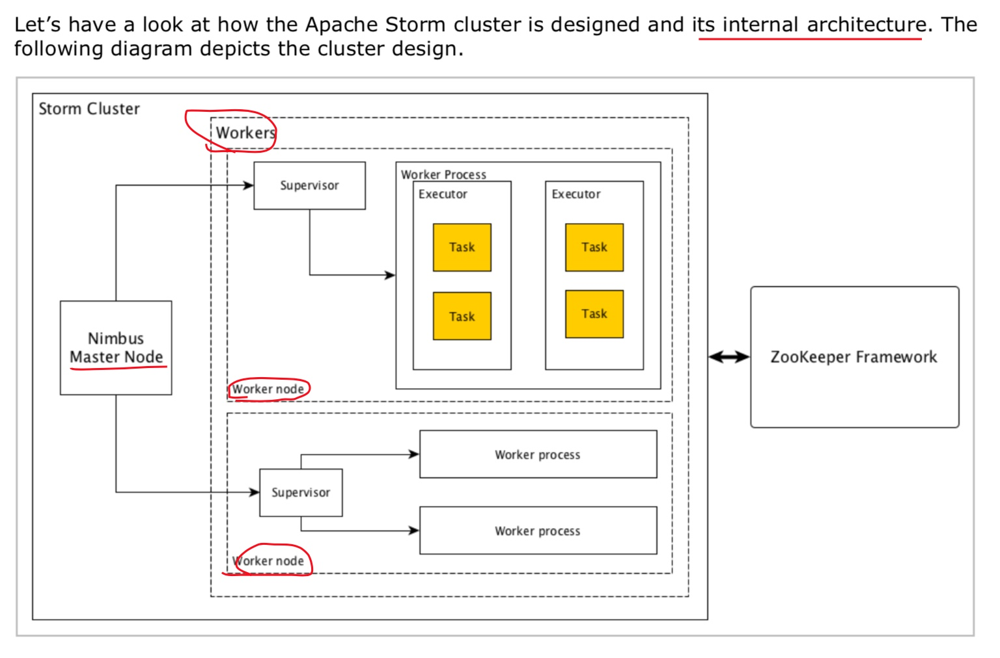
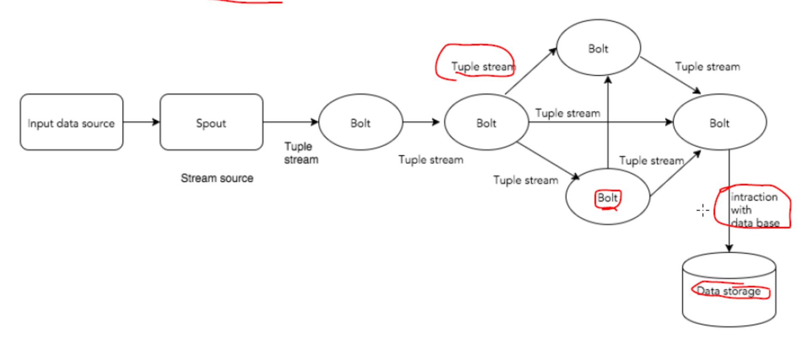

## 1，主要概念

* 先看一下流程



```
Storm架构
---------------------
	1.Nimbus(灵气)
		master节点。
		核心组件，运行top。
		分析top并收集运行task。分发task给supervisor.
		监控top。
		无状态，依靠zk监控top的运行状况。

	2.Supervisor(监察)
		每个supervisor有n个worker进程，负责代理task给worker。
		worker再孵化执行线程最终运行task。
		storm使用内部消息系统在nimbus和supervisor之间进行通信。

		接受nimbus指令，管理worker进程完成task派发。

	3.worker
		执行特定的task，worker本身不执行任务，而是孵化executors，
		让executors执行task。
	
	4.Executor
		本质上有worker进程孵化出来的一个线程而已。
		executor运行task都属于同一spout或者bolt.
	
	5.task
		执行实际上的任务处理。或者是Spout或者是bolt.
		
		
		
storm工作流程
----------------
	1.nimbus等待topology提交给自己
	2.提交top后，nimbus运行top并收集task以及task的运行顺序等
	3.nimbus分发task给所有可用的supervisor
	4.supervisor周期性发送心跳给nimbus表示自己还活着。
	5.如果supervisor挂掉，不会发送心跳给nimubs，nimbus将task发送给其他的supervisor
	6.nimubs挂掉，super会继续执行自己task。
	7.task完成后，supervisor等待新的task
	8.同时，挂掉的nimbus可以通过监控工具软件自动重启。
	
```




* 01, Tuple
  * 主要的数据结构，有序元素的列表
  
* 02, Stream
  * Tuple的序列

* 03，Spouts
  * 数据流源头，可以读取Kafka队列消息。可以自定义

* 04， Bolts
  * 转接头，逻辑处理单元。Spout的数据传递给单个bolt，bolt进行计算，产生新的数据传递给下个单元

* 05，Topology
  * Spout + Bolt 连接在一起，形成拓扑结构，形成有向图，定点就是计算，边就是数据流
  
* Nimbus
  * Nimbus is a master node of Storm cluster. All other nodes in the cluster are called as worker nodes. Master node is responsible for distributing data among all the worker nodes, assign tasks to worker nodes and monitoring failures.

* Supervisor
  * The nodes that follow instructions given by the nimbus are called as Supervisors. A supervisor has multiple worker processes and it governs worker processes to complete the tasks assigned by the nimbus.
  
* Worker process
  * A worker process will execute tasks related to a specific topology. A worker process will not run a task by itself, instead it creates executors and asks them to perform a particular task. A worker process will have multiple executors.
  
* Executor
  * An executor is nothing but a single thread spawn by a worker process. An executor runs one or more tasks but only for a specific spout or bolt.
  
* Task
  * A task performs actual data processing. So, it is either a spout or a bolt.

* ZooKeeper framework

  * Apache ZooKeeper is a service used by a cluster (group of nodes) to coordinate between themselves and maintaining shared data with robust synchronization techniques. Nimbus is stateless, so it depends on ZooKeeper to monitor the working node status.
  * ZooKeeper helps the supervisor to interact with the nimbus. It is responsible to maintain the state of nimbus and supervisor.
  * 

## 2，Storm 1.1.3 的安装和配置

* 01，下载，解压，软链，环境变量不再赘述
* 02，修改配置文件storm.yaml，需要修改的几项如下：

  ```shell
  # 这个是配置slave节点机器主机名
  storm.zookeeper.servers:
    - "slave01"
    - "slave02"
    - "slave03"
    
  # 这个是配置主节点机器主机名
  nimbus.seeds: ["master","master01"]
  
  # 配置zk端口和存储目录
  storm.zookeeper.port: 2181
  storm.zookeeper.root: "/storm"
  
  # 存储位置
  Nimbus dir
    storm.local.dir: "/data/storm"
    
  # 槽点端口
  supervisor.slots.ports:
      - 6700
      - 6701
      - 6702
      - 6703
      
  # UI
  ui.host: 0.0.0.0
  ui.port: 8080
  ```
* 03, 分别在master,master01上启动nimbus进程
  
> storm nimbus &

* 04，分别在slave01,slave02,slave03上启动supervisor
  
> storm supervisor &

* 05, 最后在nimbus上启动ui
  
> storm ui &

* 06, 查看8080端口最终配置是否正确
  * 如果配置正确，最终会有一个leader，三个supervisor，在ui页面上可以看的出来哈
  > http://master:8080/index.html
  > http://master01:8080/index.html

* 07, 如果想要在页面上查看某台节点的log, 启动logviewer
  
> storm logviewer &

* 08, 查看log, 比如说是查看在slave01上的log
  
  > http://slave01:8000

## 3, Storm的使用
* 01, storm上运行jar包：

> storm jar Storm_test.jar im.ivanl001.bigData.Storm.A03_WordCount.WordCountApp