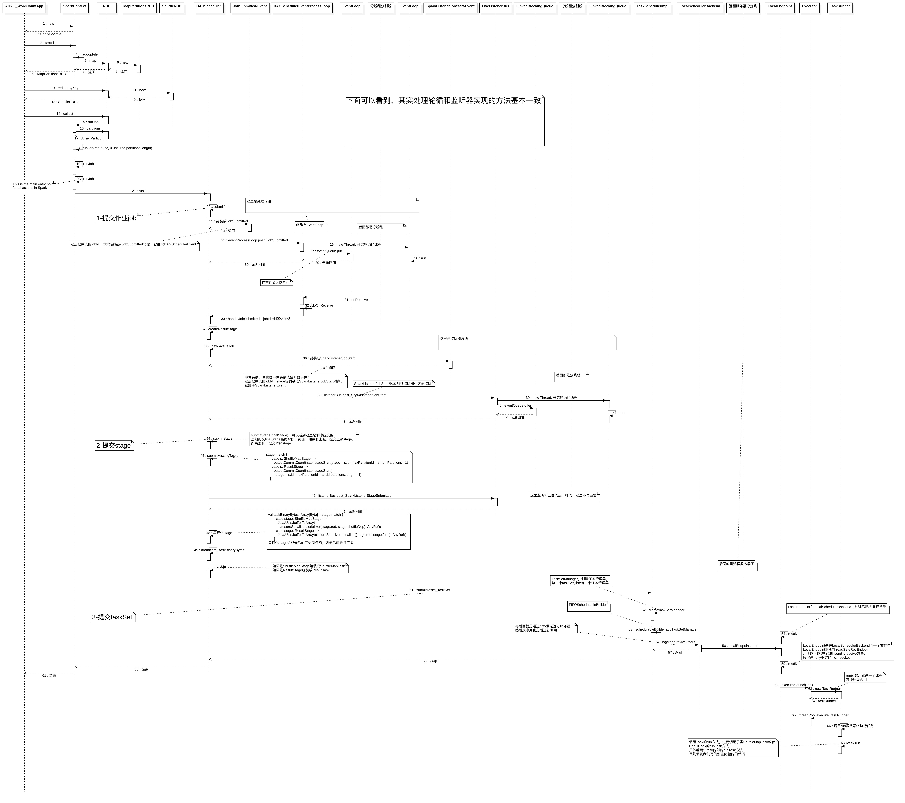
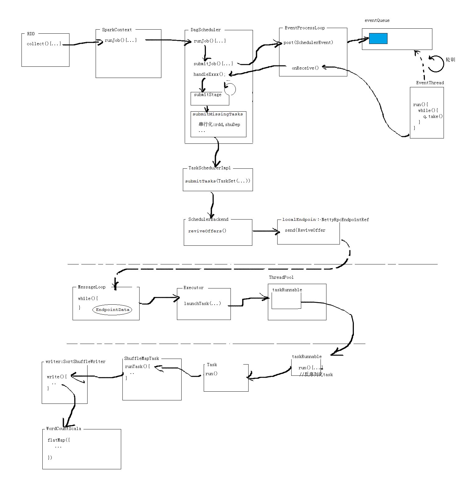

三级调度：
* DAGScheduler
  * 面向stage
    * shuffleMapStage
    * resultStage
  * DAG调度器会有轮循，不断的提交任务给任务调度器
  
* TaskScheduler
  * 面向task, 上面的stage就是任务task的集合
  * 每个阶段形成对应的taskSet，提交给后台调度器
  
* BackendScheduler
  * 使用Nitty框架用rpc实现远程调用
  * 通过Executor执行任务，最终在线程池中不断的执行任务
  

spark调动作最主要的一个方法应该是：
  * runJob，

## 代码流程图如下：最好下载后观看





aaaa


```text
以下内容均是拷贝参考内容

Spark核心API
-----------------
	[SparkContext]
		连接到spark集群,入口点.

	[HadoopRDD]
		读取hadoop上的数据，

	[MapPartitionsRDD]
		针对父RDD的每个分区提供了函数构成的新类型RDD.

	[PairRDDFunctions]
		对偶RDD函数类。
		可用于KV类型RDD的附加函数。可以通过隐式转化得到.

	[ShuffleRDD]
		从Shuffle中计算结果的RDD.

	[RDD]
		是分区的集合.
		弹性分布式数据集.
		不可变的数据分区集合.
		基本操作(map filter , persist)
		
		分区列表					//数据
		应用给每个切片的计算函数	//行为
		到其他RDD的依赖列表			//依赖关系
		(可选)针对kv类型RDD的分区类
		(可选)首选位置列表
	
	[DAGScheduler]
		高级调度器层面，实现按照阶段(stage),shuffle一次就是一个新的阶段stage.
		对每个JOB的各阶段计算有向无环图(DAG)，并且跟踪RDD和每个阶段的输出。
		找出最小调度运行作业,将Stage对象以TaskSet方式提交给底层的调度器。
		底层调度器实现TaskScheduler,进而在cluster上运行job.
		TaskSet已经包含了全部的单独的task，这些Task都能够基于cluster的数据进行
		正确运行。

		Stage通过在需要shuffle的边界处将RDD打碎来创建Stage对象。
		具有'窄依赖'的RDD操作(比如map /filter)被管道化至一个taskset中.
		而具有shuffle依赖的操作则包含多个Stage(一个进行输出，另一个进行输入)
		最会，每个stage都有一个针对其他stage的shuffle依赖，可以计算多个操作。
	
		Dag调度器检测首选位置来运行rask，通过基于当前的缓存状态，并传递给底层的
		task调度器来实现。根据shuffle的输出是否丢失处理故障问题。

		不是由stage内因为丢失文件引发的故障有task调度处理。在取消整个stage之前，
		task会进行少量次数的重试操作。

		为了容错，同一stage可能会运行多次，称之为"attemp",如果task调度器报告了一个故障(该
		故障是由于上一个stage丢失输出文件而导致的)DAG调度就会重新提交丢失的stage。这个通过
		具有 FetchFailed的CompletionEvent对象或者ExecutorLost进行检测的。
		DAG调度器会等待一段时间看其他节点或task是否失败，然后对丢失的stage重新提交taskset，
		计算丢失的task。


		术语介绍
		[job]
			提交给调度的顶层的工作项目，由ActiveJob表示。
			是Stage集合。

		[Stage]
			是task的集合，计算job中的中间结果。同一RDD的每个分区都会应用相同的计算函数。
			在shuffle的边界处进行隔离(因此引入了隔断，需要上一个stage完成后，才能得到output结果)
			有两种类型的stage:1)ResultStage，用于执行action动作的最终stage。2)ShuffleMapStage,
			对shuffle进行输出文件的写操作的。如果job重用了同一个rdd的话，stage通常可以跨越多个
			job实现共享。

			并行任务的集合，都会计算同一函数。所有task有着同样的shuffle依赖，调度器运行的task DAG
			在shuffle边界处划分成不同阶段。调度器以拓扑顺序执行.

			每个stage可以shuffleMapStage,该阶段下输出是下一个stage的输入，也可以是resultStage,该阶段
			task直接执行spark action。对于shuffleMapStage，需要跟踪每个输出分区所在的节点。

			每个stage都有FirstJobId,区分于首次提交的id
			
			[ShuffleMapStage]
				产生输出数据，在每次shuffle之前发生。内部含有shuffleDep字段,有相关字段记录产生多少输出
				以及多少输出可用。
				DAGScheduler.submitMapStage()方法可以单独提交ubmitMapStage().

			[ResultStage]
				该阶段在RDD的一些分区中应用函数来计算Action的结果。有些stage并不会在所有分区上执行。
				例如first(),lookup();

		[Task]
			单独的工作单元，每个发送给一台主机。

		[Cache tracking]
			Dag调度器找出哪些RDD被缓存，避免不必要的重复计算，同时，也会记住哪些shuffleMap已经输出了
			结果，避免map端shuffle的重复处理。

		[Preferred locations]
			dag调度器根据rdd的中首选位置属性计算task在哪里运行。

		[Cleanup]
			运行的job如果完成就会清楚数据结构避免内存泄漏，主要是针对耗时应用。

		
		[ActiveJob]
			在Dag调度器中运行job。作业分为两种类型，1)result job，计算ResultStage来执行action.
			2)map-state job,为shuffleMapState结算计算输出结果以供下游stage使用。
			主要使用finalStage字段进行类型划分。

			job只跟踪客户端提交的"leaf" stage，通过调用Dag调度器的submitjob或者submitMapStage()方法实现.
			job类型引发之前stage的执行，而且多个job可以共享之前的stage。这些依赖关系由DAG调度器内部管理。

		[LiveListenerBus]
			异步传输spark监听事件到监听器事件集合中。

		[EventLoop]
			从caller接受事件，在单独的事件线程中处理所有事件，该类的唯一子类是DAGSchedulerEventProcessLoop。

		[LiveListenerBus]
			监听器总线，存放Spark监听器事件的队列。用于监控。
		
		[OutputCommitCoordinator]
			输出提交协调器.决定提交的输出是否进入hdfs。

		
		[TaskScheduler]
			底层的调度器，唯一实现TaskSchedulerImpl。可插拔，同Dag调度器接受task，发送给cluster，
			运行任务，失败重试，返回事件给DAG调度器。
		
		[TaskSchedulerImpl]
			TaskScheduler调度器的唯一实现，通过BackendScheduler(后台调度器)实现各种类型集群的任务调度。
		

		[SchedulerBackend]
			可插拔的后台调度系统，本地调度，mesos调度，。。。
			在任务调度器下方，
			实现有三种
			1.LocalSchedulerBackend
				本地后台调度器
				启动task.
			
			2.StandaloneSchedulerBackend
				独立后台调度器

			3.CoarseGrainedSchedulerBackend
				粗粒度后台调度器

		[Executor]
			spark程序执行者，通过线程池执行任务。


```