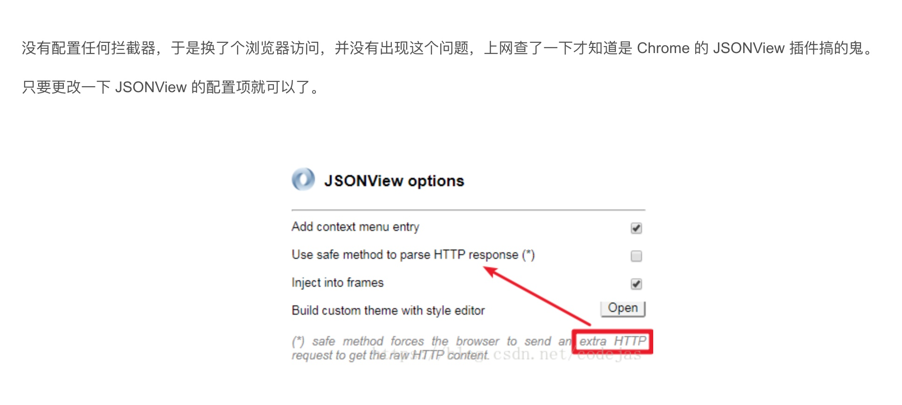

# 千万要注意：chrome请求一次controller， 会自动的发送两次，这回导致hive转成MR后还没有接受到数据就会重新再发送，最终导致问题

https://blog.csdn.net/codejas/article/details/81947930

Chrome 访问一次 Controller，请求却执行两次

> 我本人到话是装了一个JSON-handle， 关闭就好了, 后来也没好, 用firefox也不行，最后用safari不会重复发送

* 代码这里不放了，后期放在github上