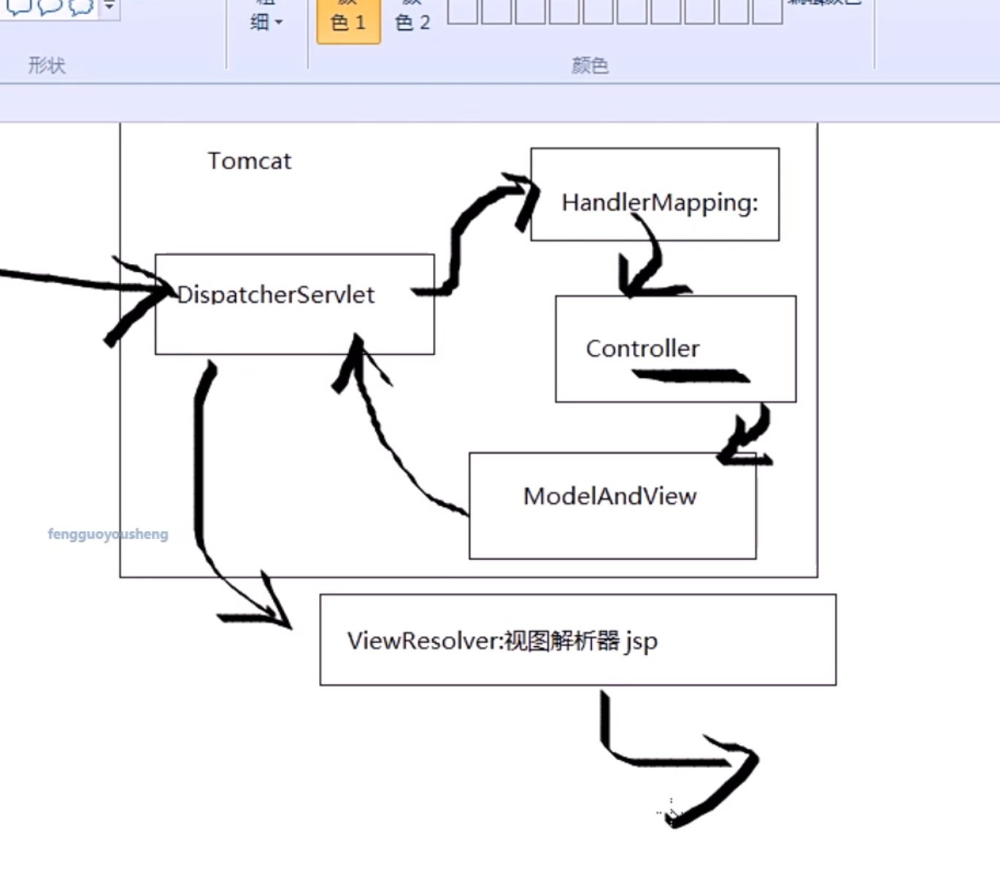

# 事务相关

## 1, 事务的四个特征ACID
* 01, Atomic
  > 原子性，即一个事务不可分割，要么全部成功，要么全部失败
  > 不管耗时多久，操作多久多少步骤，必须保持一个整体
* 02, Consistent
  
  > 一致性，操作前结束后，数据不能被破坏，数据的完整性保持一直
* 03, Isolate
  
  > 隔离性，各个事务之间是相互独立的，互相分隔的个体
* 04, Durable
  
  > 持久性，事务在提交之后，保持持久不变，除非开启新的事务

## 2, 并发现象
*多个事务并发执行的时候可能会导致的三种现象：*
* 01, 脏读
  
> 并发的两个事务，一个事务能读到另外一个事务中还没有提交的数据
  
* 02, 不可重复读, 针对更新
  
> 就是并发的两个事务，一个事务能够读到另外一个事务提交的更新操作，其实就是一个事务中重复读的时候有可能两次读的值不一样
  
* 03, 幻读, 针对插入
  
  > 就是并发的两个事务，一个事务能够读到另外一个事务提交的插入操作，幻读就是可能会读出来幻想出来的数据，毕竟同一个事务里面，第二次读的多了或者少了

## 3, 隔离级别
*对于需要不同的并发现象，所以有了不同的隔离级别*

* 01, 读未提交, 1, 这个不能防止任何并发现象
  
> set session transaction isolation level read uncommitted;
  
* 02, 读已提交, 2, 可防止脏读
  
> set session transaction isolation level read committed; 
  
* 03, 可重复读, 4, 可防止不可重复读
  
> set session transaction isolation level repeatable read; 
  
* 04, 序列化, 8, 可防止幻读, 这个是被关锁，直接防止并发，效率低，很少用
  
  > set session transaction isolation level serializable; 

# JVM相关

## 1，栈内存和堆内存

* 内存简单理解可以分为：堆内存，栈内存和方法区。

* 堆内存主要存对象，数组等，如果无限制的循环的往数组中添加对象，很快就会造成堆内存满
* 栈内存主要存储主函数和调用的方法？，比如说迭代循环调用很快就会造成栈内存压力过大，栈内存溢出
* 方法区主要存储静态变量和静态方法？？？

* 监控中的几个内存分区：
* --------------------heap----年轻代----------------
* 1，Eden区，伊甸区，当前运行的一些内存主要在这里
* 2, S0, 也就是幸存一区，Eden区的对象被gc，回收后会先进入到幸存一区
* 3, S1, 也即是幸存二区，幸存一区的对象会被回收到幸存二区
* --------------------heap----年老代----------------
* 4，old,也就是年老区
* ------------1-3都是年轻代，4是年老代，这四个都是heap，也就是堆内存------
* -------------------non-heap,非堆--------------------
* 5，metaspace, 也即是方法区，非堆，这里是JVM中heap以外的区域
* --------------------off-heap, 离堆------------------
* 6，off-heap, 这是离堆，其实已经是jvm外的内存

# Spring
