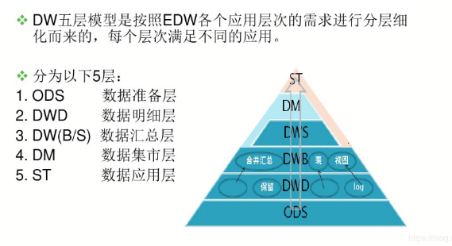

https://blog.csdn.net/zhaodedong/article/details/73385647

https://blog.csdn.net/qq_26442553/article/details/79318165

##### 1， Operation Data Store

**源数据层（ODS）：**此层数据无任何更改，直接沿用外围系统数据结构和数据，不对外开放；为临时存储层，是接口数据的临时存储区域，为后一步的数据处理做准备。

##### 2,  Data Ware

**细节层（DW）：**为数据仓库层，DW 层的数据应该是一致的、准确的、干净的数据，即对源系统数据进行了清洗（去除了杂质）后的数据。

##### 3,

**应用层（DA 或 APP）：**前端应用直接读取的数据源；根据报表、专题分析需求而计算生成的数据。

数据仓库的数据来源于不同的源数据，并提供多样的数据应用，数据自下而上流入数据仓库后向上层开放应用，而数据仓库只是中间集成化数据管理的一个平台。

**源数据层（ODS）：**此层数据无任何更改，直接沿用外围系统数据结构和数据，不对外开放；为临时存储层，是接口数据的临时存储区域，为后一步的数据处理做准备。

**细节层（DW）：**为数据仓库层，DW 层的数据应该是一致的、准确的、干净的数据，即对源系统数据进行了清洗（去除了杂质）后的数据。

**应用层（DA 或 APP）：**前端应用直接读取的数据源；根据报表、专题分析需求而计算生成的数据。

数据仓库从各数据源获取数据及在数据仓库内的数据转换和流动都可以认为是 **ETL（抽取 Extra, 转化 Transfer, 装载 Load）**的过程，ETL 是数据仓库的流水线，也可以认为是数据仓库的血液，它维系着数据仓库中数据的新陈代谢，而数据仓库日常的管理和维护工作的大部分精力就是保持 ETL 的正常和稳定。