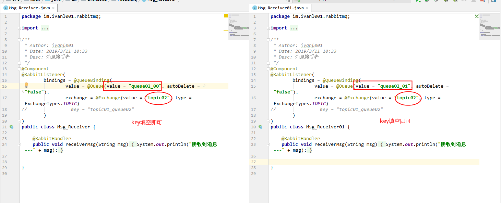
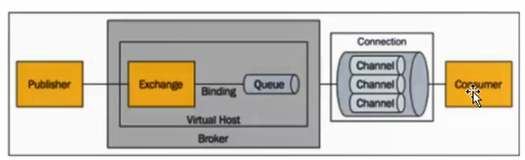
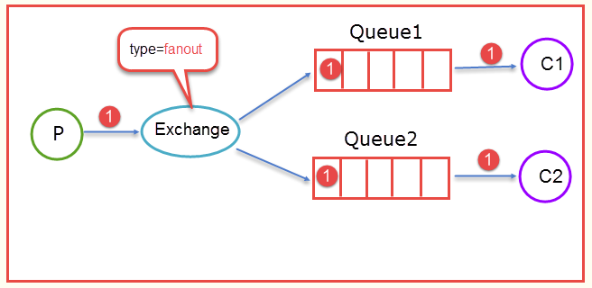
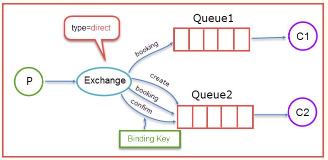
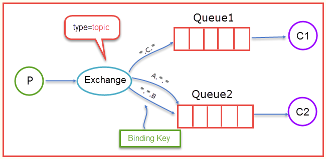
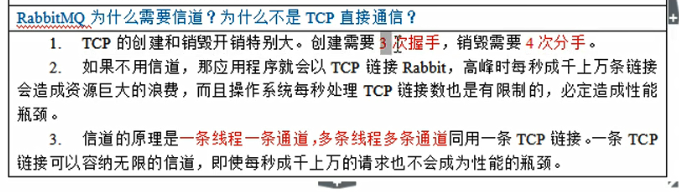

#### 启动RabbitMQ命令(windows)：

> rabbitmq-plugins enable rabbitmq_management


#### 0， 自己的理解

* 其实exchange不同交换器的唯一区别就是匹配的方式不一样。
* fanout最简单，queue和exchange直接绑定，不需要routing-key
* direct是默认，需要routing-key，匹配方式是完全匹配，就是queue绑定的routing-key需要和交换器写出到的routing-key一致。如果direct模式下routing-key为空，就是fanout模式了
* topic比direct更宽泛，匹配的时候可以使用通配符。
* 所以如果是一个queue，多个消费者，必然是一个蛋糕分开吃
* 如果需要用广播的模式，最简单的是使用fanout模式， 一个exchange绑定多个queue，然后多个消费者消费各自的queue即可
* 当然也可以通过direct或者topic方式， 把routing-key填空的方式实现类似fanout的广播模式

* 

#### 1, RabbitMQ的基本概念



##### 1.1, Message

* 消息， 由消息头和消息体组成
* 消息头则由一系列可选属性组成，包括：routing-key(路由键)， priority(相对其他消息的优先权)， delivery-mode(消息可能持久性存储)等

##### 1.2, producer

* 消息生产者

##### 1.3, exchange

* 生产者生产消息，首先会发给exchange交换器， 由交换器决定哪个消息发送到哪个队列中去

* 交换器类型有：fanout, direct(默认), topic

* fanout类型的Exchange路由规则非常简单，它会把所有发送到该Exchange的消息路由到所有与它绑定的Queue中。

  

* direct类型的Exchange路由规则也很简单，它会把消息路由到那些binding key与routing key完全匹配的Queue中

* direct模式下，多个consumer消费同一个queue，相当于一个蛋糕分开给大家吃

  

* topic这个规则就是模糊匹配，可以通过通配符满足一部分规则就可以传送(direct规则是严格意义上的匹配，换言之Routing Key必须与Binding Key相匹配的时候才将消息传送给Queue)

  

##### 1.4, queue

* 消息队列， 生产者生产消息后会通过对应类型的交换器把消息路由给对应的队列中来。比如如如果是fanout交换器，那么直接发送到绑定的队列中即可。如果是direct交换器， 会通过路由键进行匹配发送。如果是topic交换器，会通过模糊匹配的方式进行发送消息到队列中。

##### 1.5， channel

* 消费通道，是TCP里面的虚拟连接，一条TCP连接上可以创建多个通道。把TCP连接比作网线，通道就相当是光线束
* 如果一个消息创建一个TCP连接，需要三次握手，效率比较低，所以通过一个连接内部创建多个通道进行加速
* 消费者消费消息的时候每个线程中会有多个通道，加快速度
* 

##### 1.6， consumer

* 消费者

#### 2， spring-rabbit框架使用

##### 2.1， pom中添加如下依赖

```xml
<dependency>
    <groupId>org.springframework.amqp</groupId>
    <artifactId>spring-rabbit</artifactId>
    <version>1.4.0.RELEASE</version>
</dependency>
<dependency>
    <groupId>com.rabbitmq</groupId>
    <artifactId>amqp-client</artifactId>
    <version>3.4.1</version>
</dependency>
```

##### 2.2, 在资源目录下配置rabbitmq-context.xml

* （配置好像没啥用，后期看下怎么调用）

```xml
<beans xmlns="http://www.springframework.org/schema/beans"
	xmlns:xsi="http://www.w3.org/2001/XMLSchema-instance" xmlns:rabbit="http://www.springframework.org/schema/rabbit"
	xsi:schemaLocation="http://www.springframework.org/schema/rabbit
	http://www.springframework.org/schema/rabbit/spring-rabbit-1.4.xsd
	http://www.springframework.org/schema/beans
	http://www.springframework.org/schema/beans/spring-beans-4.1.xsd">

	<!-- 定义RabbitMQ的连接工厂 -->
	<rabbit:connection-factory id="connectionFactory"
		host="127.0.0.1" port="5672" username="taotao" password="taotao"
		virtual-host="/taotao" />

	<!-- 定义Rabbit模板，指定连接工厂以及定义exchange -->
	<rabbit:template id="amqpTemplate" connection-factory="connectionFactory" exchange="fanoutExchange" />
	<!-- <rabbit:template id="amqpTemplate" connection-factory="connectionFactory"
		exchange="fanoutExchange" routing-key="foo.bar" /> -->

	<!-- MQ的管理，包括队列、交换器等 -->
	<rabbit:admin connection-factory="connectionFactory" />

	<!-- 定义队列，自动声明 -->
	<rabbit:queue name="myQueue" auto-declare="true"/>
	
	<!-- 定义交换器，自动声明 -->
	<rabbit:fanout-exchange name="fanoutExchange" auto-declare="true">
		<rabbit:bindings>
			<rabbit:binding queue="myQueue"/>
		</rabbit:bindings>
	</rabbit:fanout-exchange>
	
<!-- 	<rabbit:topic-exchange name="myExchange">
		<rabbit:bindings>
			<rabbit:binding queue="myQueue" pattern="foo.*" />
		</rabbit:bindings>
	</rabbit:topic-exchange> -->

	<!-- 队列监听 -->
	<rabbit:listener-container connection-factory="connectionFactory">
		<rabbit:listener ref="foo" method="listen" queue-names="myQueue" />
	</rabbit:listener-container>

	<bean id="foo" class="cn.itcast.rabbitmq.spring.Foo" />

</beans>
```

##### 2.3， ConnectionUtil.java

* 好像配置文件中不好用，所以这里可以直接设置

```java
package im.ivanl001.buer.A01_RabbitMQ.util;

import com.rabbitmq.client.ConnectionFactory;
import com.rabbitmq.client.Connection;

public class ConnectionUtil {

    public static Connection getConnection() throws Exception {
        //定义连接工厂
        ConnectionFactory factory = new ConnectionFactory();
        //设置服务地址
        factory.setHost("10.19.48.37");
        //端口
        factory.setPort(5672);
        //设置账号信息，用户名、密码、vhost
        factory.setVirtualHost("test01");
        factory.setUsername("bi_user");
        factory.setPassword("@bi_user");
        // 通过工程获取连接
        Connection connection = factory.newConnection();
        return connection;
    }
}
```

##### 2.4， 发送消息

```java
package im.ivanl001.buer.A01_RabbitMQ.topic;

import im.ivanl001.buer.A01_RabbitMQ.util.ConnectionUtil;
import com.rabbitmq.client.Channel;
import com.rabbitmq.client.Connection;

public class Send {

    private final static String EXCHANGE_NAME = "test_exchange_topic";

    public static void main(String[] argv) throws Exception {
        // 获取到连接以及mq通道
        Connection connection = ConnectionUtil.getConnection();
        Channel channel = connection.createChannel();

        // 声明exchange
        channel.exchangeDeclare(EXCHANGE_NAME, "topic");

        // 消息内容
        String message = "Hello World!";
        channel.basicPublish(EXCHANGE_NAME, "key.1", null, message.getBytes());
        System.out.println(" [x] Sent '" + message + "'");

        channel.close();
        connection.close();
    }
}
```

##### 2.5, 接收消息

```java
package im.ivanl001.buer.A01_RabbitMQ.topic;

import im.ivanl001.buer.A01_RabbitMQ.util.ConnectionUtil;

import com.rabbitmq.client.Channel;
import com.rabbitmq.client.Connection;
import com.rabbitmq.client.QueueingConsumer;

public class Recv {

    private final static String QUEUE_NAME = "test_queue_topic_work";

    private final static String EXCHANGE_NAME = "test_exchange_topic";

    public static void main(String[] argv) throws Exception {

        // 获取到连接以及mq通道
        Connection connection = ConnectionUtil.getConnection();
        Channel channel = connection.createChannel();

        // 声明队列
        channel.queueDeclare(QUEUE_NAME, false, false, false, null);

        // 绑定队列到交换机
        channel.queueBind(QUEUE_NAME, EXCHANGE_NAME, "key.*");

        // 同一时刻服务器只会发一条消息给消费者
        channel.basicQos(1);

        // 定义队列的消费者
        QueueingConsumer consumer = new QueueingConsumer(channel);
        // 监听队列，手动返回完成
        channel.basicConsume(QUEUE_NAME, false, consumer);

        // 获取消息
        while (true) {
            QueueingConsumer.Delivery delivery = consumer.nextDelivery();
            String message = new String(delivery.getBody());
            System.out.println(" [x] Received '" + message + "'");
            Thread.sleep(10);

            channel.basicAck(delivery.getEnvelope().getDeliveryTag(), false);
        }
    }
}
```

* 其他类型的可以参考2T盘中：\_ivanl002\buer\src\main\java\im\ivanl001\buer项目

#### 3， spring-boot-starter-amqp框架使用

> 这个框架基本都是直接使用注解完成了大部分功能， 比如接收消息直接@RabbitListener， 发送消息直接使用模板：AmqpTemplate

##### 3.1， 添加maven依赖

```xml
<dependency>
    <groupId>org.springframework.boot</groupId>
    <artifactId>spring-boot-starter-amqp</artifactId>
</dependency>
```

##### 3.2, 发送消息

```java
package im.ivanl001.rabbitmq;

import org.springframework.amqp.core.AmqpTemplate;
import org.springframework.beans.factory.annotation.Autowired;
import org.springframework.beans.factory.annotation.Value;
import org.springframework.stereotype.Component;

/**
 * Author: ivanl001
 * Date: 2019/3/11 10:28
 * Desc: 消息发送者, 具体的测试类在：im.ivanl001.rabbitmq.RabbitmqApplicationTest_A01
 */
@Component
public class Msg_Sender {

    @Autowired
    private AmqpTemplate rabbitAmqp;

    @Value("fanout01")
    private String exchange;
    

    public void sendMsg(String msg){
        //下面这个方法注释：Convert a Java object to an Amqp {@link Message} and send it to a default exchange
        String msg01 = exchange + "----" + "----" + msg;
        this.rabbitAmqp.convertAndSend(exchange, "", msg01);//第二个参数是key，如果不需要可以填空
        System.out.println(msg01);
    }
}
```

##### 3.3， 接收消息

```java
package im.ivanl001.rabbitmq;

import org.springframework.amqp.core.ExchangeTypes;
import org.springframework.amqp.rabbit.annotation.*;
import org.springframework.stereotype.Component;

/**
 * Author: ivanl001
 * Date: 2019/3/11 10:33
 * Desc: 消息接受者
 */
@Component
@RabbitListener(
        bindings = @QueueBinding(
                value = @Queue(value = "queue03_00", autoDelete = "false"),
                exchange = @Exchange(value = "fanout01", type = ExchangeTypes.FANOUT)
        )
)
public class Msg_Receiver {

    @RabbitHandler
    public void receiverMsg(String msg){
        System.out.println("00----接收到消息---" + msg);
    }
}
```

