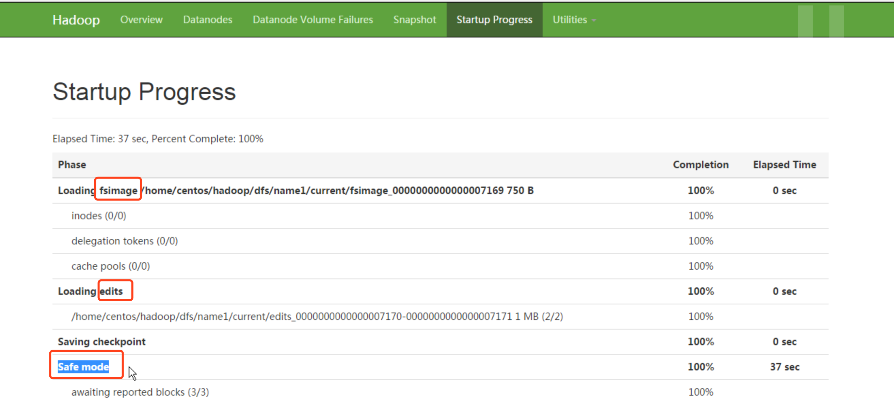
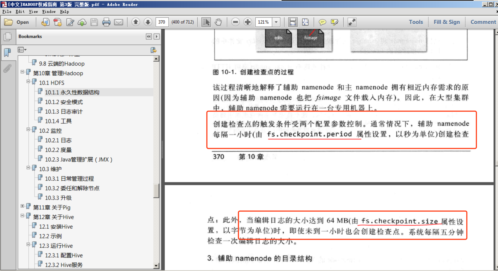

1, hadoop枚512字节进行一次数据校验，所以块大小必须是512的倍数，默认应该是128M，可以更改

2，namenode主要存储两方面的内容，启动的时候加载过程如下图：

* 镜像日志文件，主要是文件夹和文件的信息，通过oiv命令查看文件内容
* 编辑日志文件，主要存储文件的操作信息，通过oev命令查看文件内容

3，辅助名称节点主要用于帮助名称节点融合编辑日志和镜像日志文件， 加快namenode的启动速度，当然一般情况下也不会随便的重启哈。可以通过设置检查点来自定义融合操作的时间，比如说每隔一小时这样。当然如果编辑日志超过一定的大小，默认应该是64M，辅助名称节点也会自动的进行融合。

