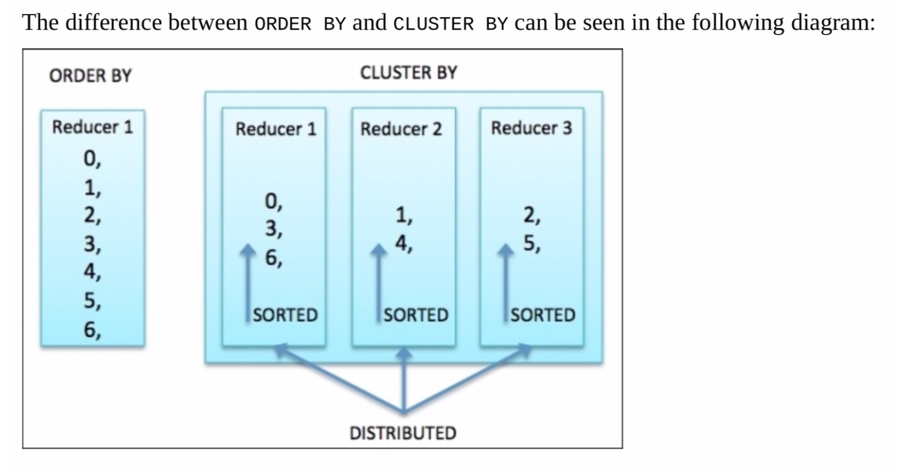

order===> 全排序，相当于最后只设置了一个reducer

 sort===> 部分排序，每个reducer有序，如果设置了多个reducer，不保证全局有序，但是保证单个reducer有序

distribute by===> mapper端的分区操作,需要放在sort之前，因为排序之前需要确定哪些数据进入哪个reducer，要不然怎么排序.

cluster by ===>  distribute by cid sort by cid

