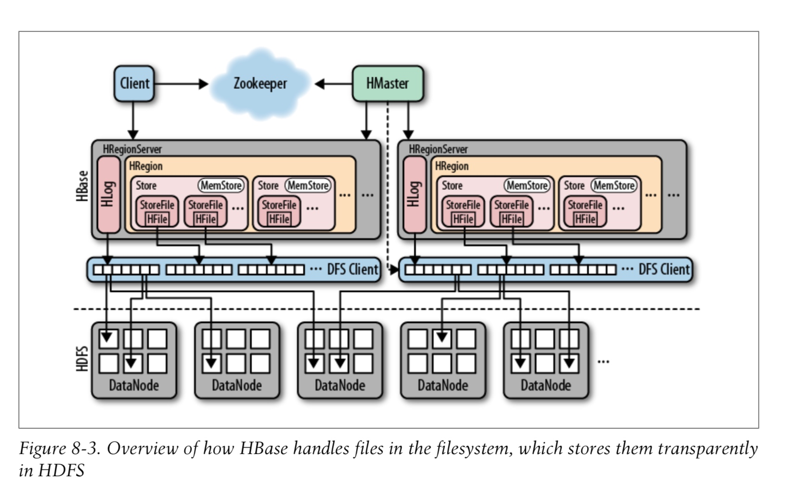

总结一下hbase的架构相关：

1， master是主节点，负责表的增删改查操作

2，regionserver是区域服务器，是数据存储的地方

3，zk是协同管理， 保证leader选举，程序的健康状态，避免单点故障等等。

> 

client读取的时候，先是联系zk，

架构关系：

Region: 对应一张表中的某个区域，一张表会有多个Region

Store：对应一个区域中的一个列族，一个Region中也可能会有多个列族。

> client访问hbase上的数据并不需要master参与（寻址访问zookeeper和region server，数据读写访问region server），master仅仅维护table和region的元数据信息（table的元数据信息保存在zookeeper上），负载很低。HRegionServer存取一个子表时，会创建一个HRegion对象，然后对表的每个列族创建一个Store实例，每个Store都会有一个MemStore和0个或多个StoreFile与之对应，每个StoreFile都会对应一个HFile，HFile就是实际的存储文件。因此，一个HRegion（表）有多少个列族就有多少个Store。一个HRegionServer会有多个HRegion和一个HLog。

- 在hbase中是有一个默认的命名空间的， 叫做“hbase”
- 该命名空间下有两个默认的表， 一个是namespace，用来存储hbase的所有命名空间，一个是meta，是元数据表，存储

### hbase架构解析,讲的还蛮好的，所以我这里就不总结了，看这篇文章吧：

- https://www.cnblogs.com/swordfall/p/8737328.html

