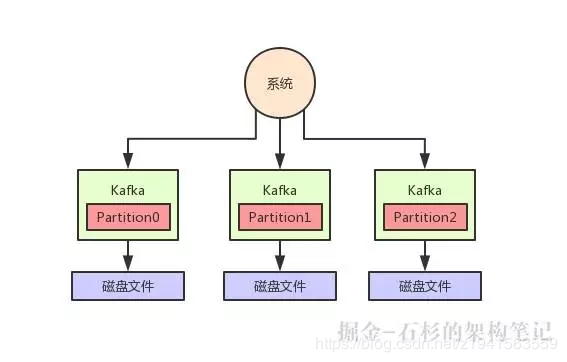

转

# 突发宕机，Kafka写入的数据如何保证不丢失？

2019年03月25日 16:02:11 [PersistJiao](https://me.csdn.net/z1941563559) 阅读数：104

我们暂且不考虑写磁盘的具体过程，先大致看看下面的图，这代表了 Kafka 的核心架构原理。

#### Kafka 分布式存储架构

那么现在问题来了，如果每天产生几十 TB 的数据，难道都写一台机器的磁盘上吗？这明显是不靠谱的啊！

所以说，这里就得考虑数据的分布式存储了，我们结合 Kafka 的具体情况来说说。

在 Kafka 里面，有一个核心的概念叫做“Topic”，这个 Topic 你就姑且认为是一个数据集合吧。

举个例子，如果你现在有一份网站的用户行为数据要写入 Kafka，你可以搞一个 Topic 叫做“user_access_log_topic”，这里写入的都是用户行为数据。

然后如果你要把电商网站的订单数据的增删改变更记录写 Kafka，那可以搞一个 Topic 叫做“order_tb_topic”，这里写入的都是订单表的变更记录。

然后假如说咱们举个例子，就说这个用户行为 Topic 吧，里面如果每天写入几十 TB 的数据，你觉得都放一台机器上靠谱吗？

明显不太靠谱，所以 Kafka 有一个概念叫做 Partition，就是把一个 Topic 数据集合拆分为多个数据分区，你可以认为是多个数据分片，每个 Partition 可以在不同的机器上，储存部分数据。

这样，不就可以把一个超大的数据集合分布式存储在多台机器上了吗？大家看下图，一起来体会一下。

#### Kafka 高可用架构

但是这个时候，我们又会遇到一个问题，就是万一某台机器宕机了，这台机器上的那个 Partition 管理的数据不就丢失了吗？

所以说，我们还得做多副本冗余，每个 Partition 都可以搞一个副本放在别的机器上，这样某台机器宕机，只不过是 Partition 其中一个副本丢失。

如果某个 Partition 有多副本的话，Kafka 会选举其中一个 Parititon 副本作为 Leader，然后其他的 Partition 副本是 Follower。

只有 Leader Partition 是对外提供读写操作的，Follower Partition 就是从 Leader Partition 同步数据。

一旦 Leader Partition 宕机了，就会选举其他的 Follower Partition 作为新的 Leader Partition 对外提供读写服务，这不就实现了高可用架构了？

大家看下面的图，看看这个过程：

#### Kafka 写入数据丢失问题

现在我们来看看，什么情况下 Kafka 中写入数据会丢失呢？其实也很简单，大家都知道写入数据都是往某个 Partition 的 Leader 写入的，然后那个 Partition 的 Follower 会从 Leader 同步数据。

但是万一 1 条数据刚写入 Leader Partition，还没来得及同步给 Follower，此时 Leader Partiton 所在机器突然就宕机了呢？

大家看下图：

如上图，这个时候有一条数据是没同步到 Partition0 的 Follower 上去的，然后 Partition0 的 Leader 所在机器宕机了。

此时就会选举 Partition0 的 Follower 作为新的 Leader 对外提供服务，然后用户是不是就读不到刚才写入的那条数据了？

因为 Partition0 的 Follower 上是没有同步到最新的一条数据的。这个时候就会造成数据丢失的问题。

#### Kafka 的 ISR 机制是什么？

现在我们先留着这个问题不说具体怎么解决，先回过头来看一个 Kafka 的核心机制，就是 。

这个机制简单来说，就是会自动给每个 Partition 维护一个 ISR 列表，这个列表里一定会有 Leader，然后还会包含跟 Leader 保持同步的 Follower。

也就是说，只要 Leader 的某个 Follower 一直跟他保持数据同步，那么就会存在于 ISR 列表里。

但是如果 Follower 因为自身发生一些问题，导致不能及时的从 Leader 同步数据过去，那么这个 Follower 就会被认为是“out-of-sync”，被从 ISR 列表里踢出去。

所以大家先得明白这个 ISR 是什么，说白了，就是 Kafka 自动维护和监控哪些 Follower 及时的跟上了 Leader 的数据同步。

#### Kafka 写入的数据如何保证不丢失？

所以如果要让写入 Kafka 的数据不丢失，你需要保证如下几点：

- 每个 Partition 都至少得有 1 个 Follower 在 ISR 列表里，跟上了 Leader 的数据同步。
- 每次写入数据的时候，都要求至少写入 Partition Leader 成功，同时还有至少一个 ISR 里的 Follower 也写入成功，才算这个写入是成功了。
- 如果不满足上述两个条件，那就一直写入失败，让生产系统不停的尝试重试，直到满足上述两个条件，然后才能认为写入成功。
- 按照上述思路去配置相应的参数，才能保证写入 Kafka 的数据不会丢失。

好！现在咱们来分析一下上面几点要求。

**第一条，必须要求至少一个 Follower 在 ISR 列表里。**

那必须的啊，要是 Leader 没有 Follower 了，或者是 Follower 都没法及时同步 Leader 数据，那么这个事儿肯定就没法弄下去了。

**第二条，每次写入数据的时候，要求 Leader 写入成功以外，至少一个 ISR 里的 Follower 也写成功。**

大家看下面的图，这个要求就是保证说，每次写数据，必须是 Leader 和 Follower 都写成功了，才能算是写成功，保证一条数据必须有两个以上的副本。

这个时候万一 Leader 宕机，就可以切换到那个 Follower 上去，那么 Follower 上是有刚写入的数据的，此时数据就不会丢失了。

如上图所示，假如现在 Leader 没有 Follower 了，或者是刚写入 Leader，Leader 立马就宕机，还没来得及同步给 Follower。

在这种情况下，写入就会失败，然后你就让生产者不停的重试，直到 Kafka 恢复正常满足上述条件，才能继续写入。这样就可以让写入 Kafka 的数据不丢失。

#### 总结

最后总结一下，其实 Kafka 的数据丢失问题，涉及到方方面面。

譬如生产端的缓存问题，包括消费端的问题，同时 Kafka 自己内部的底层算法和机制也可能导致数据丢失。

但是平时写入数据遇到比较大的一个问题，就是 Leader 切换时可能导致数据丢失。所以本文仅仅是针对这个问题说了一下生产环境解决这个问题的方案。

原文：https://mp.weixin.qq.com/s/UzRcHdN7PBoxiEBZOUadGA