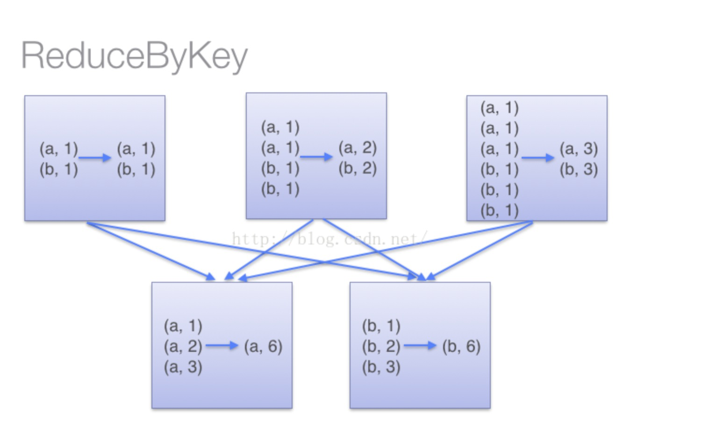
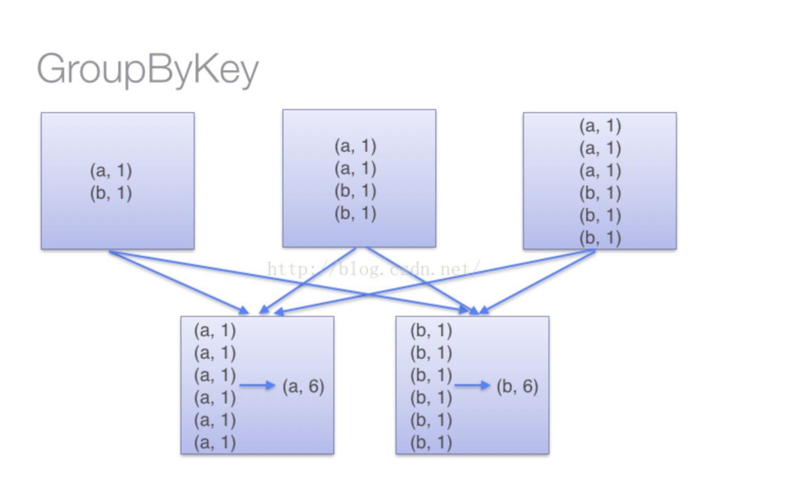

RDD：弹性分布式数据集，spark中最重要的概念

DataStream和DataSet是spark中数据流的表现方式


transform：

reduceByKey ==> 这个是直接聚合，比如wordcount里面，直接把和算出来

groupByKey  ==>这个是分组，wordcount里面，是把相同的word做key, 后面的数量是一个数组，做value

 他们都是要经过shuffle的，groupByKey在方法shuffle之间不会合并原样进行shuffle，。reduceByKey进行shuffle之前会先做合并,这样就减少了shuffle的io传送，所以效率高一点。

```java
val words = Array(“one”, “two”, “two”, “three”, “three”, “three”)
val wordPairsRDD = sc.parallelize(words).map(word => (word, 1))
  
val wordCountsWithReduce = wordPairsRDD.reduceByKey(_ + _)
val wordCountsWithGroup = wordPairsRDD.groupByKey().map(t => (t._1, t._2.sum))
  
  
上面得到的wordCountsWithReduce和wordCountsWithGroup是完全一样的，但是，它们的内部运算过程是不同的。
--------------------- 
作者：qq_38799155 
来源：CSDN 
原文：https://blog.csdn.net/qq_38799155/article/details/80178022 
版权声明：本文为博主原创文章，转载请附上博文链接！
```



