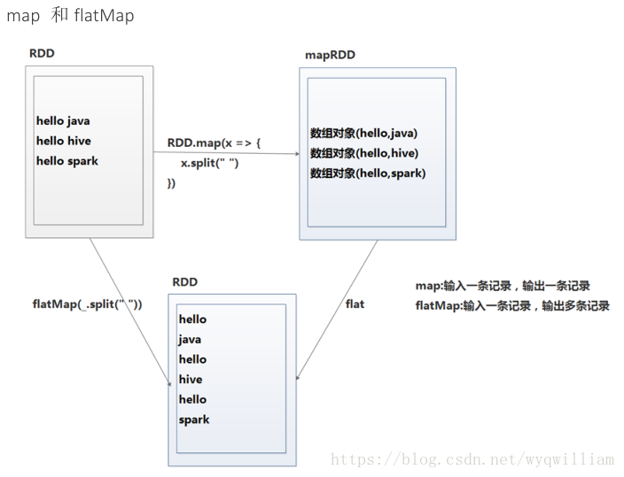

# Spark部分：调优【reduceByKey/aggregateByKey替代groupByKey，mapPartitions替代普通map，foreachPartitions替代foreach】

2018年08月13日 11:11:12 [道法—自然](https://me.csdn.net/wyqwilliam) 阅读数：650


### 1.使用reduceByKey/aggregateByKey替代groupByKey

# 2.使用mapPartitions替代普通map

### 3.使用foreachPartitions替代foreach

### 4.使用filter之后进行coalesce操作

### 5.使用repartitionAndSortWithinPartitions替代repartition与sort类操作

### 6.使用broadcast使各task共享同一Executor的集合替代算子函数中各task传送一份集合

### 7.使用相同分区方式的join可以避免Shuffle

### 8.map和flatMap选择

### 9.cache和persist选择

### 10.zipWithIndex和zipWithUniqueId选择

　

### 1.使用reduceByKey/aggregateByKey替代groupByKey

 reduceByKey/aggregateByKey底层使用combinerByKey实现，会在map端进行局部聚合；groupByKey不会。

map端预聚合的算子： reduceByKey/aggregateByKey/combinerByKey

使用map-side预聚合的shuffle操作,尽量使用有combiner的shuffle类算子。
            combiner概念：
                在map端，每一个map task计算完毕后进行的局部聚合
            combiner好处：
            a)    降低shuffle write写磁盘的数据量。
            b)    降低shuffle read拉取数据量的大小。
            c)    降低reduce端聚合的次数。

### 2.使用mapPartitions替代普通map

mapPartitions类的算子，一次函数调用会处理一个partition所有的数据，而不是一次函数调用处理一条，性能相对来说会高一些。但是有的时候，使用mapPartitions会出现OOM（内存溢出）的问题。因为单次函数调用就要处理掉一个partition所有的数据，如果内存不够，垃圾回收时是无法回收掉太多对象的，很可能出现OOM异常。所以使用这类操作时要慎重！

### 3.使用foreachPartitions替代foreach

原理类似于“使用mapPartitions替代map”，也是一次函数调用处理一个partition的所有数据，而不是一次函数调用处理一条数据。在实践中发现，foreachPartitions类的算子，对性能的提升还是很有帮助的。比如在foreach函数中，将RDD中所有数据写MySQL，那么如果是普通的foreach算子，就会一条数据一条数据地写，每次函数调用可能就会创建一个数据库连接，此时就势必会频繁地创建和销毁数据库连接，性能是非常低下；但是如果用foreachPartitions算子一次性处理一个partition的数据，那么对于每个partition，只要创建一个数据库连接即可，然后执行批量插入操作，此时性能是比较高的。实践中发现，对于1万条左右的数据量写MySQL，性能可以提升30%以上。

foreach 以一条记录为单位来遍历 RDD
foreachPartition 以分区为单位遍历 RDD
foreach 和 foreachPartition 都是 actions 算子
map 和 mapPartition 可以与它们做类比，但 map 和 mapPartitions 是 transformations 算子

### 4.使用filter之后进行coalesce操作

通常对一个RDD执行filter算子过滤掉RDD中较多数据后（比如30%以上的数据），建议使用coalesce算子，手动减少RDD的partition数量，将RDD中的数据压缩到更少的partition中去。因为filter之后，RDD的每个partition中都会有很多数据被过滤掉，此时如果照常进行后续的计算，其实每个task处理的partition中的数据量并不是很多，有一点资源浪费，而且此时处理的task越多，可能速度反而越慢。因此用coalesce减少partition数量，将RDD中的数据压缩到更少的partition之后，只要使用更少的task即可处理完所有的partition。在某些场景下，对于性能的提升会有一定的帮助。

### 5.使用repartitionAndSortWithinPartitions替代repartition与sort类操作

repartitionAndSortWithinPartitions是Spark官网推荐的一个算子，官方建议，如果需要在repartition重分区之后，还要进行排序，建议直接使用repartitionAndSortWithinPartitions算子。因为该算子可以一边进行重分区的shuffle操作，一边进行排序。shuffle与sort两个操作同时进行，比先shuffle再sort来说，性能可能是要高的。

### 6.使用broadcast使各task共享同一Executor的集合替代算子函数中各task传送一份集合

在算子函数中使用到外部变量时，默认情况下，Spark会将该变量复制多个副本，通过网络传输到task中，此时每个task都有一个变量副本。如果变量本身比较大的话（比如100M，甚至1G），那么大量的变量副本在网络中传输的性能开销，以及在各个节点的Executor中占用过多内存导致的频繁GC，都会极大地影响性能。

因此对于上述情况，如果使用的外部变量比较大，建议使用Spark的广播功能，对该变量进行广播。广播后的变量，会保证每个Executor的内存中，只驻留一份变量副本，而Executor中的task执行时共享该Executor中的那份变量副本。这样的话，可以大大减少变量副本的数量，从而减少网络传输的性能开销，并减少对Executor内存的占用开销，降低GC的频率。

### 7.使用相同分区方式的join可以避免Shuffle

Spark知道当前面的转换已经根据相同的partitioner分区器分好区的时候如何避免shuffle。如果RDD有相同数目的分区，*join*操作不需要额外的shuffle操作。因为RDD是相同分区的，rdd1中任何一个分区的key集合都只能出现在rdd2中的单个分区中。因此rdd3中任何一个输出分区的内容仅仅依赖rdd1和rdd2中的单个分区，第三次shuffle就没有必要了。

```java
rdd1 = someRdd.reduceByKey(...)


rdd2 = someOtherRdd.reduceByKey(...)


rdd3 = rdd1.join(rdd2)
```

那如果rdd1和rdd2使用不同的分区器，或者使用默认的hash分区器但配置不同的分区数呢？那样的话，仅仅只有一个rdd（较少分区的RDD）需要重新shuffle后再join。

8.map和flatMap选择

```java
def map[U](f: (T) ⇒ U)(implicit arg0: ClassTag[U]): RDD[U] //Return a new RDD by applying a function to all elements of this RDD.


def flatMap[U](f: (T) ⇒ TraversableOnce[U])(implicit arg0: ClassTag[U]): RDD[U]  //Return a new RDD by first applying a function to all elements of this RDD, and then flattening the results.
```

前者的输入是一个单一数据，后者的输入数据是一个可迭代的集合。同样是执行某种映射函数，后者最终会把元素打平，即map的输入输出是一对一的，而flatMap的输出是一对多的。



