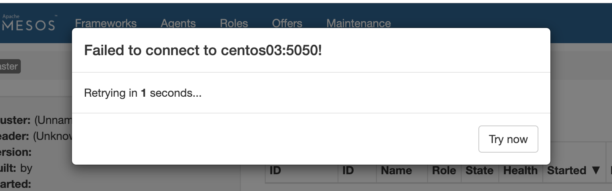

一些参考资料:

http://www.cnblogs.com/kevingrace/p/5685313.html

https://www.jianshu.com/p/168f4456e234

#### 看这个

https://blog.csdn.net/qq_35440040/article/details/78427516

https://blog.csdn.net/snipercai/article/details/79273704

marathon启动不起来的解决：

https://blog.csdn.net/fujianfafu/article/details/80697524

datax+cdh+hivesql+hbase+javaspringboot+docker+marathon+messon+presto这些


## 1, marathon+mesos的安装

*集群介绍：很简单，因为是用虚拟机测试，所以我一共创建三台虚拟机，centos01，node202, node203， ip地址分别是：192.168.83.201， 192.168.83.202， 193.168.83.203. 然后mesos-master分布在centos01，node202, node203, mesos-slave分布在centos01, node202, node203。marathon也是一样，zk也是*

### 1.1,  添加mesos的yum源

```shell
$> rpm -Uvh http://repos.mesosphere.io/el/7/noarch/RPMS/mesosphere-el-repo-7-2.noarch.rpm
```

### 1.2, 安装mesos，marathon

* (zk已经手动安装配置过，这里不再安装， 如果没有也可以在这里直接安装yum -y install mesosphere-zookeeper，具体配置可自行搜索), mesos速度有点慢，做好心理准备

```shell
$> yum -y install mesos marathon
```


## 2, mesos全局配置: zk

* 修改/etc/mesos/zk文件内容，格式如下：需要根据自己的集群修改zk的地址(注意：我这里配置了hosts，如果hosts文件中没有映射具体的ip地址，这里需要写ip地址)

```shell
echo zk://centos01:2181,centos02:2181,centos03:2181/mesos > /etc/mesos/zk
imrsync.sh /etc/mesos/zk
```


## 3, mesos-master配置

### 3.1, quorum

* 修改/etc/mesos-master/quorum文件内容， 设置 quorum=2 的意思是：至少要有 2 台 master 节点在线，否则集群无法起来，所以至少要两台 master 一起启动。

```txt
echo 2 > /etc/mesos-master/quorum
imrsync.sh /etc/mesos-master/quorum
```

### 3.2, hostname

* 修改/etc/mesos-master/hostname文件内容, 这个应该是界面上显示的机器的ip地址，每台master机器配置自己的哈。应该只能写ip，我试了一下写centos01， 结果好像出错了，找不到原因，重启机器之后就好了。最好写ip吧。
* 也有的教程说在/etc/mesos-master/下要再加一个ip为名字的文件，里面也要写上ip地址，但是我没有创建这个文件，也可以正常跑起来mesos-master
* 最后还是ip文件下写ip， hostname文件下写hostname
* (添加master的hostname，默认为localhost，主要在mesos集群间使用，不是机器的hostname，只做显示用)

```shell
# 在centos01上执行
echo centos01 > /etc/mesos-master/hostname
# 在centos02上执行
echo centos02 > /etc/mesos-master/hostname
# 在centos03上执行
echo centos03 > /etc/mesos-master/hostname
```

### 3,3, ip

* (添加master的ip，默认是127.0.0.1，只做显示用)

```shell
# 在centos01上执行
echo 192.168.147.101 > /etc/mesos-master/ip
# 在centos02上执行
echo 192.168.147.102 > /etc/mesos-master/ip
# 在centos03上执行
echo 192.168.147.103 > /etc/mesos-master/ip
```

## 4, 启动mesos-master节点

### 4.1, 启动命令

```shell
systemctl start mesos-master

# 设置成开机启动：
systemctl enable  mesos-master
```

### 4.2, 验证mesos-master页面：

* http://192.168.147.101:5050/#/
* http://192.168.147.102:5050/#/
* http://192.168.147.103:5050/#/

```shell
# 不正常的时候 查看状态和日志
systemctl status mesos-master
service mesos-master status -l
journalctl -u mesos-master
```


### 4.3, bug问题解决



```shell
# 上面问题是因为zk没开，操！第二遍这个错误了！！！
```


## 5, mesos-slave配置

### 5.1, hostname

* 修改/etc/mesos-slave/hostname文件内容, 是本机的ip地址（因为机器有限，所有我把slave节点和master节点放在同一台机器上）

```shell
# 在centos01上执行
echo 192.168.147.101 > /etc/mesos-slave/hostname
# 在centos02上执行
echo 192.168.147.102 > /etc/mesos-slave/hostname
# 在centos03上执行
echo 192.168.147.103 > /etc/mesos-slave/hostname
```

### 5.2, containerizers

* 如果要运行dockers，则要配置docker启动，如下：

```shell
# 下面这行必须要加上，否则后续docker镜像起不起来
echo 'docker,mesos' > /etc/mesos-slave/containerizers
# 下面这个好像不配置也是ok的
echo '5mins' > /etc/mesos-slave/executor_registration_timeout
```


## 6, 启动mesos-slave节点

### 6.1, 启动命令

```shell
systemctl start mesos-slave

# 设置成开机启动：
systemctl enable  mesos-slave
```


### 6.2, 检查mesos-slave页面

* http://192.168.147.101:5050
* http://192.168.147.102:5050
* http://192.168.147.103:5050

```shell
# 不正常的时候 查看状态和日志
systemctl status mesos-slave
service mesos-slave status -l
journalctl -u mesos-slave
```


## 7, 配置marathon

* marathon就是一个UI，可以在任何一台服务器上跑即可，不需要跑很多

### 7.1, 创建目录/etc/marathon/conf

```shell
mkdir -p /etc/marathon/conf
cd /etc/marathon/conf
```

### 7.2, 在该目录下创建如下三个文件

### 7.2.1, hostname

```shell
# 在centos01上执行
echo 192.168.147.101 > /etc/marathon/conf/hostname
# 在centos02上执行
echo 192.168.147.102 > /etc/marathon/conf/hostname
# 在centos03上执行
echo 192.168.147.103 > /etc/marathon/conf/hostname
```

### **7.2.2,** master

* 这个其实是配置mesos的zk

```shell
echo zk://centos01:2181,centos02:2181,centos03:2181/mesos > /etc/marathon/conf/master
imrsync.sh /etc/marathon/conf/master
```

### **7.2.3,** marathon

* 这个是配置marathon的zk (也有的教程说这个文件名是zk，我用的marathon，后来跑不起来，然后查资料，又修改了另外一个地方的配置文件ok了。不知道直接用zk名字是不是可以直接跑起来)

```txt
echo zk://centos01:2181,centos02:2181,centos03:2181/marathon > /etc/marathon/conf/marathon
imrsync.sh /etc/marathon/conf/marathon
```


7.3, 修改文件/etc/default/marathon

```shell
vim /etc/default/marathon
```


```properties
MARATHON_MASTER="zk://centos01:2181,centos02:2181,centos03:2181/mesos"
MARATHON_ZK="zk://centos01:2181,centos02:2181,centos03:2181/marathon"
MARATHON_MESOS_USER="root"
```


## 8, 启动marathon

### 8.1, 启动命令

```shell
# 开启命令
systemctl start marathon
# 关闭命令
systemctl stop marathon

systemctl disable marathon

```


### 8.2, 检查marathon页面

* http://192.168.147.101:8080
* http://192.168.147.102:8080
* http://192.168.147.103:8080

```shell
# 启动不正常的时候 查看状态和日志
systemctl status mesos-master
service mesos-master status -l
journalctl -u mesos-master
```

* 我这里不正常，参考了如下文章解决：https://blog.csdn.net/fujianfafu/article/details/80697524


#### marathon中docker镜像启动不起来解决办法：

**⑤mesos-slave节点配置**
 如果要运行dockers，则要配置docker启动
 （**Note：slave节点都必须安装docker并且docker的版本必须一致，否则下面的配置会导致slave节点启动不了**）
 `echo 'docker,mesos' /etc/mesos-slave/containerizers`
 `echo '5mins' /etc/mesos-slave/executor_registration_timeout`

作者：扳掘de

链接：https://www.jianshu.com/p/257f44167c45

来源：简书

简书著作权归作者所有，任何形式的转载都请联系作者获得授权并注明出处。


#### mesos日志文件目录：

> /var/log/mesos


