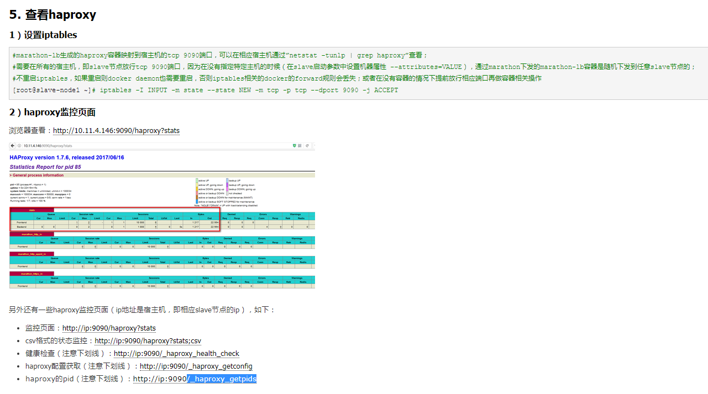
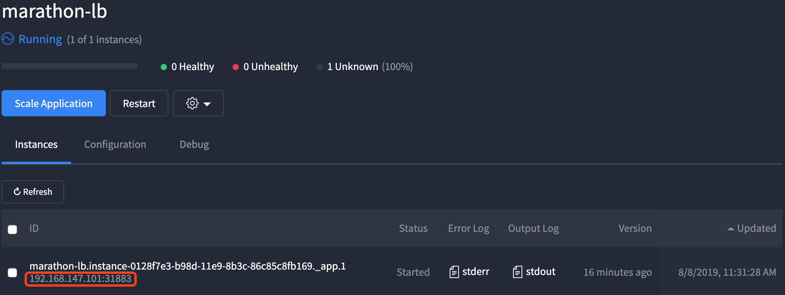
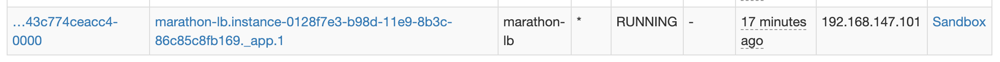
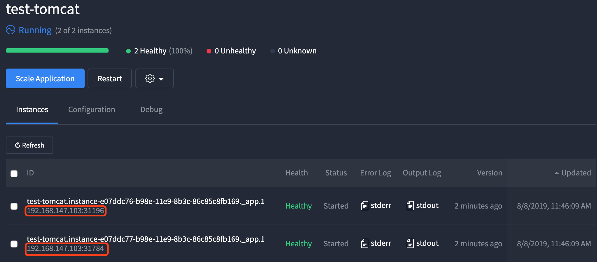

参考文档：https://www.cnblogs.com/kevingrace/p/6845980.html





## 1, 部署marathon-lb

### 1.1,  准备marathon-lb镜像

```shell
#在3个slave节点提前准备镜像，以节省容器部署时间
docker pull mesosphere/marathon-lb
docker images
```

### 1.2, 拓扑编写marathon-lb的json文件

```shell
#在任意marathon master节点上编写关于marathon-lb的json文件
vim marathon-lb.json
```

```json
//”network”采用HOST模式，与宿主机共享namespace;
//”args”参数将3个marathon master节点的192.168.147.101:8080都带上，即marahon的api接口地址，因为不确定marathon下发marathon-lb容器时，会下发到哪一台宿主机；
//”group”参数为”external”，可以定义多个不同的”group”（即不同的marathon-lb），针对不同的应用可以绑定到不同的”group”；
//请注意json文件的格式，如标点符号等，marathon web下的”JSON Mode”框有检查语法正确与否的功能。
{
  "id": "/marathon-lb",
  "cmd": null,
  "cpus": 1,
  "mem": 128,
  "disk": 0,
  "instances": 1,
  "constraints": [
    [
      "hostname",
      "UNIQUE"
    ]
  ],
  "acceptedResourceRoles": [],
  "container": {
    "type": "DOCKER",
    "docker": {
      "forcePullImage": false,
      "image": "docker.io/mesosphere/marathon-lb",
      "parameters": [],
      "privileged": true
    },
    "volumes": []
  },
  "portDefinitions": [
    {
      "port": 10001,   //lb服务端口,也就是external组中服务的端口
      "name": "default",
      "protocol": "tcp"
    }
  ],
  "args": [
    "sse",
    "-m",
    "http://192.168.147.101:8080",   //maarthon的服务地址
    "--group",
    "external"    //group名称  container中指定名称要和该名称一致
  ]
}
```

### 1.3, 下发marathon-lb容器

#### 1）方式1：通过curl调用json配置

```shell
#调用保存有json文件的maste节点8080端口下的json文件，即调用marathon的api
curl -X POST http://192.168.147.101:8080/v2/apps -d@/root/marathon-lb.json -H "Content-type:application/json"
```

#### 2）方式2：通过marathon web下发json配置

* 在marathon的ui页面中直接配置json即可


## 2, 查看marathon-lb

### 2.1, 看marathon中实例运行情况

* 可以看到该实例运行在192.168.147.101上，后面在marathon-lb组内服务就可以通过这个地址和服务端口进行访问服务



### 2.2, 看mesos中的Active Tasks情况



## 3, 查看haproxy

### 3.1, haproxy监控页面

* marathon-lb在哪个服务器上，下面的地址就是哪个服务器地址哈

* http://192.168.147.101:9090/haproxy?stats


### 3.2, 其他的监控页面

另外还有一些haproxy监控页面（ip地址是宿主机，即相应slave节点的ip），如下：

- 监控页面：http://192.168.147.101:9090/haproxy?stats
- csv格式的状态监控：http://192.168.147.101:9090/haproxy?stats;csv
- 健康检查（注意下划线）：http://192.168.147.101:9090/_haproxy_health_check
- haproxy配置获取（注意下划线）：http://192.168.147.101:9090/_haproxy_getconfig
- haproxy的pid（注意下划线）：http://192.168.147.101:9090/_haproxy_getpids


## 4, marathon-lb对tomcat负载均衡

### 4.1, tomcat应用的配置marathon配置json

```json
{
  "id": "/test-tomcat",
  "cmd": null,
  "cpus": 0.5,
  "mem": 128,
  "disk": 0,
  "instances": 2,
  "acceptedResourceRoles": [
    "*"
  ],
  "container": {
    "type": "DOCKER",
    "docker": {
      "forcePullImage": false,
      "image": "tomcat:latest",
      "parameters": [],
      "privileged": false
    },
    "volumes": [
      {
        "containerPath": "/usr/local/tomcat/logs",
        "hostPath": "/opt/test-tomcat",
        "mode": "RW"
      }
    ],
    "portMappings": [
      {
        "containerPort": 8080,
        "hostPort": 0,
        "labels": {},
        "protocol": "tcp",
        "servicePort": 10001
      }
    ]
  },
  "healthChecks": [
    {
      "gracePeriodSeconds": 300,
      "ignoreHttp1xx": false,
      "intervalSeconds": 10,
      "maxConsecutiveFailures": 3,
      "path": "/",
      "portIndex": 0,
      "protocol": "HTTP",
      "ipProtocol": "IPv4",
      "timeoutSeconds": 20,
      "delaySeconds": 15
    }
  ],
  "labels": {
    "HAPROXY_GROUP": "external",
    "HAPROXY_0_VHOST": "tomcat.marathon.mesos",
    "HAPROXY_DEPLOYMENT_ALT_PORT": "10002"
  },
  "networks": [
    {
      "mode": "container/bridge"
    }
  ],
  "portDefinitions": []
}
```


### 4.2, 开启应用



### 4.3, 测试访问

使用负载均衡访问示例：marathon-lb 所在IP + "servicePort": 10001

由上面启动的marathon-lb可知：marathon-lb的部署在192.168.147.101上，服务端口是10001

那么访问可以分为两种方式：

#### 4.3.1, 负载均衡访问

http://192.168.147.101:10001/

#### 4.3.2, 单独访问

* 这个就是test-tomcat应用两个tomcat的部署地址

http://192.168.147.103:31784/

http://192.168.147.103:31196/

