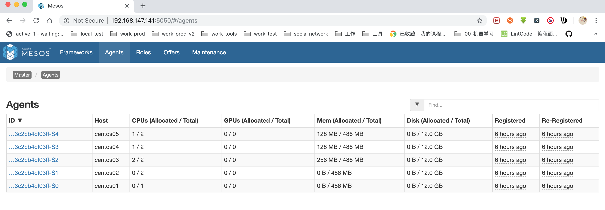

##### 1， zk

* 首先是启动zookeeper
* 启动命令如下

* > zkServer.sh start

* 启动后查看状态

* > zkServer.sh status

##### 2, mesos-master

* 其次启动mesos-master，如果有多个节点，需要分别依次启动

* 启动命令如下：

* > systemctl start mesos-master

* 查看状态命令如下：

* > systemctl status mesos-master

* 启动后查看页面确认是否启动ok, 端口是5050，如果有多个节点，最好每个都查看一下

* > http://192.168.147.141:5050

* 注意：如果启动有问题，可以尝试关闭后(最好不要随意删除)，删除zk中mesos节点，后面的marathon最好不要删除对应的节点，删除后就没有对应的微服务了

##### 3，mesos-slave

* 第三步启动slave节点，如果有多个，分别依次启动
* 启动命令如下：

* > systemctl start mesos-slave

* 查看状态 ：

* > systemctl status mesos-slave

* 启动后查看页面确认是否启动ok, 端口是5050,其实就是master的界面中的agents，如果有多个节点，最好每个都查看一下

* > http://192.168.147.141:5050/#/agents

* 

##### 4, marathon

* 第四步启动marathon 

* 启动命令如下：如果有多台，其余的会成为备用节点

* > systemctl start marathon

* 查看状态：

* > systemctl status marathon

* 页面确认

* > http://centos01:8080/ui/#/apps

* 如果确实也启动不起来，也可以尝试删除zk对应主题，但是注意删除后之前的微服务也会丢失

##### 5,marathon-lb

* 在marathon页面中启动marathon-lb的微服务，以开启服务发现和负载均衡的服务

  