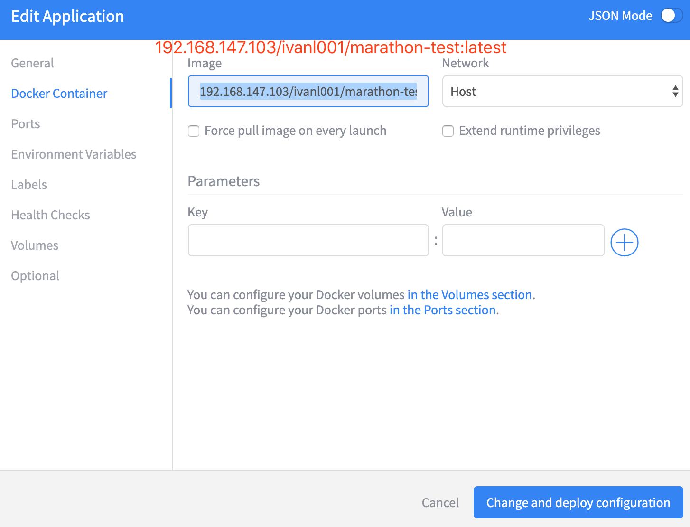

# 1, docker制作镜像

### 1.1, 首先写代码

* 打包成：04-marathon-test-1.0-SNAPSHOT-jar-with-dependencies.jar

### 1.2, 通过jar包制作镜像

* 参考“01-Docker03 运行jar包.md”
* Dockerfile内容如下：

```shell
FROM java:8
VOLUME /tmp
ADD 04-marathon-test-1.0-SNAPSHOT-jar-with-dependencies.jar 04-marathon-test-1.0-SNAPSHOT-jar-with-dependencies.jar
ENTRYPOINT ["java","-Djava.security.egd=file:/dev/./urandom","-jar","04-marathon-test-1.0-SNAPSHOT-jar-with-dependencies.jar"]
ENV TZ=Asia/Shanghai
RUN ln -snf /usr/share/zoneinfo/$TZ /etc/localtime && echo $TZ > /etc/timezone
EXPOSE 5555
```

* 通过命令如下命令制作成镜像

```shell
docker build -t marathon/test . 
```

### 1.3, 测试本地镜像是否ok

```shell
docker run -d -p 5555:5555 -name marathon/test marathon/test
```

### 1.4, 上传本地镜像到Harbor仓库

```shell
docker tag marathon/test 192.168.147.103/ivanl001/marathon-test
docker push 192.168.147.103/ivanl001/marathon-test
```


## 2, marathon中制作app

### 2.1, 之需要把镜像地址填上，写上id即可



### 2.2, 其他参数根据具体而定

* 我这里只设定了镜像地址和id，其他均默认，实例设置为3，cpu：2

```json
{
  "id": "/marathon-test",
  "cmd": null,
  "cpus": 2,
  "mem": 128,
  "disk": 0,
  "instances": 0,
  "acceptedResourceRoles": [
    "*"
  ],
  "container": {
    "type": "DOCKER",
    "docker": {
      "forcePullImage": false,
      "image": "192.168.147.103/ivanl001/marathon-test:latest",
      "parameters": [],
      "privileged": false
    },
    "volumes": []
  },
  "portDefinitions": [
    {
      "port": 10000,
      "name": "default",
      "protocol": "tcp"
    }
  ],
  "maxLaunchDelaySeconds": 300,
  "networks": [
    {
      "mode": "host"
    }
  ]
}
```

