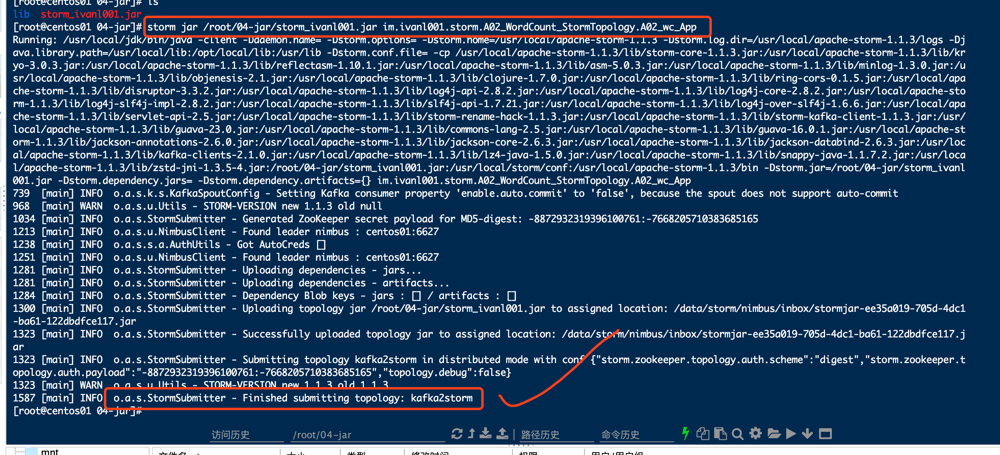

#### 1, 代码集成

##### 1.1, maven依赖

* 注意：如果是本机idea跑的时候，注意把<scope>provided</scope>给注释掉，不然会抛各种ClassNotFoundException的异常
* storm-core是storm的核心包。
*  storm-kafka-client是storm集成kafka的包，后面代码中的KafkaSpout是在这个包中。
* kafka-clients是kafka的包, storm-kafka-client中其实也有，不过这里重新加一下是为了使用特定版本

```xml
<?xml version="1.0" encoding="UTF-8"?>
<project xmlns="http://maven.apache.org/POM/4.0.0"
         xmlns:xsi="http://www.w3.org/2001/XMLSchema-instance"
         xsi:schemaLocation="http://maven.apache.org/POM/4.0.0 http://maven.apache.org/xsd/maven-4.0.0.xsd">
    <modelVersion>4.0.0</modelVersion>

    <groupId>im.ivanl001</groupId>
    <artifactId>0101-Storm</artifactId>
    <version>1.0-SNAPSHOT</version>

    <dependencies>

        <!--这里是provided，因为服务器上这些内容都有，不需要打入到jar包中去-->
        <dependency>
            <groupId>org.apache.storm</groupId>
            <artifactId>storm-core</artifactId>
            <version>1.1.3</version>
        </dependency>

        <dependency>
            <groupId>org.apache.storm</groupId>
            <artifactId>storm-kafka-client</artifactId>
            <version>1.1.3</version>
        </dependency>
        
        <!--如果不加下面这个依赖，kafka的版本会是1.1.3的storm-kafka-client所依赖的版本-->
        <!--加上本依赖，会使用该版本的kafka-->
        <dependency>
            <groupId>org.apache.kafka</groupId>
            <artifactId>kafka-clients</artifactId>
            <version>2.1.0</version>
        </dependency>

    </dependencies>

    <build>

        <finalName>storm_ivanl001</finalName>
        <!--这个会把打好的包放在下面这个文件夹-->
        <directory>/Users/ivanl001/Desktop/bigData/jar/storm/</directory>

        <plugins>
            <plugin>
                <groupId>org.apache.maven.plugins</groupId>
                <artifactId>maven-compiler-plugin</artifactId>
                <configuration>
                    <source>1.7</source>
                    <target>1.7</target>
                </configuration>
            </plugin>
        </plugins>
    </build>

</project>
```

##### 1.2, app代码

* 注意：我这里用AT_MOST_ONCE，接受到消息就自动偏移
* 如果用AT_LEAST_ONCE，需要用collector.ack(input);进行消息确认，要不然没确认，每隔一段时间就会重新消费一次哈！大概10s钟？不确定～～

```java
package im.ivanl001.storm.A02_WordCount_StormTopology;

import org.apache.storm.Config;
import org.apache.storm.LocalCluster;
import org.apache.storm.StormSubmitter;
import org.apache.storm.generated.AlreadyAliveException;
import org.apache.storm.generated.AuthorizationException;
import org.apache.storm.generated.InvalidTopologyException;
import org.apache.storm.generated.StormTopology;
import org.apache.storm.kafka.spout.KafkaSpout;
import org.apache.storm.kafka.spout.KafkaSpoutConfig;
import org.apache.storm.topology.TopologyBuilder;
import org.apache.storm.tuple.Fields;

/**
 * #author      : ivanl001
 * #creator     : 2019-05-10 20:36
 * #description :
 **/
public class A02_wc_App {

    public static void main(String[] args) throws InterruptedException, InvalidTopologyException, AuthorizationException, AlreadyAliveException {

        /*
        AT_LEAST_ONCE
        An offset is ready to commit only after the corresponding tuple has been processed and acked (at least once).
        AT_MOST_ONCE
        Every offset will be synchronously committed to Kafka right after being polled but before being emitted to the downstream components of the topology.
        NO_GUARANTEE
        The polled offsets are ready to commit immediately after being polled.
         */
        TopologyBuilder topologyBuilder = new TopologyBuilder();
        topologyBuilder.setSpout("kafka_spout", new KafkaSpout<>(KafkaSpoutConfig.builder("centos01:9092", "kafka2storm").setProcessingGuarantee(KafkaSpoutConfig.ProcessingGuarantee.AT_MOST_ONCE).build()), 1);
        topologyBuilder.setBolt("wc_split_bolt", new A02_split_Bolt()).shuffleGrouping("kafka_spout");

        Config config = new Config();
        config.setDebug(false);

        /*LocalCluster cluster = new LocalCluster();
        cluster.submitTopology("LogAnalyserStorm", config, topologyBuilder.createTopology());*/

        //分布式部署
        StormSubmitter.submitTopology("CallLogAnalyserStorm", config, topologyBuilder.createTopology());
    }
}
```

##### 1.3, A02_split_Bolt

* 我这里只是为了演示一下整个流程，所以就只简单的写了一个切分的bolt，且没有做什么操作

```java
package im.ivanl001.storm.A02_WordCount_StormTopology;

import org.apache.storm.task.OutputCollector;
import org.apache.storm.task.TopologyContext;
import org.apache.storm.topology.IRichBolt;
import org.apache.storm.topology.OutputFieldsDeclarer;
import org.apache.storm.tuple.Tuple;

import java.util.Map;

/**
 * #author      : ivanl001
 * #creator     : 2019-05-10 20:37
 * #description :
 **/
public class A02_split_Bolt implements IRichBolt {

    private TopologyContext context;
    private OutputCollector collector;

    public void prepare(Map stormConf, TopologyContext context, OutputCollector collector) {
        this.context = context;
        this.collector = collector;
    }

    public void execute(Tuple input) {
        String topic = input.getString(0);
        Object partition = input.getValue(1);
        Object offset = input.getValue(2);
        String key = input.getString(3);
        String value = input.getString(4);

//        String line01 = input.getString(1);
        System.out.println("接受到消息："+ "topic:" + topic + ", partition: " + partition + ", offset:" + offset + ", key:" + key + ", value: " + value );

    }

    public void cleanup() {

    }

    public void declareOutputFields(OutputFieldsDeclarer declarer) {

    }

    public Map<String, Object> getComponentConfiguration() {
        return null;
    }
}
```


#### 2, 项目部署

##### 2.1, 依赖处理

- 我本来想把依赖都打到jar包中，但是好像不行
- 所以后来直接下载工件的所有依赖软件包，放进storm/lib/文件夹中即可，具体如下:

```java
//在放有pom.xml的文件夹下建立一个lib文件夹
//在pom.xml文件位置执行如下命令，会自动把所有依赖jar包下载到刚才的lib文件夹中去，注意修改其中的groupid什么的跟pom.xml中的一致哈
//把下载好的jar文件放入到服务器上的storm的lib文件夹中即可

mvn -DoutputDirectory=./lib -DgroupId=im.ivanl001 -DartifactId=0101-Storm -Dversion=1.0-SNAPSHOT dependency:copy-dependencies
```


##### 2.2, maven的package命令打包即可

* 得到包：storm_ivanl001，拷贝到服务器指定位置，执行如下命令：

> storm jar /root/04-jar/storm_ivanl001.jar im.ivanl001.storm.A02_WordCount_StormTopology.A02_wc_App


2.3, 如下，代表成功

