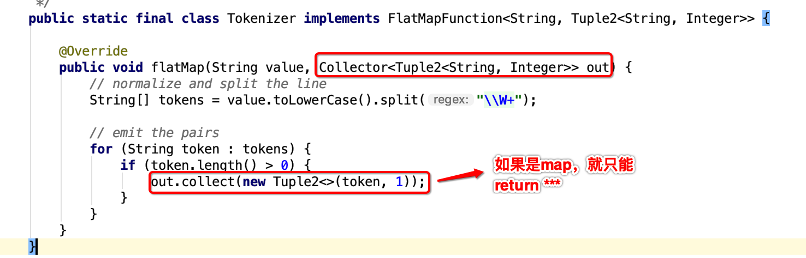
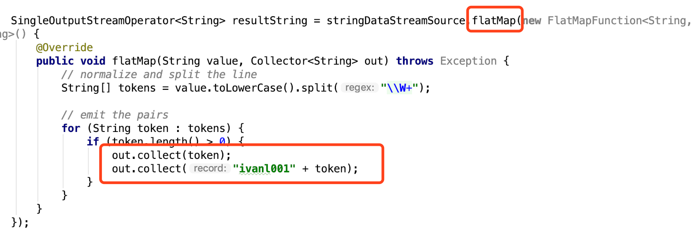
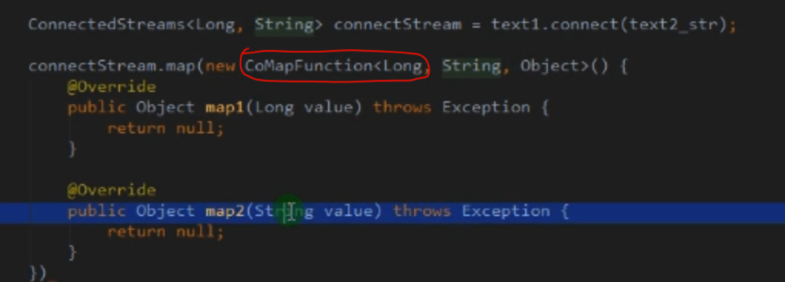
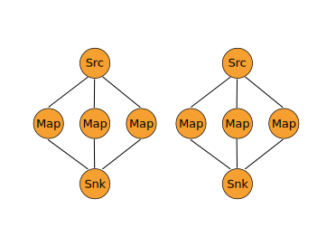

## DataStream的transformations算子

## 1, map相关

### 01, map

* 输入一个元素，返回一个元素， 中间可以做一些清洗转换操作
* 意思是一个map函数里面只能返回一次，而不能像flatmap那样，可以在内部通过colllect发送多次或者n次
* 直接return返回值，所以map里面只能返回一个值
* 

### 02, flatmap

* 输入一个元素，可以返回0个，1个或者多个元素
* 通过Collector返回值，所以可以返回任意多次
* 
* 

### 03, CoMapFunction, CoFlatMapFunction

* 这两个其实都是函数，使用在map和flatMap中的函数

- Similar to map and flatMap on a connected data stream
- 和map和flatmap的功能是一样的，只不过是使用在连接过的dataStream上的

* 结合connect一起理解


## 2, 分区相关

* 看下面“DataStream的物理分区算子”


## 3, key相关

* flink中keyby+reduce等于spark的reduceByKey

### 01, keyby

* 根据指定的key进行分组， 相同的key的数据会进入同一个分区

### 02, reduce

- 对数据进行聚合操作，结合当前元素和上一次reduce返回的值进行聚合操作，然后返回一个新的值


### 03, aggregations: sum(), min(), max()

> Rolling aggregations on a keyed data stream. The difference between min and minBy is that min returns the minimum value, whereas minBy returns the element that has the minimum value in this field (same for max and maxBy).

- min和minBy的区别在于， min返回最小值，就是一个数值，minBy返回的是有这个最小值的元素

```java
keyedStream.sum(0);
keyedStream.sum("key");
keyedStream.min(0);
keyedStream.min("key");
keyedStream.max(0);
keyedStream.max("key");
keyedStream.minBy(0);
keyedStream.minBy("key");
keyedStream.maxBy(0);
keyedStream.maxBy("key");
```


## 4, 类似数据库相关

### 01, Interval Join

KeyedStream,KeyedStream → DataStream

> Join two elements e1 and e2 of two keyed streams with a common key over a given time interval, so that e1.timestamp + lowerBound <= e2.timestamp <= e1.timestamp + upperBound

* 通过指定的键值连接在一个指定时间间隙内的两个keyed streams

```java
// this will join the two streams so that
// key1 == key2 && leftTs - 2 < rightTs < leftTs + 2
keyedStream.intervalJoin(otherKeyedStream)
    .between(Time.milliseconds(-2), Time.milliseconds(2)) // lower and upper bound
    .upperBoundExclusive(true) // optional
    .lowerBoundExclusive(true) // optional
    .process(new IntervalJoinFunction() {...});
```


### 02, union

- 和mysql中的union作用一样， 合并的流的类型必须是一致的

- Union of two or more data streams creating a new stream containing all the elements from all the streams. Note: If you union a data stream with itself you will get each element twice in the resulting stream.

  ```java
  dataStream.union(otherStream1, otherStream2, ...);
  ```

### 03, connect

* 和union类似，是连接两个流的，不同的是connect连接的两个数据流类型可以不一样，可以对连接后两个流应用不同的方法

* 在connect的数据流中使用
* CoMap, CoFlatMap这两个取代map和flatmap操作哈
* 


### 04, Project

DataStream → DataStream

Selects a subset of fields from the tuples

- 这个可以用来缩减字段或者重新排列字段顺序

```java
DataStream<Tuple3<Integer, Double, String>> in = // [...]
DataStream<Tuple2<String, Integer>> out = in.project(2,0);
```


## 5, window相关

### 01, Window

* KeyedStream → WindowedStream

Windows can be defined on already partitioned KeyedStreams. Windows group the data in each key according to some characteristic (e.g., the data that arrived within the last 5 seconds). See [windows](https://ci.apache.org/projects/flink/flink-docs-release-1.7/dev/stream/operators/windows.html) for a complete description of windows.

* 注意：在WindowedStream上做任何算子操作，都会回到DataStream上

```java
dataStream.keyBy(0).window(TumblingEventTimeWindows.of(Time.seconds(5))); // Last 5 seconds of data
```


### 02, WindowAll

* DataStream → AllWindowedStream

Windows can be defined on regular DataStreams. Windows group all the stream events according to some characteristic (e.g., the data that arrived within the last 5 seconds). See [windows](https://ci.apache.org/projects/flink/flink-docs-release-1.7/dev/stream/operators/windows.html) for a complete description of windows.

**WARNING:** This is in many cases a **non-parallel** transformation. All records will be gathered in one task for the windowAll operator.

* 注意：如果没有keyby操作，那么这样的话，是一个单任务窗口，并行度是1哦。所以这种窗口的操作会在一个task中完成

```java
dataStream.windowAll(TumblingEventTimeWindows.of(Time.seconds(5))); // Last 5 seconds of data
```


### 03, Window Apply

WindowedStream → DataStream
AllWindowedStream → DataStream

Applies a general function to the window as a whole. Below is a function that manually sums the elements of a window.

**Note:** If you are using a windowAll transformation, you need to use an AllWindowFunction instead.

```java
windowedStream.apply (new WindowFunction<Tuple2<String,Integer>, Integer, Tuple, Window>() {
    public void apply (Tuple tuple,
            Window window,
            Iterable<Tuple2<String, Integer>> values,
            Collector<Integer> out) throws Exception {
        int sum = 0;
        for (value t: values) {
            sum += t.f1;
        }
        out.collect (new Integer(sum));
    }
});

// applying an AllWindowFunction on non-keyed window stream
allWindowedStream.apply (new AllWindowFunction<Tuple2<String,Integer>, Integer, Window>() {
    public void apply (Window window,
            Iterable<Tuple2<String, Integer>> values,
            Collector<Integer> out) throws Exception {
        int sum = 0;
        for (value t: values) {
            sum += t.f1;
        }
        out.collect (new Integer(sum));
    }
});
```


### 04, Window Reduce

WindowedStream → DataStream

Applies a functional reduce function to the window and returns the reduced value.

* 对窗口执行reduce操作

```java
windowedStream.reduce (new ReduceFunction<Tuple2<String,Integer>>() {
    public Tuple2<String, Integer> reduce(Tuple2<String, Integer> value1, Tuple2<String, Integer> value2) throws Exception {
        return new Tuple2<String,Integer>(value1.f0, value1.f1 + value2.f1);
    }
});
```


### 05, Aggregations on windows

WindowedStream → DataStream

Aggregates the contents of a window. The difference between min and minBy is that min returns the minimum value, whereas minBy returns the element that has the minimum value in this field (same for max and maxBy).

* min和minBy的区别在于， min返回最小值，就是一个数值，minBy返回的是有这个最小值的元素

```java
windowedStream.sum(0);
windowedStream.sum("key");
windowedStream.min(0);
windowedStream.min("key");
windowedStream.max(0);
windowedStream.max("key");
windowedStream.minBy(0);
windowedStream.minBy("key");
windowedStream.maxBy(0);
windowedStream.maxBy("key");
```


### 06, Window Join

DataStream,DataStream → DataStream

Join two data streams on a given key and a common window.

* 两个数据流join在一起后，进行window处理
* 可以结合Interval Join一起理解

```java
dataStream.join(otherStream)
    .where(<key selector>).equalTo(<key selector>)
    .window(TumblingEventTimeWindows.of(Time.seconds(3)))
    .apply (new JoinFunction () {...});
```


### 07, Window CoGroup

DataStream,DataStream → DataStream

Cogroups two data streams on a given key and a common window.

```java
dataStream.coGroup(otherStream)
    .where(0).equalTo(1)
    .window(TumblingEventTimeWindows.of(Time.seconds(3)))
    .apply (new CoGroupFunction () {...});
```


## 6, 单独其他

### 01, filter

- 过滤函数，对输入的数据进行判断，符合条件的留下
- 通过返回的布尔值决定留与走


### 02, split和select

- 上面union和connect都是连接两个流，split是把一个流分成多个流
- 根据规则把一个数据流切分成多个流
- select和split配合使用，选择被切分后的流

```scala
//原来还可以这么用，厉害
val splitedStream = senv.addSource(new Custom_Source).split(new OutputSelector[Long] {
  override def select(out: Long): lang.Iterable[String] = {
    val list = new util.ArrayList[String]()
    if(out%2==1){
      list.add("even", "a","c")
    }else{
      list.add("odd", "b","d")
    }
    list
  }
})

splitedStream.select("even", "a").print()
```


### 03, Extract Timestamps

DataStream → DataStream

Extracts timestamps from records in order to work with windows that use event time semantics. See [Event Time](https://ci.apache.org/projects/flink/flink-docs-release-1.7/dev/event_time.html).

```java
stream.assignTimestamps (new TimeStampExtractor() {...});   
```


### 04, Iterate

DataStream → IterativeStream → DataStream

Creates a "feedback" loop in the flow, by redirecting the output of one operator to some previous operator. This is especially useful for defining algorithms that continuously update a model. The following code starts with a stream and applies the iteration body continuously. Elements that are greater than 0 are sent back to the feedback channel, and the rest of the elements are forwarded downstream. See [iterations](https://ci.apache.org/projects/flink/flink-docs-release-1.7/dev/stream/operators/index.html#iterations) for a complete description.

- 这个暂时还不是很懂

```java
IterativeStream<Long> iteration = initialStream.iterate();
DataStream<Long> iterationBody = iteration.map (/*do something*/);
DataStream<Long> feedback = iterationBody.filter(new FilterFunction<Long>(){
    @Override
    public boolean filter(Long value) throws Exception {
        return value > 0;
    }
});
iteration.closeWith(feedback);
DataStream<Long> output = iterationBody.filter(new FilterFunction<Long>(){
    @Override
    public boolean filter(Long value) throws Exception {
        return value <= 0;
    }
});
```


## DataStream的物理分区算子

### 1, Custom partitioning

DataStream → DataStream

Uses a user-defined Partitioner to select the target task for each element.

* 根据上面这行的解释，也就是说，一个分区就是一个task吗

```java
dataStream.partitionCustom(partitioner, "someKey");
dataStream.partitionCustom(partitioner, 0);
```

### 2, Random partitioning

DataStream → DataStream

Partitions elements randomly according to a uniform distribution.

```java
dataStream.shuffle();
```

### 3, Rebalancing (Round-robin partitioning)

Partitions elements round-robin, creating equal load per partition. Useful for performance optimization in the presence of data skew.

```java
dataStream.rebalance();
```

### 4, Rescaling

DataStream → DataStream

Partitions elements, round-robin, to a subset of downstream operations. This is useful if you want to have pipelines where you, for example, fan out from each parallel instance of a source to a subset of several mappers to distribute load but don't want the full rebalance that rebalance() would incur. This would require only local data transfers instead of transferring data over network, depending on other configuration values such as the number of slots of TaskManagers.

The subset of downstream operations to which the upstream operation sends elements depends on the degree of parallelism of both the upstream and downstream operation. For example, if the upstream operation has parallelism 2 and the downstream operation has parallelism 6, then one upstream operation would distribute elements to three downstream operations while the other upstream operation would distribute to the other three downstream operations. If, on the other hand, the downstream operation has parallelism 2 while the upstream operation has parallelism 6 then three upstream operations would distribute to one downstream operation while the other three upstream operations would distribute to the other downstream operation.

In cases where the different parallelisms are not multiples of each other one or several downstream operations will have a differing number of inputs from upstream operations.

Please see this figure for a visualization of the connection pattern in the above example:




```java
dataStream.rescale();
```

### 5, Broadcasting

DataStream → DataStream

Broadcasts elements to every partition.

```java
dataStream.broadcast();       
```


## DataStream的任务链和资源组算子

### 1, Start new chain

Begin a new chain, starting with this operator. The two mappers will be chained, and filter will not be chained to the first mapper.

```java
someStream.filter(...).map(...).startNewChain().map(...);
```

### 2, Disable chaining

Do not chain the map operator

```java
someStream.map(...).disableChaining();
```

### 3, Set slot sharing group

Set the slot sharing group of an operation. Flink will put operations with the same slot sharing group into the same slot while keeping operations that don't have the slot sharing group in other slots. This can be used to isolate slots. The slot sharing group is inherited from input operations if all input operations are in the same slot sharing group. The name of the default slot sharing group is "default", operations can explicitly be put into this group by calling slotSharingGroup("default").

```java
someStream.filter(...).slotSharingGroup("name");
```