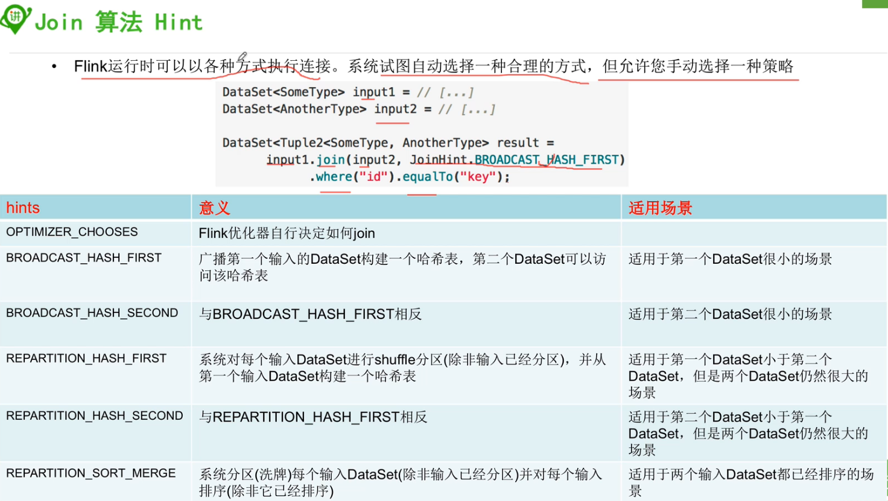
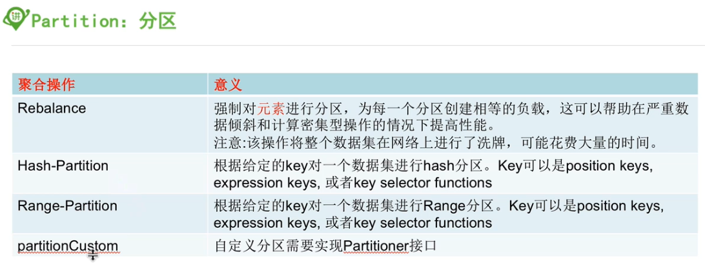

#### DataSet的算子

##### 1, map

##### 2, flatmap

##### 3, filter

- 过滤数据

##### 4, groupBy

* 等同于datastream中的keyby
* 

##### 5,  reduce

- 对数据进行聚合操作，结合当前元素和上一次reduce返回的值进行聚合操作，然后返回一个新的值

* reduce是增量聚合

##### 6, reduceGroup

* reduceGroup是遍历group内所有元素一次聚合，所以对于多并发线程是不适用的，combined？
* 


##### 7, combineGroup

* 不会用，后面有机会再看吧


##### 8, Aggregate

- Sum,
- Min, and
- Max.

* 注明：.aggregate(SUM, 0).and(MIN, 2)这个是求原始数据第一个字段的总和以及第三个字段的最小值，而.aggregate(SUM, 0).aggregate(MIN, 2)则是先求groupby后第一个字段的总和，然后再在结果的基础上求结果那些数据第二个字段的最小值，具体可以参考代码：im.ivanl002.batch.a02_flink_transformation.Flink_transformations06_aggregate

```java
DataSet<Tuple3<Integer, String, Double>> input = // [...]
DataSet<Tuple3<Integer, String, Double>> output = input
                                   .groupBy(1)        // group DataSet on second field
                                   .aggregate(SUM, 0) // compute sum of the first field
                                   .and(MIN, 2);      // compute minimum of the third field
```

To apply multiple aggregations on a DataSet it is necessary to use the `.and()` function after the first aggregate, that means `.aggregate(SUM, 0).and(MIN, 2)` produces the sum of field 0 and the minimum of field 2 of the original DataSet. In contrast to that `.aggregate(SUM, 0).aggregate(MIN, 2)` will apply an aggregation on an aggregation. In the given example it would produce the minimum of field 2 after calculating the sum of field 0 grouped by field 1.

**Note:** The set of aggregation functions will be extended in the future.


##### 9, sum, min, minBy, max, maxBy


##### 10, union

> Produces the union of two DataSets, which have to be of the same type. A union of more than two DataSets can be implemented with multiple union calls, as shown here:

```java
DataSet<Tuple2<String, Integer>> vals1 = // [...]
DataSet<Tuple2<String, Integer>> vals2 = // [...]
DataSet<Tuple2<String, Integer>> vals3 = // [...]
DataSet<Tuple2<String, Integer>> unioned = vals1.union(vals2).union(vals3);
```


##### 11, Project

```java
DataSet<Tuple3<Integer, Double, String>> in = // [...]
// converts Tuple3<Integer, Double, String> into Tuple2<String, Integer>
DataSet<Tuple2<String, Integer>> out = in.project(2,0);
```

###### Projection with Type Hint

Note that the Java compiler cannot infer the return type of `project` operator. This can cause a problem if you call another operator on a result of `project` operator such as:

❌：如果直接在project后的结果上加上其他算子是不行的

```
DataSet<Tuple5<String,String,String,String,String>> ds = ....
DataSet<Tuple1<String>> ds2 = ds.project(0).distinct(0);
```

This problem can be overcome by hinting the return type of `project` operator like this:

✅: 可以如下解决：

```
DataSet<Tuple1<String>> ds2 = ds.<Tuple1<String>>project(0).distinct(0);
```


##### 12, join

The Join transformation joins two DataSets into one DataSet. The elements of both DataSets are joined on one or more keys which can be specified using

- a key expression
- a key-selector function
- one or more field position keys (Tuple DataSet only).
- Case Class Fields

###### 12.0, 代码

* 注意：join之后，可以通过.with函数指定输出字段

```java
private static void join(ExecutionEnvironment benv) throws Exception {

        ArrayList<Tuple2<Integer, String>> list = new ArrayList<>();
        list.add(new Tuple2<>(1, "ivanl001"));
        list.add(new Tuple2<>(2, "ivanl002"));
        list.add(new Tuple2<>(3, "ivanl003"));

        ArrayList<Tuple2<Integer, String>> list01 = new ArrayList<>();
        list01.add(new Tuple2<>(1, "level01"));
        list01.add(new Tuple2<>(2, "level02"));
        list01.add(new Tuple2<>(3, "level03"));

        benv.fromCollection(list)
          .join(benv.fromCollection(list01))
          .where(0)
          .equalTo(0)
          .with(new JoinFunction<Tuple2<Integer,String>, Tuple2<Integer,String>, Tuple3<Integer, String, String>>() {
            @Override
            public Tuple3<Integer, String, String> join(Tuple2<Integer, String> first, Tuple2<Integer, String> second) throws Exception {
                return new Tuple3<>(first.f0, first.f1, second.f1);
            }
        }).print();
        
    }
```

###### Join with Projection (Java/Python Only)

A Join transformation can construct result tuples using a projection as shown here:

- [**Java**](https://ci.apache.org/projects/flink/flink-docs-release-1.7/dev/batch/dataset_transformations.html#tab_java_27)
- [**Scala**](https://ci.apache.org/projects/flink/flink-docs-release-1.7/dev/batch/dataset_transformations.html#tab_scala_27)
- [**Python**](https://ci.apache.org/projects/flink/flink-docs-release-1.7/dev/batch/dataset_transformations.html#tab_python_27)

```
DataSet<Tuple3<Integer, Byte, String>> input1 = // [...]
DataSet<Tuple2<Integer, Double>> input2 = // [...]
DataSet<Tuple4<Integer, String, Double, Byte>>
            result =
            input1.join(input2)
                  // key definition on first DataSet using a field position key
                  .where(0)
                  // key definition of second DataSet using a field position key
                  .equalTo(0)
                  // select and reorder fields of matching tuples
                  .projectFirst(0,2).projectSecond(1).projectFirst(1);
```

`projectFirst(int...)` and `projectSecond(int...)` select the fields of the first and second joined input that should be assembled into an output Tuple. The order of indexes defines the order of fields in the output tuple. The join projection works also for non-Tuple DataSets. In this case, `projectFirst()` or `projectSecond()` must be called without arguments to add a joined element to the output Tuple.

###### 12.1, join with DataSet Size Hin

```java
DataSet<Tuple2<Integer, String>> input1 = // [...]
DataSet<Tuple2<Integer, String>> input2 = // [...]

DataSet<Tuple2<Tuple2<Integer, String>, Tuple2<Integer, String>>>
            result1 =
            // hint that the second DataSet is very small
            input1.joinWithTiny(input2)
                  .where(0)
                  .equalTo(0);

DataSet<Tuple2<Tuple2<Integer, String>, Tuple2<Integer, String>>>
            result2 =
            // hint that the second DataSet is very large
            input1.joinWithHuge(input2)
                  .where(0)
                  .equalTo(0);
```

###### 12.2, join Algorithm Hints



```java
DataSet<SomeType> input1 = // [...]
DataSet<AnotherType> input2 = // [...]

DataSet<Tuple2<SomeType, AnotherType> result =
      input1.join(input2, JoinHint.BROADCAST_HASH_FIRST)
            .where("id").equalTo("key");
```

The following hints are available:

- `OPTIMIZER_CHOOSES`: Equivalent to not giving a hint at all, leaves the choice to the system.
- `BROADCAST_HASH_FIRST`: Broadcasts the first input and builds a hash table from it, which is probed by the second input. A good strategy if the first input is very small.
- `BROADCAST_HASH_SECOND`: Broadcasts the second input and builds a hash table from it, which is probed by the first input. A good strategy if the second input is very small.
- `REPARTITION_HASH_FIRST`: The system partitions (shuffles) each input (unless the input is already partitioned) and builds a hash table from the first input. This strategy is good if the first input is smaller than the second, but both inputs are still large. *Note:*This is the default fallback strategy that the system uses if no size estimates can be made and no pre-existing partitions and sort-orders can be re-used.
- `REPARTITION_HASH_SECOND`: The system partitions (shuffles) each input (unless the input is already partitioned) and builds a hash table from the second input. This strategy is good if the second input is smaller than the first, but both inputs are still large.
- `REPARTITION_SORT_MERGE`: The system partitions (shuffles) each input (unless the input is already partitioned) and sorts each input (unless it is already sorted). The inputs are joined by a streamed merge of the sorted inputs. This strategy is good if one or both of the inputs are already sorted.

##### 13, Outjoin

参考官网教程：

https://ci.apache.org/projects/flink/flink-docs-release-1.7/dev/batch/dataset_transformations.html#outerjoin 


##### 14, cross

* 笛卡尔积

https://ci.apache.org/projects/flink/flink-docs-release-1.7/dev/batch/dataset_transformations.html#cross


##### 15, distinct

- 是整体去重哈，不是单个分区去重，可指定去重的字段位置哈
- 返回一个数据集中去重后的元素
- 参看下面19, mapPartition的java代码
- 不支持分组哈


##### 16, first-n

* 取集合中的前n个元素
* 如果前面有groupby，就是取出每组中的前n个元素

```java
ExecutionEnvironment benv = ExecutionEnvironment.getExecutionEnvironment();

ArrayList<Tuple3<Integer, Integer, String>> list = new ArrayList<>();
list.add(new Tuple3<>(1, 1, "ivanl001 is the king of world!"));
list.add(new Tuple3<>(1, 2, "ivanl002 is the king of world!"));
list.add(new Tuple3<>(3, 1, "ivanl003 is the king of world!"));
list.add(new Tuple3<>(3, 2, "ivanl004 is the king of world!"));
list.add(new Tuple3<>(5, 1, "ivanl005 is the king of world!"));


DataSource<Tuple3<Integer, Integer, String>> data = benv.fromCollection(list);
//这个是直接取出前3个，也就是1，1，3
data.first(3).print();

System.out.println("=====================");

//这个是先进行分组，分成3组，分别是1， 3，5三个组，然后取出组中的第一个，也就是ivanl001, ivanl003, ivanl005
data.groupBy(0).first(1).print();

System.out.println("=====================");

//这个是先进行分组，分成3组，分别是1， 3，5三个组，然后根据第二个数字倒序排列，三组中id大的那个，分别是：ivanl002, ivanl004, ivanl005
//先分组，后排序，获取id大的那个
data.groupBy(0).sortGroup(1, Order.DESCENDING).first(0).print();
```

##### 17, sortGroup

* 组内排序，先分组，后排序

* ```java
  ExecutionEnvironment benv = ExecutionEnvironment.getExecutionEnvironment();
  
  ArrayList<Tuple3<Integer, Integer, String>> list = new ArrayList<>();
  list.add(new Tuple3<>(1, 1, "ivanl001 is the king of world!"));
  list.add(new Tuple3<>(1, 2, "ivanl002 is the king of world!"));
  list.add(new Tuple3<>(3, 1, "ivanl003 is the king of world!"));
  list.add(new Tuple3<>(3, 2, "ivanl004 is the king of world!"));
  list.add(new Tuple3<>(5, 1, "ivanl005 is the king of world!"));
  
  
  DataSource<Tuple3<Integer, Integer, String>> data = benv.fromCollection(list);
  //这个是直接取出前3个，也就是1，1，3
  data.first(3).print();
  
  System.out.println("=====================");
  
  //这个是先进行分组，分成3组，分别是1， 3，5三个组，然后取出组中的第一个，也就是ivanl001, ivanl003, ivanl005
  data.groupBy(0).first(1).print();
  
  System.out.println("=====================");
  
  //这个是先进行分组，分成3组，分别是1， 3，5三个组，然后根据第二个数字倒序排列，三组中id大的那个，分别是：ivanl002, ivanl004, ivanl005
  //先分组，后排序，获取id大的那个
  data.groupBy(0).sortGroup(1, Order.DESCENDING).first(0).print();
  ```


##### 18, sortpartition

- ❌对所有分区进行排序，也就是全局排序
- ✅是分区内排序，多并发的情况下， 单个分区内有序，全局还是无序的

```java
ExecutionEnvironment benv = ExecutionEnvironment.getExecutionEnvironment();

ArrayList<Tuple3<Integer, Integer, String>> list = new ArrayList<>();
list.add(new Tuple3<>(1, 1, "ivanl001 is the king of world!"));
list.add(new Tuple3<>(1, 2, "ivanl002 is the king of world!"));
list.add(new Tuple3<>(3, 1, "ivanl003 is the king of world!"));
list.add(new Tuple3<>(3, 2, "ivanl004 is the king of world!"));
list.add(new Tuple3<>(5, 1, "ivanl005 is the king of world!"));
list.add(new Tuple3<>(6, 2, "ivanl005 is the king of world!"));
list.add(new Tuple3<>(7, 3, "ivanl005 is the king of world!"));
list.add(new Tuple3<>(8, 4, "ivanl005 is the king of world!"));
list.add(new Tuple3<>(9, 5, "ivanl005 is the king of world!"));

DataSource<Tuple3<Integer, Integer, String>> data = benv.fromCollection(list);

data.sortPartition(0, Order.DESCENDING).sortPartition(1, Order.DESCENDING).print();

/*
(9,5,ivanl005 is the king of world!)
(8,4,ivanl005 is the king of world!)
(7,3,ivanl005 is the king of world!)
(6,2,ivanl005 is the king of world!)
(5,1,ivanl005 is the king of world!)
(3,2,ivanl004 is the king of world!)
(3,1,ivanl003 is the king of world!)
(1,2,ivanl002 is the king of world!)
(1,1,ivanl001 is the king of world!)
*/
```


##### 19, mapPartition

- 类似map，一次处理一个分区的数据
- 这个和spark的mappartition是一个意思哈
- 如果在进行map处理的时候需要动态获取第三方资源连接中的内容，建议使用mappartition
- scala

```scala
def main(args: Array[String]): Unit = {

  val benv = ExecutionEnvironment.getExecutionEnvironment

  val list = ListBuffer[String]()
  list.append("ivanl001 is the king of world!")
  list.append("ivanl002 is the king of world!")

  benv.fromCollection(list).mapPartition(ite => {
    val res = ListBuffer[String]()
    print("开启数据库")
    while (ite.hasNext){
      val words = ite.next().split("\\s")
      for (word <- words){
          println("处理数据：" + word)        
        	res.append(word)
      }
    }
    print("关闭数据库")
    res
  }).print( )

  //benv.execute("mappartition")
}
```


- java

```java
ExecutionEnvironment benv = ExecutionEnvironment.getExecutionEnvironment();

ArrayList<String> list = new ArrayList<>();
list.add("ivanl001 is the king of world!");
list.add("ivanl002 is the king of world!");
list.add("ivanl003 is the king of world!");
list.add("ivanl004 is the king of world!");
list.add("ivanl005 is the king of world!");

benv.fromCollection(list).mapPartition(new MapPartitionFunction<String, String>() {
  @Override
  public void mapPartition(Iterable<String> values, Collector<String> out) throws Exception {

    System.out.println("ivanl----");
    System.out.println("在这里开启数据库等连接");

    for (String value : values) {
      System.out.println("hhhhh:" + value);
      for (String word: value.split("\\s")){
        out.collect(word);
      }
    }
    System.out.println("在这里关闭数据库等连接");
  }
}).distinct().print();
```


##### 20, CoGroup


#### DataSet的物理分区算子



##### Rebalance

Evenly rebalances the parallel partitions of a DataSet to eliminate data skew.

- [**Java**](https://ci.apache.org/projects/flink/flink-docs-release-1.7/dev/batch/dataset_transformations.html#tab_java_37)
- [**Scala**](https://ci.apache.org/projects/flink/flink-docs-release-1.7/dev/batch/dataset_transformations.html#tab_scala_37)
- [**Python**](https://ci.apache.org/projects/flink/flink-docs-release-1.7/dev/batch/dataset_transformations.html#tab_python_37)

```
DataSet<String> in = // [...]
// rebalance DataSet and apply a Map transformation.
DataSet<Tuple2<String, String>> out = in.rebalance()
                                        .map(new Mapper());
```

##### Hash-Partition

Hash-partitions a DataSet on a given key. Keys can be specified as position keys, expression keys, and key selector functions (see [Reduce examples](https://ci.apache.org/projects/flink/flink-docs-release-1.7/dev/batch/dataset_transformations.html#reduce-on-grouped-dataset) for how to specify keys).

- [**Java**](https://ci.apache.org/projects/flink/flink-docs-release-1.7/dev/batch/dataset_transformations.html#tab_java_38)
- [**Scala**](https://ci.apache.org/projects/flink/flink-docs-release-1.7/dev/batch/dataset_transformations.html#tab_scala_38)
- [**Python**](https://ci.apache.org/projects/flink/flink-docs-release-1.7/dev/batch/dataset_transformations.html#tab_python_38)

```
DataSet<Tuple2<String, Integer>> in = // [...]
// hash-partition DataSet by String value and apply a MapPartition transformation.
DataSet<Tuple2<String, String>> out = in.partitionByHash(0)
                                        .mapPartition(new PartitionMapper());
```

##### Range-Partition

Range-partitions a DataSet on a given key. Keys can be specified as position keys, expression keys, and key selector functions (see [Reduce examples](https://ci.apache.org/projects/flink/flink-docs-release-1.7/dev/batch/dataset_transformations.html#reduce-on-grouped-dataset) for how to specify keys).

- [**Java**](https://ci.apache.org/projects/flink/flink-docs-release-1.7/dev/batch/dataset_transformations.html#tab_java_39)
- [**Scala**](https://ci.apache.org/projects/flink/flink-docs-release-1.7/dev/batch/dataset_transformations.html#tab_scala_39)
- [**Python**](https://ci.apache.org/projects/flink/flink-docs-release-1.7/dev/batch/dataset_transformations.html#tab_python_39)

```
DataSet<Tuple2<String, Integer>> in = // [...]
// range-partition DataSet by String value and apply a MapPartition transformation.
DataSet<Tuple2<String, String>> out = in.partitionByRange(0)
                                        .mapPartition(new PartitionMapper());
```