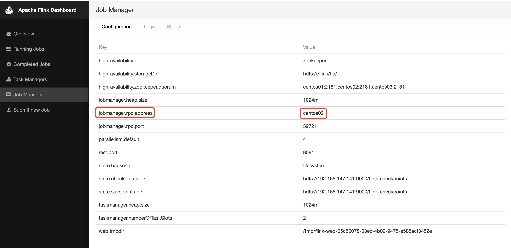
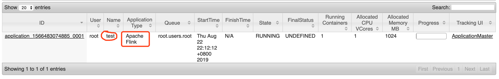
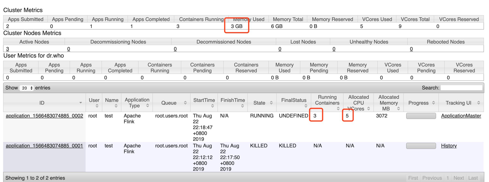
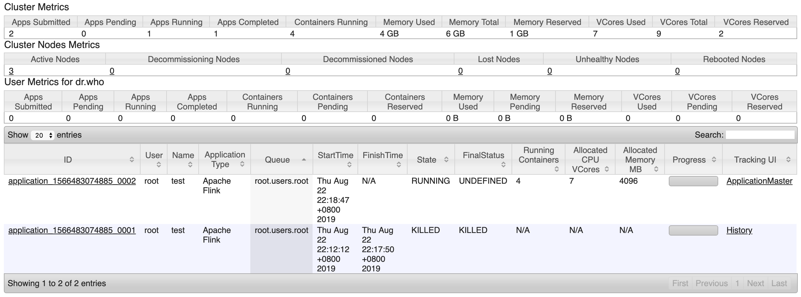
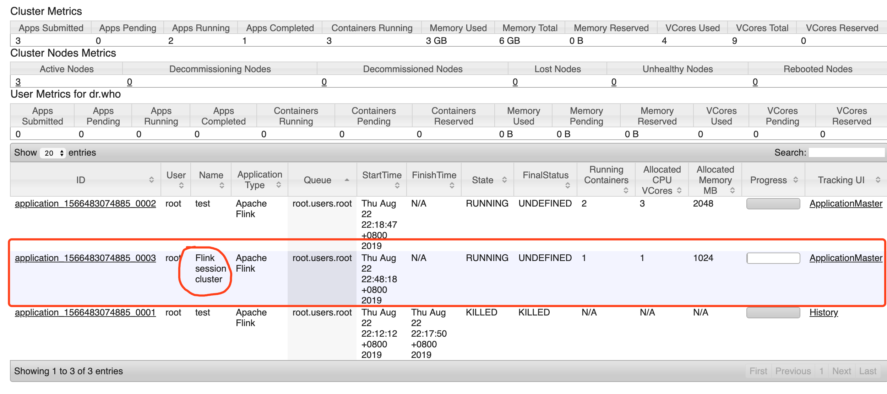

> 如下的搭建都是在如下的虚拟机机器配置上进行的
>
> 对于yarn模式的话，只有cluster模式，flink直接把client模式去掉了


##### 服务器分布：3台：

| hostname | mem             | disk          | core |      |
| -------- | --------------- | ------------- | ---- | ---- |
| centos01 | 8G              | 50G           | 4    |      |
| centos02 | 3G              | 40G           | 3    |      |
| centos03 | 3G              | 40G           | 3    |      |
|          | free -h查看内存 | df -h查看磁盘 |      |      |

## 1, local模式

### 1.1, 安装flink

* 解压之后即安装ok

* 即下载，解压，添加环境变量，更新环境变量
* 默认就是是本地模式

```shell
tar -zxvf /root/flink-1.7.2-bin-hadoop26-scala_2.11.tgz -C /usr/local/

ln -s /usr/local/flink-1.7.2/ /usr/local/flink

vim /etc/profile
export FLINK_HOME=/usr/local/flink
export PATH=$PATH:$FLINK_HOME/bin
```


### 1.2, 配置多目录设置

```shell
mv /usr/local/flink/conf /usr/local/flink/conf_local
ln -s /usr/local/flink/conf_local/ /usr/local/flink/conf
```


### 1.3, 启动flink

```shell
# 启动命令
/usr/local/flink/bin/start-cluster.sh

# 关闭命令
/usr/local/flink/bin/stop-cluster.sh 

# 开启成功后会多两个进程
120842 TaskManagerRunner
120397 StandaloneSessionClusterEntrypoint
```


### 1.4, 访问页面验证

* http://centos01:8081


### 1.5, 提交作业

```shell
/usr/local/flink/bin/flink run -c im.ivanl001.A02_stream.a01_flink_stream_demo.Z99_Flink_window_simple_scala_local  /root/flink_ivanl001_scala.jar --input --port 5555 &
```


## 2, Standalone模式

Standalone模式顾名思义，是在本地集群上调度执行，不依赖于外部调度机制例如YARN。此时需要对配置文件进行一些简单的修改，我们预计使用centos01节点当Job manage，centos01,centos02,centos03三台机器充当Task Managers。

### 2.1, 修改conf软链接

```shell
cp -r /usr/local/flink/conf_local /usr/local/flink/conf_standalone
rm -rf /usr/local/flink/conf
ln -s /usr/local/flink/conf_standalone/ /usr/local/flink/conf
```


### 2.1, 配置flink-conf.yaml文件

```shell
vim /usr/local/flink-1.7.2/conf/flink-conf.yaml
```

```yaml
# 这个就是jobmanager的主机名哦， 不要写成taskmanager的了
jobmanager.rpc.address: centos01
taskmanager.numberOfTaskSlots: 2
parallelism.default: 4

rest.port: 8081
```


### 2.2, 配置masters文件

```shell
vim /usr/local/flink-1.7.2/conf/masters
```

```shell
# 这个地方是有8081的，和web端口有关系，不可以去掉
centos01:8081
```


### 2.3, 配置slaves文件

```shell
vim /usr/local/flink-1.7.2/conf/slaves
```

```shell
centos01
centos02
centos03
```


### 2.4, 分发文件

* 这是我自己的脚本，没有的用scp分发就行

```shell
imrsync.sh /usr/local/flink-1.7.2/

# 注意分发完在其他机器上进行环境变量，软链接哦
```


### 2.5, 启动

```shell
# 启动集群命令
/usr/local/flink/bin/start-cluster.sh 

# 关闭集群命令
/usr/local/flink/bin/stop-cluster.sh 

# 启动过程
Starting cluster.
Starting standalonesession daemon on host centos01.
Starting taskexecutor daemon on host centos01.
Starting taskexecutor daemon on host centos02.
Starting taskexecutor daemon on host centos03.
# 启动结束后，会多出上面的几个进程
```


### 2.6, 页面验证

* http://centos01:8081


### 2.7, 提交作业

```shell
/usr/local/flink/bin/flink run -c im.ivanl001.A02_stream.a01_flink_stream_demo.Z99_Flink_window_simple_scala_standalone /root/flink_ivanl001_scala.jar --input --port 5555 &
```


## 3, Standalone模式的HA配置

* 以下操作都是在Standalone模式基础上进行的哈

### 3.1, 修改conf软链接

```shell
cp -r /usr/local/flink/conf_standalone /usr/local/flink/conf_standalone_ha

imcall.sh rm -rf /usr/local/flink/conf
imcall.sh ln -s /usr/local/flink/conf_standalone_ha/ /usr/local/flink/conf
```


### 3.1,  配置flink-conf.yaml文件

```shell
vim /usr/local/flink-1.7.2/conf/flink-conf.yaml
```

```yaml
# 这些是默认值
jobmanager.rpc.port: 6123
jobmanager.heap.size: 1024m

taskmanager.heap.size: 1024m

# 默认slots是1个，并发度是1个
taskmanager.numberOfTaskSlots: 2

parallelism.default: 4


high-availability: zookeeper
high-availability.storageDir: hdfs:///flink/ha/
high-availability.zookeeper.quorum: centos01:2181,centos02:2181,centos03:2181

state.backend: filesystem
# 注意：下面端口号是8020，而不是9000，否则会报错类似如下：Protocol message end-group tag did not match expected tag
state.checkpoints.dir: hdfs://192.168.147.101:8020/flink-checkpoints
state.savepoints.dir: hdfs://192.168.147.101:8020/flink-checkpoints

rest.port: 8081
```


### 3.2, 配置masters文件

```shell
vim /usr/local/flink/conf/masters
```

```shell
# 这里务必要带端口号，要不然端口号有可能被随机分配
centos01:8081
centos02:8081
```


### 3.3, 配置slave文件

```shell
vim /usr/local/flink-1.7.2/conf/slaves
```

```shell
centos01
centos02
centos03
```


### 3.4, 配置zoo.cfg文件

```shell
vim /usr/local/flink-1.7.2/conf/zoo.cfg
```

```cfg
server.1=centos01:2888:3888
server.2=centos02:2888:3888
server.3=centos03:2888:3888
```


### 3.5, 分发文件

```shell
imrsync.sh /usr/local/flink/conf/
```


### 3.6, 启动集群

```shell
# 启动集群命令
/usr/local/flink/bin/start-cluster.sh 

# 关闭集群命令
/usr/local/flink/bin/stop-cluster.sh 

# 启动过程
Starting HA cluster with 2 masters.
Starting standalonesession daemon on host centos01.
Starting standalonesession daemon on host centos02.
Starting taskexecutor daemon on host centos01.
Starting taskexecutor daemon on host centos02.
Starting taskexecutor daemon on host centos03.
# 启动结束后，会多出上面的几个进程
```


### 3.5, 页面验证

* http://centos01:8081/#/overview
* [http://centos02:8081](http://centos02:8081/)


### 3.6, ha切换演示

* 从3.5的ui页面可以看到centos02时leader，你们的应该是centos01是leader，因为我已经演示过一次，flink的主节点从01切到02了



```shell
# 如果把centos02上的StandaloneSessionClusterEntrypoint给kill掉，过几秒中在看，centos01就会重新变成leader了哈

如果页面显示：Could not retrieve the redirect address of the current leader.说明正在切换中，等一下重新刷新一下页面即可哈
```


### 3.7, 作业提交

```shell
/usr/local/flink/bin/flink run -c im.ivanl001.A02_stream.a01_flink_stream_demo.Z99_Flink_window_simple_scala_standalone /root/flink_ivanl001_scala.jar --input --port 5555 &


# flink run /usr/local/flink-1.7.2/examples/streaming/SocketWindowWordCount.jar --hostname centos03 --port 9999
```


## 4, yarn: 先启动集群后提交模式

* yarn模式基本不需要配置任何flink本身的东西

> 使用时候需要先用yarn-session.sh启动一个flink集群，然后在通过flink run在这个集群上提交任务
>
> 这个和spark-on-yarn的时候，开启一个spark-shell类似

* yarn-session.sh：开辟资源，也就是启动一个一直运行的flink集群
* flink run：提交任务，也就是在刚才启动的那个flink集群上提交任务
* 资源固定，而且任务完成，也不会释放，而是等待下一个任务的提交
* 这里说的也不全对，如果任务都死掉了之后，占用的空间还是会释放的，只是jobmanager占用的空间不会释放，因为jm一直不会死掉

### 4.1, 先启动集群

* 启动后会在yarn上看到一个应用，如下：名字是test




```shell
# 启动命令
/usr/local/flink/bin/yarn-session.sh -n 2 -s 2 -jm 1024 -tm 1024 -nm test -d 

# 启动后会在/tmp的目录下生成一个.yarn-properties-root文件，里面记录了yarn的app进程号，这就是为什么后续flink run的时候能找到yarn的原因

# 杀死命令，退出前台是不会杀死应用的，可以用这个命令
yarn application -kill application_1566483074885_0001

# 上面的参数解释如下
-n(--container)：TaskManager的数量。
-s(--slots)：	每个TaskManager的slot数量，默认一个slot一个core，默认每个taskmanager的slot的个数为1，有时可以多一些taskmanager，做冗余。
-jm：JobManager的内存（单位MB)。
-tm：每个taskmanager的内存（单位MB)。
-nm：yarn 的appName(现在yarn的ui上的名字)。 
-d：后台执行。
```


### 4.2, 在集群上提交任务

* 因为我们上面指定了tm是两个，每个占用1024空间，所以提交后，该app会有两个tm，一共占用2048空间，加上jm占用的1024，所以一共占用3G的空间，在3个容器中运行，一个容器运行tm，两个容器分别运行两个jm。有两个slot，所以是两个并发。一个jm上有两个并发，所以占用4个核，然后加上tm的一个核心，所以一共5核

```shell
/usr/local/flink/bin/flink run -c im.ivanl001.A02_stream.a01_flink_stream_demo.Z99_Flink_window_simple_scala_on_yarn /root/flink_ivanl001_scala.jar --input --port 5555 &
```






## 5, 直接提交任务模式, -m yarn-cluster模式(推荐)

* yarn模式基本不需要配置任何flink本身的东西

> 使用的时候直接 flink run -m yarn-cluster 方式提交任务，任务完成资源也就释放了
>
> 这个和spark-on-yarn的时候，直接提交job，然后带上参数--master yarn

* 不需要使用yarn-session.sh先开启flink集群

*  直接使用flink run -m yarn-cluster(开辟资源+提交任务)提交任务，但是需要带上参数 -m yarn-cluster
* 任务独立，任务完成，资源也就释放了


### 直接开启任务

```shell
flink run -m yarn-cluster -yn 2 -yjm 1024 -ytm 1024  -c im.ivanl001.A02_stream.a01_flink_stream_demo.Z99_Flink_window_simple_scala_on_yarn /root/flink_ivanl001_scala.jar --input --port 5555 &


flink run -m yarn-cluster -yn 2 -yjm 1024 -ytm 1024  -c im.ivanl001.A02_streaming.a00_flink_streaming_demo.Z99_Flink_window_simple_scala_on_yarn
flink_ivanl001_scala.jar --input --port 5555 &

-- 不太清楚上面两个为啥不行，之前是可以的，在1.8好像不管用了， 需要放到后面
flink run -m yarn-cluster -c im.ivanl001.A02_streaming.a00_flink_streaming_demo.Z99_Flink_window_simple_scala_on_yarn flink_ivanl001_scala.jar --input --port 5555 -yn 2 -yjm 1024 -ytm 1024 

```




