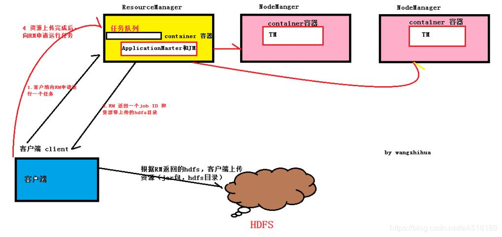
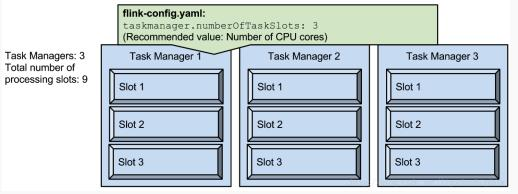
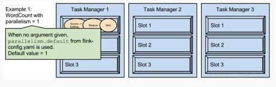
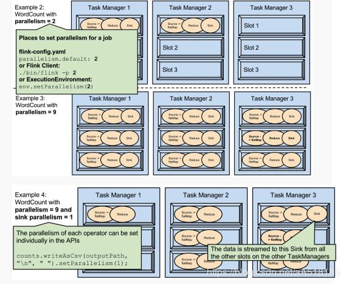

## flink开发实战之 flink on yarn

技术标签： [flink](http://www.pianshen.com/tag/flink/)  [ on yarn](http://www.pianshen.com/tag/+on+yarn/)    [flink 中的slot](http://www.pianshen.com/tag/flink+中的slot/)  [flink 提交任务的指令](http://www.pianshen.com/tag/flink+提交任务的指令/)  [flink](http://www.pianshen.com/tag/flink/)  [ on yarn 资源分配](http://www.pianshen.com/tag/+on+yarn+资源分配/)


> slot和parallelism的关系：slot是静的，是指可以使用的并发度。而parallelism是动的，是指实际的并发使用。比如说有9个slot，则最大能开到9个并发度，但是如果你就设置成1个也是可以的，只是没有很好的利用资源。所以合理的设置parallelism可以提高资源的利用率。 具体看后面的内容


# flink 运行模式

Flink 和spark一样有三种部署模式，分别是 Local、Standalone Cluster 和 Yarn Cluster。

实战开发主要使用Yarn Cluster模式，所以本文主要介绍yarn  模式下flink任务的执行和资源分配。

# **Yarn Cluster 模式**



在图中可以看出，Flink 与 Yarn 的关系与 **MapReduce 和 Yarn 的关系是一样的**。Flink 通过 Yarn 的接口实现了自己的 App Master。当在 Yarn 中部署了 Flink，**Yarn 就会用自己的 Container 来启动 Flink 的 JobManager**（也就是 App Master）和 TaskManager。

## flink 任务提交到yarn上的全流程

第一步：

向资源管理器（ResourceManager）请求，要运行一个程序。中获取新的作业ID（jobId），以及程序资源存储路径

第二步

ResourceManager检查作业的输出说明，然后返回一个存放程序资源的路径以及jobId，这个路径在hdfs的tmp文件夹中，如果程序中没有指定输出目录或指定的输出目录已经存在，作业就不提交，错误返回给flink程序

就是这个路径存放程序资源，包括程序的jar包，job的配置文件等。

第三步

将作业资源（包括JAR、配置和信息）复制到HDFS。

第五步：

通过调用资源管理器上的submitApplication()方法提交作业。

第六步

资源管理器收到调用它的submitApplication（）消息后，如果容器不够，任务会现在等待队列中等待，之后便将请求传递给调度器（Schedule），调度器分配一个容器，然后资源管理器在节点管理器的管理下在容器中启动应用程序master进程也就是MRAPPMaster。

flink作业的application master是一个Java应用程序，它的主类是MRAPPMaster他对作业进行初始化，通过创建多个薄记对象以保持对作业进度的跟踪，因为他将接受来自任务的进度和完成报告

第七步

MRAPPMaster根据配置信息，获知要启动多少个TaskManger，向ResourceManager请求容器

第八步

一旦资源管理器的调度器为任务分配了容器，MRAPPMaster(application master) 就通过与节点管理器NodeManager通信来启动容器向已获得容器的TaskManger发从启动命令，也就是主类为YarnChild程序

## **Flink在yarn上运行两种的模式**

**第一种：**

一种是让 Yarn 直接启动 JobManager 和 TaskManager

在yarn上运行一个flink job

```
./bin/flink run -m yarn-cluster -yn 4 -yjm 1024 -ytm 4096 ./examples/batch/WordCount.jar
```

**第二种：**

是在运行 Flink Workload 的时候启动 Flink 的模块。前者相当于让 Flink 的模块处于 Standby 的状态。**这里，我也主要介绍下前者**。

在下载和解压 Flink 的安装包之后，需要在环境中增加环境变量 HADOOP_CONF_DIR 或者 YARN_CONF_DIR，**其指向 Yarn 的配置目录**。

```
export HADOOP_CONF_DIR=/etc/hadoop/conf
```

这是因为 Flink 实现了 Yarn 的 Client，因此需要 Yarn 的一些配置和 Jar 包。在配置好环境变量后，只需简单的运行如下的脚本，Yarn 就会启动 Flink 的 JobManager 和 TaskManager。

**先启动集群：**

```
 ./bin/yarn-session.sh  -n  2 -jm  1024 -tm  1024 -s 2
```

上面的意思是：向 Yarn 申请 2 个 Container 启动 TaskManager（-n 2），每个 TaskManager 拥有两个 Task Slot（-s 2），并且向每个 TaskManager 的 Container 申请 1024 的内存

**再提交任务**

```
./bin/flink run com.demo.florian.WordCount  ./flink-demo-1.0-SNAPSHOT.jar
```

## **启动session的指令参数**

```
 必选
     -n,--container    分配多少个yarn容器 (=taskmanager的数量)

可选
      -d,--detached                   独立运行
     -jm,--jobManagerMemory     JobManager的内存 [in MB]
     -nm,--name                     在YARN上为一个自定义的应用设置一个名字
     -q,--query                      显示yarn中可用的资源 (内存, cpu核数)
     -qu,--queue                指定YARN队列.
     -s,--slots                 每个TaskManager使用的slots数量
     -tm,--taskManagerMemory    每个TaskManager的内存 [in MB]
     -z,--zookeeperNamespace    针对HA模式在zookeeper上创建NameSpace
```

## **run 提交任务的指令参数**

```
 -c,--class <classname>           如果没有在jar包中指定入口类，则需要在这里通过这个参数指定  


 -m,--jobmanager <host:port>      指定需要连接的jobmanager(主节点)地址  


                                    使用这个参数可以指定一个不同于配置文件中的jobmanager  


 -p,--parallelism <parallelism>   指定程序的并行度。可以覆盖配置文件中的默认值。
```

# **slot和parallelism**

# **1.slot是指taskmanager的并发执行能力**

**在hadoop 1.x 版本中也有slot的概念，有兴趣的读者可以了解一下**



taskmanager.numberOfTaskSlots:3

每一个taskmanager中的分配3个TaskSlot,3个taskmanager一共有9个TaskSlot

### **2.parallelism是指taskmanager实际使用的并发能力**



parallelism.default:1

运行程序默认的并行度为1，9个TaskSlot只用了1个，有8个空闲。设置合适的并行度才能提高效率。

### **3.parallelism是可配置、可指定的**



 

1.可以通过修改$FLINK_HOME/conf/flink-conf.yaml文件的方式更改并行度。

2.可以通过设置$FLINK_HOME/bin/flink 的-p参数修改并行度

3.可以通过设置executionEnvironmentk的方法修改并行度

4.可以通过设置flink的[编程](https://www.2cto.com/kf)API修改过并行度

5.这些并行度设置优先级从低到高排序，排序为api>env>p>file.

6.设置合适的并行度，能提高运算效率

7.parallelism不能多与slot个数。

### **4.slot和parallelism总结**

1.slot是静态的概念，是指taskmanager具有的并发执行能力

2.parallelism是动态的概念，是指程序运行时实际使用的并发能力

3.设置合适的parallelism能提高运算效率，太多了和太少了都不行

4.设置parallelism有多中方式，优先级为api>env>p>file


### 相关文章

- [Deploy Apache Flink Natively on YARN/Kubernetes](http://www.pianshen.com/article/5723381260/;jsessionid=F718DCAF250BAF60A78295D3A650C655)
- [Apache Flink源码解析 （三）Flink On Yarn (1) YarnSessionClusterEntrypoint](http://www.pianshen.com/article/1221245072/;jsessionid=F718DCAF250BAF60A78295D3A650C655)
- [flink on yarn提交任务的两种方式](http://www.pianshen.com/article/2811293136/;jsessionid=F718DCAF250BAF60A78295D3A650C655)
- [Apache Flink 源码解析（三）Flink on Yarn (2) Resource Manager](http://www.pianshen.com/article/1856245068/;jsessionid=F718DCAF250BAF60A78295D3A650C655)
- [flink on yarn 任务提交出错，报AskTimeoutException和java.util.concurrent.CompletionException异常](http://www.pianshen.com/article/5179300740/;jsessionid=F718DCAF250BAF60A78295D3A650C655)
- [flink](http://www.pianshen.com/article/5395367077/;jsessionid=F718DCAF250BAF60A78295D3A650C655)
- [flink开发实战之flink原理解析](http://www.pianshen.com/article/53055995/;jsessionid=F718DCAF250BAF60A78295D3A650C655)
- [Flink提交任务到yarn上启动踩坑（一）](http://www.pianshen.com/article/1406190489/;jsessionid=F718DCAF250BAF60A78295D3A650C655)
- [Spark on YARN](http://www.pianshen.com/article/129722669/;jsessionid=F718DCAF250BAF60A78295D3A650C655)
- [spark on yarn](http://www.pianshen.com/article/148930274/;jsessionid=F718DCAF250BAF60A78295D3A650C655)