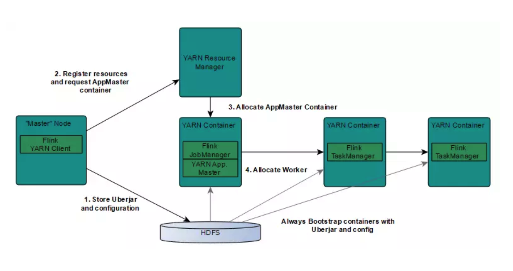
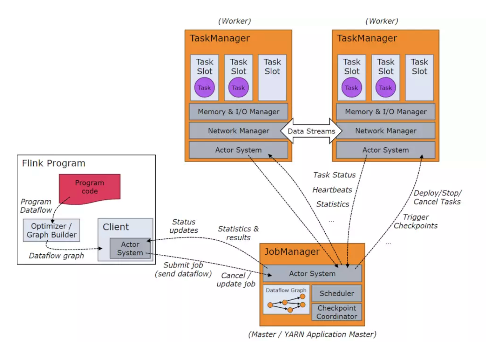

地址：https://www.jianshu.com/p/c47e8f438291


# Flink集群部署详细步骤

# 1.下载Flink压缩包

下载地址：[http://flink.apache.org/downloads.html](http://flink.apache.org/downloads.html)。
CDH集群环境 hadoop2.6，Scala2.11，所以下载：flink-1.5.0-bin-hadoop26-scala_2.11.tgz

# 2.解压

```
[root@hadoop2 opt]# tar -zxf flink-1.5.0-bin-hadoop26-scala_2.11.tgz
[root@hadoop2 opt]# cd flink-1.5.0
```

# 3.选择一个master节点， 配置conf/flink-conf.yaml

```
[root@hadoop2 flink-1.5.0]# vi conf/flink-conf.yaml 
# 设置jobmanager.rpc.address 配置项为该节点的IP 或者主机名
jobmanager.rpc.address: 10.108.4.202
```

# 4.配置slaves

将所有的worker节点（TaskManager）的IP或者主机名（一行一个）填入conf/slaves 文件中。

```
[root@hadoop2 flink-1.5.0]# vi conf/slaves
10.108.4.203
10.108.4.204
```

# 5.启动flink集群

```
[root@hadoop2 flink-1.5.0]# bin/start-cluster.sh
```

# 6.停止flink集群

```
[root@hadoop2 flink-1.5.0]# bin/stop-cluster.sh
```

# 7. 查看更多可用的配置项:

https://ci.apache.org/projects/flink/flink-docs-release-1.5/ops/config.html
以下都是非常重要的配置项：
1、TaskManager总共能使用的内存大小（taskmanager.heap.mb）
2、每一台机器上能使用的 CPU 个数（taskmanager.numberOfTaskSlots）
3、集群中的总 CPU个数（parallelism.default）
4、临时目录（taskmanager.tmp.dirs）

##### 以上就完成了一个简单的Flink集群。

------

## 添加JobManager或TaskManager实例到集群

可以使用`bin/jobmanager.sh`和`bin/taskmanager.sh`脚本为运行中的集群添加**JobManager**和**TaskManager**实例

**添加jobmanager：**

```
bin/jobmanager.sh  ((start|start-foreground) cluster)  | stop | stop-all
```

**添加taskmanager：**

```
bin/taskmanager.sh start | start-foreground | stop | stop-all
```

**生产中基本很少使用这种模式的，大多数都是基于YARN来进行提交任务，下面主要给出YARN的任务提交配置方式。**

------

# Flink On YARN

##### 设置Hadoop环境变量：

```
[root@hadoop2 flink-1.5.0]# vi /etc/profile
export HADOOP_CONF_DIR=/opt/cloudera/parcels/CDH-5.13.3-1.cdh5.13.3.p0.2/lib/hadoop/etc/hadoop
```

##### 查看使用方法：

```
[root@hadoop2 flink-1.5.0]# bin/yarn-session.sh -h

Usage:
   Required
     -n,--container <arg>   为YARN分配容器的数量 (=Number of Task Managers)
   Optional
     -D <property=value>             动态属性 
     -d,--detached                   以分离模式运行作业
     -h,--help                       Yarn session帮助.
     -id,--applicationId <arg>       连接到一个正在运行的YARN session
     -j,--jar <arg>                  Flink jar文件的路径
     -jm,--jobManagerMemory <arg>    JobManager的内存大小，driver-memory [in MB]
     -m,--jobmanager <arg>           Address of the JobManager (master) to which to connect. Use this flag to connect to a different JobManager than the one specified in the configuration.
     -n,--container <arg>            TaskManager的数量，相当于executor的数量
     -nm,--name <arg>                设置YARN应用自定义名称 
     -q,--query                      显示可用的YARN资源 (memory, cores)
     -qu,--queue <arg>               指定YARN队列
     -s,--slots <arg>                每个JobManager的core的数量，executor-cores。建议将slot的数量设置每台机器的处理器数量
     -st,--streaming                 在流模式下启动Flink
     -t,--ship <arg>                 在指定目录中传送文件(t for transfer)
     -tm,--taskManagerMemory <arg>   每个TaskManager的内存大小，executor-memory  [in MB]
     -yd,--yarndetached              如果存在，则以分离模式运行作业 (deprecated; use non-YARN specific option instead)
     -z,--zookeeperNamespace <arg>   为高可用性模式创建Zookeeper子路径的命名空间
```

#### 1. 以集群模式提交任务，每次都会新建flink集群

```
[root@hadoop2 flink-1.5.0]# ./bin/flink run -m yarn-cluster -c com.demo.florian.WordCount  $DEMO_DIR/target/flink-demo-1.0-SNAPSHOT.jar --port 9000
```

#### 2.启动Session flink集群，提交任务

1. 启动一个YARN session用2个TaskManager（每个TaskManager分配1GB的堆空间）

```
[root@hadoop2 flink-1.5.0]# ./bin/yarn-session.sh -n 2 -jm 1024 -tm 1024 -s 2
```

1. YARN session启动之后就可以使用bin/flink来启动提交作业

```
[root@hadoop2 flink-1.5.0]#  ./bin/flink run -c com.demo.florian.WordCount $DEMO_DIR/target/flink-demo-1.0.SNAPSHOT.jar --port 9000
用法: run [OPTIONS] <jar-file> <arguments>  
  "run" 操作参数:  
     -c,--class <classname>           如果没有在jar包中指定入口类，则需要在这里通过这个参数指定  

     -m,--jobmanager <host:port>      指定需要连接的jobmanager(主节点)地址  
                                      使用这个参数可以指定一个不同于配置文件中的jobmanager  
     -p,--parallelism <parallelism>   指定程序的并行度。可以覆盖配置文件中的默认值。  
```

使用run 命令向yarn集群提交一个job。客户端可以确定jobmanager的地址。当然，你也可以通过-m参数指定jobmanager。jobmanager的地址在yarn控制台上可以看到。

# 后台 yarn session

如果你不希望flink yarn client一直运行，也可以启动一个后台运行的yarn session。使用这个参数：-d 或者 --detached

在这种情况下，flink yarn client将会只提交任务到集群然后关闭自己。注意：在这种情况下，无法使用flink停止yarn session。
使用yarn 工具 来停止yarn session

```
yarn application -kill <applicationId> 
```

# 附着到一个已存在的session

下面命令可以附着到一个运行中的flink yarn session：

```
[root@hadoop2 flink-1.5.0]#  ./bin/yarn-session.sh  -id <yarnAppId> 
```

附着到一个运行的session使用yarn resourcemanager来确定job Manager 的RPC端口。
停止yarn session通过停止unix进程(使用**CTRL+C**）或者在client中输入**stop**

# flink on yarn的故障恢复

flink 的 yarn 客户端通过下面的配置参数来控制容器的故障恢复。这些参数可以通过conf/flink-conf.yaml 或者在启动yarn session的时候通过-D参数来指定。

- yarn.reallocate-failed：这个参数控制了flink是否应该重新分配失败的taskmanager容器。默认是true。
- yarn.maximum-failed-containers：applicationMaster可以接受的容器最大失败次数，达到这个参数，就会认为yarn session失败。默认这个次数和初始化请求的taskmanager数量相等(-n 参数指定的)。
- yarn.application-attempts：applicationMaster重试的次数。如果这个值被设置为1(默认就是1)，当application master失败的时候，yarn session也会失败。设置一个比较大的值的话，yarn会尝试重启applicationMaster。

# 日志文件

在某种情况下，flink yarn session 部署失败是由于它自身的原因，用户必须依赖于yarn的日志来进行分析。最有用的就是[yarn log aggregation](http://hortonworks.com/blog/simplifying-user-logs-management-and-access-in-yarn/) 。启动它，用户必须在yarn-site.xml文件中设置yarn.log-aggregation-enable 属性为true。一旦启用了，用户可以通过下面的命令来查看一个失败的yarn session的所有详细日志。

```
yarn logs -applicationId <application ID>  
```

# yarn client控制台和web界面

flink yarn client也会打印一些错误信息在控制台上，如果错误发生在运行时(例如如果一个taskmanager停止工作了一段时间)

除此之外，yarn resource manager的web界面(默认端口是8088)。resource manager的端口是通过yarn.resourcemanager.webapp.address参数来配置的。

它运行在yarn 程序运行的时候查看日志和程序失败的时候查看日志用户查找问题。

# flink on yarn 内部实现

Flink在YARN集群上运行时：Flink YARN Client负责与YARN RM通信协商资源请求，Flink JobManager和Flink TaskManager分别申请到Container去运行各自的进程。

YARN AM与Flink JobManager在同一个Container中，这样AM可以知道Flink JobManager的地址，从而AM可以申请Container去启动Flink TaskManager。待Flink成功运行在YARN集群上，Flink YARN Client就可以提交Flink Job到Flink JobManager，并进行后续的映射、调度和计算处理。




YARN客户端需要访问Hadoop配置来连接YARN资源管理器和HDFS。它使用下面的策略来确定Hadoop的配置：

- YARN_CONF_DIR，HADOOP_CONF_DIR，HADOOP_CONF_PATH.其中一个变量被设置，就能读取配置
- 如果上面的策略失败（在正确的yarn 设置中不应该出来这种情况），客户端使用HADOOP_HOME环境变量。如果设置了，那么客户端就会尝试访问$HADOOP_HOME/tect/hadoop

**step1 :** 当启动一个新的Flink YARN session时，客户端首先检查资源（container和memory）是否可用。然后，上传一个包含Flink和配置的jar包到HDFS上。

客户端请求（step 2）YARN container启动ApplicationMaster（step 3）.由于客户端将配置和jar文件注册到容器，在特定机器上运行的YARN的NodeManager将负责准备container（例如下载文件）。一旦完成，ApplicationMaster就被启动了。

JobManager和ApplicationMaster运行在同一个container上。一旦他们被成功启动，AM就知道JobManager的地址（AM它自己所在的机器）。它就会为TaskManager生成一个新的Flink配置文件（他们就可以连接到JobManager）。这个配置文件也被上传到HDFS上。此外，AM容器也提供了Flink的web服务接口。YARN所分配的所有端口都是临时端口，这允许用户并行执行多个Flink session。

最后，AM开始为Flink的任务TaskManager分配container，它将从HDFS加载jar文件和修改的配置文件。一旦这些步骤完成，Flink就准备好接口Job的提交了

# Flink任务处理过程

当Flink系统启动时，首先启动JobManager和一至多个TaskManager。JobManager负责协调Flink系统，TaskManager则是执行并行程序的worker。当系统以本地形式启动时，一个JobManager和一个TaskManager会启动在同一个JVM中。
当一个程序被提交后，系统会创建一个Client来进行预处理，将程序转变成一个并行数据流的形式，交给JobManager和TaskManager执行。



