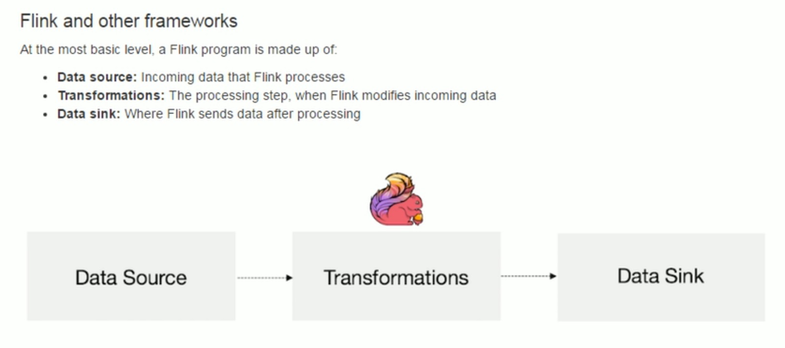
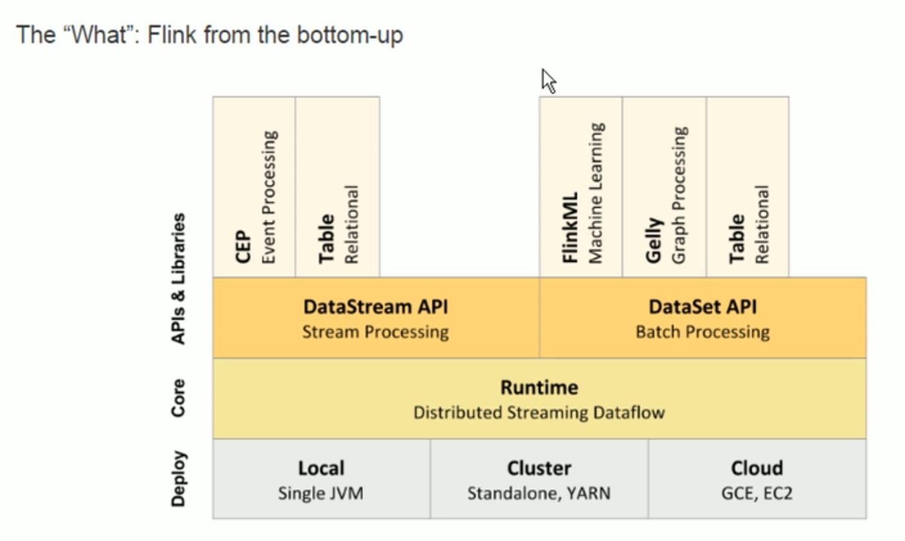

> flink run -c im.ivanl001.a01_flink_exp.SocketWindowWordCount /root/0103-Flink-scala-1.0-SNAPSHOT.jar --port 9999


##### 1, flink：无界数据集的流计算


##### 2, 数据集类型：

* 无界数据集：

  不断产生的数据

* 有界数据集

  最终不再改变的数据集

##### 3, 执行模型：

* 流计算

  数据不断产生， 就一直处于计算状态

* 批处理

  完成一段时间段的任务后， 释放资源

  

##### 4, flink特性:

* 结果精确，即使是无序数据或者延迟到达的数据
* 有状态以及容错，维护精准一次的应用状态
  * 可以记录数据的计算状态，失败的时候重新运算
* 大规模计算，几千台节点计算，高吞吐量和低延迟
* flink通过检查点机制实现精准一次的计算保证，在故障时可以提现出来
* flink支持流计算以及窗口化操作
* flink支持灵活的基于时间的窗口计算处理
* flink容错是轻量级的，保证零数据丢失


##### 5, flink的架构






##### 6, 运行时层面


##### 7, api层面


##### 8, 单机跑程序体验

8.1, maven依赖

* provided表示代码编译的使用，运行和打包的时候都不使用
* 当然maven默认就算不加provided打jar包也不会打进去的，如果需要打进去需要特殊的插件

```xml
<?xml version="1.0" encoding="UTF-8"?>
<project xmlns="http://maven.apache.org/POM/4.0.0"
         xmlns:xsi="http://www.w3.org/2001/XMLSchema-instance"
         xsi:schemaLocation="http://maven.apache.org/POM/4.0.0 http://maven.apache.org/xsd/maven-4.0.0.xsd">
    <modelVersion>4.0.0</modelVersion>

    <groupId>im.ivanl001</groupId>
    <artifactId>0103-Flink-scala</artifactId>
    <version>1.0-SNAPSHOT</version>

    <dependencies>
        <!--flink的核心库-->
        <dependency>
            <groupId>org.apache.flink</groupId>
            <artifactId>flink-core</artifactId>
            <version>1.7.2</version>
        </dependency>

        <!--flink的stream包-->
        <dependency>
            <groupId>org.apache.flink</groupId>
            <artifactId>flink-streaming-scala_2.11</artifactId>
            <version>1.7.2</version>
        </dependency>
    </dependencies>
    
</project>
```

8.2, 核心代码类

```scala
package im.ivanl001.a01_flink_exp

import org.apache.flink.api.java.utils.ParameterTool
import org.apache.flink.streaming.api.scala._
import org.apache.flink.streaming.api.windowing.time.Time
/**
  * #author      : ivanl001
  * #creator     : 2019-05-12 14:29
  * #description :  
  *
  **/

object SocketWindowWordCount {

  def main(args: Array[String]) : Unit = {

    // the port to connect to
    val port: Int = try {
      ParameterTool.fromArgs(args).getInt("port")
    } catch {
      case e: Exception => {
        System.err.println("No port specified. Please run 'SocketWindowWordCount --port <port>'")
        return
      }
    }

    // get the execution environment
    val env: StreamExecutionEnvironment = StreamExecutionEnvironment.getExecutionEnvironment

    // get input data by connecting to the socket
    val text = env.socketTextStream("localhost", port, '\n')

    // parse the data, group it, window it, and aggregate the counts
    val windowCounts = text
      .flatMap { w => w.split("\\s") }
      .map { w => WordWithCount(w, 1) }
      .keyBy("word")
      .timeWindow(Time.seconds(5), Time.seconds(1))
      .sum("count")

    // print the results with a single thread, rather than in parallel
    windowCounts.print().setParallelism(1)

    env.execute("Socket Window WordCount")
  }

  // Data type for words with count
  case class WordWithCount(word: String, count: Long)
}
```

8.3,  编译打包

> 0103-Flink-scala-1.0-SNAPSHOT.jar

8.4, 服务器上解压并并启动flink

```shell
tar -zxvf flink-1.7.2-bin-hadoop26-scala_2.11.tgz -C /usr/local/
/usr/local/flink-1.7.2/bin/start-cluster.sh 
```

* 网页验证

  > [http://192.168.147.144:8081/#/overview](http://192.168.147.144:8081/#/overview)

8.5, 拷贝jar包到服务器，先启动9999端口nc， 并如下命令运行jar包

> nc -lk -p 9999

> flink run -c im.ivanl001.a01_flink_exp.SocketWindowWordCount /root/0103-Flink-scala-1.0-SNAPSHOT.jar --port 9999

8.6, 查看日志

> cd /usr/local/flink-1.7.2/log/
>
> tail -f flink-root-taskexecutor-0-centos04.out 