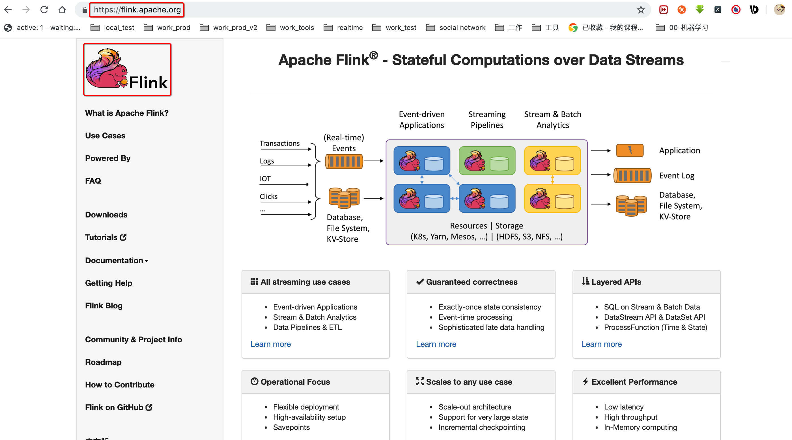
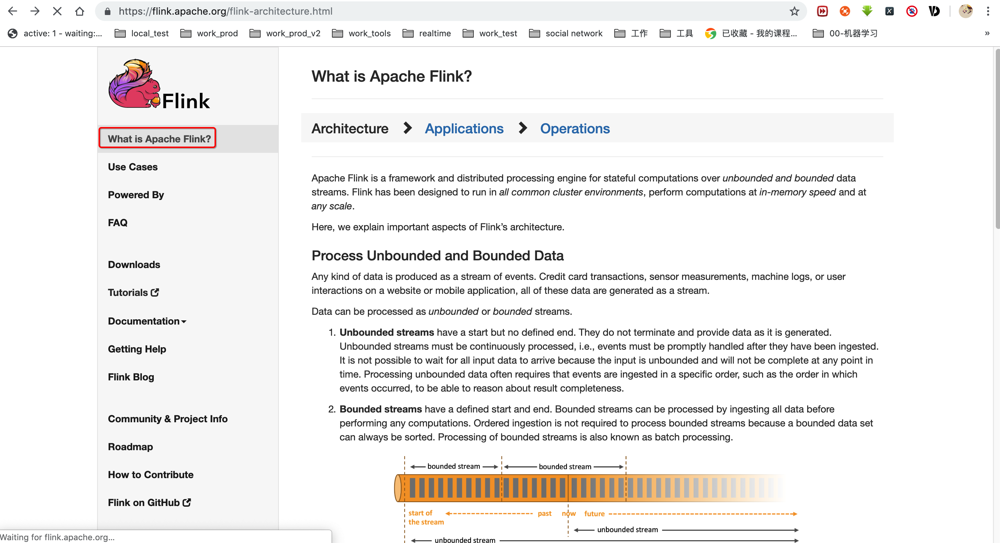
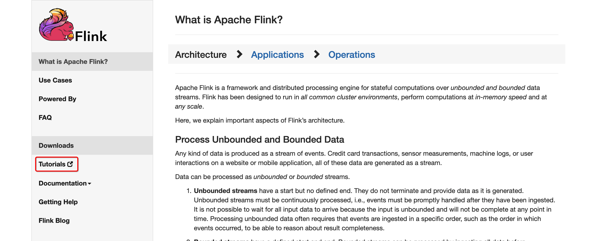
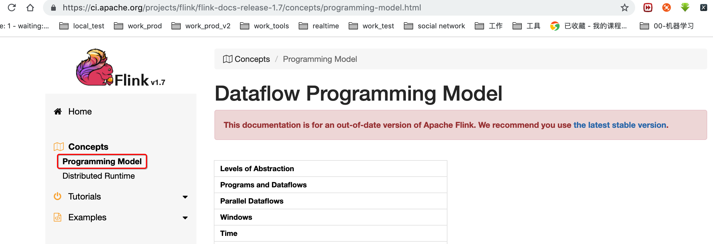
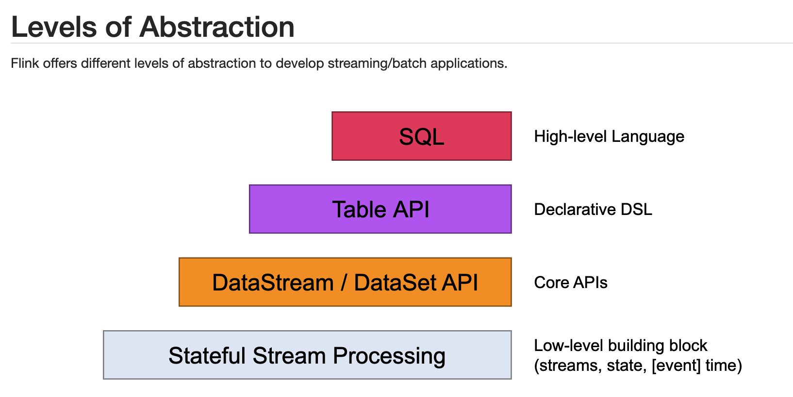
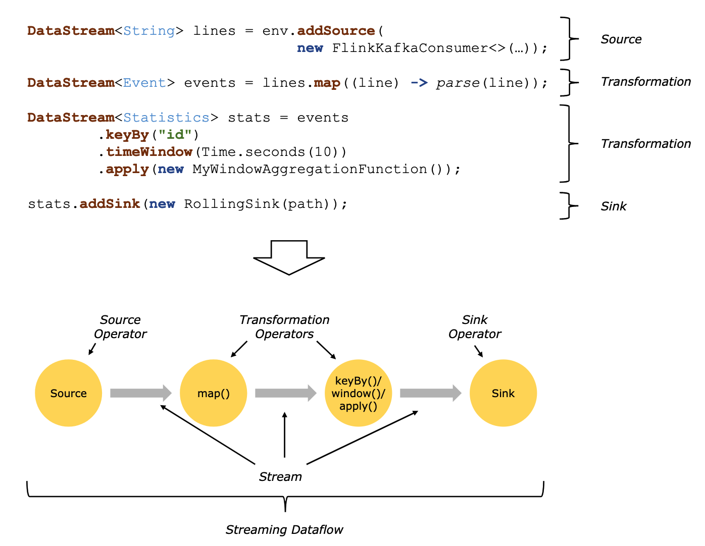
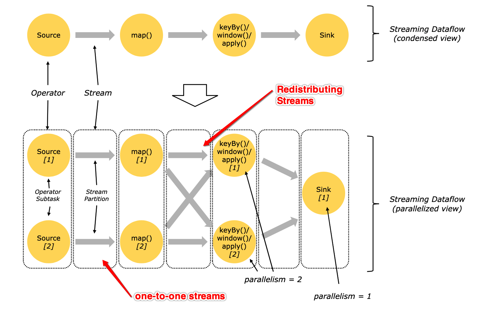
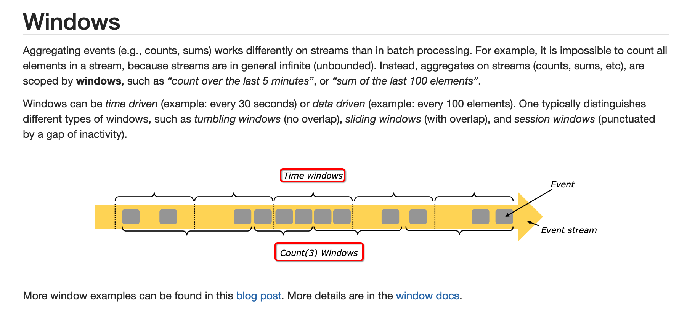
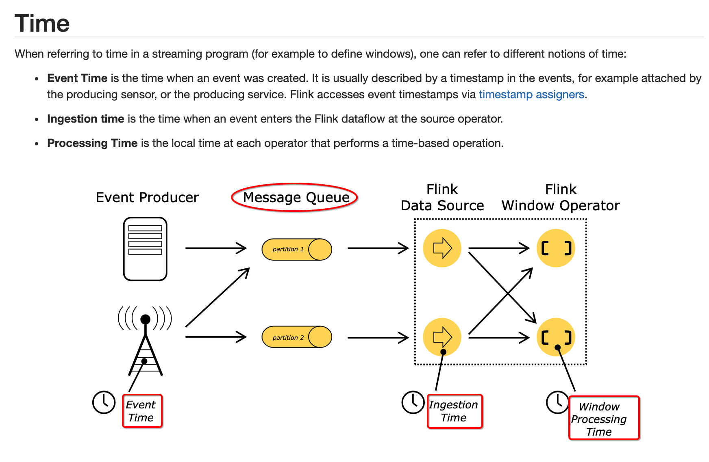

#### 1, flink 简单介绍

https://flink.apache.org/

spark: 流处理是批处理的一个特例，spark本质上来讲是小批量处理

##### flink: 批处理是流处理的一个特例，flink本质上来讲是流处理

* DataStream API （流处理接口）
* DataSet API （批处理接口）

#### 2, flink的架构

https://flink.apache.org/flink-architecture.html

flink是有界数据集(批处理)和无界数据集(流处理)的带状态的分布式处理框架

##### 2.1, Process Unbounded and Bounded Data

##### 2.2, Deploy Applications Anywhere

##### 2.3, Run Applications at any Scale

##### 2.4, Leverage In-Memory Performance

#### 3, 编程模型

https://ci.apache.org/projects/flink/flink-docs-release-1.7/concepts/programming-model.html

##### 3.1, 模型的抽象

##### 3.2, 编程和数据流

Programs and Dataflows

比较:

| -     | -                                      |
| ----- | -------------------------------------- |
| MR    | input—>map(reduce)—>output             |
| storm | input—>Spout—>Bolt—>output             |
| spark | input—>transformations—>action—>output |
| flink | input—>transformation—>output          |

##### 3.3, 并行度

##### 3.4, 窗口化

* 时间窗口
* 数量窗口

##### 3.5, 时间

* 事件时间
* 接受时间
* 处理时间

##### 3.6, 状态操作

> While many operations in a dataflow simply look at one individual *event at a time* (for example an event parser), some operations remember information across multiple events (for example window operators). These operations are called **stateful**.

##### 3.7, 检查点容错

Flink implements fault tolerance using a combination of **stream replay** and **checkpointing**. A checkpoint is related to a specific point in each of the input streams along with the corresponding state for each of the operators. A streaming dataflow can be resumed from a checkpoint while maintaining consistency *(exactly-once processing semantics)* by restoring the state of the operators and replaying the events from the point of the checkpoint.

The checkpoint interval is a means of trading off the overhead of fault tolerance during execution with the recovery time (the number of events that need to be replayed).

The description of the [fault tolerance internals](https://ci.apache.org/projects/flink/flink-docs-release-1.7/internals/stream_checkpointing.html) provides more information about how Flink manages checkpoints and related topics. Details about enabling and configuring checkpointing are in the [checkpointing API docs](https://ci.apache.org/projects/flink/flink-docs-release-1.7/dev/stream/state/checkpointing.html).

##### 3.8, 流的批处理

* 批处理就是流处理的一个特例special case

Flink executes [batch programs](https://ci.apache.org/projects/flink/flink-docs-release-1.7/dev/batch/index.html) as a special case of streaming programs, where the streams are bounded (finite number of elements). A *DataSet* is treated internally as a stream of data. The concepts above thus apply to batch programs in the same way as well as they apply to streaming programs, with minor exceptions:

- [Fault tolerance for batch programs](https://ci.apache.org/projects/flink/flink-docs-release-1.7/dev/batch/fault_tolerance.html) does not use checkpointing. Recovery happens by fully replaying the streams. That is possible, because inputs are bounded. This pushes the cost more towards the recovery, but makes the regular processing cheaper, because it avoids checkpoints.
- Stateful operations in the DataSet API use simplified in-memory/out-of-core data structures, rather than key/value indexes.
- The DataSet API introduces special synchronized (superstep-based) iterations, which are only possible on bounded streams. For details, check out the [iteration docs](https://ci.apache.org/projects/flink/flink-docs-release-1.7/dev/batch/iterations.html).

#### 4, flink安装使用

##### 4.1, flink的环境安装文档

https://ci.apache.org/projects/flink/flink-docs-release-1.7/tutorials/local_setup.html

##### 4.2, 下载

https://flink.apache.org/downloads.html

