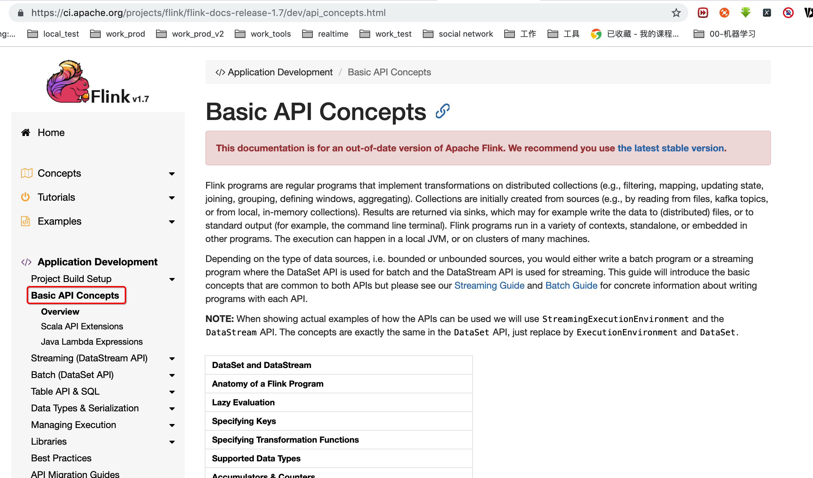

#### 1, spark, storm, flink比较

| 比较项   | spark      | storm | flink      |
| :------- | ---------- | ----- | ---------- |
| 运行模型 | 小批量     | 实时  | 实时       |
| 延时性   | 高         | 低    | 低         |
| 吞吐量   | 大         | 小    | 大         |
| 容错     | checkpoint | sdk?  | checkpoint |
|          |            |       |            |

#### 2, flink api

https://ci.apache.org/projects/flink/flink-docs-release-1.7/dev/api_concepts.html




##### 2.1, 基本的api概念

Flink programs are regular programs that implement transformations on distributed collections (e.g., filtering, mapping, updating state, joining, grouping, defining windows, aggregating). Collections are initially created from sources (e.g., by reading from files, kafka topics, or from local, in-memory collections). Results are returned via sinks, which may for example write the data to (distributed) files, or to standard output (for example, the command line terminal). Flink programs run in a variety of contexts, standalone, or embedded in other programs. The execution can happen in a local JVM, or on clusters of many machines.

Depending on the type of data sources, i.e. bounded or unbounded sources, you would either write a batch program or a streaming program where the DataSet API is used for batch and the DataStream API is used for streaming. This guide will introduce the basic concepts that are common to both APIs but please see our [Streaming Guide](https://ci.apache.org/projects/flink/flink-docs-release-1.7/dev/datastream_api.html) and [Batch Guide](https://ci.apache.org/projects/flink/flink-docs-release-1.7/dev/batch/index.html) for concrete information about writing programs with each API.


##### 2.2, DataSet和DataStream

Flink has the special classes `DataSet` and `DataStream` to represent data in a program. You can think of them as immutable collections of data that can contain duplicates. In the case of `DataSet` the data is finite while for a `DataStream` the number of elements can be unbounded.

These collections differ from regular Java collections in some key ways. First, they are immutable, meaning that once they are created you cannot add or remove elements. You can also not simply inspect the elements inside.

A collection is initially created by adding a source in a Flink program and new collections are derived from these by transforming them using API methods such as `map`, `filter` and so on.


##### 2.3, flink程序剖析

Flink programs look like regular programs that transform collections of data. Each program consists of the same basic parts:

1. Obtain an `execution environment`,获取环境
2. Load/create the initial data,获取或者加载数据
3. Specify transformations on this data,对数据进行变换
4. Specify where to put the results of your computations,指定数据输出
5. Trigger the program execution, 触发程序执行


 Note that all core classes of the Scala DataSet API are found in the package [org.apache.flink.api.scala](https://github.com/apache/flink/blob/master//flink-scala/src/main/scala/org/apache/flink/api/scala) while the classes of the Scala DataStream API can be found in [org.apache.flink.streaming.api.scala](https://github.com/apache/flink/blob/master//flink-streaming-scala/src/main/scala/org/apache/flink/streaming/api/scala).

Typically, you only need to use `getExecutionEnvironment()`, since this will do the right thing depending on the context: if you are executing your program inside an IDE or as a regular Java program it will create a local environment that will execute your program on your local machine. If you created a JAR file from your program, and invoke it through the [command line](https://ci.apache.org/projects/flink/flink-docs-release-1.7/ops/cli.html), the Flink cluster manager will execute your main method and `getExecutionEnvironment()` will return an execution environment for executing your program on a cluster.

通过getExecutionEnvironment()获取环境即可，会自动判断，如果是ide或者一个普通的java程序，会自动的创建本地环境。如果是jar包，通过命令行触发，会自动的创建集群环境进行分布式的执行。


##### 2.4, 懒执行

All Flink programs are executed lazily: When the program’s main method is executed, the data loading and transformations do not happen directly. Rather, each operation is created and added to the program’s plan. The operations are actually executed when the execution is explicitly triggered by an `execute()` call on the execution environment. Whether the program is executed locally or on a cluster depends on the type of execution environment

一般都是懒执行，通过execute()进行触发执行


##### 2.5, key的指定

Some transformations (join, coGroup, keyBy, groupBy) require that a key be defined on a collection of elements. Other transformations (Reduce, GroupReduce, Aggregate, Windows) allow data being grouped on a key before they are applied.

诸如join, coGroup, keyBy, groupBy这些变换都需要给元素指定一个key。其他的变换类似Reduce, GroupReduce,  Aggregate, Windows则需要一个key，方便在变换前进行分组。

A DataSet is grouped as

```
DataSet<...> input = // [...]
DataSet<...> reduced = input
  .groupBy(/*define key here*/)
  .reduceGroup(/*do something*/);
```

while a key can be specified on a DataStream using

```
DataStream<...> input = // [...]
DataStream<...> windowed = input
  .keyBy(/*define key here*/)
  .window(/*window specification*/);
```

###### 2.5.1, Define keys for Tuples

```scala
val input: DataStream[(Int, String, Long)] = // [...]
val keyed = input.keyBy(0)
```

```scala
val input: DataSet[(Int, String, Long)] = // [...]
val grouped = input.groupBy(0,1)
```

Here, we group the tuples on a composite key consisting of the first and the second field.

###### 2.5.2, Define keys using Field Expressions

```java
// some ordinary POJO (Plain old Java Object)
class WC(var word: String, var count: Int) {
  def this() { this("", 0L) }
}
val words: DataStream[WC] = // [...]
val wordCounts = words.keyBy("word").window(/*window specification*/)

// or, as a case class, which is less typing
case class WC(word: String, count: Int)
val words: DataStream[WC] = // [...]
val wordCounts = words.keyBy("word").window(/*window specification*/)
```

###### 2.5.3, Define keys using Key Selector Functions

```scala
// some ordinary case class
case class WC(word: String, count: Int)
val words: DataStream[WC] = // [...]
val keyed = words.keyBy( _.word )
```

 

##### 2.6, 指定变换函数

All transformations that take as argument a lambda function can instead take as argument a *rich* function. For example, instead of

```
data.map { x => x.toInt }
```

you can write

```
class MyMapFunction extends RichMapFunction[String, Int] {
  def map(in: String):Int = { in.toInt }
};
```

and pass the function to a `map` transformation:

```
data.map(new MyMapFunction())
```

Rich functions can also be defined as an anonymous class:

```
data.map (new RichMapFunction[String, Int] {
  def map(in: String):Int = { in.toInt }
})
```

Rich functions provide, in addition to the user-defined function (map, reduce, etc), four methods: `open`, `close`, `getRuntimeContext`, and `setRuntimeContext`. These are useful for parameterizing the function (see [Passing Parameters to Functions](https://ci.apache.org/projects/flink/flink-docs-release-1.7/dev/batch/index.html#passing-parameters-to-functions)), creating and finalizing local state, accessing broadcast variables (see [Broadcast Variables](https://ci.apache.org/projects/flink/flink-docs-release-1.7/dev/batch/index.html#broadcast-variables)), and for accessing runtime information such as accumulators and counters (see [Accumulators and Counters](https://ci.apache.org/projects/flink/flink-docs-release-1.7/dev/api_concepts.html#accumulators--counters)), and information on iterations (see [Iterations](https://ci.apache.org/projects/flink/flink-docs-release-1.7/dev/batch/iterations.html)).

##### 2.7, 支持的数据类型

Flink places some restrictions on the type of elements that can be in a DataSet or DataStream. The reason for this is that the system analyzes the types to determine efficient execution strategies.

###### 2.7.1, There are six different categories of data types: 支持六种数据类型

1. **Java Tuples** and **Scala Case Classes** 元祖或者Case类
2. **Java POJOs** 
3. **Primitive Types**
4. **Regular Classes**
5. **Values**
6. **Hadoop Writables**
7. **Special Types**

###### 2.7.2, POJOs

Java and Scala classes are treated by Flink as a special POJO data type if they fulfill the following requirements:

- The class must be public.
- It must have a public constructor without arguments (default constructor).
- All fields are either public or must be accessible through getter and setter functions. For a field called `foo` the getter and setter methods must be named `getFoo()` and `setFoo()`.
- The type of a field must be supported by Flink. At the moment, Flink uses [Avro](http://avro.apache.org/) to serialize arbitrary objects (such as `Date`).

###### 2.7.3, Primitive Types

Flink supports all Java and Scala primitive types such as `Integer`, `String`, and `Double`.

###### 2.7.4, ...

##### 2.8, Accumulators & Counters 累加器和计数器