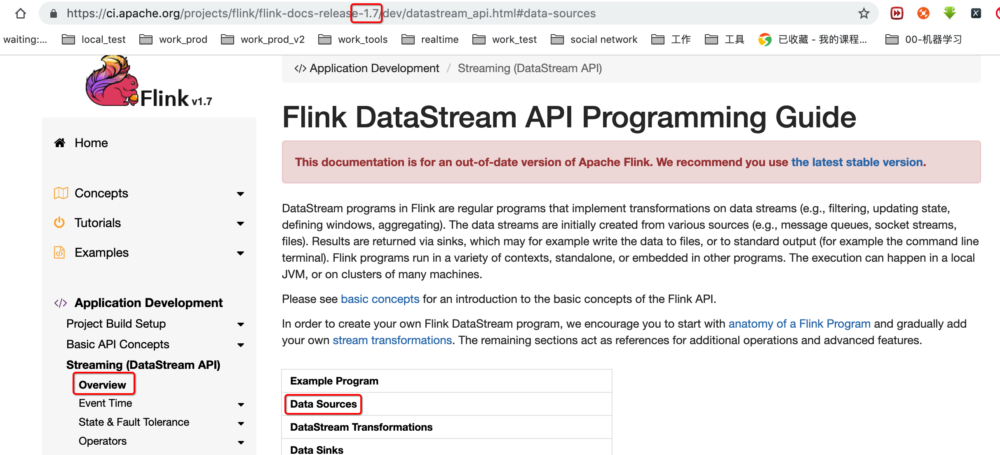
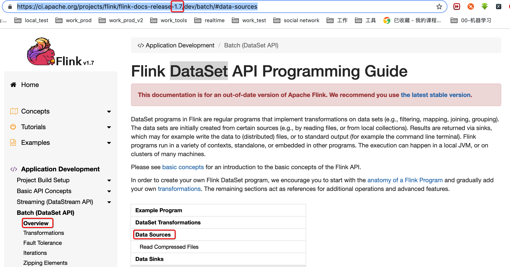

> 注意：由于数据是否有界和无界的原因， DataSet中是没有基于socket的数据源的，因为socket本身是属于无界的。
>
> 然后读取压缩文件的时候是不能并发读取的哈


#### 1, DataStream-Data Sources

https://ci.apache.org/projects/flink/flink-docs-release-1.7/dev/datastream_api.html#data-sources




There are several predefined stream sources accessible from the `StreamExecutionEnvironment`:

##### 1.1, File-based: 基于文件的数据源

- `readTextFile(path)` - Reads text files, i.e. files that respect the `TextInputFormat` specification, line-by-line and returns them as Strings.

- `readFile(fileInputFormat, path)` - Reads (once) files as dictated by the specified file input format.

- `readFile(fileInputFormat, path, watchType, interval, pathFilter)` - This is the method called internally by the two previous ones. It reads files in the `path` based on the given `fileInputFormat`. Depending on the provided `watchType`, this source may periodically monitor (every `interval` ms) the path for new data (`FileProcessingMode.PROCESS_CONTINUOUSLY`), or process once the data currently in the path and exit (`FileProcessingMode.PROCESS_ONCE`). Using the `pathFilter`, the user can further exclude files from being processed.

  *IMPLEMENTATION:*

  Under the hood, Flink splits the file reading process into two sub-tasks, namely *directory monitoring* and *data reading*. Each of these sub-tasks is implemented by a separate entity. Monitoring is implemented by a single, **non-parallel** (parallelism = 1) task, while reading is performed by multiple tasks running in parallel. The parallelism of the latter is equal to the job parallelism. The role of the single monitoring task is to scan the directory (periodically or only once depending on the `watchType`), find the files to be processed, divide them in *splits*, and assign these splits to the downstream readers. The readers are the ones who will read the actual data. Each split is read by only one reader, while a reader can read multiple splits, one-by-one.

  *IMPORTANT NOTES:*

  1. If the `watchType` is set to `FileProcessingMode.PROCESS_CONTINUOUSLY`, when a file is modified, its contents are re-processed entirely. This can break the “exactly-once” semantics, as appending data at the end of a file will lead to **all** its contents being re-processed.
  2. If the `watchType` is set to `FileProcessingMode.PROCESS_ONCE`, the source scans the path **once** and exits, without waiting for the readers to finish reading the file contents. Of course the readers will continue reading until all file contents are read. Closing the source leads to no more checkpoints after that point. This may lead to slower recovery after a node failure, as the job will resume reading from the last checkpoint.

  > ```scala
  > val env = StreamExecutionEnvironment.getExecutionEnvironment
  > val conf = new Configuration()
  > conf.setBoolean("recursive.file.enumeration", true)
  > val lines = env.readTextFile("/Users/ivanl001/Documents/00-zhangbuer/learning_code/04-analysis/01-BigData_v2/0103-Flink-scala/src/main/resources/").withParameters(conf)
  > // 设置递归读取文件的时候不管用，没有withParameters这个方法，先放着
  > 
  > 哦哦哦哦， 我知道了，这个配置只有批处理才有的，把上面的env改成如下即可
  > val env = ExecutionEnvironment.getExecutionEnvironment
  > ```

##### 1.2, Socket-based: 基于socket的数据源

- `socketTextStream` - Reads from a socket. Elements can be separated by a delimiter.

##### 1.3, Collection-based: 基于集合的数据源

- `fromCollection(Seq)` - Creates a data stream from the Java Java.util.Collection. All elements in the collection must be of the same type.
- `fromCollection(Iterator)` - Creates a data stream from an iterator. The class specifies the data type of the elements returned by the iterator.
- `fromElements(elements: _*)` - Creates a data stream from the given sequence of objects. All objects must be of the same type.
- `fromParallelCollection(SplittableIterator)` - Creates a data stream from an iterator, in parallel. The class specifies the data type of the elements returned by the iterator.
- `generateSequence(from, to)` - Generates the sequence of numbers in the given interval, in parallel.

##### 1.4, Custom: 自定义数据源

- `addSource` - Attach a new source function. For example, to read from Apache Kafka you can use `addSource(new FlinkKafkaConsumer08<>(...))`. See [connectors](https://ci.apache.org/projects/flink/flink-docs-release-1.7/dev/connectors/) for more details.


#### 2,DataSet-Data Sources

https://ci.apache.org/projects/flink/flink-docs-release-1.7/dev/batch/#data-sources




##### 2.1, File-based:基于文件的数据源

- `readTextFile(path)` / `TextInputFormat` - Reads files line wise and returns them as Strings.
- `readTextFileWithValue(path)` / `TextValueInputFormat` - Reads files line wise and returns them as StringValues. StringValues are mutable strings.
- `readCsvFile(path)` / `CsvInputFormat` - Parses files of comma (or another char) delimited fields. Returns a DataSet of tuples, case class objects, or POJOs. Supports the basic java types and their Value counterparts as field types.
- `readFileOfPrimitives(path, delimiter)` / `PrimitiveInputFormat` - Parses files of new-line (or another char sequence) delimited primitive data types such as `String` or `Integer` using the given delimiter.
- `readSequenceFile(Key, Value, path)` / `SequenceFileInputFormat` - Creates a JobConf and reads file from the specified path with type SequenceFileInputFormat, Key class and Value class and returns them as Tuple2<Key, Value>.

##### 2.2, Collection-based: 基于集合的数据源

- `fromCollection(Seq)` - Creates a data set from a Seq. All elements in the collection must be of the same type.
- `fromCollection(Iterator)` - Creates a data set from an Iterator. The class specifies the data type of the elements returned by the iterator.
- `fromElements(elements: _*)` - Creates a data set from the given sequence of objects. All objects must be of the same type.
- `fromParallelCollection(SplittableIterator)` - Creates a data set from an iterator, in parallel. The class specifies the data type of the elements returned by the iterator.
- `generateSequence(from, to)` - Generates the sequence of numbers in the given interval, in parallel.

##### 2.3, Generic: 2.1中是文件路径，这里是原生输入流

- `readFile(inputFormat, path)` / `FileInputFormat` - Accepts a file input format.
- `createInput(inputFormat)` / `InputFormat` - Accepts a generic input format.

**Examples**

```scala
val env  = ExecutionEnvironment.getExecutionEnvironment

// read text file from local files system
val localLines = env.readTextFile("file:///path/to/my/textfile")

// read text file from a HDFS running at nnHost:nnPort
val hdfsLines = env.readTextFile("hdfs://nnHost:nnPort/path/to/my/textfile")

// read a CSV file with three fields
val csvInput = env.readCsvFile[(Int, String, Double)]("hdfs:///the/CSV/file")

// read a CSV file with five fields, taking only two of them
val csvInput = env.readCsvFile[(String, Double)](
  "hdfs:///the/CSV/file",
  includedFields = Array(0, 3)) // take the first and the fourth field

// CSV input can also be used with Case Classes
case class MyCaseClass(str: String, dbl: Double)
val csvInput = env.readCsvFile[MyCaseClass](
  "hdfs:///the/CSV/file",
  includedFields = Array(0, 3)) // take the first and the fourth field

// read a CSV file with three fields into a POJO (Person) with corresponding fields
val csvInput = env.readCsvFile[Person](
  "hdfs:///the/CSV/file",
  pojoFields = Array("name", "age", "zipcode"))

// create a set from some given elements
val values = env.fromElements("Foo", "bar", "foobar", "fubar")

// generate a number sequence
val numbers = env.generateSequence(1, 10000000)

// read a file from the specified path of type SequenceFileInputFormat
val tuples = env.readSequenceFile(classOf[IntWritable], classOf[Text],
 "hdfs://nnHost:nnPort/path/to/file")
```

##### 2.4, Configuring CSV Parsing

Flink offers a number of configuration options for CSV parsing:

- `lineDelimiter: String` specifies the delimiter of individual records. The default line delimiter is the new-line character `'\n'`.
- `fieldDelimiter: String` specifies the delimiter that separates fields of a record. The default field delimiter is the comma character `','`.
- `includeFields: Array[Int]` defines which fields to read from the input file (and which to ignore). By default the first *n* fields (as defined by the number of types in the `types()` call) are parsed.
- `pojoFields: Array[String]` specifies the fields of a POJO that are mapped to CSV fields. Parsers for CSV fields are automatically initialized based on the type and order of the POJO fields.
- `parseQuotedStrings: Character` enables quoted string parsing. Strings are parsed as quoted strings if the first character of the string field is the quote character (leading or tailing whitespaces are *not* trimmed). Field delimiters within quoted strings are ignored. Quoted string parsing fails if the last character of a quoted string field is not the quote character. If quoted string parsing is enabled and the first character of the field is *not* the quoting string, the string is parsed as unquoted string. By default, quoted string parsing is disabled.
- `ignoreComments: String` specifies a comment prefix. All lines that start with the specified comment prefix are not parsed and ignored. By default, no lines are ignored.
- `lenient: Boolean` enables lenient parsing, i.e., lines that cannot be correctly parsed are ignored. By default, lenient parsing is disabled and invalid lines raise an exception.
- `ignoreFirstLine: Boolean` configures the InputFormat to ignore the first line of the input file. By default no line is ignored.

##### 2.5, Recursive Traversal of the Input Path Directory

For file-based inputs, when the input path is a directory, nested files are not enumerated by default. Instead, only the files inside the base directory are read, while nested files are ignored. Recursive enumeration of nested files can be enabled through the `recursive.file.enumeration` configuration parameter, like in the following example.

```scala
// enable recursive enumeration of nested input files
val env  = ExecutionEnvironment.getExecutionEnvironment

// create a configuration object
val parameters = new Configuration

// set the recursive enumeration parameter
parameters.setBoolean("recursive.file.enumeration", true)

// pass the configuration to the data source
env.readTextFile("file:///path/with.nested/files").withParameters(parameters)
```

##### 2.6, Read Compressed Files

Flink currently supports transparent decompression of input files if these are marked with an appropriate file extension. In particular, this means that no further configuration of the input formats is necessary and any `FileInputFormat` support the compression, including custom input formats. Please notice that compressed files might not be read in parallel, thus impacting job scalability.

The following table lists the currently supported compression methods.

| Compression method | File extensions | Parallelizable |
| :----------------- | :-------------- | :------------- |
| **DEFLATE**        | `.deflate`      | no             |
| **GZip**           | `.gz`, `.gzip`  | no             |
| **Bzip2**          | `.bz2`          | no             |
| **XZ**             | `.xz`           | no             |