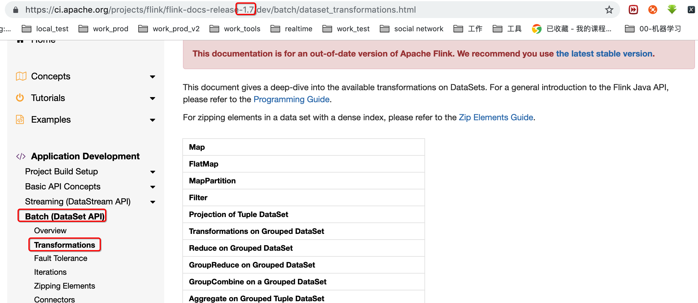

## 1, DataStream-Data Transformations

https://ci.apache.org/projects/flink/flink-docs-release-1.7/dev/datastream_api.html#datastream-transformations


Please see [operators](https://ci.apache.org/projects/flink/flink-docs-release-1.7/dev/stream/operators/index.html) for an overview of the available stream transformations.

看Operators章节，这里先不看了，自行查看，通过学习dataset的


## 2,DataSet-Data Transformations

https://ci.apache.org/projects/flink/flink-docs-release-1.7/dev/batch/dataset_transformations.html




This document gives a deep-dive into the available transformations on DataSets. For a general introduction to the Flink Java API, please refer to the [Programming Guide](https://ci.apache.org/projects/flink/flink-docs-release-1.7/dev/batch/index.html).

For zipping elements in a data set with a dense index, please refer to the [Zip Elements Guide](https://ci.apache.org/projects/flink/flink-docs-release-1.7/dev/batch/zip_elements_guide.html).

### Map

The Map transformation applies a user-defined map function on each element of a DataSet. It implements a one-to-one mapping, that is, exactly one element must be returned by the function.

The following code transforms a DataSet of Integer pairs into a DataSet of Integers:

- [**Java**](https://ci.apache.org/projects/flink/flink-docs-release-1.7/dev/batch/dataset_transformations.html#tab_java_0)
- [**Scala**](https://ci.apache.org/projects/flink/flink-docs-release-1.7/dev/batch/dataset_transformations.html#tab_scala_0)
- [**Python**](https://ci.apache.org/projects/flink/flink-docs-release-1.7/dev/batch/dataset_transformations.html#tab_python_0)

```
val intPairs: DataSet[(Int, Int)] = // [...]
val intSums = intPairs.map { pair => pair._1 + pair._2 }
```

### FlatMap

The FlatMap transformation applies a user-defined flat-map function on each element of a DataSet. This variant of a map function can return arbitrary many result elements (including none) for each input element.

The following code transforms a DataSet of text lines into a DataSet of words:

- [**Java**](https://ci.apache.org/projects/flink/flink-docs-release-1.7/dev/batch/dataset_transformations.html#tab_java_1)
- [**Scala**](https://ci.apache.org/projects/flink/flink-docs-release-1.7/dev/batch/dataset_transformations.html#tab_scala_1)
- [**Python**](https://ci.apache.org/projects/flink/flink-docs-release-1.7/dev/batch/dataset_transformations.html#tab_python_1)

```
val textLines: DataSet[String] = // [...]
val words = textLines.flatMap { _.split(" ") }
```

### MapPartition

MapPartition transforms a parallel partition in a single function call. The map-partition function gets the partition as Iterable and can produce an arbitrary number of result values. The number of elements in each partition depends on the degree-of-parallelism and previous operations.

The following code transforms a DataSet of text lines into a DataSet of counts per partition:

- [**Java**](https://ci.apache.org/projects/flink/flink-docs-release-1.7/dev/batch/dataset_transformations.html#tab_java_2)
- [**Scala**](https://ci.apache.org/projects/flink/flink-docs-release-1.7/dev/batch/dataset_transformations.html#tab_scala_2)
- [**Python**](https://ci.apache.org/projects/flink/flink-docs-release-1.7/dev/batch/dataset_transformations.html#tab_python_2)

```
val textLines: DataSet[String] = // [...]
// Some is required because the return value must be a Collection.
// There is an implicit conversion from Option to a Collection.
val counts = texLines.mapPartition { in => Some(in.size) }
```

### Filter

The Filter transformation applies a user-defined filter function on each element of a DataSet and retains only those elements for which the function returns `true`.

The following code removes all Integers smaller than zero from a DataSet:

- [**Java**](https://ci.apache.org/projects/flink/flink-docs-release-1.7/dev/batch/dataset_transformations.html#tab_java_3)
- [**Scala**](https://ci.apache.org/projects/flink/flink-docs-release-1.7/dev/batch/dataset_transformations.html#tab_scala_3)
- [**Python**](https://ci.apache.org/projects/flink/flink-docs-release-1.7/dev/batch/dataset_transformations.html#tab_python_3)

```
val intNumbers: DataSet[Int] = // [...]
val naturalNumbers = intNumbers.filter { _ > 0 }
```

**IMPORTANT:** The system assumes that the function does not modify the elements on which the predicate is applied. Violating this assumption can lead to incorrect results.

### Projection of Tuple DataSet

The Project transformation removes or moves Tuple fields of a Tuple DataSet. The `project(int...)` method selects Tuple fields that should be retained by their index and defines their order in the output Tuple.

Projections do not require the definition of a user function.

The following code shows different ways to apply a Project transformation on a DataSet:

- [**Java**](https://ci.apache.org/projects/flink/flink-docs-release-1.7/dev/batch/dataset_transformations.html#tab_java_4)
- [**Scala**](https://ci.apache.org/projects/flink/flink-docs-release-1.7/dev/batch/dataset_transformations.html#tab_scala_4)
- [**Python**](https://ci.apache.org/projects/flink/flink-docs-release-1.7/dev/batch/dataset_transformations.html#tab_python_4)

```
Not supported.
```

### Transformations on Grouped DataSet

The reduce operations can operate on grouped data sets. Specifying the key to be used for grouping can be done in many ways:

- key expressions
- a key-selector function
- one or more field position keys (Tuple DataSet only)
- Case Class fields (Case Classes only)

Please look at the reduce examples to see how the grouping keys are specified.

### Reduce on Grouped DataSet

A Reduce transformation that is applied on a grouped DataSet reduces each group to a single element using a user-defined reduce function. For each group of input elements, a reduce function successively combines pairs of elements into one element until only a single element for each group remains.

Note that for a `ReduceFunction` the keyed fields of the returned object should match the input values. This is because reduce is implicitly combinable and objects emitted from the combine operator are again grouped by key when passed to the reduce operator.

#### Reduce on DataSet Grouped by Key Expression

Key expressions specify one or more fields of each element of a DataSet. Each key expression is either the name of a public field or a getter method. A dot can be used to drill down into objects. The key expression “*” selects all fields. The following code shows how to group a POJO DataSet using key expressions and to reduce it with a reduce function.

- [**Java**](https://ci.apache.org/projects/flink/flink-docs-release-1.7/dev/batch/dataset_transformations.html#tab_java_5)
- [**Scala**](https://ci.apache.org/projects/flink/flink-docs-release-1.7/dev/batch/dataset_transformations.html#tab_scala_5)
- [**Python**](https://ci.apache.org/projects/flink/flink-docs-release-1.7/dev/batch/dataset_transformations.html#tab_python_5)

```
// some ordinary POJO
class WC(val word: String, val count: Int) {
  def this() {
    this(null, -1)
  }
  // [...]
}

val words: DataSet[WC] = // [...]
val wordCounts = words.groupBy("word").reduce {
  (w1, w2) => new WC(w1.word, w1.count + w2.count)
}
```

#### Reduce on DataSet Grouped by KeySelector Function

A key-selector function extracts a key value from each element of a DataSet. The extracted key value is used to group the DataSet. The following code shows how to group a POJO DataSet using a key-selector function and to reduce it with a reduce function.

- [**Java**](https://ci.apache.org/projects/flink/flink-docs-release-1.7/dev/batch/dataset_transformations.html#tab_java_6)
- [**Scala**](https://ci.apache.org/projects/flink/flink-docs-release-1.7/dev/batch/dataset_transformations.html#tab_scala_6)
- [**Python**](https://ci.apache.org/projects/flink/flink-docs-release-1.7/dev/batch/dataset_transformations.html#tab_python_6)

```
// some ordinary POJO
class WC(val word: String, val count: Int) {
  def this() {
    this(null, -1)
  }
  // [...]
}

val words: DataSet[WC] = // [...]
val wordCounts = words.groupBy { _.word } reduce {
  (w1, w2) => new WC(w1.word, w1.count + w2.count)
}
```

#### Reduce on DataSet Grouped by Field Position Keys (Tuple DataSets only)

Field position keys specify one or more fields of a Tuple DataSet that are used as grouping keys. The following code shows how to use field position keys and apply a reduce function

- [**Java**](https://ci.apache.org/projects/flink/flink-docs-release-1.7/dev/batch/dataset_transformations.html#tab_java_7)
- [**Scala**](https://ci.apache.org/projects/flink/flink-docs-release-1.7/dev/batch/dataset_transformations.html#tab_scala_7)
- [**Python**](https://ci.apache.org/projects/flink/flink-docs-release-1.7/dev/batch/dataset_transformations.html#tab_python_7)

```
val tuples = DataSet[(String, Int, Double)] = // [...]
// group on the first and second Tuple field
val reducedTuples = tuples.groupBy(0, 1).reduce { ... }
```

#### Reduce on DataSet grouped by Case Class Fields

When using Case Classes you can also specify the grouping key using the names of the fields:

- [**Java**](https://ci.apache.org/projects/flink/flink-docs-release-1.7/dev/batch/dataset_transformations.html#tab_java_8)
- [**Scala**](https://ci.apache.org/projects/flink/flink-docs-release-1.7/dev/batch/dataset_transformations.html#tab_scala_8)
- [**Python**](https://ci.apache.org/projects/flink/flink-docs-release-1.7/dev/batch/dataset_transformations.html#tab_python_8)

```
case class MyClass(val a: String, b: Int, c: Double)
val tuples = DataSet[MyClass] = // [...]
// group on the first and second field
val reducedTuples = tuples.groupBy("a", "b").reduce { ... }
```

### GroupReduce on Grouped DataSet

A GroupReduce transformation that is applied on a grouped DataSet calls a user-defined group-reduce function for each group. The difference between this and *Reduce* is that the user defined function gets the whole group at once. The function is invoked with an Iterable over all elements of a group and can return an arbitrary number of result elements.

#### GroupReduce on DataSet Grouped by Field Position Keys (Tuple DataSets only)

The following code shows how duplicate strings can be removed from a DataSet grouped by Integer.

- [**Java**](https://ci.apache.org/projects/flink/flink-docs-release-1.7/dev/batch/dataset_transformations.html#tab_java_9)
- [**Scala**](https://ci.apache.org/projects/flink/flink-docs-release-1.7/dev/batch/dataset_transformations.html#tab_scala_9)
- [**Python**](https://ci.apache.org/projects/flink/flink-docs-release-1.7/dev/batch/dataset_transformations.html#tab_python_9)

```
val input: DataSet[(Int, String)] = // [...]
val output = input.groupBy(0).reduceGroup {
      (in, out: Collector[(Int, String)]) =>
        in.toSet foreach (out.collect)
    }
```

#### GroupReduce on DataSet Grouped by Key Expression, KeySelector Function, or Case Class Fields

Work analogous to [key expressions](https://ci.apache.org/projects/flink/flink-docs-release-1.7/dev/batch/dataset_transformations.html#reduce-on-dataset-grouped-by-key-expression), [key-selector functions](https://ci.apache.org/projects/flink/flink-docs-release-1.7/dev/batch/dataset_transformations.html#reduce-on-dataset-grouped-by-keyselector-function), and [case class fields](https://ci.apache.org/projects/flink/flink-docs-release-1.7/dev/batch/dataset_transformations.html#reduce-on-dataset-grouped-by-case-class-fields) in *Reduce* transformations.

#### GroupReduce on sorted groups

A group-reduce function accesses the elements of a group using an Iterable. Optionally, the Iterable can hand out the elements of a group in a specified order. In many cases this can help to reduce the complexity of a user-defined group-reduce function and improve its efficiency.

The following code shows another example how to remove duplicate Strings in a DataSet grouped by an Integer and sorted by String.

- [**Java**](https://ci.apache.org/projects/flink/flink-docs-release-1.7/dev/batch/dataset_transformations.html#tab_java_10)
- [**Scala**](https://ci.apache.org/projects/flink/flink-docs-release-1.7/dev/batch/dataset_transformations.html#tab_scala_10)
- [**Python**](https://ci.apache.org/projects/flink/flink-docs-release-1.7/dev/batch/dataset_transformations.html#tab_python_10)

```
val input: DataSet[(Int, String)] = // [...]
val output = input.groupBy(0).sortGroup(1, Order.ASCENDING).reduceGroup {
      (in, out: Collector[(Int, String)]) =>
        var prev: (Int, String) = null
        for (t <- in) {
          if (prev == null || prev != t)
            out.collect(t)
            prev = t
        }
    }
```

**Note:** A GroupSort often comes for free if the grouping is established using a sort-based execution strategy of an operator before the reduce operation.

#### Combinable GroupReduceFunctions

In contrast to a reduce function, a group-reduce function is not implicitly combinable. In order to make a group-reduce function combinable it must implement the `GroupCombineFunction` interface.

**Important**: The generic input and output types of the `GroupCombineFunction` interface must be equal to the generic input type of the `GroupReduceFunction` as shown in the following example:

- [**Java**](https://ci.apache.org/projects/flink/flink-docs-release-1.7/dev/batch/dataset_transformations.html#tab_java_11)
- [**Scala**](https://ci.apache.org/projects/flink/flink-docs-release-1.7/dev/batch/dataset_transformations.html#tab_scala_11)
- [**Python**](https://ci.apache.org/projects/flink/flink-docs-release-1.7/dev/batch/dataset_transformations.html#tab_python_11)

```
// Combinable GroupReduceFunction that computes two sums.
class MyCombinableGroupReducer
  extends GroupReduceFunction[(String, Int), String]
  with GroupCombineFunction[(String, Int), (String, Int)]
{
  override def reduce(
    in: java.lang.Iterable[(String, Int)],
    out: Collector[String]): Unit =
  {
    val r: (String, Int) =
      in.iterator.asScala.reduce( (a,b) => (a._1, a._2 + b._2) )
    // concat key and sum and emit
    out.collect (r._1 + "-" + r._2)
  }

  override def combine(
    in: java.lang.Iterable[(String, Int)],
    out: Collector[(String, Int)]): Unit =
  {
    val r: (String, Int) =
      in.iterator.asScala.reduce( (a,b) => (a._1, a._2 + b._2) )
    // emit tuple with key and sum
    out.collect(r)
  }
}
```

### GroupCombine on a Grouped DataSet

The GroupCombine transformation is the generalized form of the combine step in the combinable GroupReduceFunction. It is generalized in the sense that it allows combining of input type `I` to an arbitrary output type `O`. In contrast, the combine step in the GroupReduce only allows combining from input type `I` to output type `I`. This is because the reduce step in the GroupReduceFunction expects input type `I`.

In some applications, it is desirable to combine a DataSet into an intermediate format before performing additional transformations (e.g. to reduce data size). This can be achieved with a CombineGroup transformation with very little costs.

**Note:** The GroupCombine on a Grouped DataSet is performed in memory with a greedy strategy which may not process all data at once but in multiple steps. It is also performed on the individual partitions without a data exchange like in a GroupReduce transformation. This may lead to partial results.

The following example demonstrates the use of a CombineGroup transformation for an alternative WordCount implementation.

- [**Java**](https://ci.apache.org/projects/flink/flink-docs-release-1.7/dev/batch/dataset_transformations.html#tab_java_12)
- [**Scala**](https://ci.apache.org/projects/flink/flink-docs-release-1.7/dev/batch/dataset_transformations.html#tab_scala_12)
- [**Python**](https://ci.apache.org/projects/flink/flink-docs-release-1.7/dev/batch/dataset_transformations.html#tab_python_12)

```
val input: DataSet[String] = [..] // The words received as input

val combinedWords: DataSet[(String, Int)] = input
  .groupBy(0)
  .combineGroup {
    (words, out: Collector[(String, Int)]) =>
        var key: String = null
        var count = 0

        for (word <- words) {
            key = word
            count += 1
        }
        out.collect((key, count))
}

val output: DataSet[(String, Int)] = combinedWords
  .groupBy(0)
  .reduceGroup {
    (words, out: Collector[(String, Int)]) =>
        var key: String = null
        var sum = 0

        for ((word, sum) <- words) {
            key = word
            sum += count
        }
        out.collect((key, sum))
}
```

The above alternative WordCount implementation demonstrates how the GroupCombine combines words before performing the GroupReduce transformation. The above example is just a proof of concept. Note, how the combine step changes the type of the DataSet which would normally require an additional Map transformation before executing the GroupReduce.

### Aggregate on Grouped Tuple DataSet

There are some common aggregation operations that are frequently used. The Aggregate transformation provides the following build-in aggregation functions:

- Sum,
- Min, and
- Max.

The Aggregate transformation can only be applied on a Tuple DataSet and supports only field position keys for grouping.

The following code shows how to apply an Aggregation transformation on a DataSet grouped by field position keys:

- [**Java**](https://ci.apache.org/projects/flink/flink-docs-release-1.7/dev/batch/dataset_transformations.html#tab_java_13)
- [**Scala**](https://ci.apache.org/projects/flink/flink-docs-release-1.7/dev/batch/dataset_transformations.html#tab_scala_13)
- [**Python**](https://ci.apache.org/projects/flink/flink-docs-release-1.7/dev/batch/dataset_transformations.html#tab_python_13)

```
val input: DataSet[(Int, String, Double)] = // [...]
val output = input.groupBy(1).aggregate(SUM, 0).and(MIN, 2)
```

To apply multiple aggregations on a DataSet it is necessary to use the `.and()` function after the first aggregate, that means `.aggregate(SUM, 0).and(MIN, 2)` produces the sum of field 0 and the minimum of field 2 of the original DataSet. In contrast to that `.aggregate(SUM, 0).aggregate(MIN, 2)` will apply an aggregation on an aggregation. In the given example it would produce the minimum of field 2 after calculating the sum of field 0 grouped by field 1.

**Note:** The set of aggregation functions will be extended in the future.

### MinBy / MaxBy on Grouped Tuple DataSet

The MinBy (MaxBy) transformation selects a single tuple for each group of tuples. The selected tuple is the tuple whose values of one or more specified fields are minimum (maximum). The fields which are used for comparison must be valid key fields, i.e., comparable. If multiple tuples have minimum (maximum) fields values, an arbitrary tuple of these tuples is returned.

The following code shows how to select the tuple with the minimum values for the `Integer` and `Double` fields for each group of tuples with the same `String` value from a `DataSet<Tuple3<Integer, String, Double>>`:

- [**Java**](https://ci.apache.org/projects/flink/flink-docs-release-1.7/dev/batch/dataset_transformations.html#tab_java_14)
- [**Scala**](https://ci.apache.org/projects/flink/flink-docs-release-1.7/dev/batch/dataset_transformations.html#tab_scala_14)
- [**Python**](https://ci.apache.org/projects/flink/flink-docs-release-1.7/dev/batch/dataset_transformations.html#tab_python_14)

```
val input: DataSet[(Int, String, Double)] = // [...]
val output: DataSet[(Int, String, Double)] = input
                                   .groupBy(1)  // group DataSet on second field
                                   .minBy(0, 2) // select tuple with minimum values for first and third field.
```

### Reduce on full DataSet

The Reduce transformation applies a user-defined reduce function to all elements of a DataSet. The reduce function subsequently combines pairs of elements into one element until only a single element remains.

The following code shows how to sum all elements of an Integer DataSet:

- [**Java**](https://ci.apache.org/projects/flink/flink-docs-release-1.7/dev/batch/dataset_transformations.html#tab_java_15)
- [**Scala**](https://ci.apache.org/projects/flink/flink-docs-release-1.7/dev/batch/dataset_transformations.html#tab_scala_15)
- [**Python**](https://ci.apache.org/projects/flink/flink-docs-release-1.7/dev/batch/dataset_transformations.html#tab_python_15)

```
val intNumbers = env.fromElements(1,2,3)
val sum = intNumbers.reduce (_ + _)
```

Reducing a full DataSet using the Reduce transformation implies that the final Reduce operation cannot be done in parallel. However, a reduce function is automatically combinable such that a Reduce transformation does not limit scalability for most use cases.

### GroupReduce on full DataSet

The GroupReduce transformation applies a user-defined group-reduce function on all elements of a DataSet. A group-reduce can iterate over all elements of DataSet and return an arbitrary number of result elements.

The following example shows how to apply a GroupReduce transformation on a full DataSet:

- [**Java**](https://ci.apache.org/projects/flink/flink-docs-release-1.7/dev/batch/dataset_transformations.html#tab_java_16)
- [**Scala**](https://ci.apache.org/projects/flink/flink-docs-release-1.7/dev/batch/dataset_transformations.html#tab_scala_16)
- [**Python**](https://ci.apache.org/projects/flink/flink-docs-release-1.7/dev/batch/dataset_transformations.html#tab_python_16)

```
val input: DataSet[Int] = // [...]
val output = input.reduceGroup(new MyGroupReducer())
```

**Note:** A GroupReduce transformation on a full DataSet cannot be done in parallel if the group-reduce function is not combinable. Therefore, this can be a very compute intensive operation. See the paragraph on “Combinable GroupReduceFunctions” above to learn how to implement a combinable group-reduce function.

### GroupCombine on a full DataSet

The GroupCombine on a full DataSet works similar to the GroupCombine on a grouped DataSet. The data is partitioned on all nodes and then combined in a greedy fashion (i.e. only data fitting into memory is combined at once).

### Aggregate on full Tuple DataSet

There are some common aggregation operations that are frequently used. The Aggregate transformation provides the following build-in aggregation functions:

- Sum,
- Min, and
- Max.

The Aggregate transformation can only be applied on a Tuple DataSet.

The following code shows how to apply an Aggregation transformation on a full DataSet:

- [**Java**](https://ci.apache.org/projects/flink/flink-docs-release-1.7/dev/batch/dataset_transformations.html#tab_java_17)
- [**Scala**](https://ci.apache.org/projects/flink/flink-docs-release-1.7/dev/batch/dataset_transformations.html#tab_scala_17)
- [**Python**](https://ci.apache.org/projects/flink/flink-docs-release-1.7/dev/batch/dataset_transformations.html#tab_python_17)

```
val input: DataSet[(Int, String, Double)] = // [...]
val output = input.aggregate(SUM, 0).and(MIN, 2)
```

**Note:** Extending the set of supported aggregation functions is on our roadmap.

### MinBy / MaxBy on full Tuple DataSet

The MinBy (MaxBy) transformation selects a single tuple from a DataSet of tuples. The selected tuple is the tuple whose values of one or more specified fields are minimum (maximum). The fields which are used for comparison must be valid key fields, i.e., comparable. If multiple tuples have minimum (maximum) fields values, an arbitrary tuple of these tuples is returned.

The following code shows how to select the tuple with the maximum values for the `Integer` and `Double` fields from a `DataSet<Tuple3<Integer, String, Double>>`:

- [**Java**](https://ci.apache.org/projects/flink/flink-docs-release-1.7/dev/batch/dataset_transformations.html#tab_java_18)
- [**Scala**](https://ci.apache.org/projects/flink/flink-docs-release-1.7/dev/batch/dataset_transformations.html#tab_scala_18)
- [**Python**](https://ci.apache.org/projects/flink/flink-docs-release-1.7/dev/batch/dataset_transformations.html#tab_python_18)

```
val input: DataSet[(Int, String, Double)] = // [...]
val output: DataSet[(Int, String, Double)] = input                          
                                   .maxBy(0, 2) // select tuple with maximum values for first and third field.
```

### Distinct

The Distinct transformation computes the DataSet of the distinct elements of the source DataSet. The following code removes all duplicate elements from the DataSet:

- [**Java**](https://ci.apache.org/projects/flink/flink-docs-release-1.7/dev/batch/dataset_transformations.html#tab_java_19)
- [**Scala**](https://ci.apache.org/projects/flink/flink-docs-release-1.7/dev/batch/dataset_transformations.html#tab_scala_19)
- [**Python**](https://ci.apache.org/projects/flink/flink-docs-release-1.7/dev/batch/dataset_transformations.html#tab_python_19)

```
val input: DataSet[(Int, String, Double)] = // [...]
val output = input.distinct()
```

It is also possible to change how the distinction of the elements in the DataSet is decided, using:

- one or more field position keys (Tuple DataSets only),
- a key-selector function, or
- a key expression.

#### Distinct with field position keys

- [**Java**](https://ci.apache.org/projects/flink/flink-docs-release-1.7/dev/batch/dataset_transformations.html#tab_java_20)
- [**Scala**](https://ci.apache.org/projects/flink/flink-docs-release-1.7/dev/batch/dataset_transformations.html#tab_scala_20)
- [**Python**](https://ci.apache.org/projects/flink/flink-docs-release-1.7/dev/batch/dataset_transformations.html#tab_python_20)

```
val input: DataSet[(Int, Double, String)] = // [...]
val output = input.distinct(0,2)
```

#### Distinct with KeySelector function

- [**Java**](https://ci.apache.org/projects/flink/flink-docs-release-1.7/dev/batch/dataset_transformations.html#tab_java_21)
- [**Scala**](https://ci.apache.org/projects/flink/flink-docs-release-1.7/dev/batch/dataset_transformations.html#tab_scala_21)
- [**Python**](https://ci.apache.org/projects/flink/flink-docs-release-1.7/dev/batch/dataset_transformations.html#tab_python_21)

```
val input: DataSet[Int] = // [...]
val output = input.distinct {x => Math.abs(x)}
```

#### Distinct with key expression

- [**Java**](https://ci.apache.org/projects/flink/flink-docs-release-1.7/dev/batch/dataset_transformations.html#tab_java_22)
- [**Scala**](https://ci.apache.org/projects/flink/flink-docs-release-1.7/dev/batch/dataset_transformations.html#tab_scala_22)
- [**Python**](https://ci.apache.org/projects/flink/flink-docs-release-1.7/dev/batch/dataset_transformations.html#tab_python_22)

```
// some ordinary POJO
case class CustomType(aName : String, aNumber : Int) { }

val input: DataSet[CustomType] = // [...]
val output = input.distinct("aName", "aNumber")
```

It is also possible to indicate to use all the fields by the wildcard character:

- [**Java**](https://ci.apache.org/projects/flink/flink-docs-release-1.7/dev/batch/dataset_transformations.html#tab_java_23)
- [**Scala**](https://ci.apache.org/projects/flink/flink-docs-release-1.7/dev/batch/dataset_transformations.html#tab_scala_23)
- [**Python**](https://ci.apache.org/projects/flink/flink-docs-release-1.7/dev/batch/dataset_transformations.html#tab_python_23)

```
// some ordinary POJO
val input: DataSet[CustomType] = // [...]
val output = input.distinct("_")
```

### Join

The Join transformation joins two DataSets into one DataSet. The elements of both DataSets are joined on one or more keys which can be specified using

- a key expression
- a key-selector function
- one or more field position keys (Tuple DataSet only).
- Case Class Fields

There are a few different ways to perform a Join transformation which are shown in the following.

#### Default Join (Join into Tuple2)

The default Join transformation produces a new Tuple DataSet with two fields. Each tuple holds a joined element of the first input DataSet in the first tuple field and a matching element of the second input DataSet in the second field.

The following code shows a default Join transformation using field position keys:

- [**Java**](https://ci.apache.org/projects/flink/flink-docs-release-1.7/dev/batch/dataset_transformations.html#tab_java_24)
- [**Scala**](https://ci.apache.org/projects/flink/flink-docs-release-1.7/dev/batch/dataset_transformations.html#tab_scala_24)
- [**Python**](https://ci.apache.org/projects/flink/flink-docs-release-1.7/dev/batch/dataset_transformations.html#tab_python_24)

```
val input1: DataSet[(Int, String)] = // [...]
val input2: DataSet[(Double, Int)] = // [...]
val result = input1.join(input2).where(0).equalTo(1)
```

#### Join with Join Function

A Join transformation can also call a user-defined join function to process joining tuples. A join function receives one element of the first input DataSet and one element of the second input DataSet and returns exactly one element.

The following code performs a join of DataSet with custom java objects and a Tuple DataSet using key-selector functions and shows how to use a user-defined join function:

- [**Java**](https://ci.apache.org/projects/flink/flink-docs-release-1.7/dev/batch/dataset_transformations.html#tab_java_25)
- [**Scala**](https://ci.apache.org/projects/flink/flink-docs-release-1.7/dev/batch/dataset_transformations.html#tab_scala_25)
- [**Python**](https://ci.apache.org/projects/flink/flink-docs-release-1.7/dev/batch/dataset_transformations.html#tab_python_25)

```
case class Rating(name: String, category: String, points: Int)

val ratings: DataSet[Ratings] = // [...]
val weights: DataSet[(String, Double)] = // [...]

val weightedRatings = ratings.join(weights).where("category").equalTo(0) {
  (rating, weight) => (rating.name, rating.points * weight._2)
}
```

#### Join with Flat-Join Function

Analogous to Map and FlatMap, a FlatJoin behaves in the same way as a Join, but instead of returning one element, it can return (collect), zero, one, or more elements.

- [**Java**](https://ci.apache.org/projects/flink/flink-docs-release-1.7/dev/batch/dataset_transformations.html#tab_java_26)
- [**Scala**](https://ci.apache.org/projects/flink/flink-docs-release-1.7/dev/batch/dataset_transformations.html#tab_scala_26)
- [**Python**](https://ci.apache.org/projects/flink/flink-docs-release-1.7/dev/batch/dataset_transformations.html#tab_python_26)

```
case class Rating(name: String, category: String, points: Int)

val ratings: DataSet[Ratings] = // [...]
val weights: DataSet[(String, Double)] = // [...]

val weightedRatings = ratings.join(weights).where("category").equalTo(0) {
  (rating, weight, out: Collector[(String, Double)]) =>
    if (weight._2 > 0.1) out.collect(rating.name, rating.points * weight._2)
}
```

#### Join with Projection (Java/Python Only)

A Join transformation can construct result tuples using a projection as shown here:

- [**Java**](https://ci.apache.org/projects/flink/flink-docs-release-1.7/dev/batch/dataset_transformations.html#tab_java_27)
- [**Scala**](https://ci.apache.org/projects/flink/flink-docs-release-1.7/dev/batch/dataset_transformations.html#tab_scala_27)
- [**Python**](https://ci.apache.org/projects/flink/flink-docs-release-1.7/dev/batch/dataset_transformations.html#tab_python_27)

```
Not supported.
```

#### Join with DataSet Size Hint

In order to guide the optimizer to pick the right execution strategy, you can hint the size of a DataSet to join as shown here:

- [**Java**](https://ci.apache.org/projects/flink/flink-docs-release-1.7/dev/batch/dataset_transformations.html#tab_java_28)
- [**Scala**](https://ci.apache.org/projects/flink/flink-docs-release-1.7/dev/batch/dataset_transformations.html#tab_scala_28)
- [**Python**](https://ci.apache.org/projects/flink/flink-docs-release-1.7/dev/batch/dataset_transformations.html#tab_python_28)

```
val input1: DataSet[(Int, String)] = // [...]
val input2: DataSet[(Int, String)] = // [...]

// hint that the second DataSet is very small
val result1 = input1.joinWithTiny(input2).where(0).equalTo(0)

// hint that the second DataSet is very large
val result1 = input1.joinWithHuge(input2).where(0).equalTo(0)
```

#### Join Algorithm Hints

The Flink runtime can execute joins in various ways. Each possible way outperforms the others under different circumstances. The system tries to pick a reasonable way automatically, but allows you to manually pick a strategy, in case you want to enforce a specific way of executing the join.

- [**Java**](https://ci.apache.org/projects/flink/flink-docs-release-1.7/dev/batch/dataset_transformations.html#tab_java_29)
- [**Scala**](https://ci.apache.org/projects/flink/flink-docs-release-1.7/dev/batch/dataset_transformations.html#tab_scala_29)
- [**Python**](https://ci.apache.org/projects/flink/flink-docs-release-1.7/dev/batch/dataset_transformations.html#tab_python_29)

```
val input1: DataSet[SomeType] = // [...]
val input2: DataSet[AnotherType] = // [...]

// hint that the second DataSet is very small
val result1 = input1.join(input2, JoinHint.BROADCAST_HASH_FIRST).where("id").equalTo("key")
```

The following hints are available:

- `OPTIMIZER_CHOOSES`: Equivalent to not giving a hint at all, leaves the choice to the system.
- `BROADCAST_HASH_FIRST`: Broadcasts the first input and builds a hash table from it, which is probed by the second input. A good strategy if the first input is very small.
- `BROADCAST_HASH_SECOND`: Broadcasts the second input and builds a hash table from it, which is probed by the first input. A good strategy if the second input is very small.
- `REPARTITION_HASH_FIRST`: The system partitions (shuffles) each input (unless the input is already partitioned) and builds a hash table from the first input. This strategy is good if the first input is smaller than the second, but both inputs are still large. *Note:*This is the default fallback strategy that the system uses if no size estimates can be made and no pre-existing partitions and sort-orders can be re-used.
- `REPARTITION_HASH_SECOND`: The system partitions (shuffles) each input (unless the input is already partitioned) and builds a hash table from the second input. This strategy is good if the second input is smaller than the first, but both inputs are still large.
- `REPARTITION_SORT_MERGE`: The system partitions (shuffles) each input (unless the input is already partitioned) and sorts each input (unless it is already sorted). The inputs are joined by a streamed merge of the sorted inputs. This strategy is good if one or both of the inputs are already sorted.

### OuterJoin

The OuterJoin transformation performs a left, right, or full outer join on two data sets. Outer joins are similar to regular (inner) joins and create all pairs of elements that are equal on their keys. In addition, records of the “outer” side (left, right, or both in case of full) are preserved if no matching key is found in the other side. Matching pair of elements (or one element and a `null` value for the other input) are given to a `JoinFunction` to turn the pair of elements into a single element, or to a `FlatJoinFunction` to turn the pair of elements into arbitrarily many (including none) elements.

The elements of both DataSets are joined on one or more keys which can be specified using

- a key expression
- a key-selector function
- one or more field position keys (Tuple DataSet only).
- Case Class Fields

**OuterJoins are only supported for the Java and Scala DataSet API.**

#### OuterJoin with Join Function

A OuterJoin transformation calls a user-defined join function to process joining tuples. A join function receives one element of the first input DataSet and one element of the second input DataSet and returns exactly one element. Depending on the type of the outer join (left, right, full) one of both input elements of the join function can be `null`.

The following code performs a left outer join of DataSet with custom java objects and a Tuple DataSet using key-selector functions and shows how to use a user-defined join function:

- [**Java**](https://ci.apache.org/projects/flink/flink-docs-release-1.7/dev/batch/dataset_transformations.html#tab_java_30)
- [**Scala**](https://ci.apache.org/projects/flink/flink-docs-release-1.7/dev/batch/dataset_transformations.html#tab_scala_30)
- [**Python**](https://ci.apache.org/projects/flink/flink-docs-release-1.7/dev/batch/dataset_transformations.html#tab_python_30)

```
case class Rating(name: String, category: String, points: Int)

val movies: DataSet[(String, String)] = // [...]
val ratings: DataSet[Ratings] = // [...]

val moviesWithPoints = movies.leftOuterJoin(ratings).where(0).equalTo("name") {
  (movie, rating) => (movie._1, if (rating == null) -1 else rating.points)
}
```

#### OuterJoin with Flat-Join Function

Analogous to Map and FlatMap, an OuterJoin with flat-join function behaves in the same way as an OuterJoin with join function, but instead of returning one element, it can return (collect), zero, one, or more elements.

- [**Java**](https://ci.apache.org/projects/flink/flink-docs-release-1.7/dev/batch/dataset_transformations.html#tab_java_31)
- [**Scala**](https://ci.apache.org/projects/flink/flink-docs-release-1.7/dev/batch/dataset_transformations.html#tab_scala_31)
- [**Python**](https://ci.apache.org/projects/flink/flink-docs-release-1.7/dev/batch/dataset_transformations.html#tab_python_31)

```
Not supported.
```

#### Join Algorithm Hints

The Flink runtime can execute outer joins in various ways. Each possible way outperforms the others under different circumstances. The system tries to pick a reasonable way automatically, but allows you to manually pick a strategy, in case you want to enforce a specific way of executing the outer join.

- [**Java**](https://ci.apache.org/projects/flink/flink-docs-release-1.7/dev/batch/dataset_transformations.html#tab_java_32)
- [**Scala**](https://ci.apache.org/projects/flink/flink-docs-release-1.7/dev/batch/dataset_transformations.html#tab_scala_32)
- [**Python**](https://ci.apache.org/projects/flink/flink-docs-release-1.7/dev/batch/dataset_transformations.html#tab_python_32)

```
val input1: DataSet[SomeType] = // [...]
val input2: DataSet[AnotherType] = // [...]

// hint that the second DataSet is very small
val result1 = input1.leftOuterJoin(input2, JoinHint.REPARTITION_SORT_MERGE).where("id").equalTo("key")

val result2 = input1.rightOuterJoin(input2, JoinHint.BROADCAST_HASH_FIRST).where("id").equalTo("key")
```

The following hints are available.

- `OPTIMIZER_CHOOSES`: Equivalent to not giving a hint at all, leaves the choice to the system.
- `BROADCAST_HASH_FIRST`: Broadcasts the first input and builds a hash table from it, which is probed by the second input. A good strategy if the first input is very small.
- `BROADCAST_HASH_SECOND`: Broadcasts the second input and builds a hash table from it, which is probed by the first input. A good strategy if the second input is very small.
- `REPARTITION_HASH_FIRST`: The system partitions (shuffles) each input (unless the input is already partitioned) and builds a hash table from the first input. This strategy is good if the first input is smaller than the second, but both inputs are still large.
- `REPARTITION_HASH_SECOND`: The system partitions (shuffles) each input (unless the input is already partitioned) and builds a hash table from the second input. This strategy is good if the second input is smaller than the first, but both inputs are still large.
- `REPARTITION_SORT_MERGE`: The system partitions (shuffles) each input (unless the input is already partitioned) and sorts each input (unless it is already sorted). The inputs are joined by a streamed merge of the sorted inputs. This strategy is good if one or both of the inputs are already sorted.

**NOTE:** Not all execution strategies are supported by every outer join type, yet.

- ```
  LeftOuterJoin
  ```

   

  supports:

  - `OPTIMIZER_CHOOSES`
  - `BROADCAST_HASH_SECOND`
  - `REPARTITION_HASH_SECOND`
  - `REPARTITION_SORT_MERGE`

- ```
  RightOuterJoin
  ```

   

  supports:

  - `OPTIMIZER_CHOOSES`
  - `BROADCAST_HASH_FIRST`
  - `REPARTITION_HASH_FIRST`
  - `REPARTITION_SORT_MERGE`

- ```
  FullOuterJoin
  ```

   

  supports:

  - `OPTIMIZER_CHOOSES`
  - `REPARTITION_SORT_MERGE`

### Cross

The Cross transformation combines two DataSets into one DataSet. It builds all pairwise combinations of the elements of both input DataSets, i.e., it builds a Cartesian product. The Cross transformation either calls a user-defined cross function on each pair of elements or outputs a Tuple2. Both modes are shown in the following.

**Note:** Cross is potentially a *very* compute-intensive operation which can challenge even large compute clusters!

#### Cross with User-Defined Function

A Cross transformation can call a user-defined cross function. A cross function receives one element of the first input and one element of the second input and returns exactly one result element.

The following code shows how to apply a Cross transformation on two DataSets using a cross function:

- [**Java**](https://ci.apache.org/projects/flink/flink-docs-release-1.7/dev/batch/dataset_transformations.html#tab_java_33)
- [**Scala**](https://ci.apache.org/projects/flink/flink-docs-release-1.7/dev/batch/dataset_transformations.html#tab_scala_33)
- [**Python**](https://ci.apache.org/projects/flink/flink-docs-release-1.7/dev/batch/dataset_transformations.html#tab_python_33)

```
case class Coord(id: Int, x: Int, y: Int)

val coords1: DataSet[Coord] = // [...]
val coords2: DataSet[Coord] = // [...]

val distances = coords1.cross(coords2) {
  (c1, c2) =>
    val dist = sqrt(pow(c1.x - c2.x, 2) + pow(c1.y - c2.y, 2))
    (c1.id, c2.id, dist)
}
```

#### Cross with DataSet Size Hint

In order to guide the optimizer to pick the right execution strategy, you can hint the size of a DataSet to cross as shown here:

- [**Java**](https://ci.apache.org/projects/flink/flink-docs-release-1.7/dev/batch/dataset_transformations.html#tab_java_34)
- [**Scala**](https://ci.apache.org/projects/flink/flink-docs-release-1.7/dev/batch/dataset_transformations.html#tab_scala_34)
- [**Python**](https://ci.apache.org/projects/flink/flink-docs-release-1.7/dev/batch/dataset_transformations.html#tab_python_34)

```
val input1: DataSet[(Int, String)] = // [...]
val input2: DataSet[(Int, String)] = // [...]

// hint that the second DataSet is very small
val result1 = input1.crossWithTiny(input2)

// hint that the second DataSet is very large
val result1 = input1.crossWithHuge(input2)
```

### CoGroup

The CoGroup transformation jointly processes groups of two DataSets. Both DataSets are grouped on a defined key and groups of both DataSets that share the same key are handed together to a user-defined co-group function. If for a specific key only one DataSet has a group, the co-group function is called with this group and an empty group. A co-group function can separately iterate over the elements of both groups and return an arbitrary number of result elements.

Similar to Reduce, GroupReduce, and Join, keys can be defined using the different key-selection methods.

#### CoGroup on DataSets

- [**Java**](https://ci.apache.org/projects/flink/flink-docs-release-1.7/dev/batch/dataset_transformations.html#tab_java_35)
- [**Scala**](https://ci.apache.org/projects/flink/flink-docs-release-1.7/dev/batch/dataset_transformations.html#tab_scala_35)
- [**Python**](https://ci.apache.org/projects/flink/flink-docs-release-1.7/dev/batch/dataset_transformations.html#tab_python_35)

```
val iVals: DataSet[(String, Int)] = // [...]
val dVals: DataSet[(String, Double)] = // [...]

val output = iVals.coGroup(dVals).where(0).equalTo(0) {
  (iVals, dVals, out: Collector[Double]) =>
    val ints = iVals map { _._2 } toSet

    for (dVal <- dVals) {
      for (i <- ints) {
        out.collect(dVal._2 * i)
      }
    }
}
```

### Union

Produces the union of two DataSets, which have to be of the same type. A union of more than two DataSets can be implemented with multiple union calls, as shown here:

- [**Java**](https://ci.apache.org/projects/flink/flink-docs-release-1.7/dev/batch/dataset_transformations.html#tab_java_36)
- [**Scala**](https://ci.apache.org/projects/flink/flink-docs-release-1.7/dev/batch/dataset_transformations.html#tab_scala_36)
- [**Python**](https://ci.apache.org/projects/flink/flink-docs-release-1.7/dev/batch/dataset_transformations.html#tab_python_36)

```
val vals1: DataSet[(String, Int)] = // [...]
val vals2: DataSet[(String, Int)] = // [...]
val vals3: DataSet[(String, Int)] = // [...]

val unioned = vals1.union(vals2).union(vals3)
```

### Rebalance

Evenly rebalances the parallel partitions of a DataSet to eliminate data skew.

- [**Java**](https://ci.apache.org/projects/flink/flink-docs-release-1.7/dev/batch/dataset_transformations.html#tab_java_37)
- [**Scala**](https://ci.apache.org/projects/flink/flink-docs-release-1.7/dev/batch/dataset_transformations.html#tab_scala_37)
- [**Python**](https://ci.apache.org/projects/flink/flink-docs-release-1.7/dev/batch/dataset_transformations.html#tab_python_37)

```
val in: DataSet[String] = // [...]
// rebalance DataSet and apply a Map transformation.
val out = in.rebalance().map { ... }
```

### Hash-Partition

Hash-partitions a DataSet on a given key. Keys can be specified as position keys, expression keys, and key selector functions (see [Reduce examples](https://ci.apache.org/projects/flink/flink-docs-release-1.7/dev/batch/dataset_transformations.html#reduce-on-grouped-dataset) for how to specify keys).

- [**Java**](https://ci.apache.org/projects/flink/flink-docs-release-1.7/dev/batch/dataset_transformations.html#tab_java_38)
- [**Scala**](https://ci.apache.org/projects/flink/flink-docs-release-1.7/dev/batch/dataset_transformations.html#tab_scala_38)
- [**Python**](https://ci.apache.org/projects/flink/flink-docs-release-1.7/dev/batch/dataset_transformations.html#tab_python_38)

```
val in: DataSet[(String, Int)] = // [...]
// hash-partition DataSet by String value and apply a MapPartition transformation.
val out = in.partitionByHash(0).mapPartition { ... }
```

### Range-Partition

Range-partitions a DataSet on a given key. Keys can be specified as position keys, expression keys, and key selector functions (see [Reduce examples](https://ci.apache.org/projects/flink/flink-docs-release-1.7/dev/batch/dataset_transformations.html#reduce-on-grouped-dataset) for how to specify keys).

- [**Java**](https://ci.apache.org/projects/flink/flink-docs-release-1.7/dev/batch/dataset_transformations.html#tab_java_39)
- [**Scala**](https://ci.apache.org/projects/flink/flink-docs-release-1.7/dev/batch/dataset_transformations.html#tab_scala_39)
- [**Python**](https://ci.apache.org/projects/flink/flink-docs-release-1.7/dev/batch/dataset_transformations.html#tab_python_39)

```
val in: DataSet[(String, Int)] = // [...]
// range-partition DataSet by String value and apply a MapPartition transformation.
val out = in.partitionByRange(0).mapPartition { ... }
```

### Sort Partition

Locally sorts all partitions of a DataSet on a specified field in a specified order. Fields can be specified as field expressions or field positions (see [Reduce examples](https://ci.apache.org/projects/flink/flink-docs-release-1.7/dev/batch/dataset_transformations.html#reduce-on-grouped-dataset) for how to specify keys). Partitions can be sorted on multiple fields by chaining `sortPartition()`calls.

- [**Java**](https://ci.apache.org/projects/flink/flink-docs-release-1.7/dev/batch/dataset_transformations.html#tab_java_40)
- [**Scala**](https://ci.apache.org/projects/flink/flink-docs-release-1.7/dev/batch/dataset_transformations.html#tab_scala_40)
- [**Python**](https://ci.apache.org/projects/flink/flink-docs-release-1.7/dev/batch/dataset_transformations.html#tab_python_40)

```
val in: DataSet[(String, Int)] = // [...]
// Locally sort partitions in ascending order on the second String field and
// in descending order on the first String field.
// Apply a MapPartition transformation on the sorted partitions.
val out = in.sortPartition(1, Order.ASCENDING)
            .sortPartition(0, Order.DESCENDING)
            .mapPartition { ... }
```

### First-n

Returns the first n (arbitrary) elements of a DataSet. First-n can be applied on a regular DataSet, a grouped DataSet, or a grouped-sorted DataSet. Grouping keys can be specified as key-selector functions or field position keys (see [Reduce examples](https://ci.apache.org/projects/flink/flink-docs-release-1.7/dev/batch/dataset_transformations.html#reduce-on-grouped-dataset) for how to specify keys).

- [**Java**](https://ci.apache.org/projects/flink/flink-docs-release-1.7/dev/batch/dataset_transformations.html#tab_java_41)
- [**Scala**](https://ci.apache.org/projects/flink/flink-docs-release-1.7/dev/batch/dataset_transformations.html#tab_scala_41)
- [**Python**](https://ci.apache.org/projects/flink/flink-docs-release-1.7/dev/batch/dataset_transformations.html#tab_python_41)

```
val in: DataSet[(String, Int)] = // [...]
// Return the first five (arbitrary) elements of the DataSet
val out1 = in.first(5)

// Return the first two (arbitrary) elements of each String group
val out2 = in.groupBy(0).first(2)

// Return the first three elements of each String group ordered by the Integer field
val out3 = in.groupBy(0).sortGroup(1, Order.ASCENDING).first(3)
```