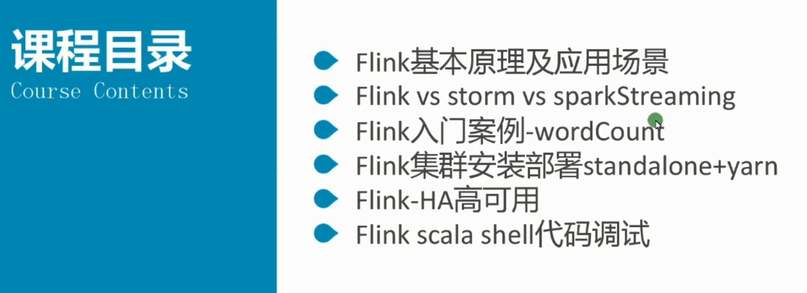
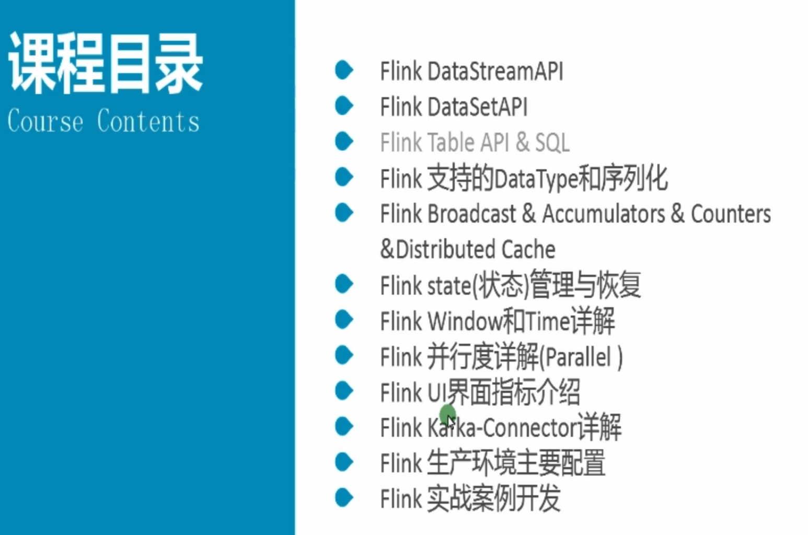
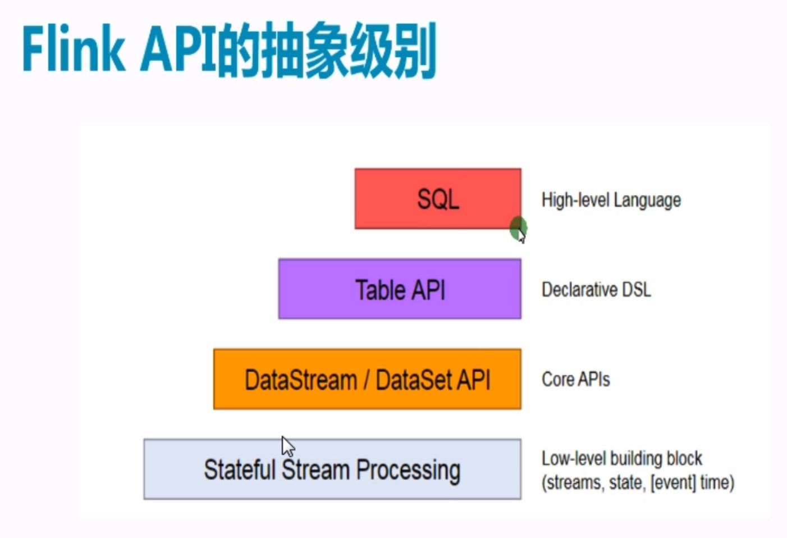
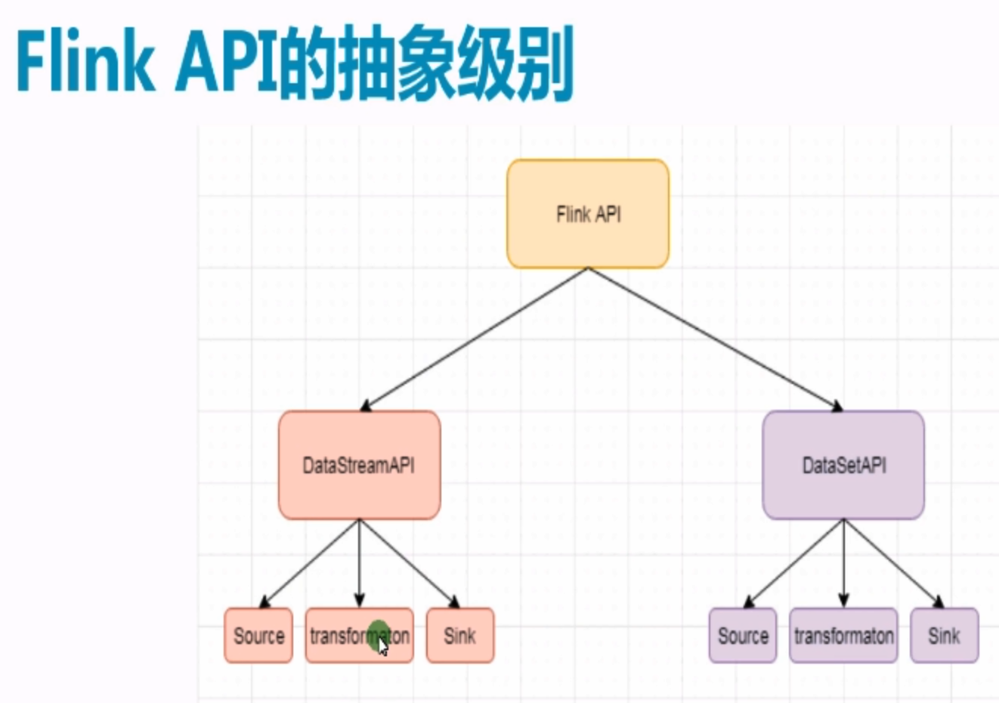
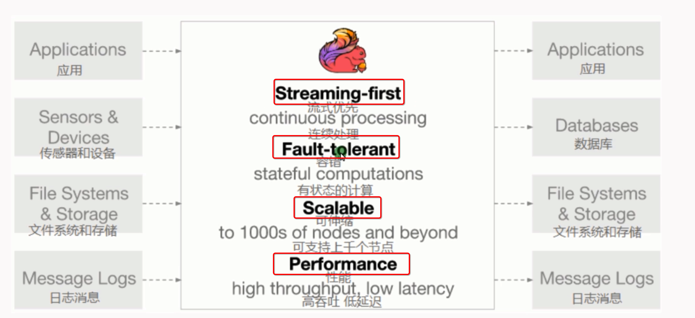
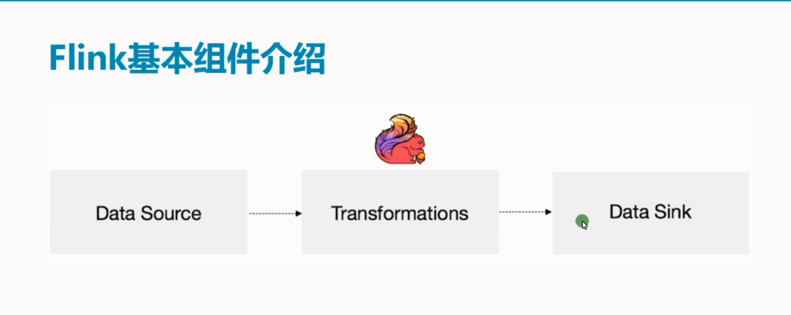
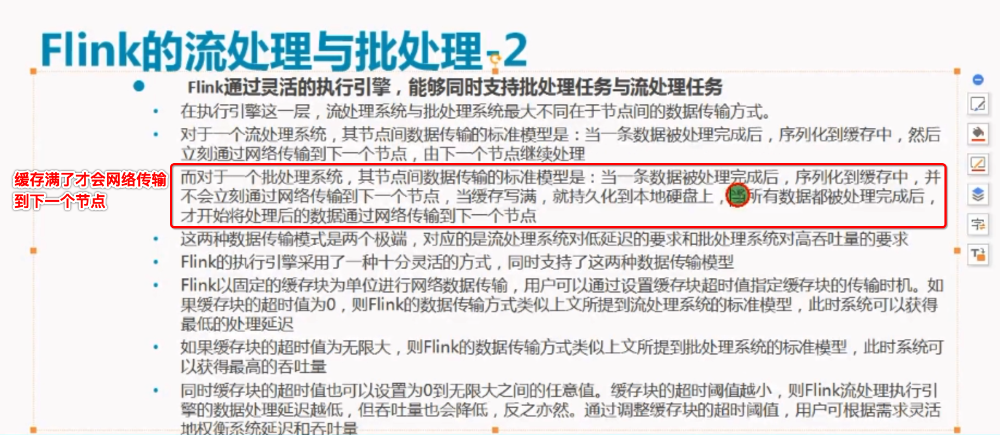

上半部分课程内容：

下半部分课程内容：

flink主要是java实现

flink原生支持了迭代计算，内存管理和程序优化

flink可以设置缓存快的发送，

缓存快发送间隔是0s的时候就是纯粹的实时处理，这个时候延时性低，但是吞吐量有限

缓存快发送时间设置较大的时候就是批处理，这个时候会有数据延迟，但是可以提高吞吐量

一般缓存时间建议设置到10-100ms左右，平衡延时性和吞吐量

