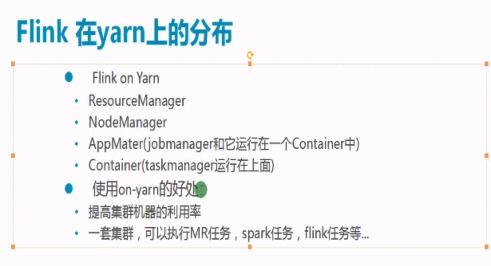
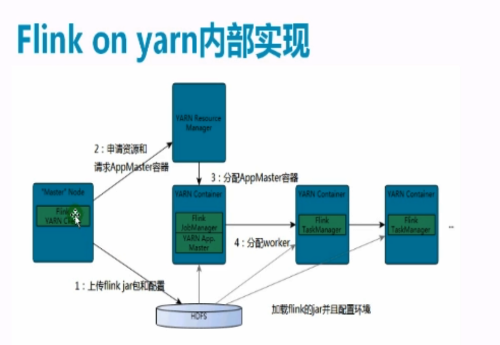
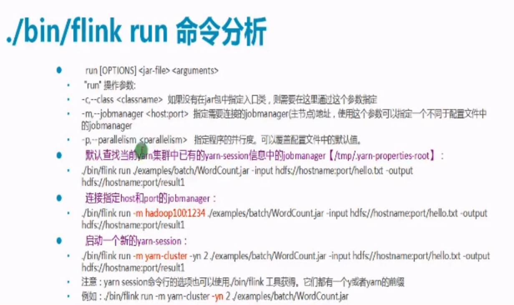
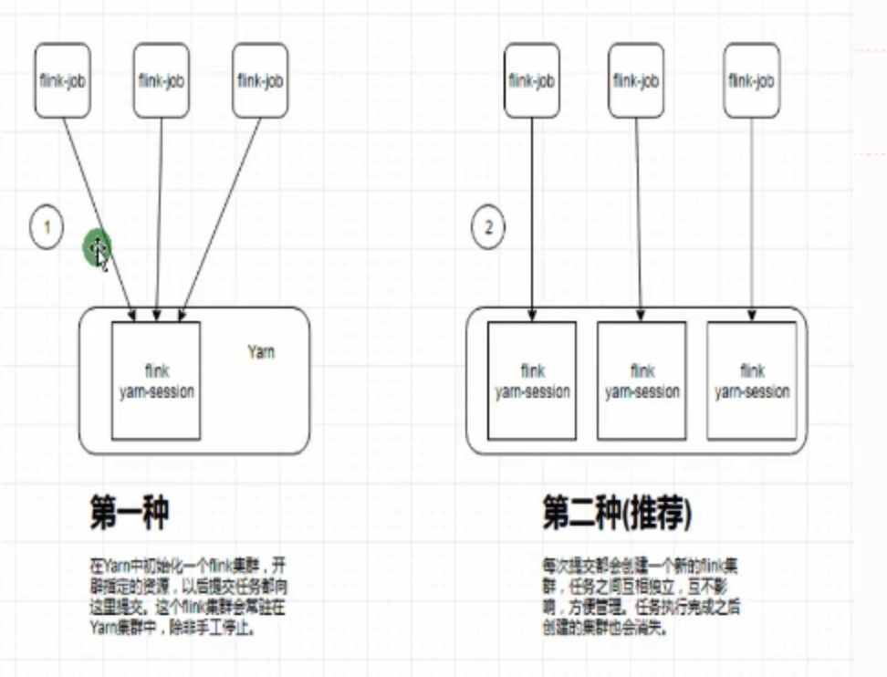
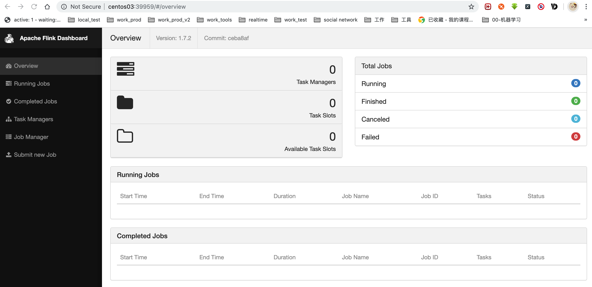
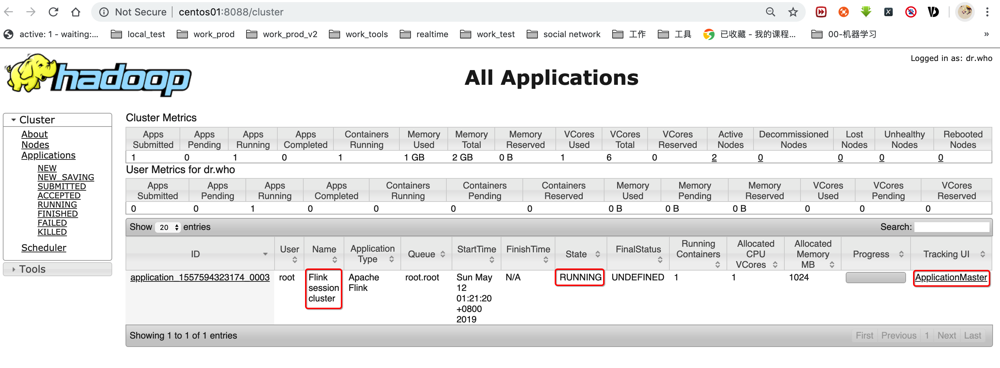
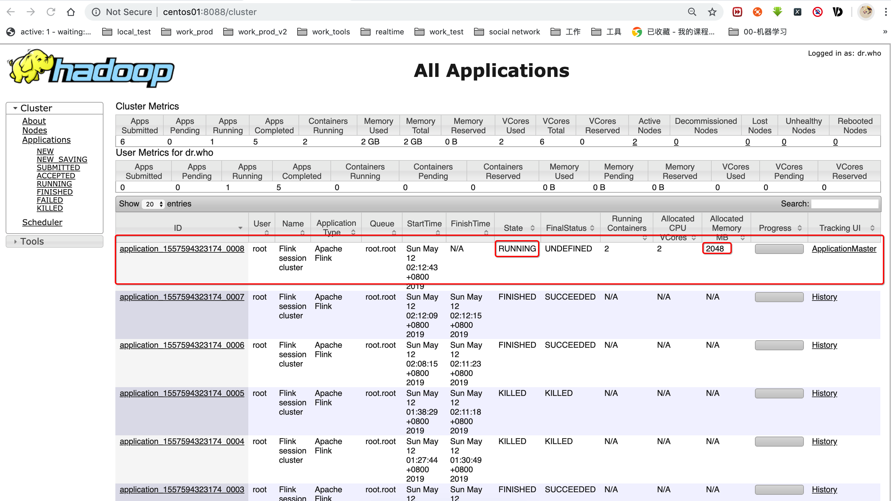
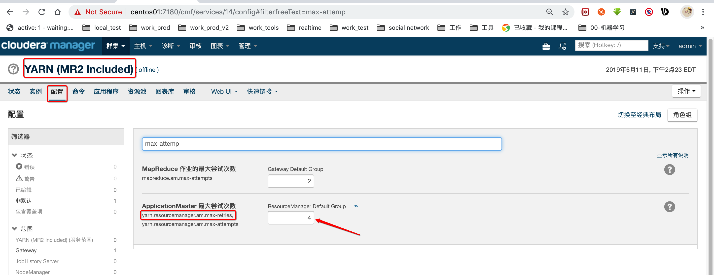
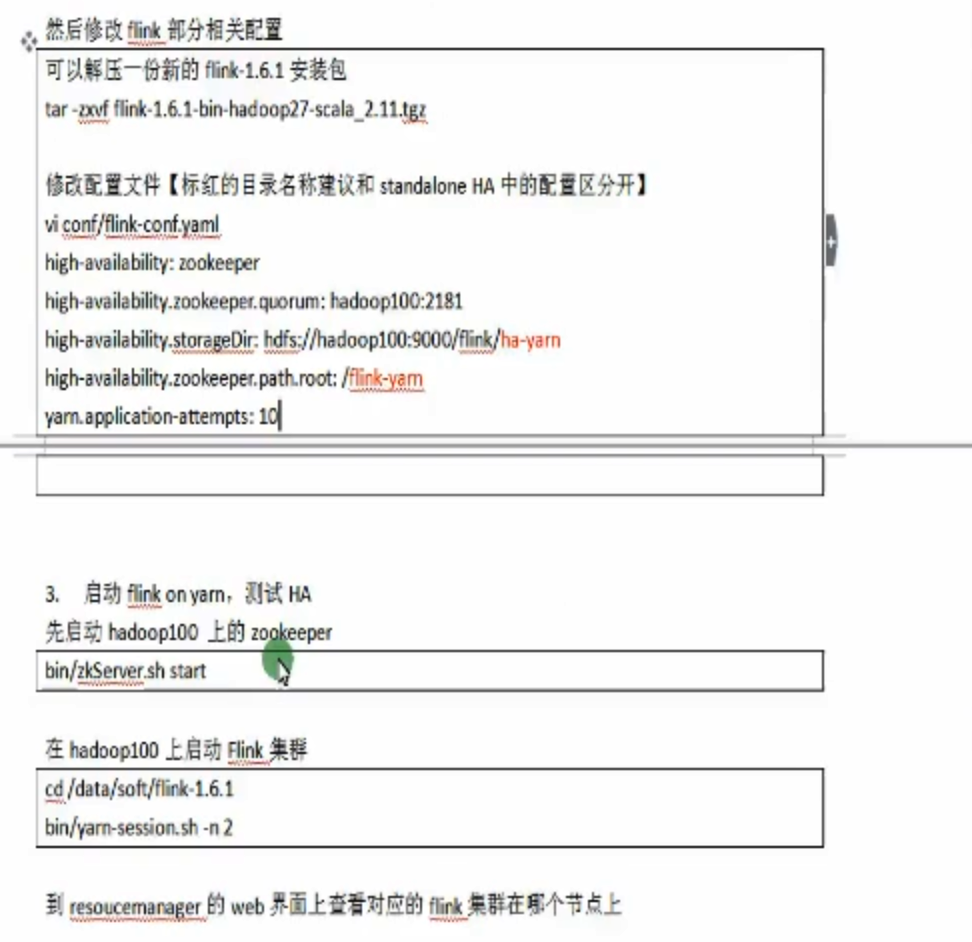

> 问：简单来说就是 如果用 分离式模式 ，那么在启动的时候会在yarn中常驻一个进程，并且已经确定了之后提交的job的内存等资源的大小，比如8G内存，如果某一个job把8G内存全部占完了，只能是第一个job执行完成把资源释放了，第二个job才能继续执行。
>
> 如果是 客户端模式，那么提交后，资源的大小是由yarn的队列所决定的，多个job提交，资源的占用和竞争都是由yarn所控制。





#### 0, flink on yarn有两种使用方式：

* 在yarn中初始化一个flink集群， 开辟指定的资源， 所有提交的作业都是像这个集群提交，在某个作业执行完后， yarn-session依然占据空间不会释放，一直存在。flink集群会一直存在除非手动停止
  * yarn-session.sh启动集群
  * 
  * 
  * flink run提交作业
* 每次提交作业，都会重新创建一个yarn-session，也就是一个新的flink集群，作业跑完，yarn-session也就结束了。任务之间互不影响，方便管理。
  * flink run -m yarn-cluster




注意：因为我使用的是cdh， 所以好像不需要再设置hadoop的环境变量了，其他版本可能需要根据情况而定

#### 1, yarn-session模式-客户端模式

* 这里是先在yarn上启动一个flink集群，然后在集群上跑我们的job，

> 如果想要使用该模式，一定要先启动hdfs和yarn哈

##### 1.1, 直接解压，添加环境变量等等基本操作

##### 1.2, 使用如下命令开启yarn-session模式

* 下面使用-d代表后台运行

* > /usr/local/flink-1.7.2/bin/yarn-session.sh -n 2 -jm 1024 -tm 1024

* > /usr/local/flink-1.7.2/bin/yarn-session.sh -n 2 -jm 1024 -tm 1024 -d

##### 1.3, 验证

1.3.1, flink的webui界面

* 在命令行页面，启动成功后会在控制台打印如下字样：JobManager Web Interface: http://centos03:39959
* 到http://centos03:39959上访问是否可以进入flink的网页页面
* 

1.3.2, yarn的任务界面

* 到yarn的任务页面查看是否有flink的这个任务
* 

1.4, 重新进入某个后台yarn-session的命令行

> /usr/local/flink-1.7.2/bin/yarn-session.sh -id application_1557594323174_0003

1.5, 在yarn-session上启动job

* 需要再研究一下怎么设定主类入口：用 -m
* ok了，-c要放在jar包前面才行

> /usr/local/flink-1.7.2/bin/flink run -c im.ivanl001.a01_flink_window_simple_java.Flink_window_simple_java /root/04-jar/0103-Flink-java-1.0-SNAPSHOT.jar --port 9999

1.5, 关闭yarn-session上面的task

> web页面或者命令行执行cancel命令即可

1.5, 关闭yarn-session

> yarn application -kill application_1557594323174_0003


#### 2, on yarn的独立模式-分离式模式，建议使用

* 这个是直接把job提交给yarn，每次提交都会有一个flink集群，

##### 2.1, 直接启动即可

> /usr/local/flink-1.7.2/bin/flink run -m yarn-cluster -yn 2 -yjm 1024 -ytm 1024 -c im.ivanl001.a01_flink_window_simple_java.Flink_window_simple_java /root/04-jar/0103-Flink-java-1.0-SNAPSHOT.jar --port 9999

> /usr/local/flink-1.7.2/bin/flink run -m yarn-cluster -yn 2 -yjm 1024 -ytm 1024 /usr/local/flink-1.7.2/examples/streaming/SocketWindowWordCount.jar --hostname centos03 --port 9999

##### 2.2, 成功验证



#### 3, flink-on-yarn的HA

* 感觉下面说的不是很对，flink-on-yarn没有ha，一般实现yarn的ha，也就是实现了flink的ha
* 任务重试次数不是ha，是容错处理，任务失败了重新尝试。

##### 3.1,  修改yarn作业失败最大重试次数



3.2, 修改flink-conf.yaml配置文件



```yaml

```

哎， 我虚拟机总是提示资源不够， 毕竟一共三台虚拟机，所以起不起来， 暂时先不演示了。。。。。。。。