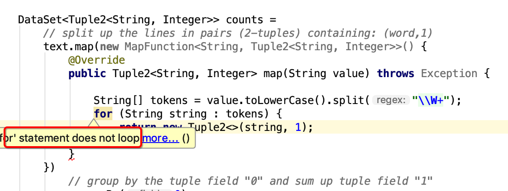
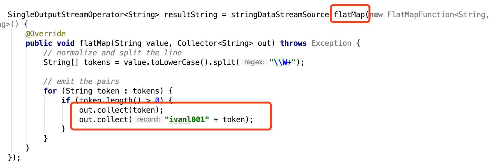
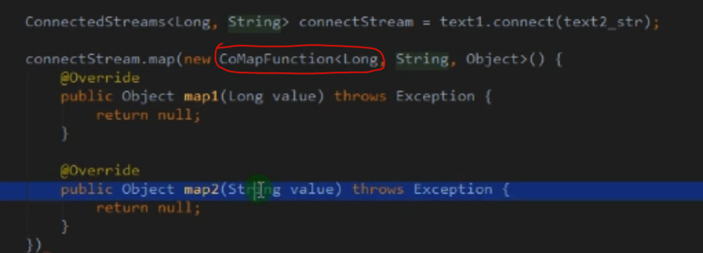
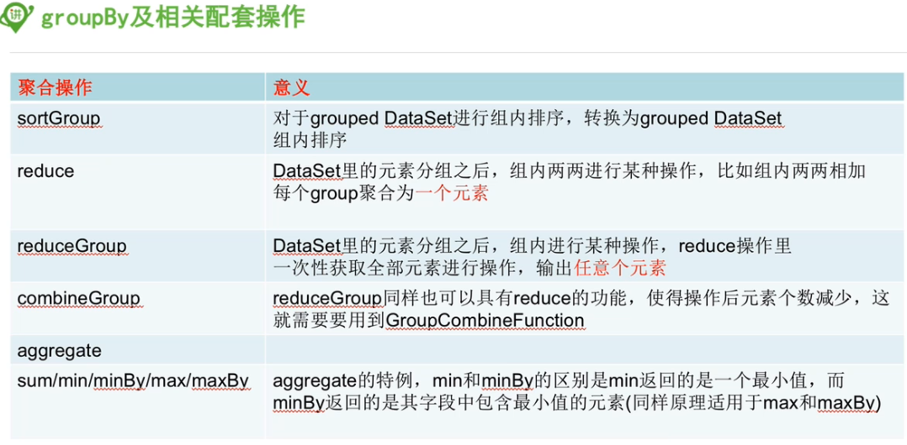
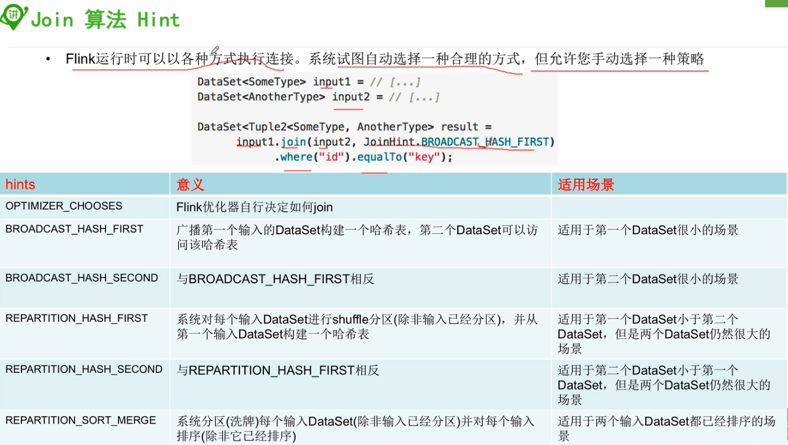
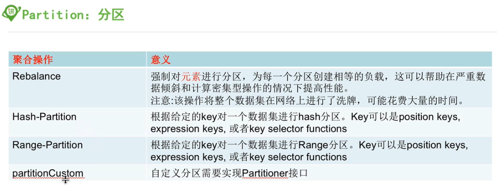

#### DataStream的transformations算子

##### 1, map

* 输入一个元素，返回一个元素， 中间可以做一些清洗转换操作
* 意思是一个map函数里面只能返回一次，而不能像flatmap那样，可以在内部通过colllect发送多次或者n次
* 直接return返回值，所以map里面只能返回一个值
* 

##### 2, flatmap

* 输入一个元素，可以返回0个，1个或者多个元素
* 通过Collector返回值，所以可以返回任意多次
* 
* 

##### 3, filter

* 过滤函数，对输入的数据进行判断，符合条件的留下
* 通过返回的布尔值决定留与走

##### 4, keyby

* 根据指定的key进行分组， 相同的key的数据会进入同一个分区

##### 5, reduce

* 对数据进行聚合操作，结合当前元素和上一次reduce返回的值进行聚合操作，然后返回一个新的值

##### 6, aggregations: sum(), min(), max()

> Rolling aggregations on a keyed data stream. The difference between min and minBy is that min returns the minimum value, whereas minBy returns the element that has the minimum value in this field (same for max and maxBy).

* min和minBy的区别在于， min返回最小值，就是一个数值，minBy返回的是有这个最小值的元素

```java
keyedStream.sum(0);
keyedStream.sum("key");
keyedStream.min(0);
keyedStream.min("key");
keyedStream.max(0);
keyedStream.max("key");
keyedStream.minBy(0);
keyedStream.minBy("key");
keyedStream.maxBy(0);
keyedStream.maxBy("key");
```

##### 7, union

- 和mysql中的union作用一样， 合并的流的类型必须是一致的

- Union of two or more data streams creating a new stream containing all the elements from all the streams. Note: If you union a data stream with itself you will get each element twice in the resulting stream.

  ```java
  dataStream.union(otherStream1, otherStream2, ...);
  ```

##### 8, Project

DataStream → DataStream

Selects a subset of fields from the tuples

- 这个可以用来缩减字段或者重新排列字段顺序

```java
DataStream<Tuple3<Integer, Double, String>> in = // [...]
DataStream<Tuple2<String, Integer>> out = in.project(2,0);
```


##### 9, connect

* 和union类似，是连接两个流的，不同的是connect连接的两个数据流类型可以不一样，可以对连接后两个流应用不同的方法

* 在connect的数据流中使用
* CoMap, CoFlatMap这两个取代map和flatmap操作哈
* 


##### 10, CoMap, CoFlatMap

- Similar to map and flatMap on a connected data stream
- 和map和flatmap的功能是一样的，只不过是使用在连接过的dataStream上的

* 结合connect一起理解

##### 11, split和select

* 上面union和connect都是连接两个流，split是把一个流分成多个流

* 根据规则把一个数据流切分成多个流

* select和split配合使用，选择被切分后的流

```scala
//原来还可以这么用，厉害
val splitedStream = senv.addSource(new Custom_Source).split(new OutputSelector[Long] {
  override def select(out: Long): lang.Iterable[String] = {
    val list = new util.ArrayList[String]()
    if(out%2==1){
      list.add("even", "a","c")
    }else{
      list.add("odd", "b","d")
    }
    list
  }
})

splitedStream.select("even", "a").print()
```


##### 12, Interval Join

KeyedStream,KeyedStream → DataStream

> Join two elements e1 and e2 of two keyed streams with a common key over a given time interval, so that e1.timestamp + lowerBound <= e2.timestamp <= e1.timestamp + upperBound

* 通过指定的键值连接在一个指定时间间隙内的两个keyed streams

```java
// this will join the two streams so that
// key1 == key2 && leftTs - 2 < rightTs < leftTs + 2
keyedStream.intervalJoin(otherKeyedStream)
    .between(Time.milliseconds(-2), Time.milliseconds(2)) // lower and upper bound
    .upperBoundExclusive(true) // optional
    .lowerBoundExclusive(true) // optional
    .process(new IntervalJoinFunction() {...});
```


##### 13, Window

* KeyedStream → WindowedStream

Windows can be defined on already partitioned KeyedStreams. Windows group the data in each key according to some characteristic (e.g., the data that arrived within the last 5 seconds). See [windows](https://ci.apache.org/projects/flink/flink-docs-release-1.7/dev/stream/operators/windows.html) for a complete description of windows.

* 注意：在WindowedStream上做任何算子操作，都会回到DataStream上

```java
dataStream.keyBy(0).window(TumblingEventTimeWindows.of(Time.seconds(5))); // Last 5 seconds of data
```


##### 14, WindowAll

* DataStream → AllWindowedStream

Windows can be defined on regular DataStreams. Windows group all the stream events according to some characteristic (e.g., the data that arrived within the last 5 seconds). See [windows](https://ci.apache.org/projects/flink/flink-docs-release-1.7/dev/stream/operators/windows.html) for a complete description of windows.

**WARNING:** This is in many cases a **non-parallel** transformation. All records will be gathered in one task for the windowAll operator.

* 注意：如果没有keyby操作，那么这样的话，是一个单任务窗口，并行度是1哦。所以这种窗口的操作会在一个task中完成

```java
dataStream.windowAll(TumblingEventTimeWindows.of(Time.seconds(5))); // Last 5 seconds of data
```


##### 15, Window Apply

WindowedStream → DataStream
AllWindowedStream → DataStream

Applies a general function to the window as a whole. Below is a function that manually sums the elements of a window.

**Note:** If you are using a windowAll transformation, you need to use an AllWindowFunction instead.

```java
windowedStream.apply (new WindowFunction<Tuple2<String,Integer>, Integer, Tuple, Window>() {
    public void apply (Tuple tuple,
            Window window,
            Iterable<Tuple2<String, Integer>> values,
            Collector<Integer> out) throws Exception {
        int sum = 0;
        for (value t: values) {
            sum += t.f1;
        }
        out.collect (new Integer(sum));
    }
});

// applying an AllWindowFunction on non-keyed window stream
allWindowedStream.apply (new AllWindowFunction<Tuple2<String,Integer>, Integer, Window>() {
    public void apply (Window window,
            Iterable<Tuple2<String, Integer>> values,
            Collector<Integer> out) throws Exception {
        int sum = 0;
        for (value t: values) {
            sum += t.f1;
        }
        out.collect (new Integer(sum));
    }
});
```


##### 16, Window Reduce

WindowedStream → DataStream

Applies a functional reduce function to the window and returns the reduced value.

* 对窗口执行reduce操作

```java
windowedStream.reduce (new ReduceFunction<Tuple2<String,Integer>>() {
    public Tuple2<String, Integer> reduce(Tuple2<String, Integer> value1, Tuple2<String, Integer> value2) throws Exception {
        return new Tuple2<String,Integer>(value1.f0, value1.f1 + value2.f1);
    }
});
```


##### 17, Aggregations on windows

WindowedStream → DataStream

Aggregates the contents of a window. The difference between min and minBy is that min returns the minimum value, whereas minBy returns the element that has the minimum value in this field (same for max and maxBy).

* min和minBy的区别在于， min返回最小值，就是一个数值，minBy返回的是有这个最小值的元素

```java
windowedStream.sum(0);
windowedStream.sum("key");
windowedStream.min(0);
windowedStream.min("key");
windowedStream.max(0);
windowedStream.max("key");
windowedStream.minBy(0);
windowedStream.minBy("key");
windowedStream.maxBy(0);
windowedStream.maxBy("key");
```


##### 18, Window Join

DataStream,DataStream → DataStream

Join two data streams on a given key and a common window.

* 两个数据流join在一起后，进行window处理
* 可以结合Interval Join一起理解

```java
dataStream.join(otherStream)
    .where(<key selector>).equalTo(<key selector>)
    .window(TumblingEventTimeWindows.of(Time.seconds(3)))
    .apply (new JoinFunction () {...});
```


##### 19, Window CoGroup

DataStream,DataStream → DataStream

Cogroups two data streams on a given key and a common window.

```java
dataStream.coGroup(otherStream)
    .where(0).equalTo(1)
    .window(TumblingEventTimeWindows.of(Time.seconds(3)))
    .apply (new CoGroupFunction () {...});
```


##### 20, Extract Timestamps

DataStream → DataStream

Extracts timestamps from records in order to work with windows that use event time semantics. See [Event Time](https://ci.apache.org/projects/flink/flink-docs-release-1.7/dev/event_time.html).

```java
stream.assignTimestamps (new TimeStampExtractor() {...});   
```


##### 21*, Iterate

DataStream → IterativeStream → DataStream

Creates a "feedback" loop in the flow, by redirecting the output of one operator to some previous operator. This is especially useful for defining algorithms that continuously update a model. The following code starts with a stream and applies the iteration body continuously. Elements that are greater than 0 are sent back to the feedback channel, and the rest of the elements are forwarded downstream. See [iterations](https://ci.apache.org/projects/flink/flink-docs-release-1.7/dev/stream/operators/index.html#iterations) for a complete description.

* 这个暂时还不是很懂

```java
IterativeStream<Long> iteration = initialStream.iterate();
DataStream<Long> iterationBody = iteration.map (/*do something*/);
DataStream<Long> feedback = iterationBody.filter(new FilterFunction<Long>(){
    @Override
    public boolean filter(Long value) throws Exception {
        return value > 0;
    }
});
iteration.closeWith(feedback);
DataStream<Long> output = iterationBody.filter(new FilterFunction<Long>(){
    @Override
    public boolean filter(Long value) throws Exception {
        return value <= 0;
    }
});
```


#### DataStream的物理分区算子

##### 1, Custom partitioning

DataStream → DataStream

Uses a user-defined Partitioner to select the target task for each element.

* 根据上面这行的解释，也就是说，一个分区就是一个task吗

```java
dataStream.partitionCustom(partitioner, "someKey");
dataStream.partitionCustom(partitioner, 0);
```

##### 2, Random partitioning

DataStream → DataStream

Partitions elements randomly according to a uniform distribution.

```java
dataStream.shuffle();
```

##### 3, Rebalancing (Round-robin partitioning)

Partitions elements round-robin, creating equal load per partition. Useful for performance optimization in the presence of data skew.

```java
dataStream.rebalance();
```

##### 4, Rescaling

DataStream → DataStream

Partitions elements, round-robin, to a subset of downstream operations. This is useful if you want to have pipelines where you, for example, fan out from each parallel instance of a source to a subset of several mappers to distribute load but don't want the full rebalance that rebalance() would incur. This would require only local data transfers instead of transferring data over network, depending on other configuration values such as the number of slots of TaskManagers.

The subset of downstream operations to which the upstream operation sends elements depends on the degree of parallelism of both the upstream and downstream operation. For example, if the upstream operation has parallelism 2 and the downstream operation has parallelism 6, then one upstream operation would distribute elements to three downstream operations while the other upstream operation would distribute to the other three downstream operations. If, on the other hand, the downstream operation has parallelism 2 while the upstream operation has parallelism 6 then three upstream operations would distribute to one downstream operation while the other three upstream operations would distribute to the other downstream operation.

In cases where the different parallelisms are not multiples of each other one or several downstream operations will have a differing number of inputs from upstream operations.

Please see this figure for a visualization of the connection pattern in the above example:


```java
dataStream.rescale();
```

##### 5, Broadcasting

DataStream → DataStream

Broadcasts elements to every partition.

```java
dataStream.broadcast();       
```


#### DataStream的任务链和资源组算子

##### 1, Start new chain

Begin a new chain, starting with this operator. The two mappers will be chained, and filter will not be chained to the first mapper.

```java
someStream.filter(...).map(...).startNewChain().map(...);
```

##### 2, Disable chaining

Do not chain the map operator

```java
someStream.map(...).disableChaining();
```

##### 3, Set slot sharing group

Set the slot sharing group of an operation. Flink will put operations with the same slot sharing group into the same slot while keeping operations that don't have the slot sharing group in other slots. This can be used to isolate slots. The slot sharing group is inherited from input operations if all input operations are in the same slot sharing group. The name of the default slot sharing group is "default", operations can explicitly be put into this group by calling slotSharingGroup("default").

```java
someStream.filter(...).slotSharingGroup("name");
```


#### DataSet的算子

##### 1, map

##### 2, flatmap

##### 3, filter

- 过滤数据

##### 4, groupBy

* 等同于datastream中的keyby
* 

##### 5,  reduce

- 对数据进行聚合操作，结合当前元素和上一次reduce返回的值进行聚合操作，然后返回一个新的值

* reduce是增量聚合

##### 6, reduceGroup

* reduceGroup是遍历group内所有元素一次聚合，所以对于多并发线程是不适用的，combined？
* 


##### 7, combineGroup

* 不会用，后面有机会再看吧


##### 8, Aggregate

- Sum,
- Min, and
- Max.

* 注明：.aggregate(SUM, 0).and(MIN, 2)这个是求原始数据第一个字段的总和以及第三个字段的最小值，而.aggregate(SUM, 0).aggregate(MIN, 2)则是先求groupby后第一个字段的总和，然后再在结果的基础上求结果那些数据第二个字段的最小值，具体可以参考代码：im.ivanl002.batch.a02_flink_transformation.Flink_transformations06_aggregate

```java
DataSet<Tuple3<Integer, String, Double>> input = // [...]
DataSet<Tuple3<Integer, String, Double>> output = input
                                   .groupBy(1)        // group DataSet on second field
                                   .aggregate(SUM, 0) // compute sum of the first field
                                   .and(MIN, 2);      // compute minimum of the third field
```

To apply multiple aggregations on a DataSet it is necessary to use the `.and()` function after the first aggregate, that means `.aggregate(SUM, 0).and(MIN, 2)` produces the sum of field 0 and the minimum of field 2 of the original DataSet. In contrast to that `.aggregate(SUM, 0).aggregate(MIN, 2)` will apply an aggregation on an aggregation. In the given example it would produce the minimum of field 2 after calculating the sum of field 0 grouped by field 1.

**Note:** The set of aggregation functions will be extended in the future.


##### 9, sum, min, minBy, max, maxBy


##### 10, union

> Produces the union of two DataSets, which have to be of the same type. A union of more than two DataSets can be implemented with multiple union calls, as shown here:

```java
DataSet<Tuple2<String, Integer>> vals1 = // [...]
DataSet<Tuple2<String, Integer>> vals2 = // [...]
DataSet<Tuple2<String, Integer>> vals3 = // [...]
DataSet<Tuple2<String, Integer>> unioned = vals1.union(vals2).union(vals3);
```


##### 11, Project

```java
DataSet<Tuple3<Integer, Double, String>> in = // [...]
// converts Tuple3<Integer, Double, String> into Tuple2<String, Integer>
DataSet<Tuple2<String, Integer>> out = in.project(2,0);
```

###### Projection with Type Hint

Note that the Java compiler cannot infer the return type of `project` operator. This can cause a problem if you call another operator on a result of `project` operator such as:

❌：如果直接在project后的结果上加上其他算子是不行的

```
DataSet<Tuple5<String,String,String,String,String>> ds = ....
DataSet<Tuple1<String>> ds2 = ds.project(0).distinct(0);
```

This problem can be overcome by hinting the return type of `project` operator like this:

✅: 可以如下解决：

```
DataSet<Tuple1<String>> ds2 = ds.<Tuple1<String>>project(0).distinct(0);
```


##### 12, join

The Join transformation joins two DataSets into one DataSet. The elements of both DataSets are joined on one or more keys which can be specified using

- a key expression
- a key-selector function
- one or more field position keys (Tuple DataSet only).
- Case Class Fields

###### 12.0, 代码

* 注意：join之后，可以通过.with函数指定输出字段

```java
private static void join(ExecutionEnvironment benv) throws Exception {

        ArrayList<Tuple2<Integer, String>> list = new ArrayList<>();
        list.add(new Tuple2<>(1, "ivanl001"));
        list.add(new Tuple2<>(2, "ivanl002"));
        list.add(new Tuple2<>(3, "ivanl003"));

        ArrayList<Tuple2<Integer, String>> list01 = new ArrayList<>();
        list01.add(new Tuple2<>(1, "level01"));
        list01.add(new Tuple2<>(2, "level02"));
        list01.add(new Tuple2<>(3, "level03"));

        benv.fromCollection(list)
          .join(benv.fromCollection(list01))
          .where(0)
          .equalTo(0)
          .with(new JoinFunction<Tuple2<Integer,String>, Tuple2<Integer,String>, Tuple3<Integer, String, String>>() {
            @Override
            public Tuple3<Integer, String, String> join(Tuple2<Integer, String> first, Tuple2<Integer, String> second) throws Exception {
                return new Tuple3<>(first.f0, first.f1, second.f1);
            }
        }).print();
        
    }
```

###### Join with Projection (Java/Python Only)

A Join transformation can construct result tuples using a projection as shown here:

- [**Java**](https://ci.apache.org/projects/flink/flink-docs-release-1.7/dev/batch/dataset_transformations.html#tab_java_27)
- [**Scala**](https://ci.apache.org/projects/flink/flink-docs-release-1.7/dev/batch/dataset_transformations.html#tab_scala_27)
- [**Python**](https://ci.apache.org/projects/flink/flink-docs-release-1.7/dev/batch/dataset_transformations.html#tab_python_27)

```
DataSet<Tuple3<Integer, Byte, String>> input1 = // [...]
DataSet<Tuple2<Integer, Double>> input2 = // [...]
DataSet<Tuple4<Integer, String, Double, Byte>>
            result =
            input1.join(input2)
                  // key definition on first DataSet using a field position key
                  .where(0)
                  // key definition of second DataSet using a field position key
                  .equalTo(0)
                  // select and reorder fields of matching tuples
                  .projectFirst(0,2).projectSecond(1).projectFirst(1);
```

`projectFirst(int...)` and `projectSecond(int...)` select the fields of the first and second joined input that should be assembled into an output Tuple. The order of indexes defines the order of fields in the output tuple. The join projection works also for non-Tuple DataSets. In this case, `projectFirst()` or `projectSecond()` must be called without arguments to add a joined element to the output Tuple.

###### 12.1, join with DataSet Size Hin

```java
DataSet<Tuple2<Integer, String>> input1 = // [...]
DataSet<Tuple2<Integer, String>> input2 = // [...]

DataSet<Tuple2<Tuple2<Integer, String>, Tuple2<Integer, String>>>
            result1 =
            // hint that the second DataSet is very small
            input1.joinWithTiny(input2)
                  .where(0)
                  .equalTo(0);

DataSet<Tuple2<Tuple2<Integer, String>, Tuple2<Integer, String>>>
            result2 =
            // hint that the second DataSet is very large
            input1.joinWithHuge(input2)
                  .where(0)
                  .equalTo(0);
```

###### 12.2, join Algorithm Hints



```java
DataSet<SomeType> input1 = // [...]
DataSet<AnotherType> input2 = // [...]

DataSet<Tuple2<SomeType, AnotherType> result =
      input1.join(input2, JoinHint.BROADCAST_HASH_FIRST)
            .where("id").equalTo("key");
```

The following hints are available:

- `OPTIMIZER_CHOOSES`: Equivalent to not giving a hint at all, leaves the choice to the system.
- `BROADCAST_HASH_FIRST`: Broadcasts the first input and builds a hash table from it, which is probed by the second input. A good strategy if the first input is very small.
- `BROADCAST_HASH_SECOND`: Broadcasts the second input and builds a hash table from it, which is probed by the first input. A good strategy if the second input is very small.
- `REPARTITION_HASH_FIRST`: The system partitions (shuffles) each input (unless the input is already partitioned) and builds a hash table from the first input. This strategy is good if the first input is smaller than the second, but both inputs are still large. *Note:*This is the default fallback strategy that the system uses if no size estimates can be made and no pre-existing partitions and sort-orders can be re-used.
- `REPARTITION_HASH_SECOND`: The system partitions (shuffles) each input (unless the input is already partitioned) and builds a hash table from the second input. This strategy is good if the second input is smaller than the first, but both inputs are still large.
- `REPARTITION_SORT_MERGE`: The system partitions (shuffles) each input (unless the input is already partitioned) and sorts each input (unless it is already sorted). The inputs are joined by a streamed merge of the sorted inputs. This strategy is good if one or both of the inputs are already sorted.

##### 13, Outjoin

参考官网教程：

https://ci.apache.org/projects/flink/flink-docs-release-1.7/dev/batch/dataset_transformations.html#outerjoin 


##### 14, cross

* 笛卡尔积

https://ci.apache.org/projects/flink/flink-docs-release-1.7/dev/batch/dataset_transformations.html#cross


##### 15, distinct

- 是整体去重哈，不是单个分区去重，可指定去重的字段位置哈
- 返回一个数据集中去重后的元素
- 参看下面19, mapPartition的java代码
- 不支持分组哈


##### 16, first-n

* 取集合中的前n个元素
* 如果前面有groupby，就是取出每组中的前n个元素

```java
ExecutionEnvironment benv = ExecutionEnvironment.getExecutionEnvironment();

ArrayList<Tuple3<Integer, Integer, String>> list = new ArrayList<>();
list.add(new Tuple3<>(1, 1, "ivanl001 is the king of world!"));
list.add(new Tuple3<>(1, 2, "ivanl002 is the king of world!"));
list.add(new Tuple3<>(3, 1, "ivanl003 is the king of world!"));
list.add(new Tuple3<>(3, 2, "ivanl004 is the king of world!"));
list.add(new Tuple3<>(5, 1, "ivanl005 is the king of world!"));


DataSource<Tuple3<Integer, Integer, String>> data = benv.fromCollection(list);
//这个是直接取出前3个，也就是1，1，3
data.first(3).print();

System.out.println("=====================");

//这个是先进行分组，分成3组，分别是1， 3，5三个组，然后取出组中的第一个，也就是ivanl001, ivanl003, ivanl005
data.groupBy(0).first(1).print();

System.out.println("=====================");

//这个是先进行分组，分成3组，分别是1， 3，5三个组，然后根据第二个数字倒序排列，三组中id大的那个，分别是：ivanl002, ivanl004, ivanl005
//先分组，后排序，获取id大的那个
data.groupBy(0).sortGroup(1, Order.DESCENDING).first(0).print();
```

##### 17, sortGroup

* 组内排序，先分组，后排序

* ```java
  ExecutionEnvironment benv = ExecutionEnvironment.getExecutionEnvironment();
  
  ArrayList<Tuple3<Integer, Integer, String>> list = new ArrayList<>();
  list.add(new Tuple3<>(1, 1, "ivanl001 is the king of world!"));
  list.add(new Tuple3<>(1, 2, "ivanl002 is the king of world!"));
  list.add(new Tuple3<>(3, 1, "ivanl003 is the king of world!"));
  list.add(new Tuple3<>(3, 2, "ivanl004 is the king of world!"));
  list.add(new Tuple3<>(5, 1, "ivanl005 is the king of world!"));
  
  
  DataSource<Tuple3<Integer, Integer, String>> data = benv.fromCollection(list);
  //这个是直接取出前3个，也就是1，1，3
  data.first(3).print();
  
  System.out.println("=====================");
  
  //这个是先进行分组，分成3组，分别是1， 3，5三个组，然后取出组中的第一个，也就是ivanl001, ivanl003, ivanl005
  data.groupBy(0).first(1).print();
  
  System.out.println("=====================");
  
  //这个是先进行分组，分成3组，分别是1， 3，5三个组，然后根据第二个数字倒序排列，三组中id大的那个，分别是：ivanl002, ivanl004, ivanl005
  //先分组，后排序，获取id大的那个
  data.groupBy(0).sortGroup(1, Order.DESCENDING).first(0).print();
  ```


##### 18, sortpartition

- ❌对所有分区进行排序，也就是全局排序
- ✅是分区内排序，多并发的情况下， 单个分区内有序，全局还是无序的

```java
ExecutionEnvironment benv = ExecutionEnvironment.getExecutionEnvironment();

ArrayList<Tuple3<Integer, Integer, String>> list = new ArrayList<>();
list.add(new Tuple3<>(1, 1, "ivanl001 is the king of world!"));
list.add(new Tuple3<>(1, 2, "ivanl002 is the king of world!"));
list.add(new Tuple3<>(3, 1, "ivanl003 is the king of world!"));
list.add(new Tuple3<>(3, 2, "ivanl004 is the king of world!"));
list.add(new Tuple3<>(5, 1, "ivanl005 is the king of world!"));
list.add(new Tuple3<>(6, 2, "ivanl005 is the king of world!"));
list.add(new Tuple3<>(7, 3, "ivanl005 is the king of world!"));
list.add(new Tuple3<>(8, 4, "ivanl005 is the king of world!"));
list.add(new Tuple3<>(9, 5, "ivanl005 is the king of world!"));

DataSource<Tuple3<Integer, Integer, String>> data = benv.fromCollection(list);

data.sortPartition(0, Order.DESCENDING).sortPartition(1, Order.DESCENDING).print();

/*
(9,5,ivanl005 is the king of world!)
(8,4,ivanl005 is the king of world!)
(7,3,ivanl005 is the king of world!)
(6,2,ivanl005 is the king of world!)
(5,1,ivanl005 is the king of world!)
(3,2,ivanl004 is the king of world!)
(3,1,ivanl003 is the king of world!)
(1,2,ivanl002 is the king of world!)
(1,1,ivanl001 is the king of world!)
*/
```


##### 19, mapPartition

- 类似map，一次处理一个分区的数据
- 这个和spark的mappartition是一个意思哈
- 如果在进行map处理的时候需要动态获取第三方资源连接中的内容，建议使用mappartition
- scala

```scala
def main(args: Array[String]): Unit = {

  val benv = ExecutionEnvironment.getExecutionEnvironment

  val list = ListBuffer[String]()
  list.append("ivanl001 is the king of world!")
  list.append("ivanl002 is the king of world!")

  benv.fromCollection(list).mapPartition(ite => {
    val res = ListBuffer[String]()
    print("开启数据库")
    while (ite.hasNext){
      val words = ite.next().split("\\s")
      for (word <- words){
          println("处理数据：" + word)        
        	res.append(word)
      }
    }
    print("关闭数据库")
    res
  }).print( )

  //benv.execute("mappartition")
}
```


- java

```java
ExecutionEnvironment benv = ExecutionEnvironment.getExecutionEnvironment();

ArrayList<String> list = new ArrayList<>();
list.add("ivanl001 is the king of world!");
list.add("ivanl002 is the king of world!");
list.add("ivanl003 is the king of world!");
list.add("ivanl004 is the king of world!");
list.add("ivanl005 is the king of world!");

benv.fromCollection(list).mapPartition(new MapPartitionFunction<String, String>() {
  @Override
  public void mapPartition(Iterable<String> values, Collector<String> out) throws Exception {

    System.out.println("ivanl----");
    System.out.println("在这里开启数据库等连接");

    for (String value : values) {
      System.out.println("hhhhh:" + value);
      for (String word: value.split("\\s")){
        out.collect(word);
      }
    }
    System.out.println("在这里关闭数据库等连接");
  }
}).distinct().print();
```


##### 20, CoGroup


#### DataSet的物理分区算子



##### Rebalance

Evenly rebalances the parallel partitions of a DataSet to eliminate data skew.

- [**Java**](https://ci.apache.org/projects/flink/flink-docs-release-1.7/dev/batch/dataset_transformations.html#tab_java_37)
- [**Scala**](https://ci.apache.org/projects/flink/flink-docs-release-1.7/dev/batch/dataset_transformations.html#tab_scala_37)
- [**Python**](https://ci.apache.org/projects/flink/flink-docs-release-1.7/dev/batch/dataset_transformations.html#tab_python_37)

```
DataSet<String> in = // [...]
// rebalance DataSet and apply a Map transformation.
DataSet<Tuple2<String, String>> out = in.rebalance()
                                        .map(new Mapper());
```

##### Hash-Partition

Hash-partitions a DataSet on a given key. Keys can be specified as position keys, expression keys, and key selector functions (see [Reduce examples](https://ci.apache.org/projects/flink/flink-docs-release-1.7/dev/batch/dataset_transformations.html#reduce-on-grouped-dataset) for how to specify keys).

- [**Java**](https://ci.apache.org/projects/flink/flink-docs-release-1.7/dev/batch/dataset_transformations.html#tab_java_38)
- [**Scala**](https://ci.apache.org/projects/flink/flink-docs-release-1.7/dev/batch/dataset_transformations.html#tab_scala_38)
- [**Python**](https://ci.apache.org/projects/flink/flink-docs-release-1.7/dev/batch/dataset_transformations.html#tab_python_38)

```
DataSet<Tuple2<String, Integer>> in = // [...]
// hash-partition DataSet by String value and apply a MapPartition transformation.
DataSet<Tuple2<String, String>> out = in.partitionByHash(0)
                                        .mapPartition(new PartitionMapper());
```

##### Range-Partition

Range-partitions a DataSet on a given key. Keys can be specified as position keys, expression keys, and key selector functions (see [Reduce examples](https://ci.apache.org/projects/flink/flink-docs-release-1.7/dev/batch/dataset_transformations.html#reduce-on-grouped-dataset) for how to specify keys).

- [**Java**](https://ci.apache.org/projects/flink/flink-docs-release-1.7/dev/batch/dataset_transformations.html#tab_java_39)
- [**Scala**](https://ci.apache.org/projects/flink/flink-docs-release-1.7/dev/batch/dataset_transformations.html#tab_scala_39)
- [**Python**](https://ci.apache.org/projects/flink/flink-docs-release-1.7/dev/batch/dataset_transformations.html#tab_python_39)

```
DataSet<Tuple2<String, Integer>> in = // [...]
// range-partition DataSet by String value and apply a MapPartition transformation.
DataSet<Tuple2<String, String>> out = in.partitionByRange(0)
                                        .mapPartition(new PartitionMapper());
```